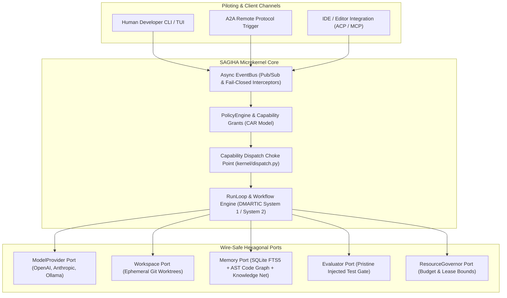
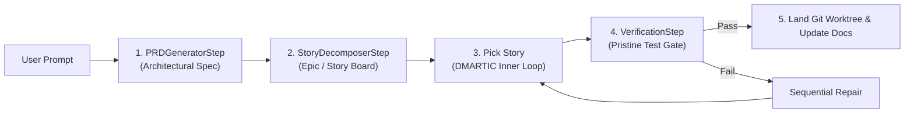

# ⚡ SAGIHA — Super AGI Harness Agent v0.2.1

> **SOTA Autonomous Coding Harness for Frontier LLMs — Built on Capability Security, Microkernel Dispatch, Deterministic Replay, and Declarative Workflow Orchestration.**

SAGIHA (Super AGI Harness Agent) is a production-grade, autonomous software engineering harness that transforms frontier LLMs into self-directed, verifiable coding agents. Built from the ground up with Hexagonal Architecture and the **CAR Model (Control / Agency / Runtime)**, SAGIHA bridges the gap between high-level reasoning and sandboxed execution.

Unlike brittle prompt-wrappers or bloated agent frameworks, SAGIHA provides:
* **Zero Framework Bloat**: Pure Python 3.13 Hexagonal Architecture (`typing.Protocol` + Pydantic + `anyio`).
* **Capability-Gated Security**: Single dispatch choke point; `Grant` never crosses a port signature and is verified at the point of effect, not merely at issuance.
* **Declarative Logic Pipelines ("dbt for Agent Logic")**: Composable `WorkflowStep` DAGs (*Prompt → PRD → Story Board → Inner Loop → Verification*).
* **100% Deterministic Replay**: Zero-network cassette record/replay for byte-for-byte reproducible CI testing.
* **Empirical Measurement Moat**: Standalone evaluation harness (E0) with an A/A noise floor to prove true capability lift.

---

## 🧠 **The Epistemology of AI Engineering: Levels of Agency & Macro-Loop Abstractions**

To build an autonomous coding system that performs at a Senior/Principal Engineer level, SAGIHA formalizes the progression from a raw LLM API call to multi-agent swarm orchestration across 5 distinct levels:

```
 Level 0: LLM API Call        ──► Raw String Generation (Prompt -> String completion)
 Level 1: Harness Engineering  ──► The Body & Sensors (Tools, LSP, Git Worktrees, Capability Gates)
 Level 2: Loop Engineering     ──► Senior Engineer Process (DMARTIC, System 1/2, PRD -> Story Board)
 Level 3: Meta-Loop Engineering──► Principal / PhD Methodology (Outer Loop RHI, Noise Floor, Self-Tuning)
 Level 4: Macro Multi-Agent    ──► Team Swarm Orchestration (Harnesses Driving Harnesses via A2A/MCP)
```

### 🔬 **Detailed Level Breakdown**

#### **Level 0: Raw LLM API Call (String Generation)**
A standard API call takes a prompt and outputs a string. It has no perception, no execution sandbox, no verification, and no long-term memory. It represents raw text prediction, not software engineering.

#### **Level 1: Harness Engineering — The Body & Sensors**
Harness Engineering builds the **deterministic physical & sensory environment** surrounding the LLM. It supplies:
* **Perception**: Tree-sitter AST queries (`callers_of`, `impacted_by`) + host-side LSP diagnostics.
* **Motor Control**: Single capability dispatch choke point (`kernel/dispatch.py`).
* **Verifiers**: Pristine read-only test suite gates (`tests_unmodified`).
* **Memory & State**: SQLite-WAL trajectory logs + Obsidian-style linked Knowledge Net.

#### **Level 2: Loop Engineering — The Senior Engineer Process**
Loop Engineering codifies how a senior developer thinks, plans, and executes a complex task. It structures cognition into **decoupled, composable logic pipelines ("dbt for Agent Logic")**:
* **Macro Planning**: *Prompt → PRDSpec → StoryBoard → TaskSpec*.
* **Inner Loop (DMARTIC)**: ReAct → verify → reflect, in practice today; the full eight-stage cycle (*Design → Measure → Analyze → Review Gate → Test → Improve → Control → Self-Reflect*) is the target shape as Measure/Analyze/Review gain their own ports — see [dmartic-inner-loop.md](docs/04-workflows-and-loops/dmartic-inner-loop.md).
* **Dual-Process Cognitive Switching**: Using System 1 (Fast ReAct) for single-file localized edits, and escalating to System 2 (Deliberate Best-of-N across isolated Git worktrees) for architectural multi-file changes.

#### **Level 3: Meta-Loop Engineering — The Principal / PhD Methodology**
The **Outer Loop (RHI — Reflexive Harness Improvement)** operates above single tasks to optimize the harness itself over time:
* Analyzes thousands of historical trajectories (`trajectories.db`).
* Measures an **A/A noise floor** under pure stochasticity to prove harness updates represent true statistical lift rather than random noise.
* Optimizes prompt templates, tool descriptions, and model-tier assignments per step (e.g. routing PRD generation to fast models and coding to frontier models to cut cost by 50%+).

#### **Level 4: Macro Multi-Agent Swarms — Team Collaboration (Harnesses Driving Harnesses)**
Complex software is never built by one engineer in a single sitting—it is built by specialized teams collaborating with clear boundaries. SAGIHA’s **wire-safe Remoteable Ports Architecture** allows scaling to Level 4 without adding microkernel complexity:
* **Decoupled Roles**: A master *Architect Harness* decomposes an epic into stories and delegates them to specialized *Developer Harnesses* and *QA Verifier Harnesses*.
* **Wire Protocol Interoperability**: Harnesses communicate asynchronously over standard **A2A (Agent-to-Agent)** and **MCP (Model Context Protocol)** triggers across isolated worktrees.
* **Non-Interfering Execution**: Each agent operates inside its own isolated Git worktree, preventing file lock collisions while merging verified PRs back to main.

---

## 🏗️ **System Architecture & Layering**



---

## 🧩 **Declarative Workflow Orchestration ("dbt for Agent Logic")**

SAGIHA treats every software engineering task as a composable, deterministic DAG of decoupled steps.



### Decoupled Execution Blocks
* **`WorkflowStep[In, Out]` Protocol**: Every stage (PRD generator, story decomposer, coder, verifier) is an isolated Python class with typed Pydantic inputs and outputs.
* **Reconfigurable Pipelines**: Re-order or swap stages in `config.toml` without altering microkernel code.

---

## 🌀 **Dual-Process Cognitive Engine (Inner & Outer Loops)**

### 1. **Inner Loop (DMARTIC — Operational Cycle)**
* **System 1 (Fast)**: Direct ReAct execution for localized, single-file edits.
* **System 2 (Deliberate)**: Parallel candidate search across isolated Git worktrees with **verifier-guided Best-of-N + sequential repair**.
* **Cycle**: ReAct → verify → reflect today; the eight-stage *Design → Measure → Analyze → Review Gate → Test → Improve → Control → Self-Reflect* form is the target as remaining stages gain ports.

### 2. **Outer Loop (RHI — Reflexive Harness Improvement)**
* Offline, scheduled optimization engine reading trajectory logs (`trajectories.db`).
* Measures **A/A noise floors** under pure stochasticity to ensure harness mutations represent true statistical lift.
* Optimizes prompts, tool schemas, and routing heuristics safely within the **Mutable Surface** (never touching the immutable **Trusted Computing Base**).

---

## 🔐 **Capability Security & Threat Model (CAR Invariants)**

1. **CAR Model Isolation**: Agency code holds **zero references** to tools or runtime objects.
2. **Single Dispatch Choke Point**: All tool executions route through `kernel/dispatch.py`.
3. **Grants Never Cross a Port**: Execution requires a scoped, expiring `Grant` minted strictly by `PolicyEngine.authorize()` and verified again at the point of effect (`verify_grant`) — "unforgeable" is a slogan in a language with full introspection; reachability, not cryptography, is what actually holds.
4. **Pristine Test Gate (`tests_unmodified`)**: Evaluator runs tests injected read-only from the base commit, preventing candidates from editing their own grader.
5. **Container Sandbox Perimeter**: Subprocess execution is wrapped in rootless Podman containers with egress allowlisting.

---

## 🕸️ **Neural-Symbolic Memory & Knowledge Net**

SAGIHA decouples code facts from learned experience to prevent hallucinated edges:
* **AST Code Graph**: Tree-sitter parsing queries (`callers_of`, `impacted_by`) supply exact structural dependencies.
* **Obsidian-Style Knowledge Net**: Long-term episodic memory connects records via `links: tuple[str, ...]` supporting **Neighborhood queries** and **Backlinks**.
* **SQLite-WAL FTS5**: Full-text lexical search across trajectories and sessions without external vector sidecar daemons.

---

## 🌐 **Wire-Safe Protocol Universality**

Every method on every port is `async def` with pure Pydantic payloads (JSON-serializable). This guarantees out-of-the-box compatibility with:
* **OpenAI API & OpenRouter**: Standard OpenAI-compatible `base_url` adapter (Anthropic, OpenAI, Ollama, vLLM, OpenRouter).
* **MCP (Model Context Protocol)**: Consumes external MCP tools and exposes internal tools as an MCP server.
* **REST / A2A (Agent-to-Agent)**: Remote agent delegation via JSON-Schema triggers.
* **gRPC / Protobuf**: Seamless gRPC service wrapping with zero microkernel changes.

### 🤖 **OpenRouter Model Catalog & Fallback Chains**

SAGIHA includes out-of-the-box support for OpenRouter models with automated failover via `FallbackModelAdapter`. If a model returns HTTP 404 (unavailable), 429 (rate-limited), or 5xx, calls automatically fail over to the next candidate model in order:

| Tier | Purpose & Primary Model | Fallback Chain Sequence |
| :--- | :--- | :--- |
| **Tier 0** (Free / Local) | Local Ollama (`http://localhost:11434/v1`) or `cohere/north-mini-code:free` | `inclusionai/ling-3.0-flash:free` → `poolside/laguna-s-2.1:free` → `poolside/laguna-xs-2.1:free` → `nvidia/nemotron-3-ultra-550b-a55b:free` |
| **Tier 1** (Cheap Paid) | `qwen/qwen3.7-flash` | `xiaomi/mimo-v2.5` → `deepseek/deepseek-v4-flash` → `tencent/hy3` |
| **Tier 2** (Good Paid) | `anthropic/claude-sonnet-5` | `deepseek/deepseek-v4-pro` → `z-ai/glm-5.2` → `minimax/minimax-m3` → `moonshotai/kimi-k3` |

Configure tier selection via `.env` / `config.toml`:
```env
OPENROUTER_API_KEY=sk-or-v1-your-api-key-here
```
Or pass the tier directly in python composition:
```python
kernel = build_kernel(config, tier="tier0")  # tier0 | tier1 | tier2
```

---

## ⚡ **Quickstart & Verification**

### Prerequisites
* Python `>=3.13`
* `uv` package manager

### Setup & Run
```sh
# Clone & install dependencies
git clone https://github.com/brainopensource/Harness-D-power.git
cd Harness-D-power
uv sync

# Run contract & shape test suite
uv run pytest tests/contracts/

# Run static type checker (strict mode)
uv run pyright src/sagiha

# Enforce architectural import boundaries
uv run lint-imports

# Verify CLI version
uv run sagiha version
```

### Available Now (Sprint 3a — cassette-driven only)
```sh
# Run a coding task end-to-end, driven by a committed cassette
sagiha run "fix failing test in tests/test_parser.py" --cassette .sagiha/cassettes/default.json

# Replay and verify cassette determinism
sagiha replay <run-id> --verify --cassette .sagiha/cassettes/default.json
```
Both commands work today, in CI, against a committed cassette. There is no live-model adapter yet
(`model.mode=live`/`record` fail closed at composition) — see [STATUS.md](docs/STATUS.md).

---

## 📁 **Repository Architecture & Sitemap**

```
src/sagiha/
├── domain/       # Pure Pydantic domain models & schemas (events, config, work, content)
├── ports/        # Typed async Protocol boundaries (model, workspace, policy, memory...)
├── kernel/       # Microkernel (EventBus, PolicyEngine, Dispatch choke point, RunLoop)
└── adapters/     # Hexagonal implementations (SQLite store, Cassette replay, Subprocess Workspace, Tools)
```

| Sitemap Location | Purpose |
| :--- | :--- |
| [`AGENTS.md`](AGENTS.md) | Core architectural invariants, TCB rules, and codebase conventions |
| [`docs/STATUS.md`](docs/STATUS.md) | Real-time implementation status & defect tracking |
| [`docs/sprints/sprint-3.md`](docs/sprints/sprint-3.md) | Sprint 3a (closed) / 3b (next) execution checklist (Block 1: Close the loop) |
| [`docs/reviews/`](docs/reviews/) | Historical & active review log (`done/`, `doing/`, `todo/`) |
| [`docs/02-architecture/`](docs/02-architecture/) | Normative architecture specs (CAR model, EventBus, Prompting) |
| [`docs/03-contracts-and-models/`](docs/03-contracts-and-models/) | Normative hexagonal ports & domain schemas |


# TODO

How can we abstract our codebase now, so we can have reusable pieces of code, that is well structured and organized as we use hexagonal architecture and have complex workflows, DAGs and loop engineering in inner or outer logic, we can compound or merge different workflows to achieve our goal, prototype, solve different tasks and challenges depending on their nature. 

In the future trought frontend GUI, CLI or TUI we will be able to use the config driven and decoupled nature to control how our processes behaves in details. But to grow and scale without bloat and with a clean and dry codebase we should be thinking about reusable code pieces, dependency injection, and a object oriented structured approach capable of orchestrating the features where each part communicate to the other allowing us to orchestrate the project architecture, the processes of solving tasks workflows and dags, so the meta process and meta harness will be very easy with this solid foundation. 

We should think about how to have this parent class, that receives standardized classes for workflow nodes in a structured way, that we can optimize individually now using the same protocols and contracts, and if needed in the future we can use rust or go to improve the performance and delivery the same outputs using the same logic but a better outsourced process. 

How could we do that? Lets dive deeper into the code now before we proceed, I want you to create a detailed report inside folder docs/fixes create a detailed report with the folowing topics plus what is important to mention below adding more chapters: 

1) Abstraction, how it is now and how could be so we can achieve this high level of abstraction and flexibility;

2) Loop engineering and Harness Engineering at the inner and outer loop and the meta process and workflows;

3) How the config driven and hexagonal will play with the frontend and the flexibility to use this to create new solutions or improve results, optimize costs etc; 

4) How to improve our codebase, patterns, make it dry, reusable, investigate the folder tree, how the classes and methods are orchestrated and how we invoke every skill, tool, context, memory, prompt injection and engineering, caching, indexing, searching, web search, etc.

5) If we implement this proposed improvements, how we can swap techologies or solutions easily or use rust and go, the protocols etc.

6) Any other suggestions to make our code more elegant, less repetitive, SOTA, dry and reusable. So when we start adding more and more features in the future sprints it will be very easy to grow the logic with a robust and flexible foundation. 

7) Talk about the impact at the code level regarding the Harness Capabilities, features and goal. Harness Infrastructure is able to make LLM extremely powerful with a kit of tools and processes that a LLM alone cant do at solving complex tasks and chalenges alone. For example, when we did the simple DAG: read code and prompt > send to llm > process the output > act sometimes we cant solve problems. So we need to improve how we deal with different capabilities in the harness context.

8) In this context of inner loop and outer loop, we may have emerging blocks of DAGs or compounded DAGs in a workflow that is made of smaller pieces. We should not repeat the code and logic for it. Example, the architect and planner is basically a process that is using tools like listing project files to discover, reading individual files to learn, inject prompt to improve the goal and modularize the response as a planner and produce a structured output breaking down the problem (So lots of the Architect are reusable).  If it is just an executor it needs to list, read and write to files etc.

Describe everything in details, so we will do the iterations and the meta process, harness engineering and loop engineering with elegant code and SOTA, explaining at the code level, and in technical senior tech lead level detailed.

Include any other chapters after the 8 major proposed in the list, so we can have a complete detailed report about this, to make the future developments easy and to help us planning the next sprints and the roadmap. 