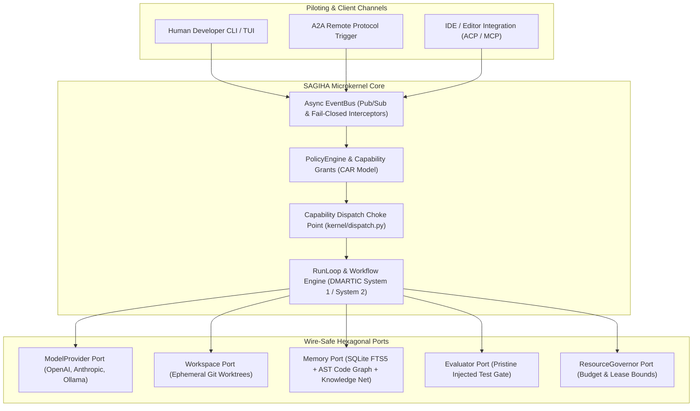
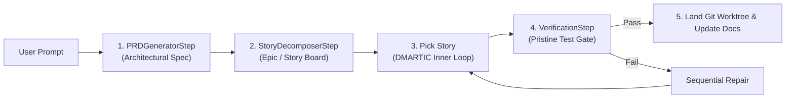

# ⚡ SAGIHA — Super AGI Harness Agent v0.1.0

> **SOTA Autonomous Coding Harness for Frontier LLMs — Built on Capability Security, Microkernel Dispatch, Deterministic Replay, and Declarative Workflow Orchestration.**

SAGIHA (Super AGI Harness Agent) is a production-grade, autonomous software engineering harness that transforms frontier LLMs into self-directed, verifiable coding agents. Built from the ground up with Hexagonal Architecture and the **CAR Model (Control / Agency / Runtime)**, SAGIHA bridges the gap between high-level reasoning and sandboxed execution.

Unlike brittle prompt-wrappers or bloated agent frameworks, SAGIHA provides:
* **Zero Framework Bloat**: Pure Python 3.13 Hexagonal Architecture (`typing.Protocol` + Pydantic + `anyio`).
* **Capability-Gated Security**: Single dispatch choke point with unforgeable `Grant` tokens.
* **Declarative Logic Pipelines ("dbt for Agent Logic")**: Composable `WorkflowStep` DAGs (*Prompt → PRD → Story Board → Inner Loop → Verification*).
* **100% Deterministic Replay**: Zero-network cassette record/replay for byte-for-byte reproducible CI testing.
* **Empirical Measurement Moat**: Standalone evaluation harness (E0) with an A/A noise floor to prove true capability lift.

---

## 🧠 **The Epistemology of AI Engineering: Levels of Agency & Macro-Loop Abstractions**

To build an autonomous coding system that performs at a Senior/Principal Engineer level, SAGIHA formalizes the progression from a raw LLM API call to multi-agent swarm orchestration across 5 distinct levels:

```
 Level 0: LLM API Call        ──► Raw String Generation (Prompt -> String completion)
 Level 1: Harness Engineering  ──► The Body & Sensors (Tools, LSP, Git Worktrees, Capability Gates)
 Level 2: Loop Engineering     ──► Senior Engineer Process (DMARTIC, System 1/2, PRD -> Story Board)
 Level 3: Meta-Loop Engineering──► Principal / PhD Methodology (Outer Loop RHI, Noise Floor, Self-Tuning)
 Level 4: Macro Multi-Agent    ──► Team Swarm Orchestration (Harnesses Driving Harnesses via A2A/MCP)
```

### 🔬 **Detailed Level Breakdown**

#### **Level 0: Raw LLM API Call (String Generation)**
A standard API call takes a prompt and outputs a string. It has no perception, no execution sandbox, no verification, and no long-term memory. It represents raw text prediction, not software engineering.

#### **Level 1: Harness Engineering — The Body & Sensors**
Harness Engineering builds the **deterministic physical & sensory environment** surrounding the LLM. It supplies:
* **Perception**: Tree-sitter AST queries (`callers_of`, `impacted_by`) + host-side LSP diagnostics.
* **Motor Control**: Single capability dispatch choke point (`kernel/dispatch.py`).
* **Verifiers**: Pristine read-only test suite gates (`tests_unmodified`).
* **Memory & State**: SQLite-WAL trajectory logs + Obsidian-style linked Knowledge Net.

#### **Level 2: Loop Engineering — The Senior Engineer Process**
Loop Engineering codifies how a senior developer thinks, plans, and executes a complex task. It structures cognition into **decoupled, composable logic pipelines ("dbt for Agent Logic")**:
* **Macro Planning**: *Prompt → PRDSpec → StoryBoard → TaskSpec*.
* **Inner Loop (DMARTIC)**: *Design → Measure → Analyze → Review Gate → Test → Improve → Control → Self-Reflect*.
* **Dual-Process Cognitive Switching**: Using System 1 (Fast ReAct) for single-file localized edits, and escalating to System 2 (Deliberate Best-of-N across isolated Git worktrees) for architectural multi-file changes.

#### **Level 3: Meta-Loop Engineering — The Principal / PhD Methodology**
The **Outer Loop (RHI — Reflexive Harness Improvement)** operates above single tasks to optimize the harness itself over time:
* Analyzes thousands of historical trajectories (`trajectories.db`).
* Measures an **A/A noise floor** under pure stochasticity to prove harness updates represent true statistical lift rather than random noise.
* Optimizes prompt templates, tool descriptions, and model-tier assignments per step (e.g. routing PRD generation to fast models and coding to frontier models to cut cost by 50%+).

#### **Level 4: Macro Multi-Agent Swarms — Team Collaboration (Harnesses Driving Harnesses)**
Complex software is never built by one engineer in a single sitting—it is built by specialized teams collaborating with clear boundaries. SAGIHA’s **wire-safe Remoteable Ports Architecture** allows scaling to Level 4 without adding microkernel complexity:
* **Decoupled Roles**: A master *Architect Harness* decomposes an epic into stories and delegates them to specialized *Developer Harnesses* and *QA Verifier Harnesses*.
* **Wire Protocol Interoperability**: Harnesses communicate asynchronously over standard **A2A (Agent-to-Agent)** and **MCP (Model Context Protocol)** triggers across isolated worktrees.
* **Non-Interfering Execution**: Each agent operates inside its own isolated Git worktree, preventing file lock collisions while merging verified PRs back to main.

---

## 🏗️ **System Architecture & Layering**



---

## 🧩 **Declarative Workflow Orchestration ("dbt for Agent Logic")**

SAGIHA treats every software engineering task as a composable, deterministic DAG of decoupled steps.



### Decoupled Execution Blocks
* **`WorkflowStep[In, Out]` Protocol**: Every stage (PRD generator, story decomposer, coder, verifier) is an isolated Python class with typed Pydantic inputs and outputs.
* **Reconfigurable Pipelines**: Re-order or swap stages in `config.toml` without altering microkernel code.

---

## 🌀 **Dual-Process Cognitive Engine (Inner & Outer Loops)**

### 1. **Inner Loop (DMARTIC — Operational Cycle)**
* **System 1 (Fast)**: Direct ReAct execution for localized, single-file edits.
* **System 2 (Deliberate)**: Parallel candidate search across isolated Git worktrees with **verifier-guided Best-of-N + sequential repair**.
* **Cycle**: *Design → Measure → Analyze → Review Gate → Test → Improve → Control → Self-Reflect*.

### 2. **Outer Loop (RHI — Reflexive Harness Improvement)**
* Offline, scheduled optimization engine reading trajectory logs (`trajectories.db`).
* Measures **A/A noise floors** under pure stochasticity to ensure harness mutations represent true statistical lift.
* Optimizes prompts, tool schemas, and routing heuristics safely within the **Mutable Surface** (never touching the immutable **Trusted Computing Base**).

---

## 🔐 **Capability Security & Threat Model (CAR Invariants)**

1. **CAR Model Isolation**: Agency code holds **zero references** to tools or runtime objects.
2. **Single Dispatch Choke Point**: All tool executions route through `kernel/dispatch.py`.
3. **Unforgeable Grants**: Execution requires a scoped, expiring `Grant` token minted strictly by `PolicyEngine.authorize()`.
4. **Pristine Test Gate (`tests_unmodified`)**: Evaluator runs tests injected read-only from the base commit, preventing candidates from editing their own grader.
5. **Container Sandbox Perimeter**: Subprocess execution is wrapped in rootless Podman containers with egress allowlisting.

---

## 🕸️ **Neural-Symbolic Memory & Knowledge Net**

SAGIHA decouples code facts from learned experience to prevent hallucinated edges:
* **AST Code Graph**: Tree-sitter parsing queries (`callers_of`, `impacted_by`) supply exact structural dependencies.
* **Obsidian-Style Knowledge Net**: Long-term episodic memory connects records via `links: tuple[str, ...]` supporting **Neighborhood queries** and **Backlinks**.
* **SQLite-WAL FTS5**: Full-text lexical search across trajectories and sessions without external vector sidecar daemons.

---

## 🌐 **Wire-Safe Protocol Universality**

Every method on every port is `async def` with pure Pydantic payloads (JSON-serializable). This guarantees out-of-the-box compatibility with:
* **OpenAI API**: Standard OpenAI-compatible `base_url` adapter (Anthropic, OpenAI, Ollama, vLLM, OpenRouter).
* **MCP (Model Context Protocol)**: Consumes external MCP tools and exposes internal tools as an MCP server.
* **REST / A2A (Agent-to-Agent)**: Remote agent delegation via JSON-Schema triggers.
* **gRPC / Protobuf**: Seamless gRPC service wrapping with zero microkernel changes.

---

## ⚡ **Quickstart & Verification**

### Prerequisites
* Python `>=3.13`
* `uv` package manager

### Setup & Run
```sh
# Clone & install dependencies
git clone https://github.com/brainopensource/Harness-D-power.git
cd Harness-D-power
uv sync

# Run contract & shape test suite
uv run pytest tests/contracts/

# Run static type checker (strict mode)
uv run pyright src/sagiha

# Enforce architectural import boundaries
uv run lint-imports

# Verify CLI version
uv run sagiha version
```

### Planned UX (Sprint 3 / Block 1)
```sh
# Run an autonomous task end-to-end
sagiha run --task "fix failing test in tests/test_parser.py"

# Replay and verify cassette deterministically
sagiha replay --run-id <run-id> --verify
```

---

## 📁 **Repository Architecture & Sitemap**

```
src/sagiha/
├── domain/       # Pure Pydantic domain models & schemas (events, config, work, content)
├── ports/        # Typed async Protocol boundaries (model, workspace, policy, memory...)
├── kernel/       # Microkernel (EventBus, PolicyEngine, Dispatch choke point, RunLoop)
└── adapters/     # Hexagonal implementations (SQLite store, Cassette replay, Subprocess Workspace, Tools)
```

| Sitemap Location | Purpose |
| :--- | :--- |
| [`AGENTS.md`](AGENTS.md) | Core architectural invariants, TCB rules, and codebase conventions |
| [`docs/STATUS.md`](docs/STATUS.md) | Real-time implementation status & defect tracking |
| [`docs/sprints/sprint-3.md`](docs/sprints/sprint-3.md) | Active Sprint 3 execution checklist (Block 1: Close the loop) |
| [`docs/reviews/`](docs/reviews/) | Historical & active review log (`done/`, `doing/`, `todo/`) |
| [`docs/02-architecture/`](docs/02-architecture/) | Normative architecture specs (CAR model, EventBus, Prompting) |
| [`docs/03-contracts-and-models/`](docs/03-contracts-and-models/) | Normative hexagonal ports & domain schemas |
