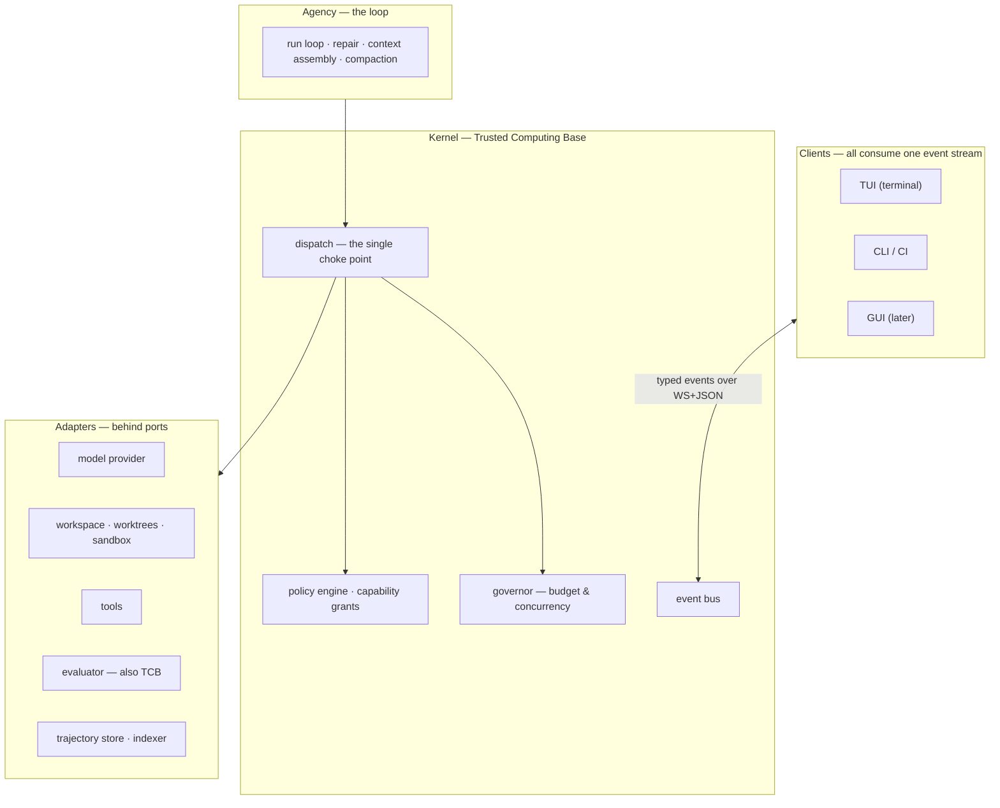

# AETHER v3.0.0 — Project Vision & Onboarding

**Read time: ~10 minutes.** This is the whole picture at altitude. Nothing here is contested; where a
decision is still open, it says so and points you elsewhere.

---

## 1. The mission

**Build an autonomous coding agent harness that competes at the top of the public leaderboards.**

The concrete targets are **SWE-bench Pro** and **SWE-bench Verified** — benchmark suites where an agent
is given a real bug report from a real open-source repository and must produce a patch that makes the
project's own hidden tests pass. Pro is the harder, newer suite and is our primary screen.

Two things about the goal that are easy to misread:

**We are not building a model.** We are building the *system around* a model — the thing that gives it
tools, a workspace, a memory, a security perimeter and a feedback loop. The industry term is a
**harness**. A frontier model called once with a bug report resolves maybe 20–40% of tasks. The same
model inside a good harness resolves substantially more. **That delta is our entire product.**

**Therefore we measure two numbers, always together.** The *absolute* score is dominated by which
model we are allowed to call — a commercial decision, not an engineering one. The number that reflects
our work is **lift**: the resolve-rate delta between a bare model call and the same model inside
AETHER, measured on identical tasks. Lift is the claim that survives a model swap, a leaderboard
reshuffle and a diligence review. Absolute is the claim that sells. We publish both and never one
without the other.

---

## 2. What the product actually is — four pillars

A coding harness is not a prompt loop with tools bolted on. Four subsystems, each with a different
failure mode:

### Reasoning Agency — *the loop*

Turns a task into a sequence of actions and keeps going until it is done or provably stuck. It decides
what to read, what to change, when to run tests, and — the hard part — **what to do when the tests
fail**. That repair edge, from a failing test back into the model's context, is the single largest
lever on score in the entire system. It also owns context: a long task exceeds any window, so the loop
must compact its own history without losing the thread.

*Fails by:* looping forever, running out of context, or losing the original task under a pile of stack
traces.

### Execution Sandbox — *the hands*

Every file read, every edit, every shell command, every test run. Each candidate solution runs in its
own isolated git worktree so parallel attempts cannot corrupt each other, inside a container so the
agent cannot reach the host or the network except through an audited path.

*Fails by:* not actually isolating — which is worse than not isolating at all, because it silently
produces numbers.

### Capability Security Perimeter — *the authorization layer*

The agent is an untrusted actor executing code it wrote, over content it did not write. Every effect
passes through **one** choke point, is authorized against a capability policy, and is verified again at
the moment of effect. External content — repository files, issue text, web results — is marked
untrusted and can never acquire instruction authority.

*Fails by:* prompt injection, or by an authorization granted early and used later under different
conditions.

### Benchmark Evaluator — *the judge*

Runs the task's real tests and decides pass or fail. It is deliberately **outside** the agent's reach:
the agent that writes code cannot modify the tests grading it. This boundary — we call it the Trusted
Computing Base — is not a nicety. Without it, a self-improving system's most efficient available
strategy is to weaken its own judge, and that failure is retroactive: it invalidates every number the
project ever produced.

*Fails by:* passing when it should fail. A gate that cannot fail is the most expensive bug this
project can have.

---

## 3. Architecture at altitude

**Hexagonal (ports & adapters).** Pure domain models at the centre with zero I/O. Every external
dependency — model provider, filesystem, container runtime, database — sits behind a typed `Protocol`.
Swapping Anthropic for a local model, or SQLite for something else, is writing one adapter and
changing no caller.

Two rules make that real rather than aspirational:

- **Ports are wire-serializable.** Every method is `async`; only serializable payloads cross — no file
  handles, no callbacks, no live objects. This means any component can later move out of process — to
  a compiled sidecar, a container, a remote peer — without touching a single caller. It is nearly free
  on day one and impossible to retrofit.
- **A port arrives with its first adapter.** No declaring interfaces against imagined implementations.
  The predecessor declared seventeen ports and five had no implementation at all.

**One choke point.** Every effect in the system goes through `kernel/dispatch.py`:

```
authorize → verify grant → acquire lease → dispatch → release
```

There is no second path, and an architecture test proves it. The `verify` step happens immediately
before the effect, not at authorization time — between issuance and use, arguments can change and a
resumed run can carry a stale grant.

**Headless engine, many clients.** The core emits one typed, append-only event stream. Every
surface — terminal UI, CLI, CI, a future desktop GUI — is a consumer of that stream with no privileged
access. Building the TUI first is deliberate: it is where developers already work, and it keeps the
engine honest, because the UI cannot do anything the protocol does not expose.



Dependencies point downward only, and a linter enforces it. The kernel and the evaluator may not
import from the agency layer — **the thing that judges cannot reach up into the thing being judged.**

---

## 4. Where we are, and what happens next

**We are leaving the prototype.** A working prototype exists at `src/sagiha/` — roughly 13,000 lines
with unusually good architectural discipline. It is reference material, not a foundation. The
production system is a greenfield build at `src/aether/`.

**The most important fact about the current state:** the prototype has **never produced a valid
benchmark number.** Not a low number — no number. Three instrument defects are documented and
reproduced: the benchmark runner resolves task commits against the wrong repository, an editable
install leaks live source into every supposedly-isolated worktree (so candidate changes were invisible
to the gates scoring them), and command-not-found errors were counted as test failures.

This is not a disappointment to work around; **it is the most valuable thing the prototype produced.**
The team found these, wrote them down, and reported zero rather than a comfortable estimate. Every
measurement taken before those fixes had to be discarded, and the project's governing rule comes
directly from that experience:

> **Instruments are built and verified before the capability they measure. Every gate ships with a
> test proving it can fail.**

You will see that rule invoked constantly. It is the difference between this attempt and the last one.

### Immediate sequence

| # | What | Status |
| :--- | :--- | :--- |
| **1** | **Tech Lead alignment meeting.** Two independent proposals were written; they agree on the foundations and diverge on **12 architectural trade-offs**. Three need deciding first: whether a compiled core lands immediately or on a measured trigger, whether capability numbers may be published before a variance baseline exists, and what the self-improvement loop is allowed to modify | **Next** |
| **2** | **Tier 2 normative spec** — ~2–3k words, the minimal statement of what is true. Written *after* the meeting, because writing it before means writing it twice | Blocked on 1 |
| **3** | **Executable contracts** — port protocols, domain models, event catalog, mock adapters, conformance suite. These start immediately and do not wait on the spec | **Can start now** |
| **4** | **Sprint 1** — milestone exit gates converted into backlog items with verifiable acceptance criteria | Blocked on 1–2 |

### What to read, and in what order

1. **`docs/00/rewrite_v300_decision_brief.md`** — the meeting agenda. One page plus appendices. Start here.
2. **`docs/_archive/rationale/rewrite/`** — proposal A (12 docs). For the measurement doctrine and the invariants.
3. **`docs/_archive/rationale/rewrite_b/`** — proposal B (5 docs). For the file-level layout.
4. **`docs/_archive/competitors_research/`** — teardowns of four competing harnesses, with ~78 numbered proposals mapped against our plan.

Everything under `docs/_archive/` is *rationale* — the record of why, not the definition of what.
**Contracts live in code.** When a document and `src/aether/ports/` disagree, the code is right and
the document is a bug.

---

*Two housekeeping notes, so they are not a surprise: the recent archive reorganization left 19 broken
internal links and pushed the documentation word budget over its ceiling — both need an owner. And
this document is tagged `rationale` deliberately, to avoid worsening that budget breach until it is
resolved.*
