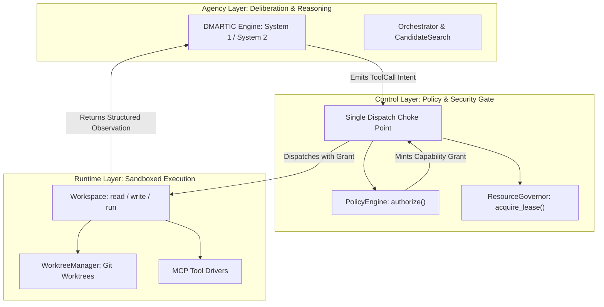

# **Control-Agency-Runtime (CAR) Architecture**

> [!NOTE]
> **Working Proposal Disclaimer**: A working architectural proposal, refined iteratively as practical evaluation progresses.

## **Architectural Layering**

CAR isolates responsibilities into **three** layers:

1. **Control Layer**: security policy, token and spend budgets, context allocation, verification gates. Authorizes every effect before it happens and mints the capability tokens that permit it.
2. **Agency Layer**: deliberation, reasoning loops, context synthesis, sub-task decomposition, delegation. Holds **no reference to Runtime objects** and emits intents only.
3. **Runtime Layer**: sandboxed execution, worktree management, terminal capture, MCP tool drivers. Returns structured observations without touching agent memory or policy state.



**Native sidecars are not a fourth layer.** They are a deployment topology — an implementation detail of where a port's adapter happens to run — available to the Indexer and Runtime layers once measurement justifies them. Listing them as a peer of Control, Agency, and Runtime conflates logical architecture with physical process placement and obscures both.

## **Why Prose Is Not Enough**

Control must evaluate every agent tool request against a security policy before authorizing execution. An interception point must exist in the type system; a boundary that exists only in a document is bypassed by the first contributor in a hurry, and by the outer loop the moment it starts editing adapters.

## **Three Enforcement Mechanisms**

### 1. Capability Grants

Every side-effecting Runtime method executes only if backed by a `Grant` — an unforgeable token minted only by `PolicyEngine.authorize()`. 

```python
class PolicyEngine(Protocol):
    async def authorize(self, call: ToolCall, context: RunContext) -> Decision: ...
    async def record_outcome(self, grant_id: str, result: ToolResult) -> None: ...


class Workspace(Protocol):
    async def write(self, path: str, content: str) -> None: ...
    async def run(self, command: list[str]) -> CommandResult: ...
```

Grants are scoped to specific paths and tools, and they expire. Policy becomes non-bypassable by construction rather than by review.

### 2. Import-Graph Contracts

CI enforces that `agency/` cannot import `runtime/` or `adapters/`, via `import-linter` layer contracts. A violation fails the build. Architectural boundaries that are not mechanically checked erode silently, and this one is load-bearing for the entire security model.

### 3. A Single Dispatch Choke Point

Agency emits a `ToolCall`. The kernel resolves authorization, acquires a lease from the `ResourceGovernor`, dispatches, records the outcome, and returns an observation. There is exactly one path from intent to effect, which is also the single place where audit logging, budget accounting, effect classification, and secret redaction attach.

Grants never escape this dispatch choke point. The dispatch pattern becomes:
```python
async def dispatch(call: ToolCall, ctx: RunContext) -> ToolResult:
    decision = await policy.authorize(call, ctx)
    if not decision.allowed:
        return _denied(call, decision)
    async with governor.lease(kind=call.tool_name) as lease:
        result = await registry.dispatch(call, decision.grant)  # grant never escapes
        await policy.record_outcome(decision.grant.grant_id, result)
        return result
```

## **Admission Control**

The `ResourceGovernor` bounds concurrency, spend, and sandbox count globally. Without it, parallel candidate exploration against a frontier API exhausts provider rate limits and spends wall-clock in retries — a budget stated in a document but never enforced at a call site is not a budget.

## **Cross-References**

* [Security & Threat Model](./security-and-threat-model.md) — what the sandbox boundary must actually stop.
* [Hexagonal Ports](../03-contracts-and-models/hexagonal-ports.md) — `PolicyEngine`, `Grant`, `ResourceGovernor` definitions.
* [Microkernel & Bus](./microkernel-and-bus.md) — where dispatch and replay live.
