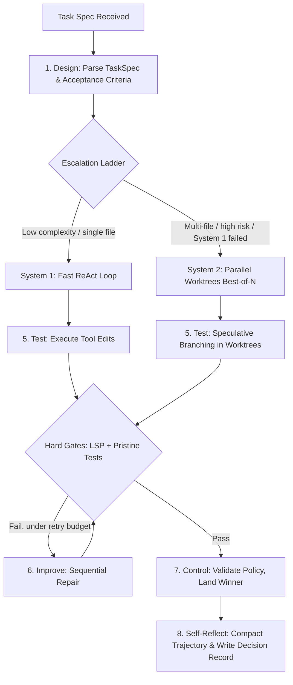

# **DMARTIC Inner Loop — Dual-Process Execution Engine**

> [!NOTE]
> **Working Proposal Disclaimer**: A working architectural proposal, refined iteratively as practical evaluation progresses.

## **Dual-Process Execution Modes**

* **System 1 (Fast):** direct ReAct execution for localized, low-complexity tasks.
* **System 2 (Deliberate):** verifier-guided **best-of-N with sequential repair** across parallel worktrees, for multi-file refactoring and architectural change.

### On the Name

System 2 is deliberately **not** called MCTS. Monte Carlo Tree Search requires a persistent tree, visit counts, UCT selection, and backpropagation of values to ancestors; proposing *n* candidates and scoring each is best-of-N at depth one, which is what the port actually described.

The naming matters because it drives engineering. MCTS's guarantees assume cheap rollouts, whereas one expansion here costs a full agent run plus a test suite — a branching factor of 3 at depth 3 is roughly thirty leaf evaluations, in minutes and dollars. At that cost profile, best-of-N against a strong verifier plus sequential repair of the best failing candidate yields more per dollar than shallow tree search.

**Tree search is gated on a calibrated value model.** That makes the PRM a hard prerequisite rather than a peer deliverable, and it is the reason both cannot land in the same phase as equals.

## **Routing: A Deterministic Escalation Ladder**

Routing is **deterministic at the start**, because a learned router needs trajectories that do not exist on day one, and a complexity score has to be produced by something. Nothing in the system can estimate task complexity before it has run tasks — so the ladder is hand-written:

1. Attempt System 1.
2. Escalate to System 2 on any of: repeated failure (N attempts), file-set closure spanning multiple modules, diff size above threshold, or an explicit risk classification.

The ladder doubles as a **label generator** — its decisions and their outcomes are exactly the training data a learned router needs later. Hand-written policy first, learned policy second, is the only sequence that resolves the cold start.

## **Operational Cycle**

1. **Design** — Parse goals into a `TaskSpec` with machine-checkable acceptance criteria. Route via the escalation ladder.
2. **Measure** — Baseline diagnostics, test results, and coverage *before* modifying anything.
3. **Analyze** — Query the index, the deterministic code graph, and episodic memory.
4. **Review (Plan Mode Gate)** — High-impact actions require Evaluator or human approval, delivered as a **durable asynchronous request** that survives restarts and denies by default on timeout.
5. **Test** — Speculative execution inside worktrees, verified against a **pristine injected copy** of the test suite the candidate cannot reach.
6. **Improve** — Admit candidates through hard gates; rank survivors by score; repair sequentially on failure.
7. **Control** — Validate policy and budget; land the winning candidate; invalidate stale episodic facts.
8. **Self-Reflect** — Compact the trajectory at a deliberate checkpoint; commit the event log; write durable decisions back to `docs/decisions/`.

## **Profile-Conditional Stages**

The cycle above describes the `coding` profile. Under other
[execution profiles](../02-architecture/execution-profiles.md) the loop is **the same loop** — stages
whose ports are unbound are simply no-ops, and the orchestrator contains no branch on profile.

| Stage | Without a `Toolchain` | Without a writable `Workspace` |
| :--- | :--- | :--- |
| 1. Design | unchanged | unchanged |
| 2. Measure | no-op — nothing to baseline | diagnostics only, if a repository is mounted |
| 3. Analyze | unchanged | unchanged (retrieval is read-only) |
| 4. Review gate | unchanged — approval is profile-independent | unchanged |
| 5. Test | no-op | no-op |
| 6. Improve | no-op | no-op |
| 7. Control | budget and policy only | budget and policy only |
| 8. Self-Reflect | unchanged | trajectory only; no decision write-back |

Two consequences worth stating:

* **The escalation ladder only applies where candidates are meaningful.** System 2 explores parallel
  worktrees; with no writable workspace there is nothing to branch. Such profiles run System 1 only,
  and the ladder never fires — not because it is disabled, but because its trigger conditions
  (multi-file closure, diff size) are undefined without edits.
* **A no-op verification stage is not a passed verification stage.** Stages 5–6 collapsing to nothing
  is exactly why `gates = "none"` emits no `GateReport` rather than an empty one.

## **Gates and Scores Are Separate**

| | Hard gates (admission) | Soft score (ranking) |
| :---- | :---- | :---- |
| **Type** | Binary, non-negotiable | Continuous |
| **Role** | Decide whether a candidate is eligible at all | Order candidates already eligible |
| **Contents** | Tests pass; **tests unmodified**; no new suppressions; coverage not decreased; diff within bounds | PRM value from diagnostic deltas, efficiency, coverage gain |

Every component of the score is a gameable proxy — delete the failing code, add a suppression, widen a type, swallow an exception. Proxies may rank; only gates may admit. And the most important gate is `tests_unmodified`: with full filesystem access to its own worktree, an agent can otherwise **edit its own grader**, rendering any selection built on that measurement meaningless.

## **Failure Recovery**

If an edit fails under compacted context, re-hydrate the affected files in full before retrying. Compilation failure is the signal that compaction went too far. Each step is a git commit, so any failed line of attack rolls back to a known state at zero cost.
