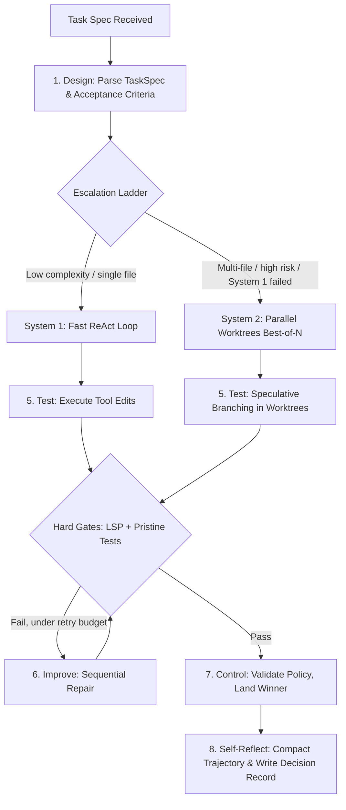

# **DMARTIC Inner Loop — Dual-Process Execution Engine**

> [!NOTE]
> **Working Proposal Disclaimer**: Architectural proposal refined iteratively during evaluation.

## **Dual-Process Execution Modes**

* **System 1 (Fast):** Direct ReAct execution for localized, low-complexity tasks.
* **System 2 (Deliberate):** Verifier-guided **best-of-N with sequential repair** across parallel worktrees for multi-file refactoring and architectural change.

### System Naming & Architecture Rationale

System 2 is best-of-N at depth one with sequential repair, not MCTS. MCTS requires cheap rollouts and a calibrated value model (PRM prerequisite). At candidate evaluation costs (agent run + test suite execution), best-of-N with verifier-guided repair yields higher efficiency per dollar.

## **Routing: Escalation Ladder**

Routing is **deterministic initially** to resolve cold-start data availability:
1. Attempt System 1 ReAct execution.
2. Escalate to System 2 on: repeated failure ($N$ attempts), multi-module file closure, diff size threshold breach, or explicit risk classification.

Decision outcomes generate labeled trajectory data for future learned routing models.

## **Operational Cycle**

1. **Design** — Parse goals into `TaskSpec` with machine-checkable acceptance criteria; evaluate escalation ladder.
2. **Measure** — Baseline diagnostics, test suite state, and coverage before edit execution.
3. **Analyze** — Query code indices, deterministic code graphs, and episodic memory.
4. **Review (Plan Mode Gate)** — Asynchronous approval gate for high-impact actions (default deny on timeout).
5. **Test** — Speculative execution in worktrees against an isolated, pristine test suite copy.
6. **Improve** — Enforce hard gates, rank surviving candidates by soft scores, execute sequential repair.
7. **Control** — Validate policy and budget, land winning candidate branch, invalidate stale episodic facts.
8. **Self-Reflect** — Compact execution trajectory, commit event log, write decision records to `docs/decisions/`.

## **Profile-Conditional Stages**

Loop stages operate identically across [execution profiles](../02-architecture/execution-profiles.md); unbound ports evaluate as no-ops without branching the orchestrator.

| Stage | Without a `Toolchain` | Without a writable `Workspace` |
| :--- | :--- | :--- |
| 1. Design | Unchanged | Unchanged |
| 2. Measure | No-op | Diagnostics only (if repository mounted) |
| 3. Analyze | Unchanged | Unchanged (read-only retrieval) |
| 4. Review gate | Unchanged | Unchanged |
| 5. Test | No-op | No-op |
| 6. Improve | No-op | No-op |
| 7. Control | Budget and policy only | Budget and policy only |
| 8. Self-Reflect | Unchanged | Trajectory only (no decision write-back) |

* Escalation ladder triggers require editable workspace state.
* Collapsed stages 5–6 emit no `GateReport` when `gates = "none"`.

## **Gates vs. Soft Scores**

| Dimension | Hard Gates (Admission) | Soft Score (Ranking) |
| :--- | :--- | :--- |
| **Type** | Binary, non-negotiable | Continuous metric |
| **Role** | Evaluates candidate eligibility | Orders eligible candidates |
| **Contents** | Tests pass, **tests unmodified**, no new suppressions, coverage preserved, diff bounds met | PRM value from diagnostic deltas, execution efficiency, coverage gain |

* The `tests_unmodified` gate prevents self-grading tampering inside agent worktrees.

## **Failure Recovery**

* Re-hydrate context in full if an edit fails under compacted context (compilation failure indicates excessive compaction).
* Every step corresponds to a git commit for zero-cost rollback.
