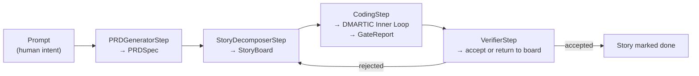

# **Workflow Orchestration & DAGs — The Macro Pipeline**

> [!NOTE]
> **Working Proposal Disclaimer**: A working architectural proposal, refined iteratively as practical evaluation progresses.

> [!IMPORTANT]
> **This layer is a non-goal until the inner loop closes.** Per
> [ADR-0018](../08-decisions/0018-native-workflow-dag.md) §6, no step class in this document is
> written before Sprint 3's exit test is green — one failing test fixed, gated, logged, and
> replayable through the dispatch choke point. This spec lands with Block 4 at the earliest, and
> only if an E0 ablation shows planning beats no-planning on the benchmark suite (ADR-0018
> Consequences). Until then, treat every step signature here as **provisional**: it graduates under
> [Port Stability & Versioning](../03-contracts-and-models/port-stability-and-versioning.md) on
> evidence, not calendar.

## **Why This Module Exists**

[DMARTIC](./dmartic-inner-loop.md) describes what happens once a `TaskSpec` exists. Nothing in the
suite describes where that `TaskSpec` comes from when the input is a paragraph of human intent
rather than an already-scoped task. A senior engineer given a vague ask does not start editing —
they write a spec, decompose it into stories, order them, pick one, implement it, verify it, and
record what happened. This document specifies that macro layer as a **declarative logic pipeline**,
not a general workflow engine: see [ADR-0018](../08-decisions/0018-native-workflow-dag.md) for why
it is a native `WorkflowStep` protocol and not LangGraph, LangChain, Prefect, or Temporal.

## **The Pipeline**



| Step | Input | Output | Responsibility |
| :--- | :--- | :--- | :--- |
| `PRDGeneratorStep` | Prompt (free text) | `PRDSpec` | Turns ambiguous intent into a structured product spec: scope, non-goals, constraints. |
| `StoryDecomposerStep` | `PRDSpec` | `StoryBoard` | Decomposes the spec into an ordered set of `StorySpec` values, each with a disjoint file-set closure per [Task & Acceptance](../03-contracts-and-models/task-and-acceptance.md#decomposition). |
| `CodingStep` | one `StorySpec` | `GateReport` | Converts the story into a `TaskSpec` and runs the existing [DMARTIC inner loop](./dmartic-inner-loop.md) unchanged. This is the only step that touches the kernel. |
| `VerifierStep` | `GateReport` + diff | accept / return-to-board | Admits the story's result or sends it back to `StoryDecomposerStep` for re-scoping. Never re-implements gate logic — it reads the `GateReport` the inner loop already produced. |

`TaskSpec` remains the inner loop's sole input; the macro layer produces `TaskSpec` values through
`CodingStep`, it does not replace or wrap them. A `chat` profile binds no pipeline at all, and
`sagiha run` invoked with an already-scoped goal skips straight to `CodingStep` — the macro layer is
strictly additive.

## **Contract Shape**

Per ADR-0018, the contract is two Protocols in `ports/workflow.py` (declared `experimental` until
adapters exist):

```
WorkflowStep[In: BaseModel, Out: BaseModel]   — name, async execute(ctx, input_data) -> Out
PipelineRunner                                — composes steps, emits events, persists between them
```

Steps are ordinary Python classes. A step may not hold a tool reference, mint a `Grant`, or call a
provider outside `ModelProvider` — the same restriction every other `agency/` module carries.
Composition order is declared in `config.toml` and resolved once at the composition root
([ADR-0004](../08-decisions/0004-no-di-container.md)); this is what makes stages reorderable or
swappable without touching kernel code, and what makes the layer a legitimate RHI target later —
the outer loop can propose a different decomposition strategy and E0 can measure whether it helped.

## **Replayability**

A pipeline run is a first-class, gated, replayable artifact, not a wrapper around one:

* Each step boundary emits an event and persists its output to `TrajectoryStore`, so a pipeline is
  resumable at step granularity and replayable from a cassette — the same properties the inner loop
  already has.
* A step that cannot be replayed is a defect, not an accepted category.
* No stage enters the tree without an E0 measurement showing it beats running the inner loop
  directly on the raw prompt (ADR-0018, "Risk we are accepting knowingly"). If planning does not beat
  no-planning on the benchmark, the layer does not ship — the Protocol may stay, the pipeline does
  not have to run.

## **New Domain Models**

`PRDSpec` and `StoryBoard` are domain models introduced for this layer; their lifecycle and schema
placement are specified in
[Task & Acceptance §PRDSpec and StoryBoard](../03-contracts-and-models/task-and-acceptance.md#prdspec-and-storyboard-macro-layer).
They live beside `TaskSpec` in `src/sagiha/domain/work.py` once implementation begins — this
document carries rules and rationale only, per [Contracts to Code](../implementation/contracts-to-code.md).

## **What This Document Is Not**

* Not a general-purpose workflow engine — four fixed step *kinds* today, not an arbitrary DAG editor.
* Not a replacement for DMARTIC — `CodingStep` calls the inner loop unchanged; this layer only
  decides *which* `TaskSpec` to run next and whether its result should be accepted.
* Not scheduled work — see [ADR-0018](../08-decisions/0018-native-workflow-dag.md) §6 and
  [STATUS.md](../STATUS.md) for what is actually being built now.

## **Related**

[ADR-0018](../08-decisions/0018-native-workflow-dag.md) · [DMARTIC Inner Loop](./dmartic-inner-loop.md) ·
[Task & Acceptance](../03-contracts-and-models/task-and-acceptance.md) ·
[RHI Outer Loop](./rhi-outer-loop.md)
