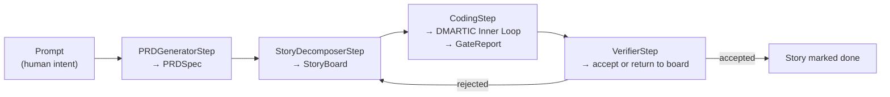

# **Workflow Orchestration & DAGs — The Macro Pipeline**

> [!NOTE]
> **Working Proposal Disclaimer**: Architectural proposal refined iteratively during evaluation.

> [!IMPORTANT]
> Non-goal until inner loop validation completes ([ADR-0018](../08-decisions/0018-native-workflow-dag.md) §6). Provisional status under [Port Stability & Versioning](../03-contracts-and-models/port-stability-and-versioning.md).

## **Why This Module Exists**

Transforms un-scoped human prompts into structured, actionable `TaskSpec` instances for [DMARTIC](./dmartic-inner-loop.md). Implemented as a declarative Python logic pipeline via `WorkflowStep` protocols, avoiding external workflow dependencies (LangGraph, Temporal).

## **The Pipeline**



| Step | Input | Output | Responsibility |
| :--- | :--- | :--- | :--- |
| `PRDGeneratorStep` | Prompt (free text) | `PRDSpec` | Converts ambiguous intent into structured product spec (scope, non-goals, constraints). |
| `StoryDecomposerStep` | `PRDSpec` | `StoryBoard` | Decomposes spec into ordered `StorySpec` list with disjoint file closures ([Task & Acceptance](../03-contracts-and-models/task-and-acceptance.md#decomposition)). |
| `CodingStep` | `StorySpec` | `GateReport` | Maps story to `TaskSpec` and executes [DMARTIC inner loop](./dmartic-inner-loop.md). Only step interacting with the kernel. |
| `VerifierStep` | `GateReport` + diff | Accept / return | Evaluates `GateReport` output; admits story or returns to `StoryDecomposerStep`. |

* Scoped goals (`sagiha run`) bypass macro steps directly to `CodingStep`.

## **Contract Shape**

Protocols in `ports/workflow.py` ([ADR-0018](../08-decisions/0018-native-workflow-dag.md)):

```python
WorkflowStep[In: BaseModel, Out: BaseModel]   # name, async execute(ctx, input_data) -> Out
PipelineRunner                                # composes steps, emits events, persists state
```

* Steps cannot hold tool references, mint `Grant` tokens, or invoke providers directly outside `ModelProvider`.
* Composition declared in `config.toml` without DI containers ([ADR-0004](../08-decisions/0004-no-di-container.md)).

## **Replayability & Benchmark Gating**

* Step boundaries emit events and persist outputs to `TrajectoryStore` for step-level resume and replayability.
* Pipeline stages require E0 benchmark verification proving performance gains over direct inner loop execution.

## **Domain Models**

* `PRDSpec` and `StoryBoard` schemas defined in [Task & Acceptance §PRDSpec and StoryBoard](../03-contracts-and-models/task-and-acceptance.md#prdspec-and-storyboard-macro-layer) and `src/sagiha/domain/work.py` (see [Contracts to Code](../implementation/contracts-to-code.md)).

## **Non-Goals**

* Not a general DAG engine (limited to 4 fixed step types).
* Not a replacement for DMARTIC (`CodingStep` invokes inner loop unchanged).

## **Related**

[ADR-0018](../08-decisions/0018-native-workflow-dag.md) · [DMARTIC Inner Loop](./dmartic-inner-loop.md) · [Task & Acceptance](../03-contracts-and-models/task-and-acceptance.md) · [RHI Outer Loop](./rhi-outer-loop.md) · [STATUS.md](../STATUS.md)
