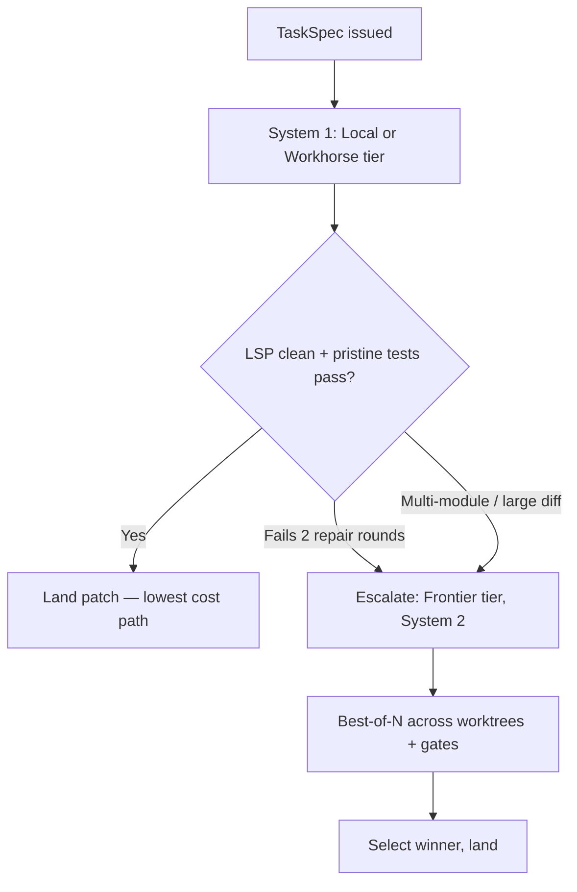

# **LLM Provider Tiering, Economics & Task Routing**

> [!NOTE]
> **Working Proposal Disclaimer**: Architectural proposal detailing LLM model tiers, economics, GPU targets, and routing escalation.

## 1. **Model Economics Thesis**

Primary metric for autonomous software engineering: **Cost per Resolved Task ($ / pass)**.

$$\text{cost\_per\_success} = \frac{\text{total\_spend}}{\text{tasks\_resolved}}$$

Verification gates (`pytest`, LSP diagnostics) allow lower-cost models to iterate safely until green, using deterministic verification to offset raw LLM capability gaps.

## 2. **Model Tiering & Role Mapping**

Tiers are assigned by functional **role**:

| Tier | Role | Primary Usage |
| :--- | :--- | :--- |
| **Tier 1: Frontier** | Deep reasoning & planning | System 2 multi-module refactoring, architectural planning, Meta-Improver, Evaluator |
| **Tier 2: Workhorse** | High-efficiency coding | Default System 1 execution (majority of edit steps) |
| **Tier 3: Fast** | Low-latency processing | Compaction, summarization, classification, commit messages |
| **Tier 4: Local** | Zero marginal cost | Offline/air-gapped execution, bulk processing |

### Role-to-Tier Default Mappings

| Call Site | Default Role $\rightarrow$ Tier | Rationale |
| :--- | :--- | :--- |
| Planning & `TaskSpec` | `planning` $\rightarrow$ **frontier** | Executes once per task; prevents compounding downstream errors. |
| System 1 execution | `execution` $\rightarrow$ **workhorse** | Dominates step volume. Overridden via [execution profiles](../02-architecture/execution-profiles.md). |
| System 2 candidates | `candidates` $\rightarrow$ **workhorse** | $N$-way candidate generation; prevents excessive frontier spend. |
| Compaction & summary | `compaction` $\rightarrow$ **fast** | Low reasoning requirement. |
| `Reviewer` judge | `judge` $\rightarrow$ **frontier** | Must use independent model identity from generating model. |
| Meta-Improver | `meta` $\rightarrow$ **frontier** | High-impact harness changes. |

* Port abstraction: Callers request roles; composition binds one `ModelProvider` per role to preserve offline cassette testability ([Hexagonal Ports](../03-contracts-and-models/hexagonal-ports.md)).

## 3. **Local GPU Target**

* **Reference Hardware**: 16GB VRAM GPU + 32GB system RAM.
* **Target Model**: Qwen 2.5 Coder 32B-Instruct (Q4_K_M) via Ollama, vLLM, or ROCm.
* Allows unlimited local iterations against LSP/tests at zero marginal API cost ([Ollama & Qwen2.5-Coder on Linux](../06-guides-and-patterns/ollama-qwen-coder-setup.md)).

## 4. **Prompt Caching Economics**

Prompt caching controls input token costs:

$$\text{Cache-stable cost} \approx P_{\text{prefix}} \times \text{rate}_{\text{write}} + (N_{\text{turns}} - 1) \times P_{\text{prefix}} \times \text{rate}_{\text{read}}$$

Mid-run tier switching invalidates prompt caches; escalation triggers must strictly depend on failure evidence ([Context & Cache Engineering](../02-architecture/context-and-cache-engineering.md)).

## 5. **Cascading Escalation Ladder**

| Trigger | Allocated Tier |
| :--- | :--- |
| Single-file tasks | Workhorse (or Local) |
| 2 repair failures, $\ge 3$ files, or large diff | Frontier (System 2) |
| System 2 candidates | Workhorse |
| Compaction / summaries | Fast |
| Meta-Improver / Judge | Frontier (independent evaluator required) |

## 6. **Cost Accounting**

Pricing schemas (`[[pricing]]`) are mandatory in configuration; missing rates trigger startup rejection.
* Trajectories log token usage and spend via `sagiha.cost_usd` spans. `ResourceGovernor` enforces spend limits per run and hour.

## 7. **Multi-Provider Integration & Failover**

Native SDKs (`anthropic`, `google-genai`, `openai`) are used directly per [ADR-0008](../08-decisions/0008-native-sdks-no-litellm.md). The `openai` SDK reaches OpenAI-compatible providers (`OpenRouter`, Ollama, vLLM) via `base_url`.

### Failover Rules
* Tripped via [circuit breaker](../03-contracts-and-models/error-taxonomy.md); emits `DegradationEvent` and invalidates run for benchmark comparison.
* Local runs will never fail over to cloud endpoints without explicit authorization.

## 8. **Baseline Invalidation on Model Upgrades**

Model updates require re-measuring the A/A noise floor to preserve statistical validity of harness comparisons.
