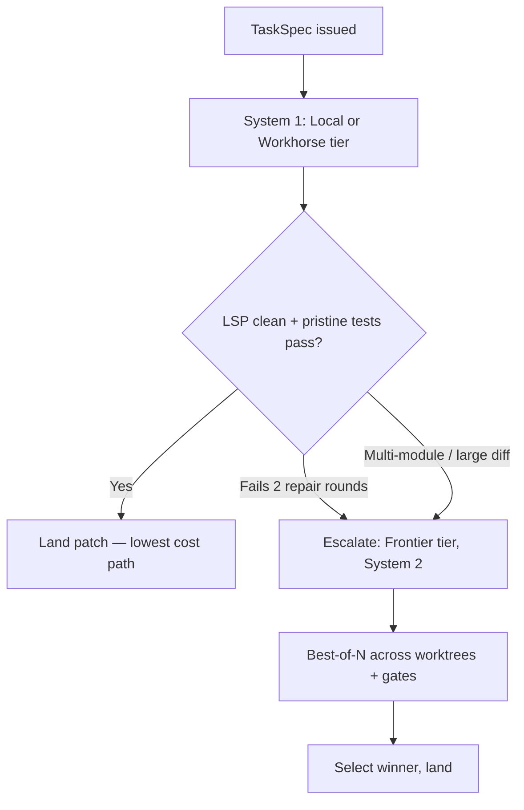

# **LLM Provider Tiering, Economics & Task Routing**

> [!NOTE]
> **Working Proposal Disclaimer**: This normative specification details the LLM model tiers, cost-performance metrics, local GPU targets, and cascading escalation strategy used by SAGIHA.

---

## 1. **Model Economics Thesis**

SAGIHA is model-agnostic by design via the `ModelProvider` port. In autonomous software engineering, **raw benchmark accuracy is not the efficiency metric that matters**. The operative figure is **Cost per Resolved Task ($ / pass)** — total spend divided by tasks that actually cleared the verification gates.

```
cost_per_success = total_spend / tasks_resolved
```

A cheaper model that halves the resolution rate is *more* expensive by this measure. Optimizing cost-per-run instead of cost-per-success is how a harness gets "cheaper" while getting worse, and it is the single most common way these systems are mis-tuned.

The strategic consequence is real: pairing budget or open-weight models with SAGIHA's LSP diagnostic gates and pristine `pytest` verification lets lower-cost models iterate until they pass — recovering much of the frontier gap at a fraction of the cost. **Verification substitutes for model capability**, and that is the economic core of this architecture.

---

## 2. **Model Tiering**

Tiers are defined by **role**, not vendor, so routing policy survives model releases.

| Tier | Role | Representative (2026) | Primary use in SAGIHA |
| :--- | :--- | :--- | :--- |
| **Tier 1: Frontier** | Deepest reasoning, largest context | Claude Opus 5, Claude Fable 5, GPT-5-class | System 2 multi-module refactoring, architectural work, Meta-Improver, Evaluator |
| **Tier 2: Workhorse** | Strong coding at moderate cost | Claude Sonnet 5, Gemini Flash-class, DeepSeek V3-class | **Default System 1 execution** — the large majority of steps |
| **Tier 3: Fast** | Cheap, low-latency | Claude Haiku 4.5, Flash-class | Compaction, summarization, classification, commit messages |
| **Tier 4: Local** | Zero marginal cost, private | Qwen 2.5 Coder 32B, DeepSeek Coder V2 Lite | Offline / air-gapped operation, bulk pre-processing |

> [!IMPORTANT]
> **Benchmark scores and per-task costs are deliberately not tabulated here.** Published SWE-bench figures and provider prices move monthly, and a stale table in a normative document is worse than none — it gets trusted. Operators populate real figures via the `[[pricing]]` config block (§5) and measure resolution rates on their own S0 suite. The only numbers this project trusts are ones it measured itself, on its own workload.

Tier-to-model binding lives in `config.toml`, never in code:

```toml
[model.tiers]
frontier  = { provider = "anthropic", model = "..." }
workhorse = { provider = "anthropic", model = "..." }
fast      = { provider = "anthropic", model = "..." }
local     = { provider = "openai-compatible", model = "...", base_url = "http://localhost:11434/v1" }
```

---

## 3. **Local GPU Target (16GB VRAM)**

SAGIHA explicitly supports self-hosted execution for privacy and zero-marginal-cost operation:

* **Reference profile**: 16GB VRAM GPU (NVIDIA RTX / AMD Radeon) + 32GB system RAM.
* **Representative model**: Qwen 2.5 Coder 32B-Instruct at Q4_K_M via Ollama, vLLM, or ROCm.
* **Allocation**: roughly 15GB resident in VRAM with the remainder offloaded to system RAM.
* **Operating mode**: unlimited iteration against LSP diagnostics and unit tests at zero API cost.

**Zero marginal cost is not zero cost.** Local inference trades dollars for latency and hardware, and slower inference lengthens every DMARTIC cycle — which lowers tasks-per-hour even when it lowers dollars-per-task. Two further caveats decide where local models actually fit:

* Most local stacks lack **prompt caching**, forfeiting the largest cost lever described in §4 — though at zero marginal cost the loss is latency rather than spend.
* Tool-use fidelity and long-context adherence are typically weaker, which matters most for the multi-file work that Tier 1 handles anyway.

Measure on the S0 suite before assuming a tier assignment. The verification-substitutes-for-capability thesis is testable, and it should be tested rather than believed.

---

## 4. **The Cache Is the Dominant Cloud Cost Lever**

For multi-step agents, cached input tokens dwarf output tokens in volume, and cache reads bill at a steep discount to base input rates:

```
Naive (prefix rebuilt each turn):
  cost ≈ N_turns × P_prefix × rate_in

Cache-stable (prefix written once, read thereafter):
  cost ≈ P_prefix × rate_write + (N_turns − 1) × P_prefix × rate_read
```

Over a 30-turn run with a large stable prefix, that gap is the biggest single number in the budget. This is why [Context & Cache Engineering](../02-architecture/context-and-cache-engineering.md) forbids per-turn repartitioning, and why **cache hit ratio is an alert metric**, not a curiosity.

**This constrains the cascade.** Switching tiers mid-run discards the cache, so an escalation pays a fresh prefix write on top of the higher rate. Escalation must therefore be triggered by *evidence of failure* rather than a guess about difficulty — which is exactly how the ladder in §5 is specified.

---

## 5. **Cascading Escalation Ladder**

Routing is **deterministic** at Day 0. The AOI router replaces it only once calibrated — and the training data it needs is precisely this ladder's recorded decisions and outcomes.



| Trigger | Tier |
| :--- | :--- |
| Default single-file work | Workhorse (or Local, if configured) |
| Repeated failure (2 repair rounds), ≥3 files, or large diff | Frontier |
| System 2 candidate generation | Frontier |
| Compaction, summarization, commit messages, query expansion | Fast |
| Meta-Improver proposals | Frontier |
| **Evaluator / LLM judge** | **Frontier, and never the model that generated the candidate** |

That last row is a **correctness constraint, not an economic one**. A model judging its own output correlates its blind spots with its grading, silently inflating every score. Generator/evaluator separation only means something if the evaluator is genuinely independent.

*Intended result*: the large majority of tasks resolve on the cheap path, with frontier spend reserved for genuine architectural complexity.

---

## 6. **Cost Accounting**

Prices live in configuration, never in code, and are stamped into the trajectory so historical runs stay costable after a price change:

```toml
[[pricing]]
provider = "anthropic"
model    = "..."
input_per_mtok       = 0.00
output_per_mtok      = 0.00
cache_write_per_mtok = 0.00
cache_read_per_mtok  = 0.00
```

A missing pricing entry is a **hard startup error**, never a silent zero. A system that under-reports spend as `$0.00` is more dangerous than one that refuses to start.

Every `gen_ai.chat` span carries `sagiha.cost_usd` derived from these rates and reported usage, and the `ResourceGovernor` enforces `max_spend_usd_per_run` / `max_spend_usd_per_hour` against the same figures — so the budget and the dashboard cannot disagree.

**Tracked alongside cost-per-success**: retry share of spend (target < 10%) and cache hit ratio (target > 0.80 on multi-step cloud runs). Both are leading indicators that move before task success does.

---

## 7. **Multi-Provider Integration**

Native first-party SDKs behind one port, per [ADR-0008](../08-decisions/0008-native-sdks-no-litellm.md):

* **`anthropic`** — Claude 5 family, with `cache_control` prefix caching and extended-thinking blocks round-tripped verbatim.
* **`google-genai`** — Gemini family.
* **`openai`** — GPT family, and by `base_url` override every OpenAI-compatible endpoint: **OpenRouter** (`https://openrouter.ai/api/v1`), Ollama (`http://localhost:11434/v1`), vLLM, LM Studio, Together, Groq.

That third bullet is why no universal abstraction layer is needed: one adapter reaches the entire long tail without flattening the cache and reasoning semantics the harness depends on.

### Failover

```toml
[model.failover]
frontier  = ["anthropic:...", "openai:...", "google:..."]
workhorse = ["anthropic:...", "openai:..."]
```

Tripped by the [circuit breaker](../03-contracts-and-models/error-taxonomy.md). Failover is a **degradation**: it emits a `DegradationEvent`, appears in the run summary, and **invalidates the run for benchmarking**, since a result produced partly on a fallback model measures a configuration nobody chose.

Failover never crosses a trust boundary — a run configured for a local model does not silently fail over to a cloud provider, because that would ship source code somewhere the operator never authorized.

---

## 8. **Model Upgrades Invalidate the Baseline**

A new model version is an ordinary harness mutation with one extra obligation: **re-measure the A/A noise floor before believing any later comparison**. A provider changing a model underneath you is statistically indistinguishable from your harness changing, and skipping the re-baseline contaminates every subsequent conclusion.

Model id, provider, and pricing hash are recorded on every trajectory root span, so a result is always attributable to the exact configuration that produced it.
