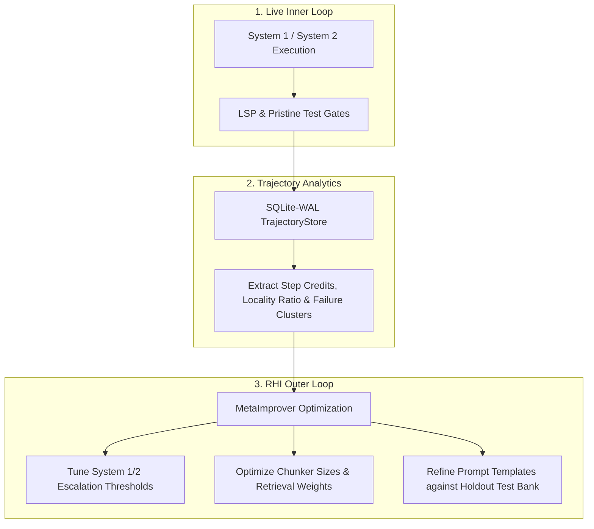

# **Proposed Analyses: Metrics, Analytics, & Trajectory Mining**

> [!NOTE]
> **Working Proposal Disclaimer**: This guide defines the telemetry analytics, process metrics, trajectory mining techniques, failure taxonomy clustering, and statistical validation principles used in SAGIHA.

---

## 1. **Pristine Holdout Evaluation & Hard Gates**

To prevent benchmark contamination and agent self-grading:

1. **Out-of-Context Test Bank:** Benchmark test suites reside completely outside the agent's worktree context.
2. **Pristine Test Injection:** The `Evaluator` port injects holdout tests into a clean container sandbox *only* at the verification step.
3. **`tests_unmodified` Hard Gate:** Any candidate branch that modifies, deletes, or disables test files is an **admissions rejection (hard gate failure)**.

---

## 2. **Component Verification & Observability**

Components are evaluated against operational health signals:

| Component Box | Primary Health & Quality Signal | Verification Suite (`tests/contracts/`) |
| :--- | :--- | :--- |
| **`ModelProvider`** | Alert when Prompt Cache Hit Ratio is consistently low; cassette replay determinism | `test_model_conformance.py` |
| **`Indexer` / `Memory`** | `recall@10` on labelled query benchmarks | `test_indexer_conformance.py` |
| **`LSPAdapter`** | Diagnostic response latency & error counts | `test_lsp_conformance.py` |
| **`Workspace` / Sandbox** | Isolation leakage (0 ungranted writes) | `test_workspace_conformance.py` |

---

## 3. **Trajectory Data Mining & Process Analytics**

Every task run produces an immutable, append-only trajectory logged into the `TrajectoryStore` (SQLite-WAL) containing: `TaskSpec`, `PromptPrefix`, `RetrievedChunks`, `ToolCalls`, `LSP_Deltas`, `Cost`, `Time`, `FinalDiff`, and `Pass/Fail`.

### **A. Intermediate Step Credit Assignment (Diagnostic Deltas)**
Measures step-by-step diagnostic progress rather than relying solely on binary final output. We evaluate if a step fixed compilation or type errors, or if it introduced syntax or interface regressions.

### **B. Locality Ratio**
Measures surgical precision vs. collateral edits across the repository. Evaluated by comparing the lines changed in the target function/module against the total lines touched across the repository.

### **C. Edit Hunk Failure Ratio**
A top-tier quality signal tracking the reliability of edit applications.

### **D. Unsupervised Failure Taxonomy Clustering**
By vectorizing log outputs from failed steps and applying clustering (e.g., HDBSCAN / K-Means), SAGIHA categorizes failure root causes automatically:
1. **Context Truncation / Misses:** Symbol omitted by retriever.
2. **Type / Interface Mismatches:** Edits violated signature contracts (caught by `LSPAdapter`).
3. **API Hallucinations:** Model invoked non-existent methods.
4. **Loop Timeouts:** Agent stuck in a repetitive ReAct loop.

---

## 4. **RHI Outer Loop & Statistical Validation**

1. **Inner Loop Telemetry:** The active kernel logs tool dispatches, LSP deltas, and costs.
2. **Offline Trajectory Analytics:** Processes trajectories offline, calculating step credits, locality ratios, and failure clusters.
3. **RHI Outer Loop Optimization:** The `MetaImprover` tunes prompts, retrieval weights, and escalation thresholds against a calibrated noise floor. Every harness mutation must be backed by empirical statistical evidence before human sign-off and deployment.
