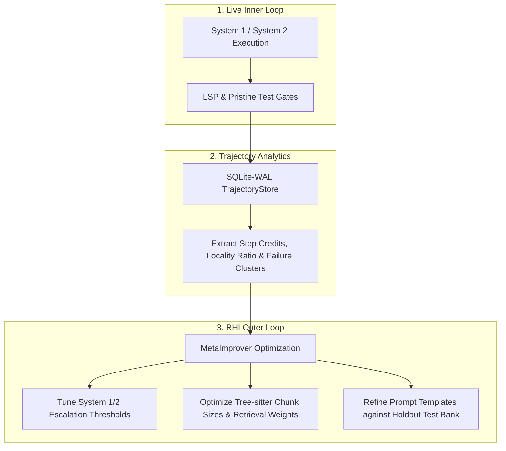

# **Metrics, Analytics, Dogfooding & Empirical Self-Improvement**

> [!NOTE]
> **Working Proposal Disclaimer**: This normative guide establishes the data science principles, evaluation metrics, trajectory mining techniques, failure taxonomy clustering, and dogfooding milestones for SAGIHA.

---

## 1. **Dogfooding & Self-Hosting Timeline**

SAGIHA follows a strict phased path toward self-hosting (using SAGIHA to build and refactor SAGIHA):

* **Sprint 1 & 2 (Bootstrap Phase):** Build typed `typing.Protocol` ports, Pydantic schemas, composition root `build_kernel()`, SQLite-WAL trajectory store, and Stdio MCP bash/filesystem tool drivers.
* **Sprint 3 (Dogfooding Milestone):** Once Sprint 2 passes its port conformance suite, SAGIHA becomes functional enough to edit files, run pytest, and execute git commands. From Sprint 3 onward, **SAGIHA is used to build its own future modules** (Worktree isolation, LSP supervisor, AST indexer, System 2 search).

---

## 2. **Pristine Holdout Evaluation & Hard Gates**

To prevent benchmark contamination and agent self-grading cheating:

1. **Out-of-Context Test Bank:** Benchmark test suites reside in a read-only, holdout directory (`/benchmarks/holdout/`) completely outside the agent's worktree context.
2. **Pristine Test Injection:** The `Evaluator` port injects holdout tests into a clean container sandbox *only* at the verification step.
3. **`tests_unmodified` Hard Gate:** Any candidate branch that modifies, deletes, or disables test files is automatically assigned a hard score of `0.0` (admissions failure).

---

## 3. **Isolated Component Verification & Contract Suites**

Components are never evaluated using noisy end-to-end task runs. Each box is benchmarked independently against its explicit KPI before assembly:

| Component Box | Isolated Benchmark Metric | Verification Suite (`tests/contracts/`) |
| :--- | :--- | :--- |
| **`ModelProvider`** | **Prompt Cache Hit Ratio (≥95%)** & Latency | `test_model_provider.py` (header verification & cassette replay) |
| **`Indexer` / `Memory`** | **`recall@10`** on a labelled query set | `test_indexer.py` (symbol retrieval precision) |
| **`LSPAdapter`** | **Diagnostic Latency (<100ms)** | `test_lsp_adapter.py` (document overlay type-check speed) |
| **`Workspace` / Sandbox** | **Isolation Leakage (0 ungranted writes)** | `test_workspace.py` (capability grant enforcement) |

---

## 4. **Trajectory Data Mining & Process Analytics**

Every task run produces an immutable, append-only trajectory logged into the `TrajectoryStore` (SQLite-WAL):

$$\text{Trajectory} = \{ \text{TaskSpec}, \text{PromptPrefix}, \text{RetrievedChunks}, \text{ToolCalls}, \text{LSP\_Deltas}, \text{Cost}, \text{Time}, \text{FinalDiff}, \text{Pass/Fail} \}$$

### **A. Intermediate Step Credit Assignment ($\Delta \text{Diagnostics}$)**
Measures step-by-step diagnostic progress rather than relying solely on binary final output:
$$\Delta \text{Diagnostics}_t = \text{LSP\_Errors}_{t-1} - \text{LSP\_Errors}_t$$
* **$\Delta > 0$:** Step fixed compilation or type errors.
* **$\Delta < 0$:** Step introduced syntax or interface regressions.

### **B. Locality Ratio ($\text{LR}$)**
Measures surgical precision vs. destructive collateral edits across the repository:
$$\text{LR} = \frac{\text{Lines Changed in Target Function/Module}}{\text{Total Lines Touched Across Repository}}$$

### **C. Unsupervised Failure Taxonomy Clustering**
By vectorizing error outputs from failed steps (using TF-IDF or embedding vectors of terminal logs) and applying **HDBSCAN / K-Means clustering**, SAGIHA categorizes failure root causes automatically:
1. **Context Truncation / Misses:** Symbol omitted by retriever.
2. **Type / Interface Mismatches:** Edits violated signature contracts (caught by `LSPAdapter`).
3. **API Hallucinations:** Model invoked non-existent methods.
4. **Loop Timeouts:** Agent got stuck in a repetitive ReAct loop.

---

## 5. **The Data-Driven Self-Improvement Flywheel (RHI Outer Loop)**

1. **Inner Loop Telemetry:** The active kernel logs all tool dispatches, LSP deltas, and costs.
2. **Offline Trajectory Analytics:** Processes trajectories offline, calculating step credits, locality ratios, and failure clusters.
3. **RHI Outer Loop Optimization:** The `MetaImprover` tunes prompt templates, retrieval weights, and escalation thresholds against a calibrated **A/A noise floor** ($\sigma_{noise}$ at $p < 0.05$), ensuring every harness mutation is backed by empirical statistical evidence before human sign-off and deployment.

---

## 6. **Task Complexity Difficulty Scale (Tiers 1 to 10)**

To benchmark SAGIHA systematically and track capability growth over time, benchmark tasks are categorized along a **10-Point Difficulty Scale**:

| Complexity Tier | Target Systems & Applications | Feasibility for SAGIHA + LLMs | Primary Verification Mechanism |
| :--- | :--- | :--- | :--- |
| **Level 1 – 3** | Single-function algorithms, unit bug fixes, simple CLI utilities (e.g., `calc_discount`). | **100% (System 1 Fast ReAct)** | Unit tests (`pytest`), `LSPAdapter` syntax check |
| **Level 4 – 6** | Complete REST CRUD microservices (FastAPI/Express), Dockerized services, React dashboards. | **95% (System 1 ReAct)** | Container integration tests, OpenAPI validation |
| **Level 7 – 8.5** | **SOTA Agentic Tier:** In-memory Vector Database in Rust (`HNSW` + BM25), Distributed CQRS & Event-Sourcing engine in Go/Python. | **80% – 88% (System 2 Best-of-N Worktrees)** | Multi-worktree parallel branching, PRM scoring, LSP type diagnostics |
| **Level 9 – 10** | **Extreme Infrastructure Tier:** Multi-region Byzantine Raft/Paxos consensus engine, sub-microsecond HFT matching engine, LLVM JIT compiler. | **<15% (Requires Human Co-Pilot)** | Formal verification, micro-benchmarks, hardware cache-line profilers |

### **Benchmark Progression Protocol**
1. **Phase 1 Baseline (Levels 1–3):** Validate kernel stability, cassette replay determinism, and basic `LSPAdapter` feedback loops.
2. **Phase 2 Expansion (Levels 4–6):** Evaluate multi-file editing precision, Docker sandbox materialization, and `Workspace` capability grant boundaries.
3. **Phase 3 SOTA Frontier (Levels 7–8.5):** Stress-test System 2 Best-of-N parallel branch exploration, `CodeGraph` dependency closures, and PRM verifier scoring on high-concurrency Rust/Go systems.
