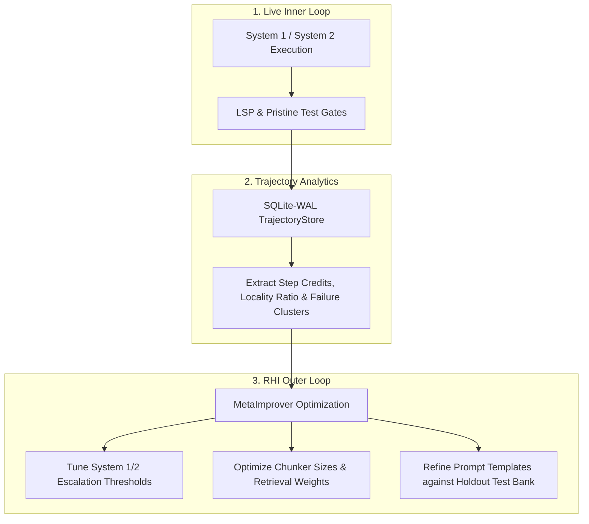

# **Proposed Analyses: Metrics, Analytics, & Trajectory Mining**

> [!NOTE]
> **Working Proposal Disclaimer**: Defines telemetry analytics, process metrics, trajectory mining, failure taxonomy clustering, and statistical validation in SAGIHA.

## 1. **Pristine Holdout Evaluation & Hard Gates**

* **Out-of-Context Test Bank**: Benchmark test suites exist outside the worktree.
* **Pristine Test Injection**: The `Evaluator` port injects holdout tests into isolated container sandboxes only during verification.
* **`tests_unmodified` Hard Gate**: Any candidate branch modifying or disabling test files triggers an automatic admissions rejection.

## 2. **Component Verification & Observability**

| Component Box | Primary Health Signal | Verification Suite (`tests/contracts/`) |
| :--- | :--- | :--- |
| **`ModelProvider`** | Prompt Cache Hit Ratio; cassette replay determinism | `test_model_conformance.py` |
| **`Indexer` / `Memory`** | `recall@10` on query benchmarks | `test_indexer_conformance.py` |
| **`LSPAdapter`** | Diagnostic latency & error counts | `test_lsp_conformance.py` |
| **`Workspace` / Sandbox** | Isolation leakage (0 ungranted writes) | `test_workspace_conformance.py` |

## 3. **Trajectory Data Mining & Process Analytics**

Append-only trajectories in `TrajectoryStore` (SQLite-WAL) capture: `TaskSpec`, `PromptPrefix`, `RetrievedChunks`, `ToolCalls`, `LSP_Deltas`, `Cost`, `Time`, `FinalDiff`, and `Pass/Fail`.

* **Intermediate Step Credit Assignment**: Evaluates step-by-step diagnostic deltas (compilation/type error resolution vs. regressions).
* **Locality Ratio**: Measures surgical edits vs. collateral edits (lines changed in target function vs. total repository diff).
* **Edit Hunk Failure Ratio**: Tracks edit application application reliability.
* **Unsupervised Failure Taxonomy Clustering**: Vectorizes failed step logs via HDBSCAN / K-Means into four categories:
  1. *Context Truncation / Misses* (omitted symbols)
  2. *Type / Interface Mismatches* (signature violations caught by LSP)
  3. *API Hallucinations* (non-existent methods)
  4. *Loop Timeouts* (stuck ReAct loops)

## 4. **RHI Outer Loop & Statistical Validation**

1. **Inner Loop Telemetry**: Active kernel records tool dispatches, LSP deltas, and token costs.
2. **Offline Trajectory Analytics**: Calculates step credits, locality metrics, and failure taxonomy clusters.
3. **RHI Outer Loop Optimization**: `MetaImprover` tunes prompt templates, retrieval parameters, and escalation thresholds against the noise floor before human sign-off.
