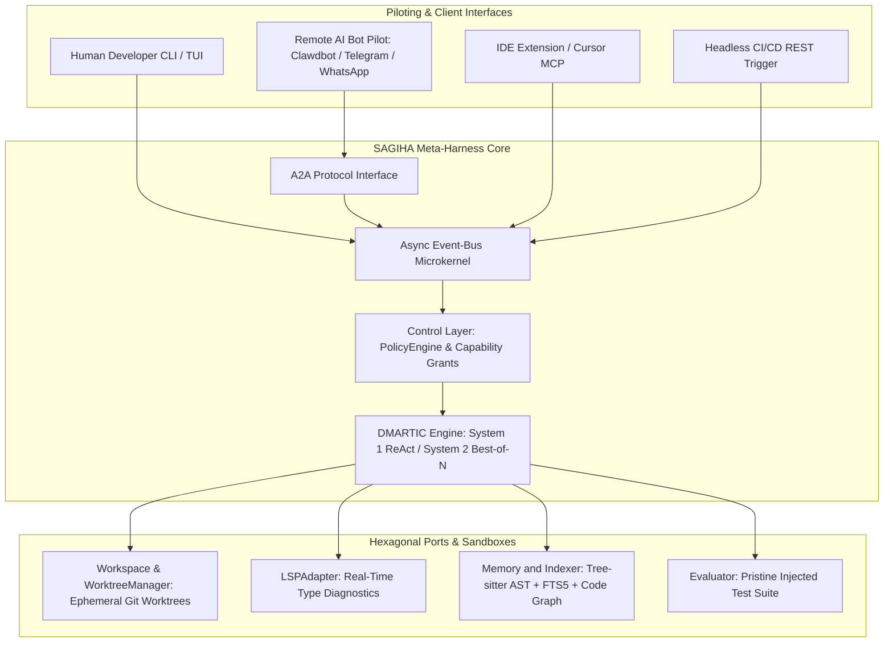

# **SAGIHA — Super AGI Harness Agent**

> [!NOTE]
> **Working Proposal Disclaimer**: This documentation tree is a working architectural proposal and reference blueprint for SAGIHA, not an imperative final specification. Practical iterations, prototyping, and empirical evaluation refine these modules as the system evolves.

Welcome to the documentation hub for **SAGIHA** — a decoupled, hexagonal Meta-Harness that turns frontier LLMs into an autonomous software engineering agent operating independently or with a human in the loop.

---

## **Naming & Scope**

`SAGIHA` expands to **Super AGI Harness Agent** throughout this suite. See [ADR-0001](./08-decisions/0001-project-name.md).

The system is **measured** as an autonomous coding harness — every capability claim in this suite is stated as a benchmark with a threshold, not as an unfalsifiable end-state, and the benchmark is a coding benchmark.

It is not *limited* to coding. Coding is the default [execution profile](./02-architecture/execution-profiles.md); analysis, review, and conversational profiles mount fewer ports and skip the worktree and gate pipeline entirely. Measurement stays scoped to coding because that is what can be verified — a profile with no machine-checkable acceptance criteria produces no number, and the tree reports no numbers it cannot defend.

---

## **Source of Truth**

Documentation drift is the failure mode this tree is structured against, so ownership is explicit:

* The **modular docs (`01` – `08`)** and [`implementation/`](./implementation/) are the **normative source of truth**. When a detail is contested, these win.
* **Contracts — ports and domain models — live only in [`03-contracts-and-models/`](./03-contracts-and-models/)**, and move into `src/sagiha/{ports,domain}/` at implementation start ([Contracts to Code](./implementation/contracts-to-code.md)). Nowhere else defines a `Protocol` or a `BaseModel`.
* [`reference/`](./reference/) is long-form derivation and rationale: research context and comparative analysis. It carries **no interface definitions**. Read it for *why*, not *what*.
* [`reviews/`](./reviews/) is historical: past adversarial reviews and their remediation status.

Every file declares `status:` in front matter (`normative` / `rationale` / `historical`), because this
tree is read by retrieval as often as by a human, and a status note in a README does not survive
chunking.

Each topic has exactly one owner. Do not restate a contract in two places.

---

## **Documentation Sitemap**

| Module Directory | Status | Primary Documents |
| :--- | :--- | :--- |
| 📄 [`STATUS.md`](./STATUS.md) | **Normative** | Implementation truth — what works now vs planned |
| 📁 [`01-executive/`](./01-executive/) | **Normative** | [vision-and-philosophy.md](./01-executive/vision-and-philosophy.md), [executive-summary.md](./01-executive/executive-summary.md), [glossary.md](./01-executive/glossary.md) |
| 📁 [`02-architecture/`](./02-architecture/) | **Normative** | [car-model.md](./02-architecture/car-model.md), [microkernel-and-bus.md](./02-architecture/microkernel-and-bus.md), [event-bus-and-hooks.md](./02-architecture/event-bus-and-hooks.md), [entry-points-and-piloting.md](./02-architecture/entry-points-and-piloting.md), [**execution-profiles.md**](./02-architecture/execution-profiles.md), [**extension-model.md**](./02-architecture/extension-model.md), [**remoteable-ports.md**](./02-architecture/remoteable-ports.md), [prompt-architecture.md](./02-architecture/prompt-architecture.md), [context-and-cache-engineering.md](./02-architecture/context-and-cache-engineering.md), [neural-symbolic-memory.md](./02-architecture/neural-symbolic-memory.md), [security-and-threat-model.md](./02-architecture/security-and-threat-model.md), [performance-sidecars.md](./02-architecture/performance-sidecars.md) |
| 📁 [`03-contracts-and-models/`](./03-contracts-and-models/) | **Normative** | [hexagonal-ports.md](./03-contracts-and-models/hexagonal-ports.md), [domain-schemas.md](./03-contracts-and-models/domain-schemas.md), [**port-stability-and-versioning.md**](./03-contracts-and-models/port-stability-and-versioning.md), [tool-catalog.md](./03-contracts-and-models/tool-catalog.md), [task-and-acceptance.md](./03-contracts-and-models/task-and-acceptance.md), [error-taxonomy.md](./03-contracts-and-models/error-taxonomy.md), [lsp-interface.md](./03-contracts-and-models/lsp-interface.md), [protocols-mcp-a2a.md](./03-contracts-and-models/protocols-mcp-a2a.md) |
| 📁 [`04-workflows-and-loops/`](./04-workflows-and-loops/) | **Normative** | [dmartic-inner-loop.md](./04-workflows-and-loops/dmartic-inner-loop.md), [**event-catalog.md**](./04-workflows-and-loops/event-catalog.md), [git-worktree-branching.md](./04-workflows-and-loops/git-worktree-branching.md), [rhi-outer-loop.md](./04-workflows-and-loops/rhi-outer-loop.md) |
| 📁 [`05-tech-stack/`](./05-tech-stack/) | **Normative** | [control-plane-python.md](./05-tech-stack/control-plane-python.md), [**composition-and-configuration.md**](./05-tech-stack/composition-and-configuration.md), [dependencies-and-versions.md](./05-tech-stack/dependencies-and-versions.md), [llm-providers-and-economics.md](./05-tech-stack/llm-providers-and-economics.md), [configuration-reference.md](./05-tech-stack/configuration-reference.md), [indexing-and-retrieval.md](./05-tech-stack/indexing-and-retrieval.md), [observability-and-telemetry.md](./05-tech-stack/observability-and-telemetry.md), [aoi-coprocessors.md](./05-tech-stack/aoi-coprocessors.md) |
| 📁 [`06-guides-and-patterns/`](./06-guides-and-patterns/) | **Normative** | [getting-started.md](./06-guides-and-patterns/getting-started.md), [ollama-qwen-coder-setup.md](./06-guides-and-patterns/ollama-qwen-coder-setup.md), [writing-adapters.md](./06-guides-and-patterns/writing-adapters.md), [port-conformance-testing.md](./06-guides-and-patterns/port-conformance-testing.md), [metrics-analytics-and-self-improvement.md](./06-guides-and-patterns/metrics-analytics-and-self-improvement.md), [ci-and-quality-gates.md](./06-guides-and-patterns/ci-and-quality-gates.md), [benchmark-curation.md](./06-guides-and-patterns/benchmark-curation.md), [running-benchmarks.md](./06-guides-and-patterns/running-benchmarks.md), [sidecar-development.md](./06-guides-and-patterns/sidecar-development.md) |
| 📁 [`07-roadmap/`](./07-roadmap/) | **Normative** | [phased-migration-matrix.md](./07-roadmap/phased-migration-matrix.md) |
| 📁 [`08-decisions/`](./08-decisions/) | **Normative** | [ADR log](./08-decisions/README.md) — 17 decisions with rationale and reversal conditions |
| 📁 [`implementation/`](./implementation/) | **Normative** | [**contracts-to-code.md**](./implementation/contracts-to-code.md), [development-plan-and-prompts.md](./implementation/development-plan-and-prompts.md) |
| 📁 [`reference/`](./reference/) | **Rationale** | Long-form derivation and comparative research. No interface definitions. |
| 📁 [`reviews/`](./reviews/) | **Historical** | Past adversarial reviews and their remediation status |

---

## 📚 **Executive & Technical Reference Documents**
* 📘 [conceptual-design.md](./reference/conceptual-design.md) — conceptual architecture, functional blocks, and dual-process execution engine.
* 📗 [design-derivation.md](./reference/design-derivation.md) — the research and comparative analysis behind the contracts, plus the adversarial failure analysis. **Contains no interface definitions**; those live in [`03-contracts-and-models/`](./03-contracts-and-models/).
* 📙 [benchmarking-existing-harnesses.md](./reference/benchmarking-existing-harnesses.md) — comparative teardown of Claude Code CLI, Aider, OpenHands, SWE-agent, and Grok Code Build.

---

## **Start Here**

1. **[Current Status](./STATUS.md)** — what is implemented today vs planned; the only page that answers “can I run this yet?”
2. [Vision & Philosophy](./01-executive/vision-and-philosophy.md) — what the harness owns and what it deliberately does not.
3. [Glossary](./01-executive/glossary.md) — terms carry precise meanings here; skim this first.
4. [Sprint 3](./sprints/sprint-3.md) — near-term executable build contract (close the loop).
5. [Hexagonal Ports](./03-contracts-and-models/hexagonal-ports.md) — the contracts everything else depends on.
6. [ADR Log](./08-decisions/README.md) — every binding decision, with what would reverse it.
7. [Phased Migration Matrix](./07-roadmap/phased-migration-matrix.md) — vertical slices, gates, and deliberate deferrals.
8. [Foundation Review](./reviews/2026-07-29-foundation-review.md) — current audit of record until Sprint 3 closes.

---

## **Build Readiness**

**Architecture decisions are pinned; the product loop is not shipping yet.** Runtime, package
manager, type checkers, model SDK strategy, tool surface *design*, prompt layout, config schema,
CI gates, and layer contracts are decided — see [Dependencies](./05-tech-stack/dependencies-and-versions.md),
[Tool Catalog](./03-contracts-and-models/tool-catalog.md), and [ADR Log](./08-decisions/README.md).

What is **not** ready: `sagiha run` / `replay` / `bench`, a multi-step agent loop, built-in tools,
an evaluator, and digest-verified replay. The near-term contract is
[Sprint 3](./sprints/sprint-3.md). Implementation truth: **[STATUS.md](./STATUS.md)**.

Command examples elsewhere in this tree that show `sagiha run`, `sagiha replay`, or `sagiha bench`
are **target UX** — Planned until the sprint/block named on [STATUS.md](./STATUS.md) exits.
