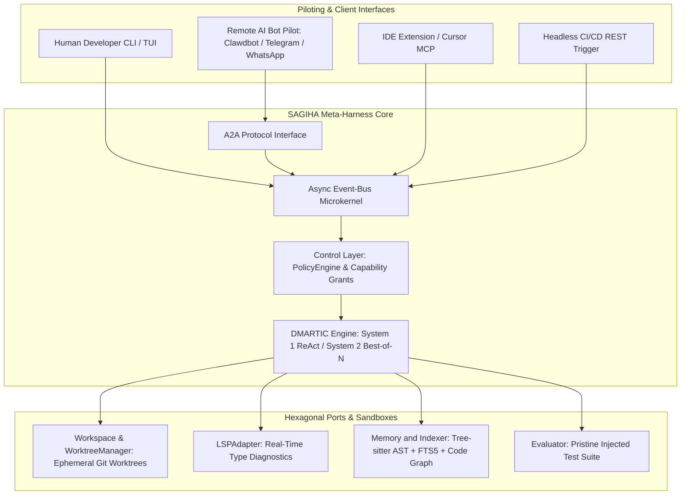

# **SAGIHA — Super AGI Harness Agent**

> [!NOTE]
> **Working Proposal Disclaimer**: This documentation tree is a working architectural proposal and reference blueprint for SAGIHA, not an imperative final specification. Practical iterations, prototyping, and empirical evaluation refine these modules as the system evolves.

Welcome to the documentation hub for **SAGIHA** — a decoupled, hexagonal Meta-Harness that turns frontier LLMs into an autonomous software engineering agent operating independently or with a human in the loop.

---

## **Naming & Scope**

`SAGIHA` expands to **Super AGI Harness Agent** throughout this suite. See [ADR-0001](./08-decisions/0001-project-name.md).

The system is **measured** as an autonomous coding harness — every capability claim in this suite is stated as a benchmark with a threshold, not as an unfalsifiable end-state, and the benchmark is a coding benchmark.

It is not *limited* to coding. Coding is the default [execution profile](./02-architecture/execution-profiles.md); analysis, review, and conversational profiles mount fewer ports and skip the worktree and gate pipeline entirely. Measurement stays scoped to coding because that is what can be verified — a profile with no machine-checkable acceptance criteria produces no number, and the tree reports no numbers it cannot defend.

---

## **Source of Truth**

Documentation drift is the failure mode this tree is structured against, so ownership is explicit:

* The **normative source of truth** is the contract surface and the specs under active amendment: [`03-contracts-and-models/`](./03-contracts-and-models/), [`04-workflows-and-loops/`](./04-workflows-and-loops/), the core of [`02-architecture/`](./02-architecture/), [`composition-and-configuration.md`](./05-tech-stack/composition-and-configuration.md), [`08-decisions/`](./08-decisions/), and [`STATUS.md`](./STATUS.md). When a detail is contested, these win — except for contracts (below), where `src/` wins. Everything else in the tree is `rationale` or `historical`: preserved reasoning, not binding.
* **Contracts — ports and domain models — live only in `src/sagiha/ports/` and `src/sagiha/domain/`.** `src/` is the single source of truth; code wins. [`03-contracts-and-models/`](./03-contracts-and-models/) carries rules, rationale, and navigation pointers into `src/`, never a second definition. See [Contracts to Code](./implementation/contracts-to-code.md). Nowhere in `docs/` defines a `Protocol` or a `BaseModel`.
* [`rationale/`](./rationale/) is long-form derivation, archived plans, and the historical review trail. It carries **no interface definitions** and nothing binding. Read it for *why*, not *what*.

Each topic has exactly one owner. Do not restate a contract in two places.

### Front matter keys

Every file declares both keys, because this tree is read by retrieval as often as by a human,
and a status note in a README does not survive chunking.

| Key | Values | Meaning |
| :--- | :--- | :--- |
| `status:` | `normative` | Binding. Counts against the word budget. Lives in `01`–`08`, `STATUS.md`, or `implementation/` |
| | `rationale` | Reasoning and derivation. Not binding, not budgeted |
| | `historical` | A point-in-time record — a review, a closed sprint. Never edited to stay current; superseded by a newer record |
| `retrieval:` | `excluded` | The `v2-S6` indexer skips this file. Set on everything under `rationale/`: retrieving superseded reasoning as though it were current is how an agent gets contradictions |
| | *(absent)* | Indexed normally |

**The taxonomy is closed.** `draft` and `advisory` were used by ten files and declared by nothing;
both are retired. `scripts/docs_budget.py` reports any file whose `status:` is outside the three
declared values, so a doc cannot dodge the budget by inventing a fourth.

### The docs-shrink rule

**A PR adding N normative words deletes N elsewhere.** `scripts/docs_budget.py --max` enforces the
ceiling in CI as a ratchet — it goes down, never up. Without the gate the ratio reverts within two
sprints.

**ADRs are exempt** (`08-decisions/`). They are short, high-value, and each one *replaces*
long-form derivation elsewhere. Budgeting them would incentivise exactly the wrong trade: prose in
an architecture doc instead of a decision record.

### Reviews are flat

The `todo/` → `doing/` → `done/` kanban under `reviews/` is **retired**. It was half-applied — six
reviews sat loose at the top level, `todo/` was empty, and `doing/` held one file whose status the
directory name contradicted. Reviews are historical records, not work items; the work they generate
belongs in `STATUS.md` and the sprint series. They now live flat and chronological under
[`rationale/reviews/`](./rationale/reviews/).

---

## **Documentation Sitemap**

> **Directory ≠ status.** The `status:` key in a file's front matter is authoritative, not the
> folder it sits in. Several docs under `01`–`08` are tagged `rationale` — they are derivation an
> ADR or `src/` already states — and are marked *(rationale)* below. `scripts/docs_budget.py`
> reports the real per-file tagging at any time.

| Module Directory | Status | Primary Documents |
| :--- | :--- | :--- |
| 📄 [`STATUS.md`](./STATUS.md) | **Normative** | Implementation truth — what works now vs planned |
| 📁 [`01-executive/`](./01-executive/) | **Rationale** | [vision-and-philosophy.md](./01-executive/vision-and-philosophy.md) *(rationale)*, [executive-summary.md](./01-executive/executive-summary.md) *(rationale)*, [glossary.md](./01-executive/glossary.md) *(rationale)* |
| 📁 [`02-architecture/`](./02-architecture/) | **Mixed** | [car-model.md](./02-architecture/car-model.md), [microkernel-and-bus.md](./02-architecture/microkernel-and-bus.md), [event-bus-and-hooks.md](./02-architecture/event-bus-and-hooks.md), [entry-points-and-piloting.md](./02-architecture/entry-points-and-piloting.md) *(rationale)*, [**execution-profiles.md**](./02-architecture/execution-profiles.md), [**extension-model.md**](./02-architecture/extension-model.md) *(rationale)*, [**remoteable-ports.md**](./02-architecture/remoteable-ports.md) *(rationale)*, [prompt-architecture.md](./02-architecture/prompt-architecture.md), [context-and-cache-engineering.md](./02-architecture/context-and-cache-engineering.md), [neural-symbolic-memory.md](./02-architecture/neural-symbolic-memory.md) *(rationale)*, [security-and-threat-model.md](./02-architecture/security-and-threat-model.md), [performance-sidecars.md](./02-architecture/performance-sidecars.md) *(rationale)* |
| 📁 [`03-contracts-and-models/`](./03-contracts-and-models/) | **Normative** | [hexagonal-ports.md](./03-contracts-and-models/hexagonal-ports.md), [domain-schemas.md](./03-contracts-and-models/domain-schemas.md), [**port-stability-and-versioning.md**](./03-contracts-and-models/port-stability-and-versioning.md), [tool-catalog.md](./03-contracts-and-models/tool-catalog.md), [task-and-acceptance.md](./03-contracts-and-models/task-and-acceptance.md), [error-taxonomy.md](./03-contracts-and-models/error-taxonomy.md), [lsp-interface.md](./03-contracts-and-models/lsp-interface.md), [protocols-mcp-a2a.md](./03-contracts-and-models/protocols-mcp-a2a.md), [**frozen-run-state.md**](./03-contracts-and-models/frozen-run-state.md) |
| 📁 [`04-workflows-and-loops/`](./04-workflows-and-loops/) | **Normative** | [dmartic-inner-loop.md](./04-workflows-and-loops/dmartic-inner-loop.md), [**event-catalog.md**](./04-workflows-and-loops/event-catalog.md), [git-worktree-branching.md](./04-workflows-and-loops/git-worktree-branching.md), [rhi-outer-loop.md](./04-workflows-and-loops/rhi-outer-loop.md), [**trace-distillation.md**](./04-workflows-and-loops/trace-distillation.md), [workflow-orchestration-and-dags.md](./04-workflows-and-loops/workflow-orchestration-and-dags.md) *(Sprint 3a is closed; this layer is still gated on a Block 2 E0 ablation showing planning beats no-planning — see [ADR-0018](./08-decisions/0018-native-workflow-dag.md))* |
| 📁 [`05-tech-stack/`](./05-tech-stack/) | **Mixed** | [control-plane-python.md](./05-tech-stack/control-plane-python.md) *(rationale)*, [**composition-and-configuration.md**](./05-tech-stack/composition-and-configuration.md), [dependencies-and-versions.md](./05-tech-stack/dependencies-and-versions.md), [llm-providers-and-economics.md](./05-tech-stack/llm-providers-and-economics.md) *(rationale)*, [configuration-reference.md](./05-tech-stack/configuration-reference.md) *(rationale)*, [indexing-and-retrieval.md](./05-tech-stack/indexing-and-retrieval.md) *(rationale)*, [observability-and-telemetry.md](./05-tech-stack/observability-and-telemetry.md) *(rationale)*, [aoi-coprocessors.md](./05-tech-stack/aoi-coprocessors.md) *(rationale)* |
| 📁 [`06-guides-and-patterns/`](./06-guides-and-patterns/) | **Rationale** — how-to, not contract; `src/` and CI are the truth these describe | [getting-started.md](./06-guides-and-patterns/getting-started.md), [ollama-qwen-coder-setup.md](./06-guides-and-patterns/ollama-qwen-coder-setup.md), [writing-adapters.md](./06-guides-and-patterns/writing-adapters.md), [port-conformance-testing.md](./06-guides-and-patterns/port-conformance-testing.md), [metrics-analytics-and-self-improvement.md](./06-guides-and-patterns/metrics-analytics-and-self-improvement.md), [ci-and-quality-gates.md](./06-guides-and-patterns/ci-and-quality-gates.md), [benchmark-curation.md](./06-guides-and-patterns/benchmark-curation.md), [running-benchmarks.md](./06-guides-and-patterns/running-benchmarks.md), [sidecar-development.md](./06-guides-and-patterns/sidecar-development.md) |
| 📁 [`07-roadmap/`](./07-roadmap/) | **Rationale** — superseded as sequencing truth by STATUS.md's `v2-S` series | [phased-migration-matrix.md](./07-roadmap/phased-migration-matrix.md) *(rationale)* |
| 📁 [`08-decisions/`](./08-decisions/) | **Normative** | [ADR log](./08-decisions/README.md) — 18 decisions with rationale and reversal conditions |
| 📁 [`implementation/`](./implementation/) | **Normative** | [**contracts-to-code.md**](./implementation/contracts-to-code.md) · [development_plan_v2.md](./implementation/development_plan_v2.md) is **Rationale** |
| 📁 [`rationale/`](./rationale/) | **Rationale / Historical** | Everything below — all `retrieval: excluded`. See the sub-table |

### `rationale/` — excluded from retrieval, exempt from the normative budget

Nothing here is binding. It is preserved reasoning: the *why* behind decisions that
`01`–`08` now state as *what*. Every file carries `retrieval: excluded`.

| Directory | Status | Contents |
| :--- | :--- | :--- |
| 📁 [`rationale/reference/`](./rationale/reference/) | **Rationale** | Long-form derivation and comparative research, incl. [`harness_examples/`](./rationale/reference/harness_examples/) competitor teardowns. No interface definitions |
| 📁 [`rationale/reviews/`](./rationale/reviews/) | **Historical** | Every adversarial review, flat and chronological (the `todo/`/`doing/`/`done/` kanban is retired — see below), plus the v2 corpus folded into `01`–`08` by PR-0d |
| 📁 [`rationale/sprints/`](./rationale/sprints/) | **Rationale** | Sprints 2–4 under the old numbering, closed. The seven `sprint-fe-*` docs stay archived until Phase 7's TUI creates a real consumer |
| 📁 [`rationale/frontend/`](./rationale/frontend/) | **Rationale** | Frontend surface design. **No consumer until `v2-S7`** |
| 📁 [`rationale/implementation-archive/`](./rationale/implementation-archive/) | **Rationale** | Superseded development plans and todo lists |

---

## 📚 **Executive & Technical Reference Documents**
* 📘 [conceptual-design.md](rationale/reference/conceptual-design.md) — conceptual architecture, functional blocks, and dual-process execution engine.
* 📗 [design-derivation.md](rationale/reference/design-derivation.md) — the research and comparative analysis behind the contracts, plus the adversarial failure analysis. **Contains no interface definitions**; those live in [`03-contracts-and-models/`](./03-contracts-and-models/).
* 📙 [benchmarking-existing-harnesses.md](rationale/reference/benchmarking-existing-harnesses.md) — comparative teardown of Claude Code CLI, Aider, OpenHands, SWE-agent, and Grok Code Build.

---

## **Start Here**

1. **[Current Status](./STATUS.md)** — what is implemented today vs planned; the only page that answers “can I run this yet?”
2. [Vision & Philosophy](./01-executive/vision-and-philosophy.md) — what the harness owns and what it deliberately does not.
3. [Glossary](./01-executive/glossary.md) — terms carry precise meanings here; skim this first.
4. [Sprint 3](rationale/sprints/sprint-3.md) — near-term executable build contract (close the loop).
5. [Hexagonal Ports](./03-contracts-and-models/hexagonal-ports.md) — the contracts everything else depends on.
6. [ADR Log](./08-decisions/README.md) — every binding decision, with what would reverse it.
7. [Phased Migration Matrix](./07-roadmap/phased-migration-matrix.md) — vertical slices, gates, and deliberate deferrals.
8. [Foundation Review](rationale/reviews/2026-07-29-foundation-review.md) — current audit of record until Sprint 3 closes.

---

## **Build Readiness**

**Architecture decisions are pinned; the product loop is not shipping yet.** Runtime, package
manager, type checkers, model SDK strategy, tool surface *design*, prompt layout, config schema,
CI gates, and layer contracts are decided — see [Dependencies](./05-tech-stack/dependencies-and-versions.md),
[Tool Catalog](./03-contracts-and-models/tool-catalog.md), and [ADR Log](./08-decisions/README.md).

What is **not** ready: `sagiha run` / `replay` / `bench`, a multi-step agent loop, built-in tools,
an evaluator, and digest-verified replay. The near-term contract is
[Sprint 3](rationale/sprints/sprint-3.md). Implementation truth: **[STATUS.md](./STATUS.md)**.

Command examples elsewhere in this tree that show `sagiha run`, `sagiha replay`, or `sagiha bench`
are **target UX** — Planned until the sprint/block named on [STATUS.md](./STATUS.md) exits.
