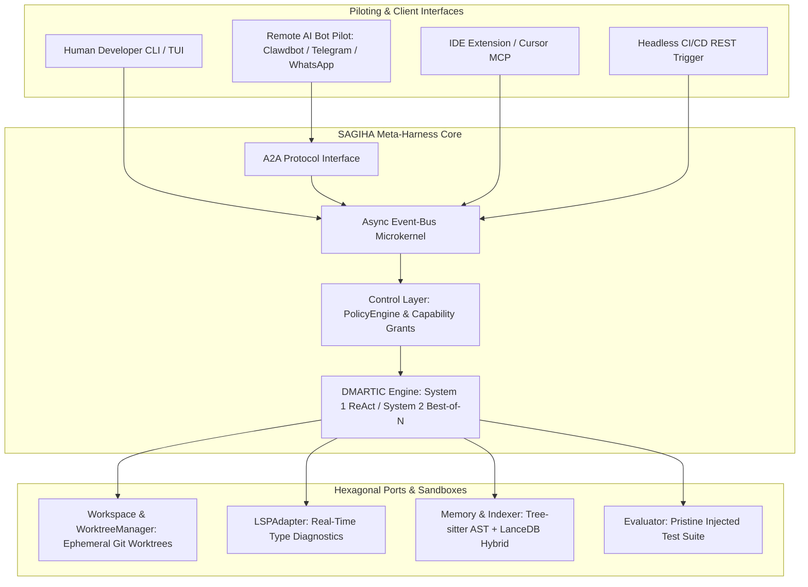

# **SAGIHA — Super AGI Harness Agent**

> [!NOTE]
> **Working Proposal Disclaimer**: This documentation tree is a working architectural proposal and reference blueprint for SAGIHA, not an imperative final specification. Practical iterations, prototyping, and empirical evaluation refine these modules as the system evolves.

Welcome to the documentation hub for **SAGIHA** — a decoupled, hexagonal Meta-Harness that turns frontier LLMs into an autonomous software engineering agent operating independently or with a human in the loop.

---

## **Naming & Scope**

`SAGIHA` expands to **Super AGI Harness Agent** throughout this suite. Earlier drafts used competing expansions; this one is canonical.

The system is scoped and measured as an **autonomous coding harness**. Capability claims in this suite are stated as benchmarks with thresholds, not as unfalsifiable end-states.

---

## **Source of Truth**

To avoid the documentation drift that affected earlier revisions, ownership is explicit:

* The **modular docs (`01` – `07`)** are the **normative source of truth**. When a detail is contested, these win.
* The **reference blueprints** in [`reference/`](./reference/) are the long-form derivation and rationale. They carry the research context, comparative analysis, and full port listings.

Each topic has exactly one owner. Do not restate a contract in two places.

---

## **Documentation Sitemap**

| Module Directory | Status | Primary Documents |
| :--- | :--- | :--- |
| 📁 [`01-executive/`](./01-executive/) | **Normative** | [vision-and-philosophy.md](./01-executive/vision-and-philosophy.md), [executive-summary.md](./01-executive/executive-summary.md), [glossary.md](./01-executive/glossary.md) |
| 📁 [`02-architecture/`](./02-architecture/) | **Normative** | [car-model.md](./02-architecture/car-model.md), [microkernel-and-bus.md](./02-architecture/microkernel-and-bus.md), [event-bus-and-hooks.md](./02-architecture/event-bus-and-hooks.md), [entry-points-and-piloting.md](./02-architecture/entry-points-and-piloting.md), [prompt-architecture.md](./02-architecture/prompt-architecture.md), [context-and-cache-engineering.md](./02-architecture/context-and-cache-engineering.md), [neural-symbolic-memory.md](./02-architecture/neural-symbolic-memory.md), [security-and-threat-model.md](./02-architecture/security-and-threat-model.md), [performance-sidecars.md](./02-architecture/performance-sidecars.md) |
| 📁 [`03-contracts-and-models/`](./03-contracts-and-models/) | **Normative** | [hexagonal-ports.md](./03-contracts-and-models/hexagonal-ports.md), [domain-schemas.md](./03-contracts-and-models/domain-schemas.md), [tool-catalog.md](./03-contracts-and-models/tool-catalog.md), [task-and-acceptance.md](./03-contracts-and-models/task-and-acceptance.md), [error-taxonomy.md](./03-contracts-and-models/error-taxonomy.md), [lsp-interface.md](./03-contracts-and-models/lsp-interface.md), [protocols-mcp-a2a.md](./03-contracts-and-models/protocols-mcp-a2a.md) |
| 📁 [`04-workflows-and-loops/`](./04-workflows-and-loops/) | **Normative** | [dmartic-inner-loop.md](./04-workflows-and-loops/dmartic-inner-loop.md), [git-worktree-branching.md](./04-workflows-and-loops/git-worktree-branching.md), [rhi-outer-loop.md](./04-workflows-and-loops/rhi-outer-loop.md) |
| 📁 [`05-tech-stack/`](./05-tech-stack/) | **Normative** | [control-plane-python.md](./05-tech-stack/control-plane-python.md), [dependencies-and-versions.md](./05-tech-stack/dependencies-and-versions.md), [llm-providers-and-economics.md](./05-tech-stack/llm-providers-and-economics.md), [configuration-reference.md](./05-tech-stack/configuration-reference.md), [indexing-and-retrieval.md](./05-tech-stack/indexing-and-retrieval.md), [observability-and-telemetry.md](./05-tech-stack/observability-and-telemetry.md), [aoi-coprocessors.md](./05-tech-stack/aoi-coprocessors.md) |
| 📁 [`06-guides-and-patterns/`](./06-guides-and-patterns/) | **Normative** | [getting-started.md](./06-guides-and-patterns/getting-started.md), [writing-adapters.md](./06-guides-and-patterns/writing-adapters.md), [port-conformance-testing.md](./06-guides-and-patterns/port-conformance-testing.md), [ci-and-quality-gates.md](./06-guides-and-patterns/ci-and-quality-gates.md), [benchmark-curation.md](./06-guides-and-patterns/benchmark-curation.md), [running-benchmarks.md](./06-guides-and-patterns/running-benchmarks.md), [sidecar-development.md](./06-guides-and-patterns/sidecar-development.md) |
| 📁 [`07-roadmap/`](./07-roadmap/) | **Normative** | [phased-migration-matrix.md](./07-roadmap/phased-migration-matrix.md) |
| 📁 [`08-decisions/`](./08-decisions/) | **Normative** | [ADR log](./08-decisions/README.md) — 12 binding decisions with rationale and reversal conditions |
| 📁 [`implementation/`](./implementation/) | **Normative** | [development-plan-and-prompts.md](./implementation/development-plan-and-prompts.md) |
| 📁 [`reference/`](./reference/) | **Rationale** | Long-form conceptual design and architecture specification blueprints |

---

## 📚 **Executive & Technical Reference Documents**
* 📘 [SAGIHA Conceptual Design.md](./reference/SAGIHA%20Conceptual%20Design.md) — conceptual architecture, functional blocks, and dual-process execution engine.
* 📗 [SAGIHA Architecture Specification Blueprint.md](./reference/SAGIHA%20Architecture%20Specification%20Blueprint.md) — technical brief, full port listings, protocol interfaces, and adversarial failure analysis.
* 📙 [benchmarking-existing-harnesses.md](./reference/benchmarking-existing-harnesses.md) — comparative teardown of Claude Code CLI, Aider, OpenHands, SWE-agent, and Grok Code Build.

---

## **Start Here**

1. [Vision & Philosophy](./01-executive/vision-and-philosophy.md) — what the harness owns and what it deliberately does not.
2. [Glossary](./01-executive/glossary.md) — terms carry precise meanings here; skim this first.
3. [Hexagonal Ports](./03-contracts-and-models/hexagonal-ports.md) — the contracts everything else depends on.
4. [Tool Catalog](./03-contracts-and-models/tool-catalog.md) — the agent's actual capability surface.
5. [Port Conformance Testing](./06-guides-and-patterns/port-conformance-testing.md) — what makes adapter swapping real rather than aspirational.
6. [ADR Log](./08-decisions/README.md) — every binding decision, with what would reverse it.
7. [Phased Migration Matrix](./07-roadmap/phased-migration-matrix.md) — vertical slices, gates, and deliberate deferrals.

---

## **Build Readiness**

Sprint 1 has **zero open decisions**. Runtime, package manager, type checkers, model SDKs, tool surface, prompt layout, config schema, CI gates, and layer contracts are all pinned — see [Dependencies](./05-tech-stack/dependencies-and-versions.md), [Tool Catalog](./03-contracts-and-models/tool-catalog.md), and [ADR Log](./08-decisions/README.md).

One artifact remains to be **curated rather than decided**: the pinned 30-task S0 benchmark suite, which must be harvested from a real repository. Method in [Benchmark Curation](./06-guides-and-patterns/benchmark-curation.md). It gates S0's exit criterion, not Sprint 1's start.
