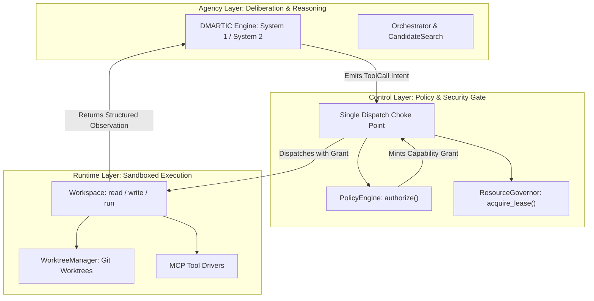

# **Control-Agency-Runtime (CAR) Architecture**

> [!NOTE]
> **Working Proposal Disclaimer**: A working architectural proposal, refined iteratively as practical evaluation progresses.

## **Architectural Layering**

CAR isolates responsibilities into three strict layers:

1. **Control Layer**: Security policy, token/spend budgets, context allocation, verification gates. Authorizes effects and mints capability tokens.
2. **Agency Layer**: Deliberation, reasoning, context synthesis, task decomposition. Emits intents only; holds no references to Runtime objects.
3. **Runtime Layer**: Sandboxed execution, worktree management, terminal capture, MCP tool drivers. Returns structured observations without touching agent memory or policy state.

> [!IMPORTANT]
> **Runtime Layer Status (R5)**: `src/sagiha/runtime/` is an intentionally empty package reserved for the sandboxed executor landing in Block 5 ([ADR-0006](../08-decisions/0006-sandbox-is-the-perimeter.md)). Today's execution (`adapters/tools/`, `adapters/workspace/local.py`) runs in dev-mode subprocesses confined by path containment, keeping `autonomous` autonomy disabled (**R10**). The `import-linter` `car-layering` contract forbids `agency/` from importing `sagiha.runtime` or `sagiha.adapters`.

*Note: Sidecars represent process deployment topology, not a architectural fourth layer.*

## **Enforcement Mechanisms**

### 1. Capability Grants
Side-effecting Runtime methods execute only when backed by a path/tool-scoped `Grant`, minted by `PolicyEngine.authorize()` and checked via `verify_grant`.
* Contracts: [`src/sagiha/ports/policy.py`](../../../src/sagiha/ports/policy.py) and [`src/sagiha/ports/workspace.py`](../../../src/sagiha/ports/workspace.py).
* Models: [`src/sagiha/domain/control.py`](../../../src/sagiha/domain/control.py).

### 2. Import-Graph Contracts
CI enforces via `import-linter` that `agency/` cannot import `runtime/` or `adapters/`.

### 3. Single Dispatch Choke Point
Agency emits a `ToolCall`. The kernel choke point ([`src/sagiha/kernel/dispatch.py`](../../../src/sagiha/kernel/dispatch.py)) executes: `authorize` → verify `grant_id` → acquire lease → `registry.dispatch(call)` → release lease → `record_outcome(grant_id, result)`. The registry never receives the `Grant` object directly (see [`src/sagiha/ports/tool_registry.py`](../../../src/sagiha/ports/tool_registry.py)).

## **Admission Control**

`ResourceGovernor` globally bounds concurrency, spend, and sandbox counts.

## **Cross-References**

* [Security & Threat Model](./security-and-threat-model.md)
* [Hexagonal Ports](../03-contracts-and-models/hexagonal-ports.md)
* [Microkernel & Bus](./microkernel-and-bus.md)
