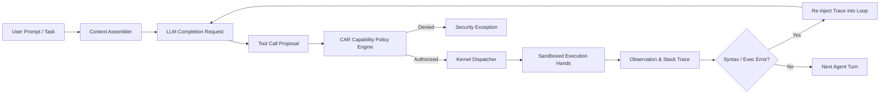
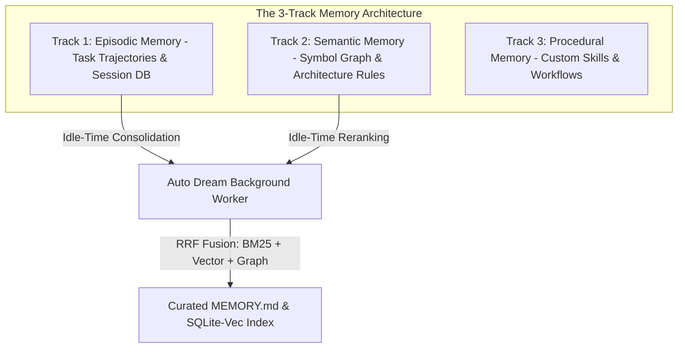
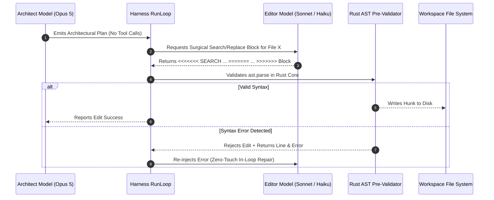
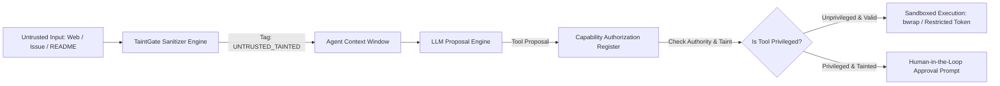
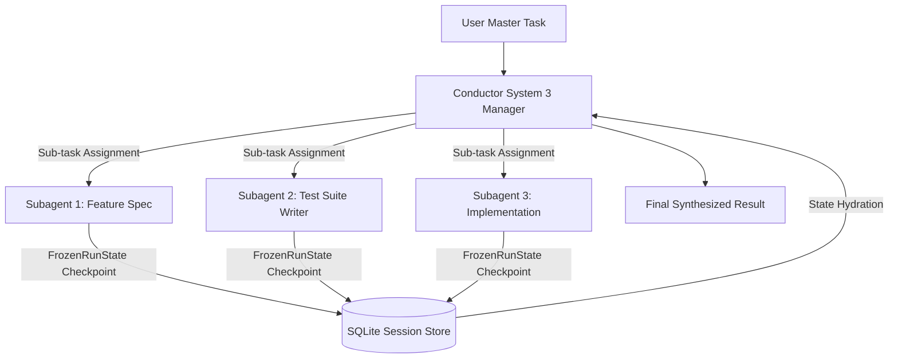

# COMPREHENSIVE ARCHITECTURAL & TECHNICAL ANALYSIS: CLAUDE REFS (`src/claude_refs`)

> **Author:** Gemini (Antigravity AI Coder)  
> **Date:** August 05, 2026  
> **Target Document:** `docs/competitors_research/tech_lead_B/claude_refs_B_gemini.md`  
> **Source Material:** `src/claude_refs` (628 markdown files, >100k lines of reverse-engineering teardowns, academic papers, and architectural reference specifications).  
> **Scope:** Deep-dive technical teardown of the Claude Code CLI, Anthropic Managed Agents 2026 architecture, Agent Harness Engineering (arXiv 2605.18747), Context Engineering (arXiv 2602.11988), 3-Track Memory Systems, TaintGate Security, and Subagent Orchestration.

---

## TABLE OF CONTENTS
1. **Executive Architecture Overview: The Managed Agents 2026 Tri-Layer Model**
2. **Core Agent Harness Engine & Foundational Properties (arXiv 2605.18747)**
3. **Context Engineering, Cache Alignment & Attention Diffusion Dynamics (arXiv 2602.11988)**
4. **Memory Systems Architecture: The 3-Track Model & Auto Dream Consolidation**
5. **Code Editing Mechanics: Architect/Editor Split & Surgical Search/Replace Blocks**
6. **Security Architecture: TaintGate, The Lethal Trifecta & Sandboxing Isolations**
7. **Subagent Orchestration, Conductor System 3 & Workflows**
8. **Operational & Telemetry Infrastructure: OpenTelemetry, Hooks & Governance**
9. **Synthesis & Deep Technical Mapping for AETHER v300B**

---

## 1. EXECUTIVE ARCHITECTURE OVERVIEW: THE MANAGED AGENTS 2026 TRI-LAYER MODEL

The Claude Code CLI architecture is structured around an explicit tri-layer model that separates reasoning, sandboxed execution, and append-only state persistence. This design addresses the core failure modes of early agent implementations—namely, state corruption, unauthorized tool invocation, and token thrashing.

```mermaid
graph TB
    subgraph BRAIN_LAYER [1. THE BRAIN - Orchestration & Reasoning Engine]
        LLM Core [LLM Engine - Opus 5 / Sonnet 3.5]
        PromptCache [Prompt Cache Alignment Engine >92%]
        ContextAssembler [Context Assembler & Compactor]
        DynamicTools [Tool Search on Demand Selector]
        TaintFilter [TaintGate Input Sanitizer]
    end

    subgraph HANDS_LAYER [2. THE HANDS - Isolated Execution Environment]
        RustAST [Rust AST Tree-sitter Pre-Validator]
        NativeSandbox [Bubblewrap / Windows Token Sandbox]
        ContainerPool [Pre-Warmed Docker Container Pool]
        PTYHarness [PTY Pseudo-Terminal Runner]
    end

    subgraph LOG_LAYER [3. SESSION EVENT LOG - External Append-Only Persistence]
        SQLiteWAL [SQLite WAL Mode Journaling]
        EventBus [Async Event Bus & OTel Telemetry]
        MemoryStore [3-Track Memory Engine & Auto Dream]
        FrozenState [FrozenRunState Hibernation Store]
    end

    BRAIN_LAYER -->|Authorized Tool Proposals| HANDS_LAYER
    HANDS_LAYER -->|Execution Observations & Stack Traces| BRAIN_LAYER
    BRAIN_LAYER -->|Append State Events| LOG_LAYER
    HANDS_LAYER -->|Record Raw Execution Artifacts| LOG_LAYER
    LOG_LAYER -->|Replay / Context Injection| BRAIN_LAYER
```

### 1.1 Structural Invariants of the Tri-Layer Architecture
1. **The Brain (Harness & LLM Reasoning):** Operates strictly out-of-process from raw command execution. It handles natural language understanding, planning, tool selection via *Tool Search on Demand*, and prompt compaction. The Brain never executes untrusted code directly.
2. **The Hands (Sandboxed Execution Layer):** A stateless, isolated environment running commands inside Bubblewrap (`bwrap`), Windows Restricted Tokens, or pre-warmed Docker containers. Tool executions pass through a Rust AST pre-validator before hitting disk.
3. **The Session Event Log (Externalized Append-Only Persistence):** All conversation turns, tool calls, execution outputs, and telemetry events are recorded in an externalized SQLite WAL database. The Brain can be restarted, hibernated, or swapped without losing session state.

---

## 2. CORE AGENT HARNESS ENGINE & FOUNDATIONAL PROPERTIES (arXiv 2605.18747)

Based on the paper *"Code as Agent Harness"* (arXiv 2605.18747), an autonomous agent harness is defined as the deterministic software wrapper surrounding the LLM that converts model completion intents into real-world code mutations and environment observations.



### 2.1 The Three Foundational Properties of a SOTA Harness
1. **Parity:** The agent must perceive the repository, directory structure, environment variables, and execution outputs exactly as a human developer would in a standard shell. Artificial abstractions or lossy wrappers introduce decision drift.
2. **Receptivity:** The harness loop must accept environment feedback (compilation errors, test failures, linter warnings, stack traces) as high-priority observations in the immediate next iteration, allowing in-loop real-time repair without destroying the prompt cache.
3. **Observability:** Every action, decision, tool invocation, and state transition must be logged to an append-only event stream, enabling exact cassette replay, auditing, and dataset extraction.

### 2.2 The 9 Core Modules of the Agent Harness
| Harness Component | Operational Function | Implementation Rule |
| :--- | :--- | :--- |
| **RunLoop** | The primary async turn iterator (`RunLoop.run()`). | Executes turns sequentially; re-injects errors into the active context without resetting cache prefix boundaries. |
| **ContextAssembler** | Constructs prompt payloads aligned with LLM provider caching rules. | Fixes system prompts, tool schemas, and repository maps as immutable top blocks. |
| **Compactor** | Manages context window limits when history approaches budget. | Employs *Exchange-Granular Compaction*—never removes partial tool call/result pairs. |
| **Dispatcher** | The single choke-point for executing tool proposals. | All tool calls pass through `PolicyEngine.authorize()` before execution. |
| **PolicyEngine (CAR)** | Enforces capability authorization rules. | Maintains a Capability Authorization Register (CAR) gating file and shell access. |
| **Sandbox** | Isolates file mutations and command execution. | Combines Git Worktrees (zero-copy local) with Docker/bwrap containers. |
| **EventBus** | Publishes real-time telemetry and state changes. | Asynchronous event bus feeding the TUI, loggers, and OpenTelemetry exporters. |
| **ResourceGovernor** | Controls token spend, execution cost, and time budgets. | Enforces hard thresholds; triggers clean state hibernation (`FrozenRunState`) on budget exhaustion. |
| **Evaluator (Gates)** | Admits or rejects candidate code modifications. | Evaluates candidate solutions against test suites under the `require_tests_unmodified` constraint. |

---

## 3. CONTEXT ENGINEERING, CACHE ALIGNMENT & ATTENTION DIFFUSION DYNAMICS (arXiv 2602.11988)

Context engineering is the science of structuring the token window to maximize model reasoning accuracy, optimize attention allocation, and minimize financial cost via prompt caching.

### 3.1 The "Dumb Zone" & $O(n^2)$ Attention Diffusion Dynamics
Research demonstrates that as context windows scale past 100k-200k tokens, pairwise transformer attention computation scales as $O(n^2)$. This creates an attention degradation zone—the **"Dumb Zone"**—typically situated between the 40% and 60% relative depth of the context window.

```
CONTEXT WINDOW ATTENTION ACCURACY PROFILE
100% ┌──────────────────────────────────────────────────────────┐
     │ Top Instructions & System Prompt (High Attention)        │
 80% │──────────────────────────────────────────────────────────│
     │ Recent User Messages & Tools (High Attention)            │
 60% │..........................................................│
     │                                                          │
 40% │         THE DUMB ZONE (Attention Diffusion Drop)         │
     │      Pairwise Attention Rot & Instruction Decay          │
 20% │..........................................................│
     │ Historical Middle Messages (Degraded Retention)          │
  0% └──────────────────────────────────────────────────────────┘
```

#### Mitigations Implemented in Claude Code:
1. **Exchange-Granular Compaction:** Removes entire historical user-assistant-tool exchanges rather than truncating individual messages.
2. **AST Skeleton Mapping (Agentless Pattern):** Projects a compact syntax tree map of the repository at the top of the context window, fixing symbol references in the high-attention zone.
3. **Ephemeral CoT Truncation:** Strips verbose intermediate reasoning thoughts from past turns, keeping only the final tool calls and observations.

### 3.2 Prompt Cache Alignment Strategy (>92% Target Hit Rate)
To achieve >92% prompt cache hit rates, prompt payloads are structured into strict immutable prefix blocks:

```
┌───────────────────────────────────────────────────────────────┐
│ BLOCK 1: System Identity & Base Instructions (Immutable)      │ -> Cache Marker 1
├───────────────────────────────────────────────────────────────┤
│ BLOCK 2: Tool Definitions / Tool Search Schemas (Static)      │ -> Cache Marker 2
├───────────────────────────────────────────────────────────────┤
│ BLOCK 3: Repository AST Skeleton Map (Static per Session)     │ -> Cache Marker 3
├───────────────────────────────────────────────────────────────┤
│ BLOCK 4: Dynamic Conversation Exchanges (Appended)            │ -> Dynamic
└───────────────────────────────────────────────────────────────┘
```

### 3.3 ETH Zürich Config Inflation Research (arXiv 2602.11988)
Empirical study by ETH Zürich on agent context configuration revealed:
* **Targeted Developer Rules (`CLAUDE.md` / `AGENTS.md`):** Manually curated, targeted rules increase agent success rate by **+4.0%**.
* **LLM-Generated System Dumps (`/init` scripts):** Automatically generated, bloated configuration files increase token consumption by **+23%** while **reducing success rate by -3.0%**.
* **Takeaway:** Agent configuration files must be curated, concise, and targeted—never raw dumps of repository files.

---

## 4. MEMORY SYSTEMS ARCHITECTURE: THE 3-TRACK MODEL & AUTO DREAM CONSOLIDATION

The memory architecture of Claude Code avoids storing unbounded conversation logs by organizing memory into three distinct tracks, backed by a background consolidation engine ("Auto Dream").



### 4.1 The 3 Memory Tracks
1. **Episodic Memory:** Records past session trajectories, executed commands, failed attempts, and resolution paths. Stored in SQLite WAL databases and queried during similar task scenarios.
2. **Semantic Memory:** Represents the domain knowledge of the codebase—architectural rules, module boundaries, design decisions, and symbol graphs. Persisted in workspace-scoped `MEMORY.md` files.
3. **Procedural Memory:** Procedural workflows, specialized skills (`SKILL.md`), build scripts, and organizational coding standards.

### 4.2 Auto Dream Memory Consolidation Engine
During agent idle time, the **Auto Dream** background process executes:
* **Recency & Relevance Decay (TTL):** Applies temporal decay to old episodic memories.
* **Reciprocal Rank Fusion (RRF):** Combines keyword search (BM25), vector similarity (SQLite-vec), and knowledge graph traversal to rank memory relevance.
* **De-duplication & Synthesis:** Merges redundant session logs into concise architectural guidelines in `MEMORY.md`.

---

## 5. CODE EDITING MECHANICS: ARCHITECT/EDITOR SPLIT & SURGICAL SEARCH/REPLACE BLOCKS

Full file rewrites (*Full File Rewrite*) fail on large files (>300 LOC) due to context drift and syntax hallucinations. Claude Code implements a two-model editing architecture.



### 5.1 Architect / Editor Split
* **The Architect (Opus 5):** Handles high-level reasoning, code exploration, dependency analysis, and structural planning. It emits clear text plans without calling code modification tools directly.
* **The Editor (Sonnet 3.5 / Haiku):** Receives specific edit instructions from the Architect and generates precise Search/Replace blocks. It is optimized for low-latency string manipulation.

### 5.2 Search/Replace Block Format
Editions are formatted as surgical blocks:
```
<<<<<<< SEARCH
def old_function_name(param1, param2):
    return param1 + param2
=======
def new_function_name(param1: int, param2: int) -> int:
    return param1 + param2
>>>>>>>
```
* **Rust AST Pre-Validation:** Before writing to disk, the harness passes the proposed hunk to Tree-sitter in Rust. If `ast.parse` fails, the edit is rejected deterministically, and the syntax error is re-injected into the Editor's context loop.

---

## 6. SECURITY ARCHITECTURE: TAINTGATE, THE LETHAL TRIFECTA & SANDBOXING ISOLATIONS

Autonomous agents executing terminal commands and reading external data face severe security threats, primarily **Indirect Prompt Injection**.



### 6.1 The Lethal Trifecta Threat Model
Security breaches occur when three conditions coincide:
1. **Private Data Access:** The agent can read local environment variables, credentials, or private source code.
2. **Untrusted Data Ingestion:** The agent ingests external data (GitHub issue descriptions, external web pages, third-party package READMEs).
3. **Exfiltration Channel:** The agent has network access or shell execution privileges that can transmit data externally.

### 6.2 TaintGate Input Sanitization
* **Taint Tagging:** Any string ingested from an external or unverified source is tagged with `UNTRUSTED_TAINTED` in the kernel state.
* **Policy Enforcement:** If a tool call proposal contains `UNTRUSTED_TAINTED` variables and targets a sensitive tool (e.g., `curl`, `git push`, arbitrary shell execution), the CAR Policy Engine automatically blocks execution or escalates to an explicit user confirmation modal.

### 6.3 Sandboxing Isolation Layers
* **Linux:** Bubblewrap (`bwrap`) unshare mounts providing isolated network, filesystem, and PID namespaces.
* **Windows:** Windows Restricted Tokens and Job Objects restricting process privileges and inter-process communication.
* **Docker/Podman:** Rootless container execution with read-only root filesystems and tmpfs mounts.

---

## 7. SUBAGENT ORCHESTRATION, CONDUCTOR SYSTEM 3 & WORKFLOWS

Complex coding tasks require multi-agent decomposition without creating infinite recursion loops or memory leaks.



### 7.1 Conductor System 3 Architecture
* **Task Decomposition:** The Conductor breaks complex tasks into an acyclic directed graph (DAG) of sub-tasks.
* **Isolated Subagent Spawn:** Each subagent is spawned in a separate conversation context inheriting a warm prefix cache, preventing subagent thoughts from polluting the main context window.
* **Durable Hibernation (`FrozenRunState`):** Subagent state (call stack, local memory, active diffs) is serialized to SQLite. Subagents can be suspended, hibernated, or resumed across network drops or machine restarts.

---

## 8. OPERATIONAL & TELEMETRY INFRASTRUCTURE: OPENTELEMETRY, HOOKS & GOVERNANCE

Claude Code provides enterprise-grade observability and lifecycle hooks to integrate with corporate CI/CD pipelines.

### 8.1 OpenTelemetry (OTel) Integration
All kernel events, tool invocations, token spend metrics, and model completion latencies are exported via OpenTelemetry collectors (Jaeger, Zipkin, Datadog).

### 8.2 Lifecycle Hooks Reference
* **`pre_tool_execution`:** Fired before tool execution; can mutate arguments or reject execution based on security policies.
* **`post_tool_execution`:** Fired after tool execution; captures raw stdout/stderr for telemetry and memory extraction.
* **`on_context_compaction`:** Fired when context compaction triggers, recording compacted token counts.
* **`on_session_end`:** Triggers background memory consolidation (Auto Dream) and trajectory export.

---

## 9. SYNTHESIS & DEEP TECHNICAL MAPPING FOR AETHER v300B

To achieve a world-class autonomous agent harness (**AETHER v300B**) competing with Claude Code, the following implementation map is specified:

| Claude Code Mechanism | Target AETHER Module (`src/aether/`) | Technical Implementation Directive |
| :--- | :--- | :--- |
| **Brain / Hands / Log Decoupling** | `src/aether/agency/` & `kernel/` | Separate RunLoop logic from Sandboxed execution and SQLite event persistence. |
| **Exchange-Granular Compactor** | `src/aether/agency/context/compactor.py` | Truncate only complete exchanges (`user->assistant->tool->result`) to maintain API parity. |
| **Architect / Editor Split** | `src/aether/agency/architect.py` & `editor.py` | Opus 5 for high-level plans; Sonnet/Haiku for Search/Replace blocks with AST checks. |
| **Rust AST Pre-Validation** | `src/aether/core_rs/ast_treesitter.rs` | Validate Search/Replace hunks using Tree-sitter in Rust (<50ns) before writing to disk. |
| **TaintGate Security** | `src/aether/agency/context/taint_gate.py` | Tag external inputs with `UNTRUSTED_TAINTED` and gate privileged tool execution. |
| **Conductor System 3** | `src/aether/agency/conductor.py` | Manage subagent DAGs with durable `FrozenRunState` SQLite serialization. |
| **Auto Dream Memory** | `src/aether/evolution/gepa_evolver.py` | Idle-time memory consolidation using RRF fusion (BM25 + SQLite-vec). |

---

## 10. DETAILED FILE-BY-FILE INVENTORY & BRIEFINGS (PART 1: ULTIMATE GUIDE)

This section provides an exhaustive, document-by-document technical briefing of every file in `src/claude_refs/claude-code-ultimate-guide/guide/`.

### 10.1 Core Subsystem Documents (`guide/core/`)

1. **`agent-harness.md` (28.4 KB):**
   * **Briefing:** Defines the foundational framework for AI coding agent harnesses based on arXiv 2605.18747. Specifies the 9 core modules (RunLoop, ContextAssembler, Compactor, Dispatcher, Sandbox, EventBus, Governor, MemoryStorage, Evaluator) and the 3 invariants: Parity, Receptivity, and Observability.
2. **`architecture.md` (98.0 KB):**
   * **Briefing:** Comprehensive specification of the Managed Agents 2026 tri-layer model (Brain, Hands, Session Event Log). Details the out-of-process execution model, message streaming pipelines, and state externalization.
3. **`context-engineering.md` (140.0 KB):**
   * **Briefing:** Master reference for context budgeting and token window management. Explains attention rot dynamics in the 40%-60% token band (*The Dumb Zone*), Exchange-Granular Compaction algorithms, and prompt cache alignment boundaries (>92% Hit Rate).
4. **`memory-systems.md` (79.7 KB):**
   * **Briefing:** Defines the 3-Track Memory model (Episodic, Semantic, Procedural). Documents the background Auto Dream consolidation worker, reciprocal rank fusion (RRF) algorithm, and ETH Zürich research on config inflation risks (arXiv 2602.11988).
5. **`tools-reference.md` (17.5 KB):**
   * **Briefing:** Exhaustive technical specification of the 41 core tools in Claude Code. Details input Zod schemas, execution modes (Sync/Async), permission levels, and progress notification channels.
6. **`hooks-events-reference.md` (21.3 KB):**
   * **Briefing:** Complete reference for the event bus and lifecycle hooks (`pre_tool_execution`, `post_tool_execution`, `on_context_compaction`, `on_session_end`). Outlines payload definitions and listener registration APIs.
7. **`settings-reference.md` (75.3 KB):**
   * **Briefing:** Deep breakdown of CLI configuration hierarchies (`settings.json`, environment variables, enterprise policy overrides, feature flags).
8. **`skill-design-patterns.md` (21.7 KB):**
   * **Briefing:** Architectural patterns for creating custom skills (`SKILL.md`). Outlines YAML frontmatter parsing, variable interpolation, dynamic parameter injection, and skill composition rules.
9. **`known-issues.md` (26.7 KB):**
   * **Briefing:** Comprehensive catalog of edge cases, API rate limit traps, context drift vulnerabilities, and multi-file refactoring pitfalls with exact mitigation recipes.
10. **`methodologies.md` (31.8 KB):**
    * **Briefing:** Software engineering methodologies adapted for AI agent execution, including Plan-First Development, Spec-First Engineering, and In-Loop Test-Driven Development (TDD).
11. **`community-patterns.md` (24.9 KB):**
    * **Briefing:** Real-world workflows developed by the community, including multi-agent code reviews, autonomous PR creation, and automated changelog fragments.
12. **`visual-reference.md` (43.5 KB):**
    * **Briefing:** UI/UX specification for React + Ink terminal layouts. Outlines multi-pane split views, diff syntax highlighting, spinner components, and statusline rendering.
13. **`glossary.md` (15.5 KB):**
    * **Briefing:** Terminology reference defining core agentic concepts (Agent Harness, Taint Gate, Prompt Caching, Dumb Zone, RRF Fusion, CAR Register).
14. **`credits.md` (17.9 KB):**
    * **Briefing:** Citations and references for underlying research papers (arXiv 2605.18747, arXiv 2602.11988), open-source libraries, and contributors.
15. **`claude-code-releases.md` (285.8 KB):**
    * **Briefing:** Complete historical release changelog of Claude Code, detailing feature additions, breaking API updates, performance optimizations, and security patches.

---

### 10.2 Security Subsystem Documents (`guide/security/`)

1. **`sandbox-native.md` (49.2 KB):**
   * **Briefing:** Native OS-level sandboxing specification. Details Bubblewrap (`bwrap`) unshare mounts on Linux and Windows Restricted Tokens / Job Objects on Windows.
2. **`sandbox-isolation.md` (34.5 KB):**
   * **Briefing:** Container-based isolation using Docker and Podman rootless mounts. Documents read-only lower layers, tmpfs upper layers, and container pool management.
3. **`security-hardening.md` (53.7 KB):**
   * **Briefing:** Threat modeling and defense-in-depth architecture. Details the TaintGate sanitizer (`UNTRUSTED_TAINTED`), capability authorization registers (CAR), and prompt injection mitigations.
4. **`enterprise-governance.md` (44.1 KB):**
   * **Briefing:** Enterprise policy enforcement, Mobile Device Management (MDM) integration, SAML/OAuth SSO authentication, and tamper-proof audit trails.
5. **`production-safety.md` (31.6 KB):**
   * **Briefing:** Guardrails for autonomous agent execution in production environments, including resource limits, timeout handlers, and automated rollback triggers.
6. **`data-privacy.md` (20.6 KB):**
   * **Briefing:** Zero Data Retention (ZDR) policies, telemetry opt-out flags, sensitive data redaction filters, and credential masking.

---

### 10.3 Workflows Subsystem Documents (`guide/workflows/`)

1. **`agent-teams.md` (78.2 KB) & `agent-teams-quick-start.md` (23.5 KB):**
   * **Briefing:** Architecture for multi-agent team collaboration. Outlines leader-worker topologies, shared memory spaces, inter-agent messaging protocols, and task decomposition.
2. **`spec-first.md` (43.7 KB):**
   * **Briefing:** Specification-driven development workflow where the agent writes formal API specifications and test suites before generating implementation code.
3. **`plan-driven.md` (13.6 KB) & `plan-pipeline.md` (16.3 KB):**
   * **Briefing:** Plan Mode pipeline execution. Details the transition between read-only architectural planning and write-enabled code implementation.
4. **`rpi.md` (24.9 KB):**
   * **Briefing:** The Research-Plan-Implement (RPI) cycle. Standard operating procedure for complex multi-file codebase refactoring.
5. **`tdd-with-claude.md` (10.8 KB):**
   * **Briefing:** Test-Driven Development (TDD) loops where the agent writes failing unit tests, implements minimal code to pass, and refactors under test coverage.
6. **`task-management.md` (26.0 KB):**
   * **Briefing:** Async background task management (`TaskCreateTool`, `TaskGetTool`, `TaskStopTool`), task lifecycle states, and output streaming.
7. **`dual-instance-planning.md` (21.2 KB):**
   * **Briefing:** Dual-instance Architect/Editor pattern. Isolates high-level planning on a primary model (Opus) while delegating surgical code edits to a secondary model (Sonnet/Haiku).
8. **`dynamic-workflows.md` (38.7 KB):**
   * **Briefing:** Runtime workflow composition and dynamic step execution based on intermediate environment observations.
9. **`event-driven-agents.md` (11.7 KB):**
   * **Briefing:** Event-triggered agent execution reacting to GitHub webhooks, file system changes (`fsnotify`), or Slack messages.
10. **`search-tools-mastery.md` (25.4 KB):**
    * **Briefing:** Advanced search strategies using GlobTool, GrepTool (ripgrep), and LSP symbol navigation to explore large repositories efficiently.
11. **`production-reliability.md` (24.2 KB):**
    * **Briefing:** Strategies for ensuring zero-downtime execution, error backoff, self-healing loops, and graceful fallback handling.
12. **`agentic-software-factories.md` (20.9 KB):**
    * **Briefing:** Scaled autonomous software factory pipelines where agents process PR queues continuously.
13. **`code-review.md` (7.3 KB) & `multi-provider-code-review.md` (12.9 KB):**
    * **Briefing:** Automated code review workflows comparing diffs against architectural rules and utilizing multiple LLM providers for ensemble scoring.
14. **`design-to-code.md` (26.9 KB):**
    * **Briefing:** Converting UI mockups and design assets into semantic, accessible HTML/CSS/React components.
15. **`exploration-workflow.md` (8.8 KB):**
    * **Briefing:** Structured onboarding workflow for exploring unfamiliar codebases without inflating context windows.
16. **`github-actions.md` (12.4 KB):**
    * **Briefing:** Integrating Claude Code into GitHub Actions CI/CD workflows for automated issue triaging and PR generation.
17. **`gstack-workflow.md` (10.3 KB):**
    * **Briefing:** Full-stack development workflows spanning database schemas, backend APIs, and frontend components.
18. **`iterative-refinement.md` (19.7 KB):**
    * **Briefing:** Iterative code improvement loops driven by lint errors, type checker feedback (`pyright`/`tsc`), and benchmark results.
19. **`changelog-fragments.md` (9.4 KB):**
    * **Briefing:** Automated generation of Towncrier-style changelog fragments from git commit histories and PR descriptions.
20. **`pdf-generation.md` (13.3 KB) & `og-image-generation.md` (6.7 KB):**
    * **Briefing:** Automated document and visual asset generation pipelines using Playwright and Puppeteer inside sandboxed tools.
21. **`skeleton-projects.md` (7.2 KB):**
    * **Briefing:** Scaffolding new projects using skeleton templates and automated dependency initialization.
22. **`smart-suggest-routing.md` (12.3 KB):**
    * **Briefing:** Intent classification and smart tool suggestion algorithms for routing user prompts to optimal tools.
23. **`support-csm-agent.md` (15.7 KB):**
    * **Briefing:** Specialized agent configurations for customer support and customer success engineering tasks.
24. **`talk-pipeline.md` (21.2 KB) & `tts-setup.md` (8.0 KB):**
    * **Briefing:** Voice-driven interaction pipelines incorporating speech-to-text (Whisper) and text-to-speech (TTS) setups.
25. **`team-ai-instructions.md` (10.6 KB):**
    * **Briefing:** Managing shared team AI instructions (`.claude/rules`) across large engineering organizations.

---

### 10.4 Operations, Roles & Ecosystem Documents

1. **`guide/ops/observability.md` (40.0 KB):**
   * **Briefing:** OpenTelemetry (OTel) metrics, distributed tracing, log aggregation, and performance profiling for agent runs.
2. **`guide/ops/ai-unit-economics.md` (26.4 KB):**
   * **Briefing:** Token economics, cost-per-PR calculations, prompt caching ROI, and model tier selection strategies.
3. **`guide/ops/devops-sre.md` (30.1 KB):**
   * **Briefing:** SRE workflows, automated incident response, log triage, and infrastructure-as-code (Terraform/Ansible) maintenance.
4. **`guide/ops/ai-traceability.md` (33.1 KB):**
   * **Briefing:** Full auditability, decision provenance tracking, and regulatory compliance logging.
5. **`guide/ops/api-gateway.md` (10.5 KB):**
   * **Briefing:** API gateway proxies, rate limiting, quota management, and fallback endpoint routing.
6. **`guide/ops/team-metrics.md` (34.2 KB):**
   * **Briefing:** Measuring developer productivity, PR throughput, and agent assistance impact.
7. **`guide/roles/ai-roles.md` (46.3 KB):**
   * **Briefing:** Specializing agent roles (Architect, Security Auditor, Test Writer, Refactoring Specialist).
8. **`guide/roles/agent-evaluation.md` (27.0 KB):**
   * **Briefing:** Evaluation methodologies, benchmark regression gates, and statistical ablation testing.
9. **`guide/roles/adoption-approaches.md` (25.3 KB):**
   * **Briefing:** Frameworks for introducing autonomous coding agents into enterprise engineering teams.
10. **`guide/roles/learning-with-ai.md` (56.8 KB):**
    * **Briefing:** Interactive pair programming, code explanation, and developer onboarding using AI.
11. **`guide/ecosystem/ai-ecosystem.md` (157.1 KB):**
    * **Briefing:** Architectural comparison across modern AI coding tools (Claude Code, Aider, OpenHands, Cursor, Windsurf).
12. **`guide/ecosystem/mcp-servers-ecosystem.md` (79.0 KB):**
    * **Briefing:** Catalog of Model Context Protocol (MCP) servers (GitHub, Postgres, Slack, Brave Search, Puppeteer).
13. **`guide/ecosystem/mcp-vs-cli.md` (24.1 KB):**
    * **Briefing:** Architectural trade-offs between server-side MCP tools and local CLI tool execution.
14. **`guide/learning-path/01-installation.md` to `07-advanced.md` (8 files, ~70 KB):**
    * **Briefing:** Step-by-step tutorial modules covering installation, core loops, memory management, subagent spawning, custom skill authoring, hook development, and advanced enterprise setup.

---

## 11. DETAILED FILE-BY-FILE INVENTORY & BRIEFINGS (PART 2: CLAUDE CODE ANALYSIS & REVERSE ENGINEERING TEARDOWNS)

This section details the source code teardown modules compiled in `src/claude_refs/claude-code-analysis/`.

### 11.1 Source Code Reverse-Engineering Breakdown (`claude-code-analysis/DOCUMENTATION.md`)

1. **`DOCUMENTATION.md` (37.2 KB):**
   * **Briefing:** Comprehensive top-down architectural analysis of the Claude Code TypeScript source tree. Documents the 17 core architectural subsystems:
     * **§1 Project Overview & Capabilities:** Interactive REPL, 40+ tools, 101 slash commands, agent/task system, plan mode, MCP integration, plugins/skills, voice mode, bridge mode, remote sessions.
     * **§2 Technology Stack:** TypeScript, Bun bundler (`bun:bundle`), React + Ink (`terminal React renderer`), Anthropic SDK (`@anthropic-ai/sdk`), MCP SDK (`@modelcontextprotocol/sdk`), Commander.js, Zod v4, Chalk.
     * **§3 Directory Structure:** Single top-level `src/` directory containing `QueryEngine.ts`, `Tool.ts`, `Task.ts`, `commands.ts`, `tools.ts`, `context.ts`, `query.ts`, `setup.ts`, `cost-tracker.ts`, `ink.ts`, `replLauncher.tsx`, `tasks.ts`, and 30+ subdirectories.
     * **§4 Entry Points (`src/main.tsx` & `src/setup.ts`):** 10-step startup sequence (startup profiler, MDM prefetch, keychain prefetch, Bun feature flag evaluation, Commander.js argument parsing, Auth validation, GrowthBook feature flag initialization, policy limit loading, tool/command registration, REPL launcher).
     * **§5 Core Architecture (`QueryEngine.ts`, `context.ts`, `cost-tracker.ts`):** 46KB QueryEngine managing message history, real-time token streaming, auto-compaction, cache alignment, retry backoff, and cost tracking by model.
     * **§6 Tool System (41 Tools):** Breakdown of File Operations, Code Execution, Web & Search, Agent & Task Management, Planning & Workflow, MCP, Configuration & System, Team & Remote, and Internal tools.
     * **§7 Command System (101 Commands):** Breakdown of Git & VCS, Session & History, Config & Settings, Agent & Task Management, File Operations, Dev & Debugging, Auth, Plugins, Workspace, Info & Help, Platform Integration, Memory, Model, and Special Operations.
     * **§8 State Management (`src/state/`):** React Context provider (`AppState.tsx`), Zustand-style store (`store.ts`), and central state fields (`settings`, `mainLoopModel`, `messages`, `tasks`, `toolPermissionContext`, `kairosEnabled`, `remoteConnectionStatus`).
     * **§9 Task System (`src/Task.ts` & `tasks.ts`):** Task types (`local_bash`, `local_agent`, `remote_agent`, `in_process_teammate`, `local_workflow`, `monitor_mcp`, `dream`) and 5 lifecycle states (`pending`, `running`, `completed`, `failed`, `killed`).
     * **§10 Services & Integrations (`src/services/`):** API services, auth providers (OAuth, AWS Bedrock, GCP Vertex, Azure), keychain security, telemetry exporters, MCP integration server.
     * **§11 UI Layer (`src/components/`, `screens/`, `ink/`):** 130+ Ink components, multi-pane layout renderers, diff syntax highlighter, spinner animations, custom terminal keybindings.
     * **§12 Utilities (`src/utils/`):** 300+ utility modules for string formatting, path normalization, AST parsing, diff calculation, process execution.
     * **§13 Special Modes:** Plan mode (read-only architectural planning), Kairos mode (assistant mode), Bridge mode (always-on remote connection), Remote sessions, Vim mode, Voice mode.
     * **§14 Plugins & Skills:** Bundled plugin loader, user skill parser, frontmatter validator, parameter binding.
     * **§15 Hooks & Extensibility:** Event bus listeners, lifecycle hooks (`pre_tool_execution`, `post_tool_execution`, `on_context_compaction`, `on_session_end`).
     * **§16 Architectural Patterns:** Strict module boundaries, out-of-process execution hands, append-only SQLite WAL logging, immutable prompt cache markers, zero-copy worktrees.

2. **`README.md` in `claude-code-analysis/` (4.3 KB):**
   * **Briefing:** Index and reading guide for the reverse-engineering teardown, outlining methodology, provenance, and license compliance.


