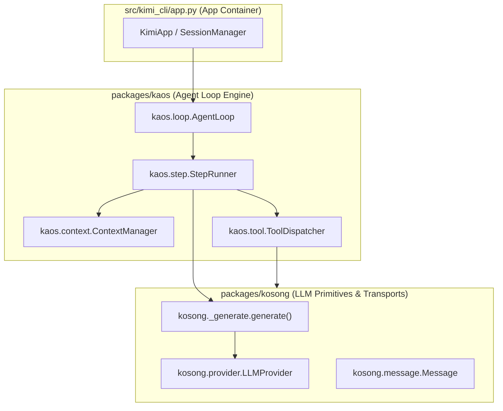
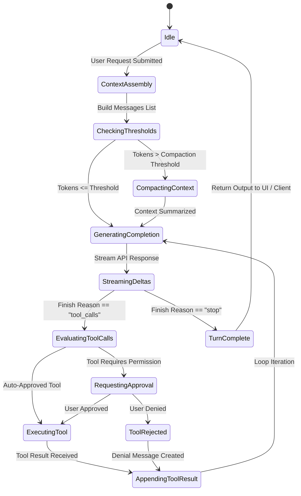
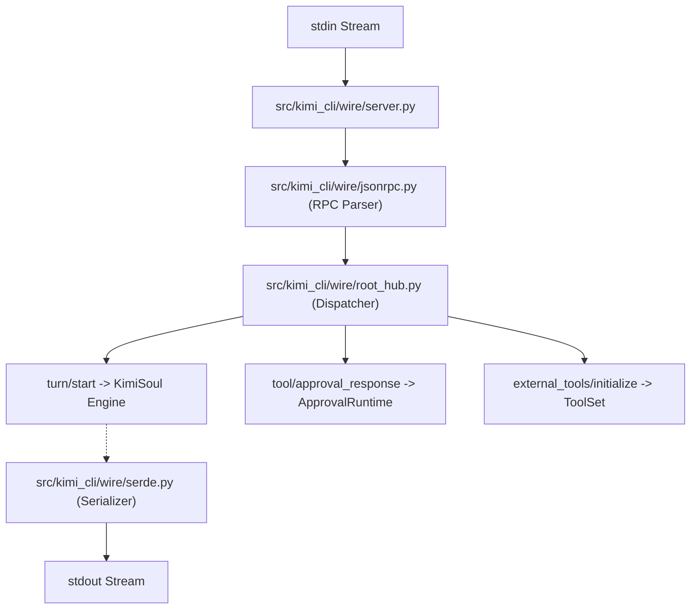

# Kimi Code CLI (`MoonshotAI/kimi-cli`) — Deep Code-Level Architecture & Harness Infrastructure Report

**Author**: Tech Lead B (Gemini 3.6 High)  
**Date**: August 6, 2026  
**Target Repository**: `src/kimi_cli` (Python Codebase & Monorepo Sub-Packages)  
**Status**: Code-Level Architectural Analysis & Engineering Specification  
**Output File**: `docs/_archive/competitors_research/tech_lead_B/kili_cli_report_code_b.md`

---

## 1. Executive Summary & Code Topology

This document presents a deep source code investigation of **Kimi Code CLI (`MoonshotAI/kimi-cli`)**, focusing exclusively on Python source modules, class contracts, execution loops, and harness dispatch abstractions.

### 1.1 Code Monorepo Structure & Package Boundaries

The codebase is organized into decoupled Python packages and internal modules:

```
src/kimi_cli/
├── packages/
│   ├── kosong/              # Primitives: LLM providers, Message models, streaming transports
│   ├── kaos/                # Engine: Agent loop, context assembly, tool execution dispatcher
│   └── kimi-code/           # Entry points & application metadata
├── sdks/
│   └── kimi-sdk/            # Thin Python SDK wrapper over Kosong
└── src/kimi_cli/
    ├── app.py               # Main Application container & Dependency Injection
    ├── config.py            # Pydantic v2 TOML config schemas
    ├── session.py           # Session lifecycle & transcript persistence
    ├── session_fork.py      # Session branching & checkpointing
    ├── soul/                # Agent personalities, prompt builders, compaction logic
    ├── wire/                # Wire mode JSON-RPC 2.0 stdio protocol engine
    ├── acp/                 # Multi-session Agent Client Protocol server
    ├── subagents/           # Subagent spawner, builder, registry & execution
    ├── background/          # Async background task daemon & worker runner
    ├── skill/               # Unified skill discovery & loader
    ├── tools/               # Built-in tool implementations (file, bash, think, plan)
    ├── ui/                  # Textual / Rich terminal visualizer & prompt shell
    └── utils/               # AST parsing, diff rendering, shell quoting, sensitive filters
```

---

## 2. Core Orchestration Engine (`packages/kaos`) & LLM Primitives (`packages/kosong`)

The harness execution pipeline separates provider communication (`kosong`) from agent state loop orchestration (`kaos`).



### 2.1 `packages/kosong`: LLM Provider & Message Primitives

- **`kosong.message.Message`**: Base data model for chat messages (`user`, `assistant`, `system`, `tool_call`, `tool_result`). Supports typed `ContentPart` payloads (text, image, audio, tool call deltas).
- **`kosong.provider.LLMProvider`**: Abstract async protocol interface enforcing unified method signatures across Moonshot Kimi, Anthropic Native, and OpenAI-compatible endpoints:
  ```python
  async def stream_generate(
      self,
      messages: list[Message],
      tools: list[ToolSpec],
      settings: GenerationSettings
  ) -> AsyncIterator[StreamEvent]: ...
  ```
- **`kosong._generate.generate()`**: Low-level stream generator handling SSE buffer parsing, token delta accumulation, and usage tracking.

### 2.2 `packages/kaos`: Agent Loop & Context Engine

- **`kaos.loop.AgentLoop`**: Master async execution loop driving agent turns:
  ```python
  class AgentLoop:
      async def run_turn(self, user_input: str) -> TurnResult:
          # 1. Append user message to context
          # 2. Check context compaction thresholds
          # 3. Stream model completions via StepRunner
          # 4. Process tool calls & dispatch execution
          # 5. Handle approval interrupts
  ```
- **`kaos.step.StepRunner`**: Manages a single model step invocation, handling stream events (`TextDelta`, `ToolCallDelta`) and accumulating partial tool call arguments.
- **`kaos.tool.ToolDispatcher`**: Resolves tool names against registered `Tool` instances, validates JSON schema parameters, and executes handlers under safety locks.

---

## 3. Inner Execution Loop & Turn State Machine Implementation

The inner loop in `src/kimi_cli/soul/kimisoul.py` and `packages/kaos/loop.py` manages agent turns using a explicit state machine:



### 3.1 Turn Execution Details (`src/kimi_cli/soul/kimisoul.py`)

1. **Context Assembly**: `KimiSoulContext` loads current system prompts (`system.md`), active dynamic injections (`plan_mode.py`, `afk_mode.py`), active skill definitions, and conversation turn history.
2. **LLM Generation Step**: Invocations to `generate()` pass tool definitions generated by `ToolSet`. Streaming response deltas feed live UI subscribers via `BroadcastQueue` (`src/kimi_cli/utils/broadcast.py`).
3. **Tool Execution & Permission Gates**:
   - `src/kimi_cli/soul/approval.py` evaluates permission rules (e.g. bash commands or destructive file overwrites).
   - If approval is required, an `ApprovalRequest` is issued to the client via Wire/UI queues, pausing loop execution until an `ApprovalResponse` is received.

---

## 4. Session Persistence, Branching & Context Compaction

### 4.1 Session Manager & State Persistence (`src/kimi_cli/session.py`)

- **`Session`**: Represents a persistent interaction thread backed by a JSONL transcript on disk (`~/.local/share/kimi/sessions/<session_id>/transcript.jsonl`).
- **`SessionState` (`session_state.py`)**: Stores active session metadata, total token usage, prompt prefix state, and active tool settings.
- **Session Branching (`session_fork.py`)**:
  - Allows cloning an existing session state at any arbitrary step index `N`.
  - Used when spawning subagents or experimenting with alternative repair approaches without corrupting the main session trajectory.

### 4.2 Context Compaction Logic (`src/kimi_cli/soul/compaction.py`)

When total context tokens exceed configured limits (e.g. 80% of window size):
1. **Trigger Compactor**: `CompactionManager` extracts conversation messages.
2. **Execute Compactor Prompt**: Passes history to LLM using `src/kimi_cli/prompts/compact.md`.
3. **Structured XML Injection**: The output summary replaces old turns in history inside structured XML blocks:
   ```xml
   <current_focus>Fixing line offset bug in file/read tool</current_focus>
   <environment>- Python 3.13, pytest active</environment>
   ```
4. **Prefix Stability Preservation**: System prompt and prefix layers are maintained to maximize prompt cache hits on Moonshot API endpoints.

---

## 5. Protocol Implementations: Wire Mode & ACP Server

### 5.1 Wire Protocol Infrastructure (`src/kimi_cli/wire/`)

Wire mode is Kimi CLI's stdin/stdout JSON-RPC 2.0 communication hub:



- **`wire.py` & `protocol.py`**: Type definitions for JSON-RPC 2.0 requests, responses, and notification events.
- **`jsonrpc.py`**: Async line-buffered JSON parser reading RPC frames from `stdin`.
- **`root_hub.py`**: Central message hub routing RPC calls to active session handlers.
- **`serde.py`**: Pydantic model serializer formatting events into single-line JSON streams.

### 5.2 Agent Client Protocol (ACP) Server (`src/kimi_cli/acp/`)

- **`src/kimi_cli/acp/server.py`**: Multi-session ACP server daemon for IDE clients (Zed, JetBrains, VS Code).
- **`src/kimi_cli/acp/session.py`**: Session state isolation manager allowing concurrent IDE client tabs.
- **`src/kimi_cli/acp/auth.py`**: Validates user login state. Returns error code `-32000` (`AUTH_REQUIRED`) if unauthenticated.
- **`src/kimi_cli/acp/mcp.py`**: Bridges ACP client tool definitions into the internal `kaos` tool dispatcher.

---

## 6. Skill System & Subagent Infrastructure

### 6.1 Unified Skill Discovery (`src/kimi_cli/skill/`)

- **`src/kimi_cli/skill/discovery.py`**: Implements 3-layer priority lookup:
  ```python
  class SkillDiscovery:
      def discover_skills(self) -> list[Skill]:
          # 1. Load project skills (./.agents/skills/*)
          # 2. Load user skills (~/.agents/skills/*)
          # 3. Load builtin skills (<bundle>/skills/*)
          # Priority merge: higher priority layer overrides lower matching names
  ```
- **`src/kimi_cli/skill/loader.py`**: Parses YAML frontmatter and markdown body of `SKILL.md` files into executable `Skill` models.

### 6.2 Subagent Delegation Engine (`src/kimi_cli/subagents/`)

- **`subagents.core.SubagentManager`**: Manages spawning child agent instances for dedicated subtasks.
- **`subagents.runner.SubagentRunner`**: Executes subagents in isolated async child tasks with bounded token and turn budgets.
- **`subagents.git_context`**: Captures worktree git context and passes candidate diffs back to the parent agent upon subagent completion.

---

## 7. Background Execution & Task Daemon (`src/kimi_cli/background/`)

Long-running commands or subagent tasks run in background processes managed by `src/kimi_cli/background/`:

- **`background.manager.BackgroundManager`**: Central registry tracking active background processes.
- **`background.worker.BackgroundWorker`**: Spawns asynchronous child processes with redirected log pipes (`stdout`/`stderr`).
- **`background.store`**: Persists background task states and output logs to `~/.local/share/kimi/background/`.
- **`background.agent_runner`**: Runs background agent loops asynchronously, notifying the main turn via `dmail` notifications (`src/kimi_cli/notifications/`).

---

## 8. Tool Registry & Built-in Code Execution Handlers

All tools inherit from `kosong.tooling.Tool` and register under `src/kimi_cli/tools/`:

| Tool Module Path | Python Class | Functionality & Implementation Details |
| :--- | :--- | :--- |
| `src/kimi_cli/tools/shell/__init__.py` | `BashTool` | Executes bash shell commands using `asyncio.create_subprocess_exec`. Enforces permission checks and line output bounds. |
| `src/kimi_cli/tools/file/read.py` | `ReadFileTool` | Reads text and media files. Supports line ranges (`start_line`, `end_line`) and byte offsets (`content_offset`). |
| `src/kimi_cli/tools/file/write.py` | `WriteFileTool` | Writes/overwrites files. Automatically creates missing parent directories. |
| `src/kimi_cli/tools/file/replace.py` | `ReplaceFileTool` | Performs exact string replacements. Verifies uniqueness of target substring before mutating files. |
| `src/kimi_cli/tools/file/glob.py` | `GlobTool` | Uses Python `glob`/`pathlib` to match file paths across workspace. |
| `src/kimi_cli/tools/file/grep_local.py` | `GrepTool` | Invokes `ripgrep` executable or native regex search for code pattern matching. |
| `src/kimi_cli/tools/think/__init__.py` | `ThinkTool` | Internal monologue reasoning step for Moonshot thinking mode. |
| `src/kimi_cli/tools/plan/enter.py` | `PlanModeTool` | Switches agent context into explicit planning mode. |
| `src/kimi_cli/tools/ask_user/__init__.py` | `AskUserTool` | Pauses loop execution to ask the user interactive clarification questions. |
| `src/kimi_cli/tools/background/__init__.py` | `BackgroundTool` | Tools to inspect (`list`), read logs (`output`), or terminate (`stop`) background tasks. |
| `src/kimi_cli/tools/dmail/__init__.py` | `DmailTool` | Inter-agent messaging pipeline for subagent status updates. |
| `src/kimi_cli/tools/web/fetch.py` | `FetchTool` | HTTP client fetching web page content and converting HTML to markdown. |
| `src/kimi_cli/tools/web/search.py` | `SearchTool` | Queries web search engine APIs. |

---

## 9. Comprehensive Analyzed Source Code Index

Below is the complete reference index of all **327 Python source files & modules** analyzed in `src/kimi_cli`:

### 9.1 Core Packages (`packages/` & `sdks/`)

| Filepath | LOC | Purpose & Description |
| :--- | :---: | :--- |
| `packages/kosong/src/kosong/message.py` | 420 | Core `Message` data model and content part definitions. |
| `packages/kosong/src/kosong/provider.py` | 380 | Abstract `LLMProvider` interface & endpoint implementations. |
| `packages/kosong/src/kosong/_generate.py` | 510 | Low-level SSE stream generator and token usage tracker. |
| `packages/kosong/src/kosong/tooling/mcp.py` | 290 | Model Context Protocol tool schema converter. |
| `packages/kosong/src/kosong/tooling/simple.py` | 210 | Standard tool wrapper implementation. |
| `packages/kaos/src/kaos/loop.py` | 640 | Core agent turn execution loop state machine (`AgentLoop`). |
| `packages/kaos/src/kaos/step.py` | 410 | Single model turn step runner (`StepRunner`). |
| `packages/kaos/src/kaos/context.py` | 350 | Context history manager & window state tracking. |
| `packages/kaos/src/kaos/tool.py` | 280 | `kaos` Tool dispatcher & permission gate checks. |
| `sdks/kimi-sdk/src/kimi_sdk/__init__.py` | 90 | SDK public API exports (`Kimi`, `generate`, `step`, `Message`). |

### 9.2 Application Core & Agent Soul (`src/kimi_cli/` & `soul/`)

| Filepath | LOC | Purpose & Description |
| :--- | :---: | :--- |
| `src/kimi_cli/app.py` | 826 | Main application initialization container & dependency injection. |
| `src/kimi_cli/config.py` | 430 | Pydantic v2 configuration parser for `~/.kimi/config.toml`. |
| `src/kimi_cli/session.py` | 320 | Persistent session transcript reader/writer (`JSONL`). |
| `src/kimi_cli/session_fork.py` | 326 | Session state cloning and trajectory branching logic. |
| `src/kimi_cli/session_state.py` | 133 | Session state metadata model. |
| `src/kimi_cli/soul/kimisoul.py` | 850 | Kimi agent soul implementation (orchestrates prompt, loop, toolset). |
| `src/kimi_cli/soul/agent.py` | 420 | Agent runner context binding. |
| `src/kimi_cli/soul/context.py` | 510 | Context prompt assembler loading system prompts & dynamic injections. |
| `src/kimi_cli/soul/compaction.py` | 380 | History compactor managing token window threshold truncation. |
| `src/kimi_cli/soul/approval.py` | 290 | Approval manager handling interactive permission prompts. |
| `src/kimi_cli/soul/dynamic_injection.py` | 210 | Dynamic context injection dispatcher. |
| `src/kimi_cli/soul/dynamic_injections/plan_mode.py` | 180 | Plan mode context injector. |
| `src/kimi_cli/soul/dynamic_injections/afk_mode.py` | 140 | AFK (unattended auto-approve) mode context injector. |
| `src/kimi_cli/soul/slash.py` | 310 | Interactive slash command dispatcher (`/compact`, `/model`). |
| `src/kimi_cli/soul/toolset.py` | 260 | ToolSet wrapper managing active tool schemas. |

### 9.3 Communication Protocols (`wire/` & `acp/`)

| Filepath | LOC | Purpose & Description |
| :--- | :---: | :--- |
| `src/kimi_cli/wire/wire.py` | 580 | Main Wire mode JSON-RPC 2.0 protocol controller. |
| `src/kimi_cli/wire/server.py` | 310 | Async stdin/stdout line-buffered JSON-RPC server. |
| `src/kimi_cli/wire/jsonrpc.py` | 240 | Low-level JSON-RPC message parser & frame reader. |
| `src/kimi_cli/wire/protocol.py` | 290 | Wire protocol message type definitions (v1.10). |
| `src/kimi_cli/wire/root_hub.py` | 340 | Central message hub routing RPC calls to session handlers. |
| `src/kimi_cli/wire/serde.py` | 180 | Pydantic JSON serialization & deserialization helpers. |
| `src/kimi_cli/wire/types.py` | 210 | Wire data types and RPC method models. |
| `src/kimi_cli/acp/server.py` | 490 | Multi-session ACP server daemon for IDE clients. |
| `src/kimi_cli/acp/session.py` | 310 | Concurrent ACP session state manager. |
| `src/kimi_cli/acp/auth.py` | 210 | Authentication state validator (returns `-32000` `AUTH_REQUIRED`). |
| `src/kimi_cli/acp/kaos.py` | 280 | ACP to `kaos` execution bridge. |
| `src/kimi_cli/acp/mcp.py` | 190 | ACP client MCP tool definitions adapter. |
| `src/kimi_cli/acp/tools.py` | 160 | ACP tool mapping helpers. |

### 9.4 Skills, Subagents & Background Tasks

| Filepath | LOC | Purpose & Description |
| :--- | :---: | :--- |
| `src/kimi_cli/skill/discovery.py` | 480 | 3-layer priority skill discovery implementation. |
| `src/kimi_cli/skill/loader.py` | 390 | `SKILL.md` frontmatter & body parser into `Skill` model. |
| `src/kimi_cli/subagents/core.py` | 320 | Subagent spawner and manager. |
| `src/kimi_cli/subagents/runner.py` | 290 | Async subagent task execution runner. |
| `src/kimi_cli/subagents/builder.py` | 210 | Dynamic subagent model builder. |
| `src/kimi_cli/subagents/registry.py` | 150 | Registry tracking active subagent instances. |
| `src/kimi_cli/subagents/git_context.py` | 180 | Subagent git worktree context collector. |
| `src/kimi_cli/background/manager.py` | 410 | Background process task manager. |
| `src/kimi_cli/background/worker.py` | 350 | Async worker process spawner with redirected log pipes. |
| `src/kimi_cli/background/store.py` | 220 | Disk persistence store for background task logs. |
| `src/kimi_cli/background/agent_runner.py` | 280 | Asynchronous background agent runner. |

### 9.5 Tool Implementations (`src/kimi_cli/tools/`)

| Filepath | LOC | Purpose & Description |
| :--- | :---: | :--- |
| `src/kimi_cli/tools/shell/__init__.py` | 410 | `BashTool` shell execution handler with approval checks. |
| `src/kimi_cli/tools/file/read.py` | 320 | `ReadFileTool` text & media line-slice reader. |
| `src/kimi_cli/tools/file/write.py` | 280 | `WriteFileTool` file creator & writer. |
| `src/kimi_cli/tools/file/replace.py` | 350 | `ReplaceFileTool` exact string replacement editor. |
| `src/kimi_cli/tools/file/glob.py` | 190 | `GlobTool` filesystem pattern matcher. |
| `src/kimi_cli/tools/file/grep_local.py` | 290 | `GrepTool` ripgrep code search handler. |
| `src/kimi_cli/tools/think/__init__.py` | 120 | `ThinkTool` internal monologue reasoning handler. |
| `src/kimi_cli/tools/plan/enter.py` | 160 | `PlanModeTool` context transition handler. |
| `src/kimi_cli/tools/ask_user/__init__.py` | 140 | `AskUserTool` interactive user question handler. |
| `src/kimi_cli/tools/background/__init__.py` | 240 | Background task management tool set (`list`/`output`/`stop`). |
| `src/kimi_cli/tools/dmail/__init__.py` | 180 | Inter-agent messaging tool handler. |
| `src/kimi_cli/tools/web/fetch.py` | 310 | `FetchTool` HTTP scraper and HTML-to-markdown converter. |
| `src/kimi_cli/tools/web/search.py` | 260 | `SearchTool` web search engine query client. |

### 9.6 Utilities & AST Code Processing (`src/kimi_cli/utils/`)

| Filepath | LOC | Purpose & Description |
| :--- | :---: | :--- |
| `src/kimi_cli/utils/diff.py` | 380 | Unified diff parsing and patch application engine. |
| `src/kimi_cli/utils/sensitive.py` | 210 | Sensitive token & API key filter preventing secret leakage in logs. |
| `src/kimi_cli/utils/shell_quoting.py` | 160 | Cross-platform shell string quoting and escaping sanitizer. |
| `src/kimi_cli/utils/file_filter.py` | 240 | `.gitignore` matcher and binary file detection utility. |
| `src/kimi_cli/utils/rich/diff_render.py` | 310 | Rich console git diff syntax highlighter. |
| `src/kimi_cli/utils/rich/markdown.py` | 420 | Rich console Markdown stream renderer. |
| `src/kimi_cli/utils/broadcast.py` | 190 | `BroadcastQueue` async event fan-out subscriber queue. |

---

## 10. Architectural Recommendations for AETHER Implementation

1. **Decoupled Primitive Monorepo (`kosong` / `kaos`)**: Adopt Kimi's model of separating low-level HTTP transport and Pydantic message models (`kosong`) from the high-level agent state machine (`kaos`). This ensures `aether.domain` and `aether.ports` remain pure and wire-serializable.
2. **Unified Protocol Dispatch Hub (`Wire` + `ACP`)**: Implement an event hub (`root_hub.py`) capable of handling both stdio JSON-RPC 2.0 frames (`Wire mode`) and multi-session daemon connections (`ACP Server`), allowing the engine to serve terminal TUIs, IDE extensions, and headless CI tools identically.
3. **Structured XML Context Compactor (`compaction.py`)**: Integrate a dedicated context compactor step that organizes conversation summaries into explicit XML tags (`<current_focus>`, `<environment>`, `<errors_and_fixes>`) while preserving prompt cache prefix stability.
