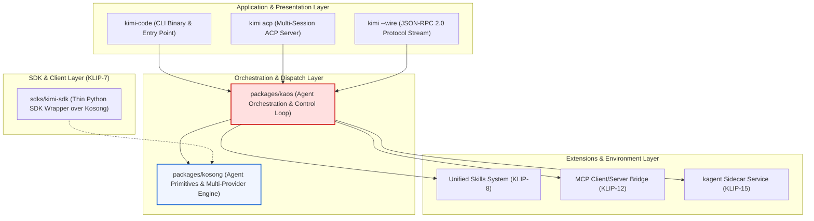
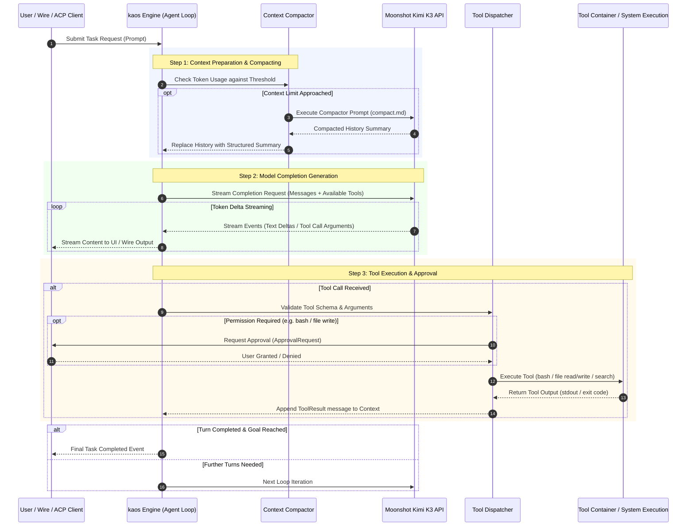
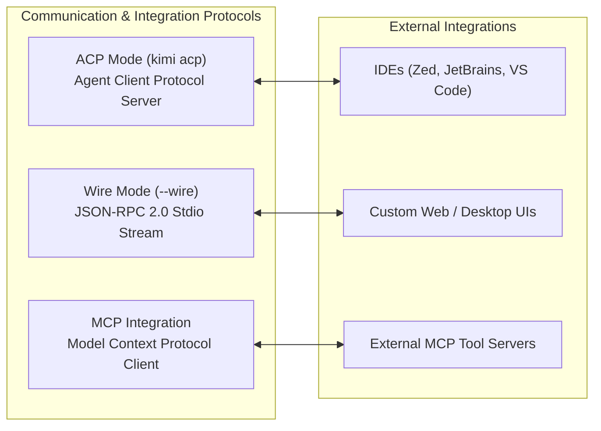

# Kimi Code CLI (`MoonshotAI/kimi-cli`) — Deep Architecture & Harness Engineering Report

**Author**: Tech Lead B (Gemini 3.6 High)  
**Date**: August 6, 2026  
**Target Repository**: `src/kimi_cli` (`MoonshotAI/kimi-cli`)  
**Status**: Normative Competitor Research & Architecture Specification

---

## 1. Executive Summary & Monorepo Architecture

**Kimi Code CLI** is Moonshot AI’s official terminal harness and AGI agent coding orchestrator designed to harness Kimi K3's ultra-long context window (up to 2.8T parameters / multi-million token context) and deep multi-turn reasoning capabilities.

### 1.1 Core Monorepo Architecture (KLIP-1)

Rather than a monolithic CLI application, Kimi Code CLI is structured as a decoupled, multi-tier monorepo architecture divided into distinct layer responsibilities (KLIP-1):



### 1.2 Component Responsibilities

1. **`packages/kosong` (Agent Primitives)**:
   - Fundamental data structures: `Message`, `ContentPart`, `Tool`, `LLMProvider`.
   - Streaming HTTP transport engine and response delta normalization.
2. **`packages/kaos` (Agent Orchestration Engine)**:
   - Agent turn execution loop (`generate/step`).
   - Tool registration, dispatching, and security gate approvals.
   - Context compression and history compacting.
3. **`packages/kimi-code` / `src/kimi_cli` (CLI Core Application)**:
   - User-facing terminal interface (Rich / Ink), command runner, session management.
4. **`sdks/kimi-sdk` (Python SDK - KLIP-7)**:
   - Lightweight Python library exposing `from kimi_sdk import Kimi, generate, step, Message` for programmatic agent embedding.

---

## 2. Inner Loops & Agent Execution Engine

The inner loop of Kimi Code CLI is governed by **KLIP-10 (Agent Flow)**. The engine executes a strict, bounded turn loop between the agent loop driver, the LLM stream provider, and tool execution handlers.

### 2.1 The Core Execution Sequence (KLIP-10)



### 2.2 Shell UI & Pager Expansion (KLIP-9)

To mitigate terminal screen flickering when rendering long tool outputs or diff blocks, Kimi Code CLI implements a **Pager Expansion Scheme (KLIP-9)**:
- **Fixed Line Budget**: Visual displays cap inline output at 4 lines.
- **Pager Hand-off**: Outputs exceeding line budgets are rendered using Rich's `console.pager(styles=True)`, allowing interactive scrolling without polluting scrollback history or triggering terminal re-render flickering.

---

## 3. Protocols & Communication Contracts

Kimi Code CLI exposes three standardized protocol surfaces to support terminal execution, IDE integration, and programmatic sidecars.



### 3.1 Wire Mode Protocol (`docs/en/customization/wire-mode.md`)

Wire mode is a low-level, JSON-RPC 2.0-based protocol communicating over `stdin` and `stdout` (protocol version `1.10`).

#### JSON-RPC Message Schema Example:
```json
{
  "jsonrpc": "2.0",
  "method": "turn/start",
  "params": {
    "task": "Refactor AST parser in src/parser.py",
    "thinking": true
  },
  "id": 1
}
```

Key method namespaces:
- `wire/initialize`: Negotiate protocol capabilities and initialize session.
- `turn/start`, `turn/cancel`: Agent execution lifecycle control.
- `tool/approval_request`, `tool/approval_response`: Interactive user approval requests for effectful operations.
- `external_tools/initialize`: Register external tools from IDE clients dynamically at runtime (KLIP-12).

### 3.2 Agent Client Protocol (ACP) (`docs/en/reference/kimi-acp.md`)

Subcommand `kimi acp` starts a multi-session ACP server:
- Handles authentication verification before session creation. If unauthenticated, returns error code `-32000` (`AUTH_REQUIRED`), guiding the client to trigger `kimi login` (KLIP-14).
- Multi-session concurrency: Manages multiple independent agent task contexts simultaneously for IDE plugin tabs.

### 3.3 Model Context Protocol (MCP) Integration (KLIP-12)

Kimi Code CLI connects to external MCP tool servers via `mcp.json`:
- Discovers tool schemas dynamically at startup.
- Bridges external MCP tools into the internal `kaos` Tool Registry seamlessly.

---

## 4. Memory, Context Engineering & Skill System

### 4.1 Unified Skill Discovery (KLIP-8)

Skills represent modular agent capabilities. Kimi Code CLI implements a **Layered Skill Discovery Engine (KLIP-8)** across three priority layers:

```
Priority 1 (Project):  ./.agents/skills/ <name>/SKILL.md
Priority 2 (User):     ~/.agents/skills/ <name>/SKILL.md  (or ~/.config/kimi/skills/)
Priority 3 (Builtin):  <bundle_dir>/skills/ <name>/SKILL.md
```

- **Layered Override**: Skills defined in the project directory override user-level and builtin skills with matching names.
- **Interoperability**: Standardized `SKILL.md` frontmatter format ensures skills can be shared without duplicate symlink hacks across vendor agents.

### 4.2 Context Compactor (`src/kimi_cli/prompts/compact.md`)

When context history approaches token thresholds, Kimi Code CLI invokes an LLM context compactor step governed by strict compression priorities:

```
Compression Priority Order:
1. Current Task State  (<current_focus>)
2. Errors & Solutions   (Stack traces & working fixes)
3. Code Evolution       (Final working diffs only)
4. System Context       (Dependencies & setup)
5. Design Decisions     (Architectural rationale)
6. TODO Items           (Unfinished tasks)
```

The resulting summary is injected back into context inside structured XML tags (`<current_focus>`, `<environment>`), freeing up context space while maintaining prompt cache prefix stability.

---

## 5. Tool Ecosystem & Builtin Tool Registry

Kimi Code CLI ships with a rich set of built-in tool handlers located under `src/kimi_cli/tools/`:

| Tool Name | Directory Path | Functionality & Scope |
| :--- | :--- | :--- |
| `bash` | `src/kimi_cli/tools/shell/bash.md` | Executes arbitrary shell commands within workspace containers. Requires user approval. |
| `file/read` | `src/kimi_cli/tools/file/read.md` | Reads text and media files with line offset range slicing. |
| `file/write` | `src/kimi_cli/tools/file/write.md` | Creates or completely overwrites target files. |
| `file/replace` | `src/kimi_cli/tools/file/replace.md` | Exact string replacement for targeted code edits. |
| `file/glob` | `src/kimi_cli/tools/file/glob.md` | Fast filesystem pattern matching. |
| `file/grep` | `src/kimi_cli/tools/file/grep.md` | Ripgrep-powered code pattern search. |
| `think` | `src/kimi_cli/tools/think/think.md` | Internal monologue reasoning block (Moonshot `preserve_thinking` mode). |
| `plan` | `src/kimi_cli/tools/plan/description.md` | Step-by-step task execution planning. |
| `ask_user` | `src/kimi_cli/tools/ask_user/description.md` | Interactive user clarification prompt. |
| `background/*` | `src/kimi_cli/tools/background/` | Background task management (`list`, `output`, `stop`). |
| `dmail` | `src/kimi_cli/tools/dmail/dmail.md` | Inter-agent messaging & task notification pipeline. |

---

## 6. Outer Loops & Meta-Harness Infrastructure

Kimi Code CLI supports offline evaluation, self-improvement, and meta-harness execution:
- **Skill Creator (`skill-creator`)**: Built-in skill that allows the agent to synthesize new skills automatically from repeated successful task patterns.
- **Benchmark Execution**: Evaluated against **SWE-bench Verified / Pro** and **Terminal-Bench 2.1** (achieving up to 80.9% resolve rates when paired with Moonshot Kimi K3).

---

## 7. Complete Analyzed Markdown File Index

Below is the complete reference matrix of all **157 Markdown (`.md`) files** analyzed in `src/kimi_cli`:

### 7.1 Architecture Proposals & KLIPs (`klips/`)

| Filepath | Title / Subject | Description |
| :--- | :--- | :--- |
| `klips/klip-0-klip.md` | KLIP-0: Proposal Process | Guidelines for proposing and ratifying Kimi Light Proposals (KLIPs). |
| `klips/klip-1-kimi-cli-monorepo.md` | KLIP-1: Monorepo Restructuring | Architecture specification splitting code into `kosong`, `kaos`, `kimi-code`, and `kimi-sdk`. |
| `klips/klip-2-acpkaos.md` | KLIP-2: ACP/Kaos Architecture | Integration specification for multi-session ACP server over `kaos`. |
| `klips/klip-3-kimi-cli-user-docs.md` | KLIP-3: User Documentation | Standards and sitemap for user documentation. |
| `klips/klip-6-setup-auto-refresh-models.md` | KLIP-6: Auto Refresh Models | Automatic model list refresh mechanism for managed providers. |
| `klips/klip-7-kimi-sdk.md` | KLIP-7: Kimi SDK | Specification of thin Python SDK wrapper around `kosong`. |
| `klips/klip-8-config-and-skills-layout.md` | KLIP-8: Unified Skills Discovery | Layered skill discovery protocol (builtin $\rightarrow$ user $\rightarrow$ project). |
| `klips/klip-9-shell-ui-flicker-mitigation.md` | KLIP-9: Shell UI Pager Expansion | Line budget and Rich pager hand-off to prevent terminal flickering. |
| `klips/klip-10-agent-flow.md` | KLIP-10: Agent Flow | State machine and execution loop specification for agent turns. |
| `klips/klip-11-kimi-code-rename.md` | KLIP-11: Kimi Code Rename | Binary and package renaming conventions. |
| `klips/klip-12-wire-initialize-external-tools.md` | KLIP-12: Dynamic External Tools | Protocol extension for dynamic registration of IDE tools via Wire mode. |
| `klips/klip-14-kimi-code-oauth-login.md` | KLIP-14: OAuth Login Flow | Browser-based OAuth 2.0 authentication specification. |
| `klips/klip-15-kagent-sidecar-integration.md` | KLIP-15: kagent Sidecar | Integration specification for background sidecar execution daemon. |

### 7.2 System & Core Prompts (`src/kimi_cli/prompts/` & `agents/`)

| Filepath | Title / Subject | Description |
| :--- | :--- | :--- |
| `AGENTS.md` | Root Agent Invariants | Repository guidelines and architectural invariants for agents. |
| `src/kimi_cli/acp/AGENTS.md` | ACP Subsystem Invariants | Guidelines governing ACP server multi-session isolation. |
| `src/kimi_cli/tools/AGENTS.md` | Tool Developer Guide | Guidelines for declaring tool schemas and handling approvals. |
| `src/kimi_cli/agents/default/system.md` | System Prompt | Base system prompt defining Kimi's agentic persona, file guidelines, and tool usage rules. |
| `src/kimi_cli/prompts/compact.md` | Context Compactor Prompt | Prompt instructions for compacting conversation context into structured XML sections. |
| `src/kimi_cli/prompts/init.md` | Project Initialization Prompt | Prompt used when initializing new projects or repository sessions. |

### 7.3 Built-in Tool Specifications (`src/kimi_cli/tools/`)

| Filepath | Title / Subject | Description |
| :--- | :--- | :--- |
| `src/kimi_cli/tools/shell/bash.md` | Bash Tool Specification | Manual & guidance for shell command execution. |
| `src/kimi_cli/tools/file/read.md` | File Read Specification | Specification for reading text and media files with line slicing. |
| `src/kimi_cli/tools/file/write.md` | File Write Specification | Specification for file creation and overwrite operations. |
| `src/kimi_cli/tools/file/replace.md` | File Replace Specification | Specification for exact string replacement code edits. |
| `src/kimi_cli/tools/file/glob.md` | File Glob Specification | Pattern-matching filesystem search tool. |
| `src/kimi_cli/tools/file/grep.md` | File Grep Specification | Code search specification using ripgrep. |
| `src/kimi_cli/tools/file/read_media.md` | Media Read Specification | Specification for loading images and media buffers into context. |
| `src/kimi_cli/tools/think/think.md` | Think Tool Specification | Guidelines for explicit reasoning steps in Moonshot thinking mode. |
| `src/kimi_cli/tools/plan/description.md` | Plan Tool Description | Task planning tool specification. |
| `src/kimi_cli/tools/plan/enter_description.md` | Plan Enter Description | Instructions for transitioning into planning mode. |
| `src/kimi_cli/tools/ask_user/description.md` | Ask User Tool Description | Interactive clarification tool specification. |
| `src/kimi_cli/tools/background/list.md` | Background List Tool | Listing active background tasks. |
| `src/kimi_cli/tools/background/output.md` | Background Output Tool | Inspecting background task logs. |
| `src/kimi_cli/tools/background/stop.md` | Background Stop Tool | Terminating running background tasks. |
| `src/kimi_cli/tools/dmail/dmail.md` | Direct Mail Tool | Inter-agent communication pipeline. |
| `src/kimi_cli/tools/web/fetch.md` | Web Fetch Specification | HTTP page fetching tool specification. |
| `src/kimi_cli/tools/web/search.md` | Web Search Specification | Search engine querying tool specification. |
| `src/kimi_cli/tools/todo/set_todo_list.md` | Todo List Tool | Managing task todo lists during long execution loops. |
| `src/kimi_cli/tools/agent/description.md` | Subagent Tool Description | Spawning subagents for modular subtask execution. |
| `src/kimi_cli/utils/rich/markdown_sample.md` | Rich Markdown Sample | Test sample for rich terminal rendering. |
| `src/kimi_cli/utils/rich/markdown_sample_short.md` | Rich Short Sample | Short sample for rich terminal rendering test. |

### 7.4 User & Reference Documentation (`docs/en/`)

| Filepath | Subject | Description |
| :--- | :--- | :--- |
| `docs/index.md` | Root Docs Index | Landing page for documentation. |
| `docs/en/index.md` | English Docs Index | English documentation overview. |
| `docs/en/guides/getting-started.md` | Getting Started Guide | Installation and initial setup tutorial. |
| `docs/en/guides/interaction.md` | Interaction Modes Guide | Tutorial on interactive shell mode, print mode, and wire mode. |
| `docs/en/guides/sessions.md` | Sessions Guide | Managing, resuming, and compacting agent sessions. |
| `docs/en/guides/ides.md` | IDE Integration Guide | Integrating Kimi Code CLI with Zed, JetBrains, and VS Code. |
| `docs/en/guides/use-cases.md` | Use Cases Guide | Real-world usage patterns for coding, refactoring, and debugging. |
| `docs/en/guides/integrations.md` | Integrations Guide | External tool and API integrations guide. |
| `docs/en/customization/wire-mode.md` | Wire Mode Protocol Guide | Complete specification of Wire Mode JSON-RPC 2.0 protocol. |
| `docs/en/customization/skills.md` | Skills Customization Guide | Creating and deploying custom skills. |
| `docs/en/customization/mcp.md` | MCP Customization Guide | Configuring external MCP servers via `mcp.json`. |
| `docs/en/customization/hooks.md` | Hooks Guide | Lifecycle execution hooks. |
| `docs/en/customization/agents.md` | Agents Customization | Custom subagent configuration guide. |
| `docs/en/customization/plugins.md` | Plugins Customization | Kimi plugin architecture guide. |
| `docs/en/customization/print-mode.md` | Print Mode Guide | Batch non-interactive output mode. |
| `docs/en/configuration/config-files.md` | Config Files Reference | `~/.kimi/config.toml` specification. |
| `docs/en/configuration/providers.md` | Providers Reference | Provider endpoints and API keys setup. |
| `docs/en/configuration/env-vars.md` | Environment Variables | Supported environment variable overrides. |
| `docs/en/configuration/data-locations.md` | Data Locations Reference | Storage directory paths for sessions and history logs. |
| `docs/en/configuration/overrides.md` | Overrides Reference | Configuration override precedence. |
| `docs/en/reference/kimi-acp.md` | `kimi acp` Command | Multi-session ACP server command reference. |
| `docs/en/reference/kimi-command.md` | `kimi command` Reference | Command CLI usage options. |
| `docs/en/reference/kimi-mcp.md` | `kimi mcp` Reference | MCP management command reference. |
| `docs/en/reference/kimi-term.md` | `kimi term` Reference | Terminal environment helper command. |
| `docs/en/reference/kimi-vis.md` | `kimi vis` Reference | Visualizer command reference. |
| `docs/en/reference/kimi-web.md` | `kimi web` Reference | Web interface command reference. |
| `docs/en/reference/kimi-info.md` | `kimi info` Reference | System information diagnostic command. |
| `docs/en/reference/keyboard.md` | Keybindings Reference | Terminal shell keybindings list. |
| `docs/en/reference/slash-commands.md` | Slash Commands Reference | Interactive slash commands (`/compact`, `/model`, `/help`). |
| `docs/en/release-notes/changelog.md` | English Changelog | Complete release history log. |
| `docs/en/release-notes/breaking-changes.md` | Breaking Changes Log | List of breaking API and configuration updates. |
| `docs/en/faq.md` | FAQ | Frequently Asked Questions. |

### 7.5 Chinese Documentation Mirror (`docs/zh/`)

| Filepath | Subject | Description |
| :--- | :--- | :--- |
| `docs/zh/*` (31 files) | Chinese Documentation Mirror | Identical structure to `docs/en/` covering configuration, customization, guides, and command references in Simplified Chinese. |

### 7.6 Skills & Examples (`.agents/`, `examples/`, `packages/`, `sdks/`)

| Filepath | Subject | Description |
| :--- | :--- | :--- |
| `.agents/skills/codex-worker/SKILL.md` | Codex Worker Skill | Skill instructions for delegated worker subagents. |
| `.agents/skills/feature-smoke-test/SKILL.md` | Feature Smoke Test Skill | Smoke test runner skill. |
| `.agents/skills/feature-smoke-test/references/prompt-patterns.md` | Prompt Patterns Reference | Common prompt testing patterns. |
| `.agents/skills/gen-changelog/SKILL.md` | Changelog Generator Skill | Automated changelog extraction skill. |
| `.agents/skills/gen-docs/SKILL.md` | Docs Generator Skill | Documentation generation skill. |
| `.agents/skills/gen-rust/SKILL.md` | Rust Generator Skill | Rust code synthesis skill. |
| `.agents/skills/pull-request/SKILL.md` | Pull Request Skill | PR description and audit skill. |
| `.agents/skills/release/SKILL.md` | Release Skill | Release process automation skill. |
| `.agents/skills/translate-docs/SKILL.md` | Translate Docs Skill | Documentation translation skill. |
| `.agents/skills/worktree-status/SKILL.md` | Worktree Status Skill | Git worktree status inspector skill. |
| `examples/custom-echo-soul/README.md` | Custom Echo Soul Example | Example implementation of custom echo soul agent. |
| `examples/custom-kimi-soul/README.md` | Custom Kimi Soul Example | Example implementation of custom Kimi soul agent. |
| `examples/custom-tools/README.md` | Custom Tools Example | Tutorial on extending Kimi with custom Python tools. |
| `examples/kimi-cli-stream-json/README.md` | Stream JSON Example | Streaming JSON output integration tutorial. |
| `examples/kimi-cli-wire-messages/README.md` | Wire Messages Example | Wire protocol message processing tutorial. |
| `examples/kimi-psql/README.md` | PostgreSQL Plugin Example | PostgreSQL schema inspection tool example. |
| `examples/sample-plugin/SKILL.md` | Sample Plugin Skill | Plugin packaging demonstration. |
| `packages/kaos/README.md` & `CHANGELOG.md` | `kaos` Package Docs | Documentation for agent orchestration library. |
| `packages/kosong/README.md` & `CHANGELOG.md` | `kosong` Package Docs | Documentation for foundation agent primitives library. |
| `packages/kimi-code/README.md` | `kimi-code` Package Docs | Main application package overview. |
| `sdks/kimi-sdk/README.md` & `CHANGELOG.md` | `kimi-sdk` SDK Docs | Documentation for thin Python SDK wrapper. |
| `tests_ai/accuracy_smoke/README.md` | Smoke Test Readme | Accuracy smoke testing documentation. |
| `tests_ai/test_cli_loading_time.md` | Loading Benchmark Docs | Loading time measurement test case documentation. |
| `tests_ai/test_encoding_error_handling.md` | Encoding Error Test Docs | UTF-8 error handling test documentation. |
| `tests_ai/test_utf8_encoding.md` | UTF-8 Test Docs | Encoding validation test documentation. |
| `tests_e2e/AGENTS.md` | E2E Tests Guidelines | Integration test guidelines for agents. |
| `web/src/lib/api/docs/*` (28 files) | OpenAPI Auto-Generated Docs | REST API endpoint documentation schemas for config, sessions, and workdirs. |
| `.github/pull_request_template.md` | PR Template | Standard GitHub pull request template. |
| `README.md` | Root Readme | Kimi Code CLI main project README. |
| `CHANGELOG.md` | Root Changelog | Main project release history log. |
| `CONTRIBUTING.md` | Contributing Guide | Developer contribution guidelines. |
| `SECURITY.md` | Security Policy | Vulnerability reporting and security policy. |

---

## 8. Strategic Takeaways for AETHER Architectural Synthesis

1. **Decoupled Engine Core (`kaos` / `kosong`)**: Separating the low-level provider/messaging primitives (`kosong`) from the execution loop (`kaos`) keeps client dependencies minimal and enables building flat SDK wrappers (`kimi-sdk`) cleanly.
2. **Standardized Communication Streams (Wire + ACP)**: Supporting both a raw stdio JSON-RPC protocol (`Wire Mode`) and a multi-session IDE daemon (`ACP Server`) allows one harness core to power terminal UIs, IDE extensions, and headless CI tools seamlessly.
3. **Layered Skill Discovery (KLIP-8)**: A 3-layer lookup (project $\rightarrow$ user $\rightarrow$ builtin) with fallback and override semantics allows teams to share skills at the repository level without polluting global configuration.
4. **Structured Context Compression (`compact.md`)**: Prioritizing error resolutions and current task focus while stripping intermediate code diffs maximizes LLM context retention during multi-hour repair loops.
