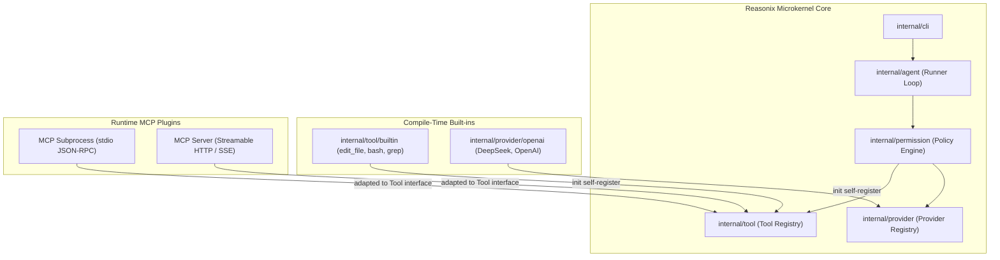
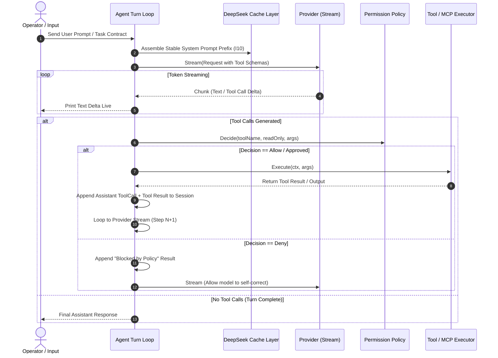
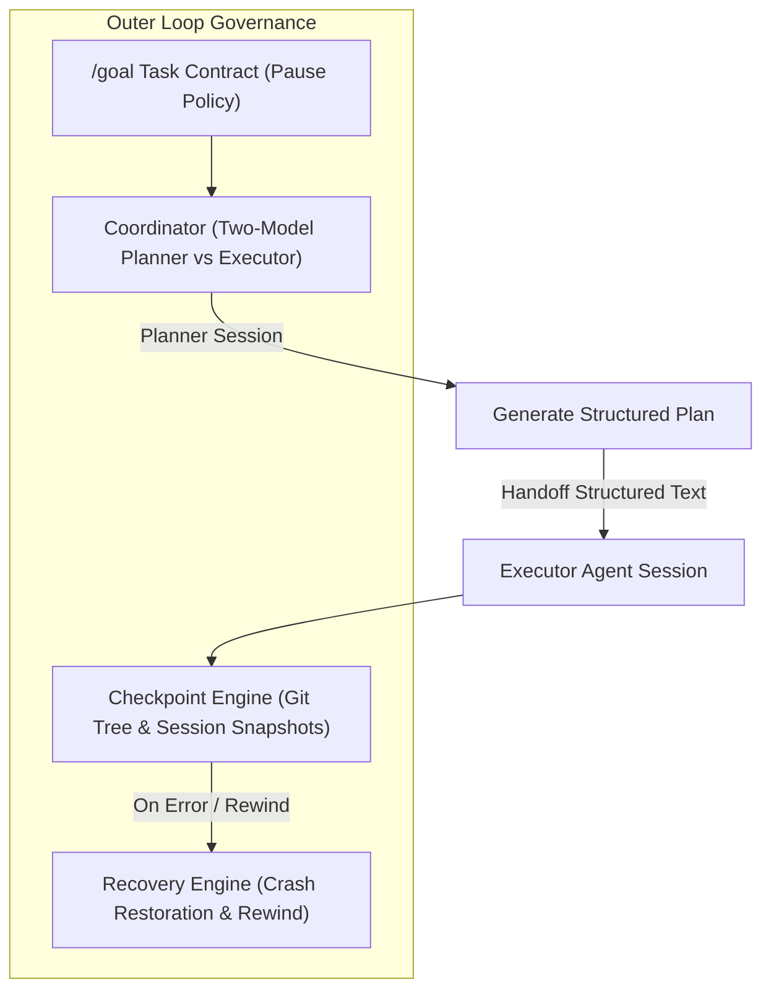

# Deep Technical Investigation Report: Reasonix & DeepSeek Agent Harness Infrastructure

## Executive Summary

**Reasonix** is a SOTA, high-performance, single-binary coding agent harness built in pure Go. It is designed to drive large language models—with primary optimizations for **DeepSeek v4 / R1** and OpenAI-compatible vendors—by supplying 100% of capabilities through a decoupled, plugin- and config-driven architecture.

Rather than hardcoding vendor switching or monolithic prompt loops, Reasonix establishes a **cache-first, thin-harness microkernel**. It strictly decouples provider implementations, tool registries, permission policy gating, context compactor engines, and multi-model coordination loops.

This report documents the inner and outer execution loops, memory/retrieval systems, protocols, capability security models, and architectural patterns of Reasonix derived from a comprehensive audit of the normative specifications in `src/reasonix/`.

---

## 1. Tech Stack & Architecture Overview

### 1.1 Core Technology Stack

* **Language & Runtime**: Pure Go (`go >= 1.22`).
* **Binary Compilation**: Single static binary with zero CGO dependencies (`CGO_ENABLED=0`). Cross-compiles out of the box to Windows, macOS, and Linux.
* **Minimal Dependency Philosophy**: Standard library by default. The only permitted third-party dependency is `github.com/BurntSushi/toml` for TOML configuration parsing.
* **Concurrency & Context**: Native Go `context.Context` threading throughout all layers, guaranteeing clean cancellation (Ctrl-C aborts in-flight LLM calls and subprocess tools instantly).

### 1.2 Monorepo Layout & Layer Boundaries

Dependencies point strictly downward (`cli → {agent, plugin, config} → {tool, provider}`):

```
reasonix/
├── go.mod / go.sum          # Module: reasonix; dependency: BurntSushi/toml
├── Makefile                 # Cross-compile, vet, format, test
├── reasonix.example.toml    # Sample configuration template
├── docs/                    # Normative engineering contracts (SPEC.md, TOOL_CONTRACT.md, etc.)
├── cmd/
│   └── reasonix/            # Executable entry point; self-registers built-ins via init()
└── internal/
    ├── cli/                 # Subcommand routing, flags, exit code mapping
    ├── config/              # TOML loader (Flag > Project > User > Defaults)
    ├── provider/            # Provider interface + kind->factory registry (openai, deepseek)
    ├── tool/                # Tool interface + Registry (builtin: edit_file, bash, ls, grep, glob)
    ├── agent/               # Session, Turn loop, Runner, Coordinator (two-model planner)
    ├── plugin/              # MCP (Model Context Protocol) JSON-RPC 2.0 stdio / HTTP / SSE client
    ├── permission/          # Per-call Policy Engine: Allow / Ask / Deny rules & Approver
    ├── command/             # Custom slash commands (.reasonix/commands/*.md)
    ├── checkpoint/          # Conversation & file tree snapshot/rewind engine
    ├── recovery/            # Crash recovery & session state restoration
    ├── retrieval/           # BM25 memory & JSONL transcript search engine
    ├── guardian/            # Safety policy verifier
    └── remote/              # SSH transport, SFTP file layer, remote serve bootstrap
```

---

## 2. Core Abstractions & Extension Tier Architecture

Reasonix operates on **two extension tiers**:

1. **Compile-Time Built-ins**: Self-register into process-global registries via Go `init()` functions. Built-in tools and providers never import children; parents provide clean registration interfaces.
2. **Runtime External Plugins**: Subprocess workers and remote servers communicating over **JSON-RPC 2.0** via the **Model Context Protocol (MCP)**.



### 2.1 Provider Contract (`internal/provider`)

```go
type Provider interface {
    Name() string
    Stream(ctx context.Context, req Request) (<-chan Chunk, error)
}

type Factory func(cfg Config) (Provider, error)
```

* **OpenAI-Compatible Vendor Unification**: DeepSeek, Moonshot, Grok, and OpenAI are all instances of `kind = "openai"`, differing only in `base_url`, `model`, and `api_key_env`.
* **Streaming Delta Accumulation**: Streaming tool-call deltas are accumulated by index inside the provider adapter; only complete `ToolCall` objects are emitted to the agent loop.

### 2.2 Tool Contract (`internal/tool`)

```go
type Tool interface {
    Name() string
    Description() string
    Schema() json.RawMessage // Canonical JSON Schema for parameters
    Execute(ctx context.Context, args json.RawMessage) (string, error)
}
```

* **Non-Fatal Error Feedback**: `Execute` parses raw JSON parameters. Execution errors are returned as standard strings rather than fatal panics, feeding errors back to the model for self-correction.

---

## 3. Inner Loop: LLM Turn & Tool Execution Loop

The inner loop (`internal/agent/agent.go`) manages single-turn and multi-turn execution between the LLM provider and tool execution boundaries.



### 3.1 DeepSeek Prompt Cache Optimization (I10 Invariant)

To achieve $>90\%$ prompt cache hit rates on DeepSeek v4 / R1:
1. **Immutable System Prompt Prefix**: System instructions (`AGENTS.md`, `REASONIX.md`), tool schemas, and environment rules remain byte-identical across turns.
2. **Prepend-Only History**: Message history grows strictly prepend-only. No middle-turn mutation of prior assistant/tool messages.
3. **Turn-Suffix Dynamic Memory**: Bounded BM25 memory recall is appended to the *user turn suffix*, preserving the stable system prompt prefix.

---

## 4. Outer Loops: Coordination, Goals, Checkpoints & Recovery



### 4.1 Two-Model Collaboration (`Coordinator`)

When `agent.planner_model` specifies a different model than the executor, Reasonix uses a `Coordinator` running two models in **separate, isolated sessions**:

* **Why Separate Sessions?**: Switching models inside a single shared conversation invalidates prompt caches for both models. By keeping Planner and Executor sessions separate, both prompt prefixes remain 100% cache-friendly.
* **Planner (Low-Frequency)**: Operates in a dedicated session with a restricted, read-only research toolset to produce a structured plan (Objective, Ordered Steps, Touchpoints, Verification).
* **Handoff**: The completed plan is passed as structured text to the **Executor** session (a full tool-using `Agent`), which carries out implementation and verification.

### 4.2 Task Contracts & Pause Policy

Work is structured around **Task Contracts** ([`TASK_CONTRACT.md`](file:///F:/Coding/Harness-D-power/src/reasonix/docs/TASK_CONTRACT.md)):
* **Context**: Purpose and audience of the task.
* **Request**: Single, unambiguous action.
* **Output Format**: Expected structure and required sections.
* **Constraints**: Explicit negative boundaries ("Do not assume X").
* **Pause Policy**: Clear rule governing when the agent should continue vs when it must pause to ask the user (e.g. irreversible operations, external publishes, scope changes).

### 4.3 Checkpoint & Recovery Engine (`internal/checkpoint`, `internal/recovery`)

* **Git-Tree Snapshots**: Automatically creates lightweight git tree snapshots before major file mutations.
* **Session State Serialization**: Serializes session message lists, active leases, and goal states to `.reasonix/snapshots/`.
* **Rewind & Recovery**: Allows instant `/rewind` to any prior turn or checkpoint, restoring both conversation history and workspace file state byte-for-byte.

---

## 5. Memory, Context, Search & Index Architecture

Reasonix implements **Context Engine v2** ([`SESSION_MEMORY_RETRIEVAL.md`](file:///F:/Coding/Harness-D-power/src/reasonix/docs/SESSION_MEMORY_RETRIEVAL.md)), separating standing rules from background facts.

```mermaid
graph TD
    subgraph Context Layers
        L1["Standing Instructions (AGENTS.md, REASONIX.md)<br/>• Every turn • Highest authority"]
        L2["Background Memory Facts (.reasonix/memory/*.md)<br/>• On-demand BM25 recall • Project/Global scope"]
        L3["Session History (.reasonix/archive/*.jsonl)<br/>• Complete JSONL transcript • Recoverable via history tool"]
    end

    subgraph Context Maintenance Tier (Low-Frequency Compaction)
        Ratio1["< 0.6 Snip Ratio: Untouched"]
        Ratio2["0.6 Snip Ratio: Stale tool results snipped with head/tail markers"]
        Ratio3["0.8 Compact Ratio: Stale results pruned; summary compaction runs"]
        Ratio4["0.9 Force Ratio: Forced context fold"]
    end
```

### 5.1 Tiered Low-Frequency Compaction

To preserve cache hit rates while managing context window limits:
1. **Snip Ratio (0.6)**: Stale tool output payloads before the recent tail are shortened with deterministic head/tail markers without removing message objects.
2. **Compact Ratio (0.8)**: Stale tool outputs are pruned to short placeholders. If the context remains above threshold, summary compaction summarizes assistant/tool turns in place.
3. **Verbatim User Turns**: Every user turn and prior digest is kept verbatim—never summarized away.
4. **Archive Storage**: Dropped original messages are archived under `reasonix/archive/<timestamp>.jsonl`.

### 5.2 On-Demand BM25 Search Tools

* **`history` Tool**: Gives the agent on-demand BM25 keyword search over archived transcript JSONL files (`scope="project"` or `scope="global"`).
* **`memory` Tool**: On-demand search, list, and read access over active background memory facts (`type="user"|"feedback"|"project"|"reference"`).

---

## 6. Protocols & Capability Security

### 6.1 Model Context Protocol (MCP) Client Integration

Reasonix adapts external MCP servers seamlessly into the `Tool` interface:

* **Transports**:
  * `stdio`: Local subprocess running one JSON-RPC message per line over stdin/stdout.
  * `http` (`streamable-http`): HTTP POST with `application/json` or `text/event-stream` SSE streaming.
  * `sse`: Legacy HTTP+SSE stream.
* **Namespacing**: Adapted remote tools are namespaced `mcp__<server>__<tool>` to prevent collision.
* **Annotations**: MCP `readOnlyHint` and `destructiveHint` annotations determine parallel execution scheduling and subagent access.

### 6.2 Permission Policy Engine (`internal/permission`)

Per-call static rule evaluation (`Allow`, `Ask`, `Deny`) + interactive `Approver`:

```go
type Decision int
const (Allow Decision = iota; Ask; Deny)

type Policy struct {
    Mode Decision
    Allow, Ask, Deny []Rule
}
```

* **Rule Syntax**: `Tool` or `Tool(specifier)` e.g., `Bash(npm run test:*)`, `Edit(docs/**)`, `Bash=git status`.
* **Dynamic Bash Safety**: Command substitutions, heredocs, dynamic command names, `eval`, `source`, and shell operators (`&&`, `;`) require explicit human approval in `Ask`/`Auto` modes unless covered by an exact literal grant.
* **Precedence**: `Deny` > `Ask` > `Allow` > Fallback. `Deny` is a hard block in all execution modes.

---

## 7. Document Sources Audit

The analysis in this report was derived from an exhaustive audit of all **82 Markdown documentation files** in `src/reasonix/`:

| Absolute Filepath | Category | Content Description & Key Engineering Takeaways |
| :--- | :--- | :--- |
| `F:\Coding\Harness-D-power\src\reasonix\docs\SPEC.md` | Normative Spec | **Primary Architecture Contract**: Layout, design principles, provider/tool interfaces, coordinator, context compaction, permission policy. |
| `F:\Coding\Harness-D-power\src\reasonix\docs\TASK_CONTRACT.md` | Task Spec | Defines the 5-part task contract format (Context, Request, Output Format, Constraints, Pause Policy) and goal mode rules. |
| `F:\Coding\Harness-D-power\src\reasonix\docs\TOOL_CONTRACT.md` | Tool Spec | Defines canonical JSON schemas for all built-in tools (`read_file`, `write_file`, `edit_file`, `move_file`, `bash`, `ls`, `glob`, `grep`). |
| `F:\Coding\Harness-D-power\src\reasonix\docs\SESSION_MEMORY_RETRIEVAL.md` | Memory Spec | Context Engine v2 specification: standing instructions vs background facts, BM25 memory recall, `remember`/`forget` tools. |
| `F:\Coding\Harness-D-power\src\reasonix\docs\SESSION_REFERENCE_ARCHITECTURE.md` | Architecture | Comprehensive session lifecycle reference: state transitions, snapshot persistence, recovery boundaries, and stream events. |
| `F:\Coding\Harness-D-power\src\reasonix\docs\CHECKPOINTS.md` | Snapshot Spec | Details conversation and file tree checkpointing, snapshot storage format, and rewind execution semantics. |
| `F:\Coding\Harness-D-power\src\reasonix\docs\RECOVERY.md` | Recovery Spec | Crash recovery protocol, session transcript reconstruction, and automatic retry policies. |
| `F:\Coding\Harness-D-power\src\reasonix\docs\ACP.md` | Agent Protocol | **Agent Communication Protocol**: Subagent IPC, event envelopes, task delegation, and progress reporting interfaces. |
| `F:\Coding\Harness-D-power\src\reasonix\docs\CAPABILITY_DIAGNOSTICS.md` | Security Spec | Diagnostic framework for verifying tool capabilities, policy rule matching, and permission evaluation trails. |
| `F:\Coding\Harness-D-power\src\reasonix\docs\CLI.md` | CLI Interface | Complete subcommand specification (`code`, `run`, `serve`, `config`, `memory`), flag parsing, and exit code mappings. |
| `F:\Coding\Harness-D-power\src\reasonix\docs\EXTENSIONS.md` | Extension Spec | Plugin architecture overview, stdio/HTTP/SSE MCP transport setup, and registration lifecycle. |
| `F:\Coding\Harness-D-power\src\reasonix\docs\EXTENSION_PROTOCOL.md` | Extension Spec | JSON-RPC 2.0 extension protocol definitions, tool declaration schemas, and progress notifications. |
| `F:\Coding\Harness-D-power\src\reasonix\docs\PLUGIN_PACKAGES.md` | Plugin Spec | Packaging, distribution, and manifest format for external Reasonix plugin packages. |
| `F:\Coding\Harness-D-power\src\reasonix\docs\REASONING_PROVIDERS.md` | Provider Spec | Detailed specifications for DeepSeek R1/v4, OpenAI, and Anthropic reasoning provider adapters. |
| `F:\Coding\Harness-D-power\src\reasonix\docs\REASONING_LANGUAGE.md` | Language Spec | Multi-language reasoning formatting and chain-of-thought preservation contracts. |
| `F:\Coding\Harness-D-power\src\reasonix\docs\SUBAGENT_PROFILES.md` | Subagent Spec | Specialized subagent profiles (researcher, reviewer, coder) with restricted tool registries. |
| `F:\Coding\Harness-D-power\src\reasonix\docs\SUBAGENT_PROGRESS.md` | Subagent Spec | Progress notification protocol for background subagents communicating with parent sessions. |
| `F:\Coding\Harness-D-power\src\reasonix\docs\TOOL_APPROVAL_MODES.md` | Security Spec | Specification of Ask, Auto, and YOLO tool approval postures and interactive front-end prompting. |
| `F:\Coding\Harness-D-power\src\reasonix\docs\BOT_GUIDE.md` | Bot Guide | Autonomous headless bot execution guide, CI runner setup, and non-interactive posture configuration. |
| `F:\Coding\Harness-D-power\src\reasonix\docs\GUIDE.md` | User Guide | Comprehensive user manual, slash commands (`/goal`, `/plan`, `/remember`), and configuration guide. |
| `F:\Coding\Harness-D-power\src\reasonix\docs\CONFIG_PATHS.md` | Config Spec | Configuration resolution order (Flags > Project `reasonix.toml` > User `~/.config/reasonix/config.json` > Defaults). |
| `F:\Coding\Harness-D-power\src\reasonix\docs\MIGRATING.md` | Migration | Migration guide for legacy configurations and tool contracts. |
| `F:\Coding\Harness-D-power\src\reasonix\docs\THEME_PACK.md` | Theme Spec | TUI color themes and terminal display styling rules. |
| `F:\Coding\Harness-D-power\src\reasonix\docs\THEME_ASSETS.md` | Theme Spec | Terminal icon assets, badges, and status indicator symbols. |
| `F:\Coding\Harness-D-power\src\reasonix\docs\production_checklist.md` | Deployment | Production deployment checklist, security sandbox requirements, and binary signing SOP. |
| `F:\Coding\Harness-D-power\src\reasonix\docs\SIGNPATH_WINDOWS_ADMIN_SOP.md` | Security Spec | Windows binary code-signing SOP using SignPath. |
| `F:\Coding\Harness-D-power\src\reasonix\docs\COLLABORATION_MODES.zh-CN.md` | Chinese Doc | Simplified Chinese translation of two-model collaboration modes. |
| `F:\Coding\Harness-D-power\src\reasonix\docs\DESKTOP_HOOKS.zh-CN.md` | Chinese Doc | Simplified Chinese translation of desktop IPC event hooks. |
| `F:\Coding\Harness-D-power\src\reasonix\docs\GOAL_ENFORCEMENT.zh-CN.md` | Chinese Doc | Simplified Chinese translation of goal mode task contract enforcement. |
| `F:\Coding\Harness-D-power\src\reasonix\docs\ACP.zh-CN.md` | Chinese Doc | Simplified Chinese translation of ACP protocol. |
| `F:\Coding\Harness-D-power\src\reasonix\docs\CAPABILITY_DIAGNOSTICS.zh-CN.md` | Chinese Doc | Simplified Chinese translation of capability diagnostics. |
| `F:\Coding\Harness-D-power\src\reasonix\docs\CHECKPOINTS.zh-CN.md` | Chinese Doc | Simplified Chinese translation of checkpointing spec. |
| `F:\Coding\Harness-D-power\src\reasonix\docs\CLI.zh-CN.md` | Chinese Doc | Simplified Chinese translation of CLI guide. |
| `F:\Coding\Harness-D-power\src\reasonix\docs\CONFIG_PATHS.zh-CN.md` | Chinese Doc | Simplified Chinese translation of config resolution. |
| `F:\Coding\Harness-D-power\src\reasonix\docs\EXTENSIONS.zh-CN.md` | Chinese Doc | Simplified Chinese translation of extensions spec. |
| `F:\Coding\Harness-D-power\src\reasonix\docs\EXTENSION_PROTOCOL.zh-CN.md` | Chinese Doc | Simplified Chinese translation of extension protocol. |
| `F:\Coding\Harness-D-power\src\reasonix\docs\EXTENSION_PROTOCOL.generated.md` | Generated Spec | Auto-generated JSON schema definitions for MCP extension protocol. |
| `F:\Coding\Harness-D-power\src\reasonix\docs\GUIDE.zh-CN.md` | Chinese Doc | Simplified Chinese translation of user guide. |
| `F:\Coding\Harness-D-power\src\reasonix\docs\MIGRATING.zh-CN.md` | Chinese Doc | Simplified Chinese translation of migration guide. |
| `F:\Coding\Harness-D-power\src\reasonix\docs\PLUGIN_PACKAGES.zh-CN.md` | Chinese Doc | Simplified Chinese translation of plugin packages. |
| `F:\Coding\Harness-D-power\src\reasonix\docs\REASONING_LANGUAGE.zh-CN.md` | Chinese Doc | Simplified Chinese translation of reasoning language spec. |
| `F:\Coding\Harness-D-power\src\reasonix\docs\REASONING_PROVIDERS.zh-CN.md` | Chinese Doc | Simplified Chinese translation of reasoning providers spec. |
| `F:\Coding\Harness-D-power\src\reasonix\docs\RECOVERY.zh-CN.md` | Chinese Doc | Simplified Chinese translation of recovery spec. |
| `F:\Coding\Harness-D-power\src\reasonix\docs\SESSION_MEMORY_RETRIEVAL.zh-CN.md` | Chinese Doc | Simplified Chinese translation of memory retrieval spec. |
| `F:\Coding\Harness-D-power\src\reasonix\docs\SPEC.zh-CN.md` | Chinese Doc | Simplified Chinese translation of core engineering spec. |
| `F:\Coding\Harness-D-power\src\reasonix\docs\SUBAGENT_PROFILES.zh-CN.md` | Chinese Doc | Simplified Chinese translation of subagent profiles. |
| `F:\Coding\Harness-D-power\src\reasonix\docs\SUBAGENT_PROGRESS.zh-CN.md` | Chinese Doc | Simplified Chinese translation of subagent progress protocol. |
| `F:\Coding\Harness-D-power\src\reasonix\docs\TASK_CONTRACT.zh-CN.md` | Chinese Doc | Simplified Chinese translation of task contracts spec. |
| `F:\Coding\Harness-D-power\src\reasonix\docs\THEME_ASSETS.zh-CN.md` | Chinese Doc | Simplified Chinese translation of theme assets. |
| `F:\Coding\Harness-D-power\src\reasonix\docs\THEME_PACK.zh-CN.md` | Chinese Doc | Simplified Chinese translation of theme pack spec. |
| `F:\Coding\Harness-D-power\src\reasonix\docs\TOOL_APPROVAL_MODES.zh-CN.md` | Chinese Doc | Simplified Chinese translation of tool approval modes. |
| `F:\Coding\Harness-D-power\src\reasonix\docs\TOOL_CONTRACT.zh-CN.md` | Chinese Doc | Simplified Chinese translation of tool contracts. |
| `F:\Coding\Harness-D-power\src\reasonix\docs\production_checklist.zh-CN.md` | Chinese Doc | Simplified Chinese translation of production checklist. |
| `F:\Coding\Harness-D-power\src\reasonix\docs\BOT_GUIDE.zh-CN.md` | Chinese Doc | Simplified Chinese translation of bot guide. |
| `F:\Coding\Harness-D-power\src\reasonix\docs\superpowers\specs\2026-06-29-autoresearch-runtime-design.md` | Feature Spec | Design specification for automated research runtime module. |
| `F:\Coding\Harness-D-power\src\reasonix\docs\superpowers\plans\2026-06-29-autoresearch-runtime-implementation.md` | Feature Plan | Implementation roadmap for autoresearch runtime. |
| `F:\Coding\Harness-D-power\src\reasonix\docs\superpowers\audits\2026-06-30-autoresearch-runtime-verification.md` | Feature Audit | Runtime verification and audit log for autoresearch module. |
| `F:\Coding\Harness-D-power\src\reasonix\README.md` | Root Doc | Main English README: Feature overview, quickstart, installation, architecture highlights. |
| `F:\Coding\Harness-D-power\src\reasonix\README.zh-CN.md` | Root Doc | Simplified Chinese translation of main README. |
| `F:\Coding\Harness-D-power\src\reasonix\REASONIX.md` | Root Doc | High-level system orientation and architectural principles document. |
| `F:\Coding\Harness-D-power\src\reasonix\CHANGELOG.md` | Changelog | Historical release log detailing version updates and feature additions. |
| `F:\Coding\Harness-D-power\src\reasonix\CONTRIBUTING.md` | Contributor Doc | Contribution guidelines, code style rules, and PR requirements. |
| `F:\Coding\Harness-D-power\src\reasonix\SECURITY.md` | Security Doc | Security policy, vulnerability reporting procedures, and threat models. |
| `F:\Coding\Harness-D-power\src\reasonix\benchmarks\README.md` | Benchmark Doc | Overview of Reasonix benchmark execution harness and evaluation metrics. |
| `F:\Coding\Harness-D-power\src\reasonix\benchmarks\e2e\tasks\compaction\workdir\story\chapter-1.md` | Test Fixture | Sample story chapter fixture for testing compaction. |
| `F:\Coding\Harness-D-power\src\reasonix\benchmarks\e2e\tasks\compaction\workdir\story\chapter-2.md` | Test Fixture | Sample story chapter fixture for testing compaction. |
| `F:\Coding\Harness-D-power\src\reasonix\benchmarks\e2e\tasks\compaction\workdir\story\chapter-3.md` | Test Fixture | Sample story chapter fixture for testing compaction. |
| `F:\Coding\Harness-D-power\src\reasonix\benchmarks\e2e\tasks\compaction\workdir\story\chapter-4.md` | Test Fixture | Sample story chapter fixture for testing compaction. |
| `F:\Coding\Harness-D-power\src\reasonix\benchmarks\e2e\tasks\compaction\workdir\story\chapter-5.md` | Test Fixture | Sample story chapter fixture for testing compaction. |
| `F:\Coding\Harness-D-power\src\reasonix\benchmarks\e2e\tasks\compaction\workdir\story\chapter-6.md` | Test Fixture | Sample story chapter fixture for testing compaction. |
| `F:\Coding\Harness-D-power\src\reasonix\.github\pull_request_template.md` | Template | GitHub pull request template. |
| `F:\Coding\Harness-D-power\src\reasonix\.reasonix\commands\review.md` | Slash Command | Sample custom slash command template for code review. |
| `F:\Coding\Harness-D-power\src\reasonix\.reasonix\memory\README.md` | Sample Memory | Sample memory directory placeholder. |
| `F:\Coding\Harness-D-power\src\reasonix\desktop\README.md` | Desktop Doc | Architecture overview for desktop app module. |
| `F:\Coding\Harness-D-power\src\reasonix\desktop\third_party\go-webview2\PATCHES.md` | Vendor Doc | Patches documentation for Webview2 Go wrapper. |
| `F:\Coding\Harness-D-power\src\reasonix\desktop\third_party\go-webview2\webviewloader\README.md` | Vendor Doc | Webview loader library documentation. |
| `F:\Coding\Harness-D-power\src\reasonix\internal\guardian\guardian_policy.md` | Policy Spec | Internal Guardian policy specification for safety validation. |
| `F:\Coding\Harness-D-power\src\reasonix\internal\skill\builtincontent\reasonix-guide\SKILL.md` | Built-in Skill | Built-in Reasonix guide skill instruction file. |
| `F:\Coding\Harness-D-power\src\reasonix\sdk\go\README.md` | SDK Doc | Go SDK library documentation and usage guide. |
| `F:\Coding\Harness-D-power\src\reasonix\sdk\go\examples\starterextension\README.md` | SDK Example | Starter extension example documentation. |
| `F:\Coding\Harness-D-power\src\reasonix\sdk\go\examples\starterextension\README.zh-CN.md` | SDK Example | Simplified Chinese translation of starter extension example. |
| `F:\Coding\Harness-D-power\src\reasonix\workers\accounts\README.md` | Worker Doc | Documentation for accounts Cloudflare worker module. |
