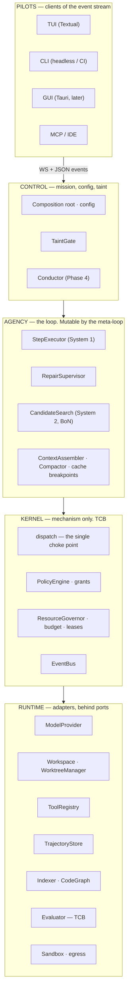
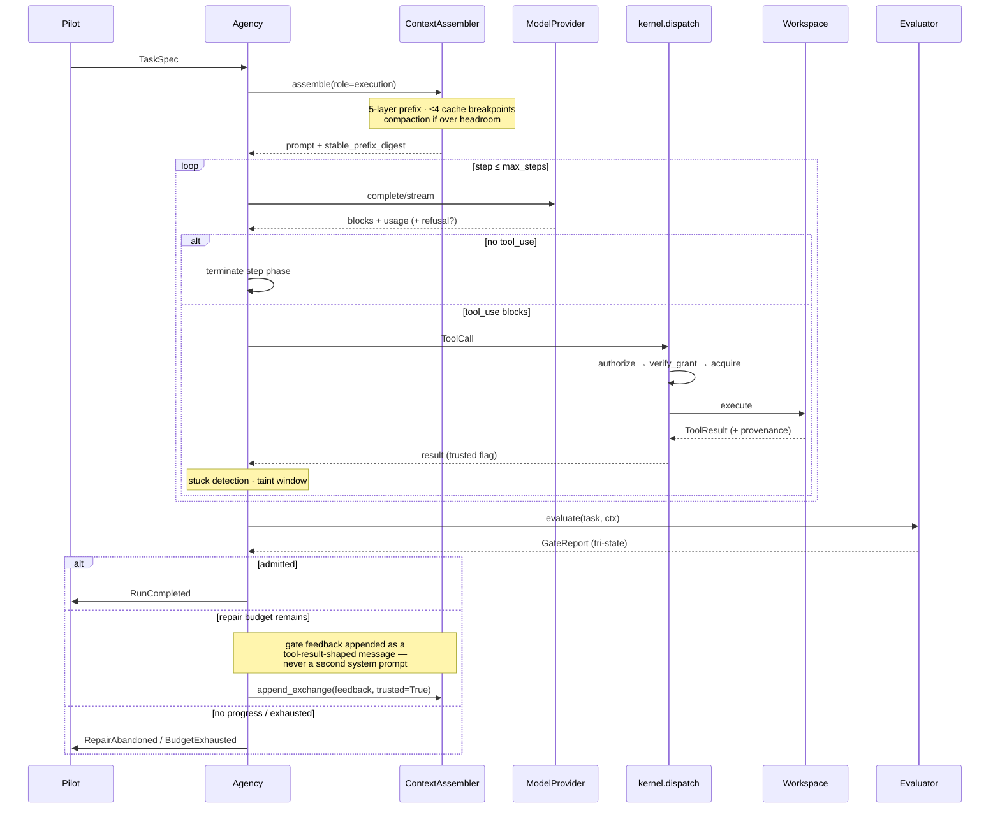

# AETHER v3.0.0 — Architecture Blueprint

> [!NOTE]
> **LLM / AI AGENT NOTICE**: This file is Phase-0 rationale for the AETHER rewrite. It is not
> binding and defines no contract. **Contracts live in `src/aether/ports/` and
> `src/aether/domain/`** — a `Protocol` or `BaseModel` defined in a `.md` file is a bug. This
> document navigates; it never defines.

Answers RFP [§5.4](../reviews/review_project_rewrite_v300.md).

---

## 1. The nine invariants

Each has a **mechanical enforcement**, because an invariant enforced only by discipline is a wish.

| # | Invariant | Enforcement |
| :--- | :--- | :--- |
| **I1** | **Pure domain.** Core logic imports no DB driver, no filesystem, no HTTP client | import-linter `domain-is-pure` |
| **I2** | **Typed ports.** All I/O crosses a `Protocol` boundary | pyright strict, zero errors |
| **I3** | **Wire-serializable ports.** Every method `async`; only serializable payloads; no file handles, callables, generators, or live objects | Reflection contract over all ports |
| **I4** | **Adapter substitutability.** Every adapter passes the *same* parametrized conformance suite | One suite, N adapters, in CI |
| **I5** | **Single dispatch choke point.** All effects through one call site; grants verified at the point of effect | Architecture test: no bypass path |
| **I6** | **Frozen extension resolution.** Entry points resolved once at composition, then frozen | Composition test; runtime registration raises |
| **I7** | **Generator ≠ Evaluator.** The agent that writes code cannot modify the tests grading it | `tests_unmodified` hard gate |
| **I8** | **Immutable TCB.** Policy, evaluator, gates, benchmarks, CI unmodifiable by agent or meta-loop | import-linter + CI `tcb-check` |
| **I9** | **Hard gates admit; proxies rank.** A learned scorer may order candidates, never admit one | Type-level `rank()` / `admit()` separation |

**I3 is the one that saves the project.** Wire-serializability lets any port move out of
process — to a Rust sidecar, a container, a remote peer — *without changing a single caller*. It is
nearly free on day one and impossible to retrofit, and it is what makes
[the monoglot decision](./rewrite_v300_decisoes_runtime.md) reversible per component instead of
all-or-nothing.

**Schemas are provisionally frozen in Phase 0 and ratified after the walking skeleton round-trips
them.** Schemas written before any code exercises them are wrong in ways only a running system
reveals. One ratification window, then the freeze is real and breaking changes require a version bump.
That is the difference between a contract and a guess with type annotations.

---

## 2. Layer model

Five strata. Dependencies point downward only; import-linter enforces the ordering.



**Why the kernel is a separate stratum.** Dispatch plus grant verification is the whole security
argument. Isolating it as mechanism-only means the meta-loop can rewrite the agency layer freely — the
prompts, the routing, the skills — without ever being able to weaken the thing that authorizes
effects. The TCB is defined by *exclusion from the mutable surface*, and this layer boundary is what
makes that definition mechanical.

---

## 3. Port catalog

Definitions live in `src/aether/ports/`. This table navigates.

### 3.1 Core — present at the walking skeleton

| Port | Responsibility | First adapter |
| :--- | :--- | :--- |
| `ModelProvider` | `complete()` and `stream()`; typed usage; typed refusal outcome | Anthropic native (cache breakpoints, thinking, effort); cassette replay |
| `Workspace` | Read, write, apply edit, run command, checkpoint, restore | Local; container sandbox |
| `WorktreeManager` | Allocate, materialize, release per-candidate worktrees | Git worktree |
| `ToolRegistry` | Register, dispatch, effect class, provenance stamping | Default; cassette |
| `PolicyEngine` | `authorize` → `grant_id`; `verify_grant`; `record_outcome` | Default — **TCB** |
| `ResourceGovernor` | Leases, budget, wall-clock | Default |
| `TrajectoryStore` | Append step / event; run records; resume | SQLite |
| `Evaluator` | `evaluate(task, ctx) → GateReport` (tri-state) | Gate evaluator — **TCB** |
| `Indexer` | `find_symbols`, `get_skeleton`, `search` | FTS5 + tree-sitter chunking |

Nine entries for eight boundaries — `Workspace` and `WorktreeManager` are separate protocols on one
concern.

### 3.2 Growth — added **with** their first adapter (A-010)

`CodeGraph` (impact analysis) · `Memory` (bi-temporal LTM) · `Toolchain` (test, typecheck, lint,
coverage) · `CandidateSearch` (BoN + judge) · `LSPAdapter` (diagnostics) · `Advisory` (learned
scoring, `research`).

**Not ports:** `Orchestrator` (the engine API *is* the boundary — SAGIHA's version was never called);
short-term memory (loop-local state); `MetaImprover` (an offline pipeline, not a runtime boundary);
`e0`/measurement (a tool, ADR-0024).

### 3.3 Port rules

Every method `async`. No `Path`, file handle, callable, generator, or live object crosses a boundary.
No untyped `dict[str, Any]`. All datetimes timezone-aware. **No `Grant` in any public signature** —
`PolicyEngine` returns a `grant_id` and nothing else. All of these are asserted **generically across
every port by reflection**, so the contract covers the port added next month, not just today's.

---

## 4. The execution loop



Four properties this diagram encodes, each of which the predecessor got wrong at some point:

1. **The gate is inside the loop.** `planning_final_sprint_rev2.md` §1 documents the pre-S7f state:
   the gate ran once after the loop exited and its verdict was shown to nobody. That single missing
   edge is the largest score lever in the tree.
2. **Feedback re-enters as a tool-result-shaped message.** A second system prompt forks the stable
   prefix and destroys the cache hit rate.
3. **Every effect passes through `kernel.dispatch`.** There is no second path.
4. **Termination is explicit** — progress signature, stuck detection, budget park — not a step cap
   alone.

### System 1 → System 2 escalation

S1 is the ReAct loop above. S2 is Best-of-N across isolated worktrees with verifier-guided selection
plus sequential repair. The escalation ladder is
`rehydrate → replan → escalate (S1→S2) → checkpoint + abort`, each rung consuming budget, each rung an
ablation target.

**BoN fan-out is cache-sequenced**: one request, await its first streamed token, then fire the
remaining N−1 — see [context & cache §1.4](./rewrite_v300_contexto_memoria.md). Naive parallel fan-out
turns N−1 cache reads into N−1 cache writes, a ~12× cost difference on the shared prefix.

---

## 5. Context assembly

```
┌─ tools               frozen for the run; deterministic serialization  ─ breakpoint 1
├─ system prompt       frozen; no dates, no run ids, no task text       ─ breakpoint 2
├─ memory / skills     resolved at composition; frozen for the run
├─ static repo context repo map + retrieval seed; construction-time only ─ breakpoint 3
└─ dynamic turns       append-only; exchanges, tool results, gate feedback ─ breakpoint 4, rolling
```

`stable_prefix_digest` is recorded on every `TrajectoryStep`, which makes a cache-stability regression
detectable after the fact rather than only in the invoice. Intermediate breakpoints go in at least
every ~15 blocks within long turns, because a breakpoint searches back at most 20 content blocks and a
tool-heavy step overruns that window silently. Full mechanics in
[context & cache](./rewrite_v300_contexto_memoria.md).

---

## 6. Workflow DAG

Agent logic as a serializable, parametric graph — ComfyUI's model applied to agent cognition.
ADR-0018, extended.

| Element | Definition |
| :--- | :--- |
| Node | `WorkflowStep[In, Out]` with typed sockets |
| Graph | Serialized to config; re-ordered, swapped, or parameterized with zero kernel changes |
| **Memoization** | Per-node output cached, **keyed by input digest** |
| Partial re-execution | Changing one node re-runs only that node and its descendants |

The memoization key is what makes ablation cheap: flipping one mechanism re-runs its subtree, not the
pipeline. Given that the project's core discipline is "no mechanism ships without an ablation", the
cost of an ablation is a first-order design concern — and this is the mechanism that pays it down.

**The graph is the execution structure; the event stream (§7) is the observation structure.** They are
deliberately separate. Nodes emit events as they run; events never drive node scheduling. Collapsing
the two produces a system where adding observability changes behaviour, which is the failure mode
every event-driven orchestrator eventually finds.

No reference in the study set implements this for agent cognition. It is original to AETHER, which
also means it carries more risk than the ported components — and is why
[A-024](./rewrite_v300_decisoes_adr.md) moves it *forward* rather than back: node types in M0, a
four-node linear graph running the walking skeleton in M1a, memoization in M2 when ablations become
routine, branching in M3. A linear pipeline is a DAG with no branches, so the abstraction is exercised
from the first working run at almost no cost, and nothing downstream accumulates a straight-line
assumption.

---

## 7. Event stream

One typed, append-only stream is the system's only observable surface — persisted to the trajectory
store, served to pilots over WS+JSON, and mined offline for failure taxonomy. Every pilot is a
consumer; none has a privileged path.

| Family | Events |
| :--- | :--- |
| Run | `RunStarted` · `RunCompleted` · `RunFailed` · `BudgetExhausted` |
| Step | `StepStarted` · `StepCompleted` · `CompactionApplied` |
| Model | `ModelCallStarted` · `ModelCallCompleted` · `ProviderFailover` · `ModelRefused` |
| Tool | `ToolCallRequested` · `ToolCallAuthorized` · `ToolCallDenied` · `ToolCallCompleted` |
| Gate | `GateEvaluated` · `RepairAttemptStarted` · `RepairAbandoned` |
| Cache | `CacheStatsRecorded` (hit rate, write/read tokens) |

The catalog is **generated from code and CI-checked for drift** (`gen_event_catalog.py --check`) —
the documentation of the event surface cannot silently diverge from the surface.

Two additions over SAGIHA: `ModelRefused` (a refusal is a typed outcome, not a crash) and
`CacheStatsRecorded` (cache economics is a first-class metric with a CI floor).

---

## 8. Package layout

```
src/aether/
├── domain/        pure models — zero I/O (I1)
├── ports/         Protocols — zero internal deps (I2, I3)
├── kernel/        dispatch · policy · governor · bus — TCB (I5, I8)
├── agency/        step_executor · repair_supervisor · escalation
├── context/       assembler · compactor · cache breakpoints · tokens
├── adapters/      model · workspace · tools · trajectory · retrieval · sandbox · search
├── measurement/   evaluator (TCB) · statistics · runner · harvester · export
├── workflow/       WorkflowStep DAG · memoization
├── engine.py      headless API — the surface every pilot consumes
└── composition.py explicit wiring; no DI container (ADR-0004)
```

Import-linter contracts: layer ordering `agency > kernel > adapters > ports > domain`; `domain-is-pure`;
`ports-are-pure`; `tcb-isolation` (kernel/policy and measurement/evaluator may not import agency or
adapters — the TCB cannot reach *up* into what it judges).

---

## 8b. Revision-A amendments from the competitor and literature review

Proposals, with cost and phase stated. None is adopted; several would become ADRs if the review takes
them. Sources: the four teardowns in
[`docs/competitors_research/tech_lead_A/`](../../competitors_research/tech_lead_A/rewrite_v300_synthesis_amendments.md)
and the 2026 harness literature verified in
[measurement §1c](./rewrite_v300_measurement_strategy.md).

### 8b.1 A tri-layer reading of the layer model, and three invariants it implies

The five strata in §2 are an *ownership* decomposition — who may mutate what. A second, orthogonal
reading groups them by **what fails when the process dies**:

```
   BRAIN            reasoning; stateless between calls; reconstructible from the log
   ──────────────   ModelProvider · ContextAssembler · Compactor
   HANDS            effects on the world; NOT reconstructible; must be idempotent or checkpointed
   ──────────────   dispatch · ToolRegistry · Workspace · WorktreeManager · Sandbox
   SESSION LOG      the only durable truth; everything above is derived from it
   ──────────────   TrajectoryStore (SQLite WAL) · EventBus · FrozenRunState
```

**This is offered as an AETHER proposal, not as a citation.** The verified arXiv paper 2605.18747 is
*Code as Agent Harness* and does not define this decomposition; attributing it there would be wrong
(see [measurement §1c.2](./rewrite_v300_measurement_strategy.md)).

What it buys is a **placement test** for every future component: *if the process dies here, is this
state recoverable from the log?* Brain state must be; Hands state must be checkpointed or idempotent;
anything else belongs in the log. That test is what makes T5 (≥8h, resumable across process death) a
property of the architecture rather than a feature someone remembers to implement.

Three invariants follow, proposed as siblings to I1–I9 rather than replacements:

| # | Invariant | Mechanical enforcement |
| :--- | :--- | :--- |
| **I10 · Parity** | The transcript is always a well-formed `user → assistant → tool_use → tool_result` alternation. No compaction, rewind, fork or halt splits a `tool_use`/`tool_result` pair | `assert_parity()` in the assembler and the replay path; property test over the compactor |
| **I11 · Receptivity** | Every terminal or degraded state names the event that would clear it. A run is never merely "stuck" — it is paused *for a reason*, and the reason implies who or what unblocks it | `RunOutcome` is a closed sum type (§8b.2); each variant declares a `clears_on` |
| **I12 · Observability** | Every state transition emits exactly one typed event before the state changes. The event stream is sufficient to reconstruct the run without reading the code | Event-catalog drift check, already in CI; extended to assert one event per transition |

I11 is the one with no current equivalent, and it comes from a real failure taxonomy: Grok Build's
compaction-suppression states are distinguished not by *cause* but by *what would make retrying
sensible* — self-heals next turn · needs the context budget to change · needs a successful call ·
needs re-auth (**and specifically not a successful call, because waiting for one deadlocks when
context is already over the window**). That last row is a production bug, not a review finding.

### 8b.2 Domain types proposed for the M0 freeze

All three are near-free before the schema freeze and breaking changes afterwards.

**`RunOutcome` — a closed sum type.** Five pause reasons already exist across this document set and
none of them share a type: the disposition ladder's rungs, the API taxonomy's `abort`, the `ask`
permission state, `BudgetExhausted`, and `RepairAbandoned(no_progress)`.

```
RunOutcome = Completed
           | Paused { kind: PauseKind, message, clears_on }
           | BudgetLimited
           | MaxTurnsReached          ← not a failure; the cap did its job
           | Cancelled
           | Failed { classified_error }

PauseKind  = User | BackOff | NoProgress | Verification | Infra | Blocked
```

`MaxTurnsReached` as a distinct variant is the small piece that matters: hitting a cap and failing a
task are different outcomes, and collapsing them makes every budget number noisier.

**`replayed: bool` on effect-carrying events.** T8 determinism is about *model calls*. A resumed run
replays its journal, and every non-model effect in that replay fires twice — duplicate telemetry,
duplicate notifications, duplicate scratch writes. The flag lets each consumer decide, and it forces
the useful question: *which of our effects are idempotent?* We have not enumerated that.

**Fail-closed drive state.** An unknown or forward-version persisted status must deserialize to
*paused*, never *active*. We already re-mint grants rather than restoring them
([security §1.2](./rewrite_v300_seguranca_sandbox.md)); this applies the same posture to the run's own
**autonomy**, and it is one enum plus one deserializer. A corrupt or newer snapshot must never resurrect
as a self-driving run burning tokens unattended.

### 8b.3 Port catalog amendments

| Port | Proposed change | Phase |
| :--- | :--- | :--- |
| `ResourceGovernor` | `reserve` / `commit` / `release` alongside the existing lease. Today spend is recorded *after the fact*, so under Best-of-N all N candidates check `remaining > 0`, all pass, all spend — a race bounded by N, which is exactly the knob M4 increases | M1a |
| `ResourceGovernor` | Turn cap **keyed to task class** (retrieval ~5 · multi-step coding ~20–30 · extended autonomous ~50), and the **tree total** recorded in the manifest — per-child budgets do not compose into a global cap | M1a |
| `Workspace` | Checkpoint as a **composite of independently-enabled domains** with atomic restore, not a bare git ref. The moment an index, a memory store or a scratch dir joins run state, a git-only checkpoint silently stops being a complete rollback | M0 type, M2 build |
| `WorktreeManager` | CoW-capable adapter where the filesystem supports reflinks, plus an optional pre-warmed pool. **The port signature does not change** — this is entirely an adapter concern, which is the point in its favour | M2, gated on §8b.4 |
| `ToolRegistry` | Tool descriptors carry a `contract_version`; a registry maps tool → supported versions with lifecycle. Without it, a paired lift measurement does not hold the tool contract constant | M0 |
| `ToolRegistry` | Capability mode for sub-agents derived from a **declared property of the tool**, not enumerated per role — adding a tool then cannot silently widen a sub-agent's authority | M3 |
| *new* | `VerificationLedger` — see [edit mechanism §1.5](./rewrite_v300_mecanismo_edicao.md). **Open question:** a port, a `TrajectoryStore` table, or an `Evaluator` internal. [A-010](./rewrite_v300_decisoes_adr.md)'s entry rule argues against making it a port on principle alone | M2 |

### 8b.4 Worktree materialization — instrument before building

Best-of-N creates N worktrees per task, per benchmark run. On a large repository a plain
`git worktree add` is a full checkout. The proposed ladder, cheapest first:

| Tier | Mechanism | Claimed cost |
| :--- | :--- | :--- |
| 0 | `git worktree add` | seconds to tens of seconds on a large repo |
| 1 | `git worktree add --no-checkout` + parallel CoW file clone (reflink) | — |
| 2 | Btrfs / OverlayFS snapshot | claimed **O(1)**, <10 ms |
| 3 | Pre-warmed pool, materialized ahead of the fan-out | claimed **0 ms** at allocation |

**The `<10 ms` and `0 ms` figures are not our measurements** and are recorded as targets with a named
benchmark (measurement §1c.2). The proposal for now is narrower and cheaper: **put a timer on worktree
creation in M1a** — one instrument on an existing operation — so that by M2 we know whether any of this
is worth building. Grok Build's own pool module carries a revealing note: it is macOS-only in
production, because *"Linux has O(1) BTRFS snapshots; the pool adds value only on macOS/APFS where
worktree creation is O(file_count)."* Whether we are in the O(1) case or the O(n) case is a property of
our filesystem, and we do not currently know which.

Two related storage decisions worth taking at M0, since both are painful to migrate:

- **One content-addressed checkpoint store across all worktrees.** Hermes shipped a per-worktree shadow
  git repo and documented the result — *"a dozen worktrees of the same repo burned ~40 MB each
  (~500 MB total) storing the same blobs over and over"* — then migrated to a single shared store with
  per-project refs so git's object DB deduplicates. **Our benchmark harness creates many worktrees of
  the same upstream repository at higher multiplicity than any user ever would.** This is the
  pathological case.
- **Filesystem-aware SQLite journal mode.** WAL relies on an mmap'd `-shm` file and coherent POSIX
  locks; on NFS it breaks. Our `TrajectoryStore` is SQLite, and an NFS-mounted home is common in
  university and enterprise environments. A probe selecting journal mode is low effort, low
  probability, high embarrassment.

### 8b.5 Observability: OpenTelemetry as the export format

§7's typed event stream stays the system's observable surface — that decision is not being reopened.
The proposal is an **export adapter**, not a replacement:

- Events map to OTel spans; the `run_id` is the trace id; each step is a span; tool calls are child
  spans carrying effect class and grant outcome.
- Exported over OTLP/HTTP to whatever the operator runs (Jaeger, Zipkin, a collector). **No vendor SDK
  in the core** — one adapter behind the existing bus, consistent with A-007(e).
- The benefit that is not merely operational: an 8-hour unattended run is *unreadable* as a flat event
  log, and span nesting is what makes "where did the four hours go" answerable.

Companion rule, cheap and easy to miss: **every enum that reaches telemetry declares a stable wire
string, pinned by a test.** Renaming a Python enum member must not break a dashboard. Grok Build states
this inline on the enums that matter (*"these are stable telemetry keys — don't rename the strings"*),
and our generated event catalog is the natural place to enforce it.

### 8b.6 A PTY-backed terminal adapter

`Workspace.run_command` currently assumes a batch subprocess. Several real cases are not batch:
interactive prompts, tools that detect a TTY and change output, long-running processes that must be
observed rather than awaited, and REPLs.

Proposal: a **PTY-backed execution adapter behind the existing `Workspace` port** — no signature change
— providing non-blocking streamed output, TTY detection for tools that behave differently under one,
and a documented process-scope discipline. Grok Build's lint file bans raw `Command::spawn` outright,
with the reason stated: *"an unenrolled child outlives the session that started it."* The equivalent
for us is that every spawned process is enrolled in a scope that dies with the run — which matters far
more for an 8-hour unattended target than for an interactive session.

**Grade B, M3.** It is not on the path to a benchmark number; it is on the path to not leaking
processes across an overnight run.

### 8b.7 A structural guard the references suggest we will need

Grok Build's core crate is 372,000 lines; Hermes' gateway file is 26,877 lines. Both teams have strong,
documented discipline, and both arrived at an unfactored core anyway — the leaf boundaries were drawn
where a *second owner* appeared, and where none did, the module grew without bound.

That pattern suggests a mechanical limit rather than an enforced one. Our `docs_budget.py` ratchet is
the existing precedent in this repository: **a CI ceiling on single-module line count**, cheap to add
at M0 and impossible to retrofit at M4.

---

## 8c. Track B cross-check — a file-level layout, and two forks

Track B's blueprint (`docs/rationale/rewrite_b/rewrite_v300_blueprint_arquitetura_B.md`) specifies the
package down to individual files. §8 above stops at the directory, which is the weaker artifact for
anyone about to open an editor. **Suggested: adopt the granularity.**

### 8c.1 A file-level layout, reconciled with this document's invariants

Track B's tree with the parts that conflict with A-010 (eight ports, adapter-first) and F1 (the Rust
fork) marked rather than silently dropped. Nothing here is frozen; it is a starting shape.

```
src/aether/
├── domain/                     pure models — zero I/O (I1)
│   ├── config.py               composition-time configuration schemas
│   ├── content.py              message and content-block models
│   ├── control.py              RunOutcome · PauseKind · control signals   ← A-026
│   ├── events.py               the typed event catalog
│   ├── trajectory.py           run, step and gate records
│   └── upcasters.py            FrozenRunState schema migration            ← from Track B, §8c.2
├── ports/                      Protocols — async, wire-serializable (I2, I3)
│   ├── model.py · workspace.py · worktree.py · tool_registry.py
│   ├── policy.py · governor.py · trajectory.py · evaluator.py · indexer.py
│   └── (code_graph · memory · toolchain · search · lsp · advisory — arrive WITH their
│        first adapter, per A-010. Track B declares 12 up front; see F5)
├── kernel/                     TCB (I5, I8)
│   ├── dispatch.py             the single choke point
│   ├── bus.py                  event bus + OTel export adapter            ← A-034
│   ├── governor.py             leases · reserve/commit/release · budgets  ← A-030
│   └── policy/
│       ├── engine.py           CAR authorization register
│       └── effects.py          per-invocation effect classification
├── agency/                     the loop — mutable by the meta-loop
│   ├── run_loop.py             step executor; in-loop repair
│   ├── repair.py               disposition ladder · progress signature
│   ├── verification/           stop detector · evidence ledger · cascade  ← A-029
│   ├── search.py               Best-of-N, cache-sequenced fan-out
│   ├── freeze.py               FrozenRunState — atomic write + sidecar
│   ├── profile.py              RunProfile — resolved once, immutable      ← A-031
│   ├── codemode.py             programmatic tool orchestration
│   ├── conductor.py            (Phase 4 — ports and domain only)
│   └── context/
│       ├── assembler.py        5-layer prefix · ≤4 breakpoints
│       ├── compactor.py        exchange-granular · prefire two-pass       ← A-033
│       ├── tokens.py           THE token estimator — one source of truth
│       └── taint_gate.py       deterministic provenance rules
├── adapters/                   behind ports
│   ├── model/ · workspace/ · worktree/ · tools/ · trajectory/
│   ├── indexer/ · sandbox/ · search/ · telemetry/
│   └── (code_graph/ · memory/ — with their ports)
├── measurement/                TCB
│   ├── evaluator.py · gates/ · statistics.py · runner.py · harvester.py
├── workflow/                   WorkflowStep DAG · memoization (A-024)
├── evolution/                  offline only — never imported by agency/    ← M5
│   ├── optimizer.py · trace_miner.py · exporter.py
├── tui/
│   ├── app.py · view_model.py
│   └── components/             diff pane · hunk inspector · run state      ← from Track B
├── engine.py                   headless API — the surface every pilot uses
└── composition.py              explicit wiring; no DI container (ADR-0004)
```

**What is deliberately not in this tree, and why.** Track B places a `core_rs/` sibling with eight
Rust modules (`ast_treesitter`, `fast_indexer`, `fast_worktree_cow`, `hunk_tracker`, `seek_sequence`,
`exec_policy_ast`, `pty_harness`, `prompt_queue`). That is **fork F1** and it is not settled here. If
the review takes Track B's side, the tree gains `core_rs/` and each of those eight becomes an adapter
implementation behind a port that already exists — which is the property that makes the fork
reversible in either direction, and the reason I3 matters more than the fork does.

### 8c.2 Three things from Track B's tree worth taking regardless of F1

**`domain/upcasters.py` — schema migration for `FrozenRunState`.** This is the best single idea in
Track B's layout and Track A does not have it. A frozen run is serialized state that must survive a
harness upgrade; T5 (≥8h unattended, resumable across process death) implicitly requires that a run
frozen by version *N* thaws under version *N+1*. Without a versioned upcaster chain the only options
are "refuse to thaw" or "thaw wrong", and both are discovered in production. Pairs directly with the
fail-closed drive-state rule in §8b.2 — an unmigratable snapshot restores as *paused*, never *active*.

**A `verification/` sub-package rather than a method on the evaluator.** Track B separates
`architect.py` / `editor.py` / `codemode.py` as peers in `agency/`. The same instinct applied to the
completion cascade (A-029) gives the stop detector, the evidence ledger and the panel their own
module, which is what makes each independently testable.

**`prompt_queue` — combining in-flight turns.** Track B lists a queue that merges user input arriving
while a turn is running, rather than serializing or dropping it. Not on our roadmap, cheap, and it is
a real interaction-quality item for a long-running TUI. Recorded in
[UI §4b](./rewrite_v300_uiux_tui.md).

### 8c.3 Fork F5 — eight ports or twelve

| | **Track A** | **Track B** |
| :--- | :--- | :--- |
| Count at M0 / Sprint 0 | 8 | 12 |
| Entry rule | A port arrives in the same change as its first adapter and conformance test | Declared up front |
| Rationale | SAGIHA declared 17 and five had zero adapters; an interface designed against an imagined adapter is a guess with type annotations | A complete contract surface lets the team parallelize against stubs |

**The argument for B's side, stated fairly:** twelve declared ports let several people build against a
frozen surface simultaneously, which is exactly what a five-sprint calendar needs. **The argument
against:** Track B's own audit identifies five adapterless SAGIHA ports and invokes *"código sem
adaptador não paga aluguel"* to delete one of them — then declares `code_graph`, `memory`, `search`
and `indexer` with no adapter-first rule.

A middle position neither track took: declare all twelve **signatures** as a design artifact in the
document, and admit into `ports/` only those with an adapter — so the parallelization benefit is
captured without the rent problem.

### 8c.4 Fork F11 — LSP

Track B proposes eliminating LSP entirely and replacing it with tree-sitter in Rust, on the grounds of
instability and cost. Track A keeps `LSPAdapter` at `growth` tier behind a warm server pool.

They answer different questions and the substitution is not clean: tree-sitter gives **syntax** —
skeletons, symbol positions, parse validity — and an LSP gives **semantics**: type errors, resolved
references across compilation units, diagnostics from the project's real toolchain. Our T2
verification tier is defined in terms of exactly that second category. Track B's position is
defensible if the T2 tier is dropped or served by invoking the project's own linters and type-checkers
directly, which is cheaper and less stateful than an LSP session — and that may well be the better
answer. Worth deciding explicitly rather than by omission.

---

## 9. What is deliberately absent from v1

| Absent | Returns |
| :--- | :--- |
| `Orchestrator` port | Never. The engine API is the boundary |
| Graph **memoization** and **branching** | M2 and M3 respectively. The node types and a linear four-node graph are present from M0/M1a — see [A-024](./rewrite_v300_decisoes_adr.md) |
| Dense retrieval | ADR-0014 recall@10 trigger |
| Learned scorer / `Advisory` | Labeled corpus beats rank-by-tests-passed |
| MCP | `growth`, with its first real adapter |
| LSP diagnostics | `growth`, with a warm server pool |
| Conductor (System 3) | Phase 4, after L1–L3 are measured |
| Multi-language sidecars | RT-1 / RT-2 / RT-3 |

Each row is a capability with a **trigger**, not a capability that was forgotten. SAGIHA's failure
mode was declaring five ports with zero adapters and an empty `aoi/` package listed in planning
documents as a capability; the discipline here is that a thing not yet built says so.
