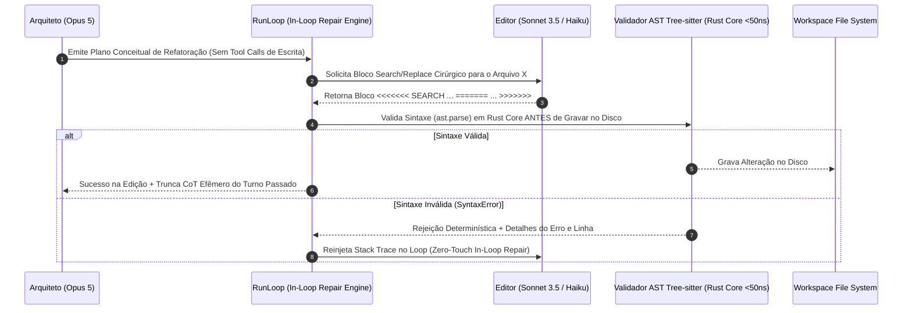

# REGISTRO DE DECISÕES DE ARQUITETURA (ADRs): MECANISMOS NÚCLEO DO AETHER v300B
## Análise Aprofundada dos 15 Domínios Técnicos, Sugestões da Track A & Tabela de Debates PhD

> **Autor:** Tech Lead B (PhD) / Principal Software Architect  
> **Data:** 05 de Agosto de 2026  
> **Target Document:** `docs/rationale/rewrite_b/rewrite_v300_decisoes_adr_B.md`  
> **Fontes Primárias:** Competitor Research (`docs/competitors_research/tech_lead_B/`) & Track A Rationale (`docs/rationale/rewrite/`).  
> **Status:** Concluído / Em Conformidade Estrita com a REVISÃO B.

---

## ESTRUTURA DOS REGISTROS DE DECISÃO DE ARQUITETURA (ADRs)

Este documento compila os Registros de Decisão de Arquitetura (ADRs) essenciais para o **AETHER v3.0.0B** (`src/aether/`), integrando os 15 domínios técnicos da REVISÃO B com as valiosas sugestões e invariantes propostos pela **Track A** (Tech Lead A).

---

## PARTE I — ADRs NÚCLEO DA REVISÃO B

### ADR-01: ARCHITECT/EDITOR SPLIT, VALIDAÇÃO SINTÁTICA DE AST EM RUST E TRUNCAÇÃO DE CoT EFÊMERO (Domínios 1, 11)



* **Mecanismos Propostos:**
  1. **Architect/Editor Split (`agency/architect.py` e `editor.py`):** Modelo Arquiteto (Opus 5) dedica-se ao raciocínio conceitual. Modelo Editor (Sonnet/Haiku) gera os diffs cirúrgicos.
  2. **Pré-Validação Sintática AST em Rust (`core_rs/ast_treesitter.rs`):** O bloco Search/Replace é submetido ao parser Tree-sitter em Rust (<50ns). Se houver `SyntaxError`, o disco permanece intocado e o erro é retornado no loop.
  3. **Truncação de CoT Efêmero (`agency/context/compactor.py`):** Retém apenas as chamadas de ferramentas e resultados (*observations*), descartando o CoT verboso de turnos passados.

---

### ADR-02: GESTÃO DE CONTEXTO, COMPACTAÇÃO GRANULAR POR TROCA E PREVENÇÃO DA "DUMB ZONE" (Domínio 2)

```mermaid
graph TD
    subgraph CONTEXT PAYLOAD ESTRUTURADO NO AETHER (>92% CACHE HIT RATE)
        M1[Marker 1: System Identity & Base Rules] --> M2[Marker 2: Tool Definitions / Dynamic Search]
        M2 --> M3[Marker 3: AST Skeleton Map do Repositório]
        M3 --> Dynamic[Dynamic Conversation History - User/Assistant Exchanges]
    end

    Compactor[Exchange-Granular Compactor] -->|Remove Trocas Inteiras Antigas| Dynamic
    Compactor -->|Preserva Paridade: User -> Assistant -> Tool -> Result| Dynamic
```

* **Mecanismos Propostos:**
  1. **Exchange-Granular Compactor (`agency/context/compactor.py`):** Remove estritamente trocas completas (*user -> assistant -> tool_use -> tool_result*), garantindo a paridade da API.
  2. **Prompt Cache Alignment (>92% Hit Rate):** Payload organizado em 3 marcadores de cache fixos.
  3. **Curadoria Determinística de Regras (`AGENTS.md`):** Evita dumps automáticos genéricos que inflam contexto em 23% e reduzem a precisão em 3% (arXiv 2602.11988).

---

### ADR-03: SEGURANÇA CONTRA A TRIFETA LETAL, TAINTGATE E EXECPOLICY SHELL AST (Domínios 6, 14)

* **Mecanismos Propostos:**
  1. **Taint Tagging (`UNTRUSTED_TAINTED`):** Conteúdo vindo da web ou de terceiros é etiquetado. Ferramentas sensíveis (`git push`, execução shell arbitrária) são bloqueadas ou exigem confirmação humana se alimentadas com dados manchados.
  2. **Declarative ExecPolicy Shell AST (`core_rs/exec_policy_ast.rs`):** O comando shell é analisado via parser AST em Rust antes da execução no terminal, eliminando bypasses por expressões regulares (regex).

---

### ADR-04: AUTONOMIA LONG-HORIZON, CONDUCTOR SYSTEM 3 E HIBERNAÇÃO DURÁVEL `FrozenRunState` (Domínios 7, 9, 2)

* **Mecanismos Propostos:**
  1. **`FrozenRunState` (`agency/freeze.py`):** Serialização atômica do estado do agente em banco SQLite WAL, permitindo pausar e retomar execuções duravelmente a qualquer momento.
  2. **Memória de 3 Trilhas & Auto Dream MMR Reranking:** Memória episódica em SQLite WAL, memória semântica em `MEMORY.md`, e memória procedural em `SKILL.md`. Consolidação em background utilizando a fórmula de Relevância Marginal Máxima (MMR, $\lambda=0.7$):
$$\text{MMR} = \arg\max_{D_i \in R \setminus S} \left[ \lambda \cdot \text{Sim}_1(D_i, Q) - (1 - \lambda) \max_{D_j \in S} \text{Sim}_2(D_i, D_j) \right]$$

---

### ADR-05: MOTOR DE AUTO-EVOLUÇÃO REFLEXIVA (GEPA & SESSION TRACE MINING) (Domínio 8)

* **Mecanismos Propostos:**
  1. **Zero-GPU Text Mutation (`evolution/gepa_evolver.py`):** Prompts, instruções e habilidades (`SKILL.md`) são otimizados via feedback reflexivo dos logs de erro usando DSPy e MIPROv2, sem retreinamento de pesos em GPUs.
  2. **Dataset Exporter (`evolution/dataset_exporter.py`):** Exportação automatizada de trajetórias de produção nos formatos JSONL para Supervised Fine-Tuning (SFT) e Direct Preference Optimization (DPO).

---

### ADR-06: ACTOR HUNK TRACKING POR AUTORIA E BUSCA APROXIMADA FUZZY (Domínio 12)

* **Mecanismos Propostos:**
  1. **Actor Hunk Tracking por Autoria (`core_rs/hunk_tracker.rs`):** Gerencia alterações por bloco (*hunks*), atribuindo autoria (`AuthorType::Agent` vs `AuthorType::ExternalUser`) via ator Tokio em Rust. Permite reversão atômica por autor.
  2. **Fuzzy Sequence Seeking (`seek_sequence.rs`):** Calcula a nova posição exata de um hunk quando ocorre deslocamento de linhas por edições externas.

---

### ADR-07: WORKTREES COPY-ON-WRITE & PTY PSEUDO-TERMINAL HARNESS (Domínio 13, 15)

* **Mecanismos Propostos:**
  1. **Worktrees CoW (<10ms):** Montagens OverlayFS e Btrfs `reflink` copies criando workspaces em menos de 10 milissegundos.
  2. **PTY Pseudo-Terminal Harness (`core_rs/pty_harness.rs`):** Spawna comandos dentro de um par PTY master/slave real em Rust, permitindo a execução não-bloqueante de ferramentas CLI interativas sem travamentos em `stdin`.

---

### ADR-08: POOL DE CONTAINERS PRÉ-AQUECIDOS & EXECUÇÃO CODEMODE PROGRAMÁTICA (Domínios 4, 13)

* **Mecanismos Propostos:**
  1. **Pre-Warmed Container Pool (`adapters/sandbox/`):** Pool de containers mantido aquecido em background, reduzindo o tempo de alocação de subagentes para **0 ms de espera**.
  2. **Codemode Local Tool Execution (`agency/codemode.py`):** A LLM gera um script conciso em Python executando múltiplas chamadas de ferramentas em loop local em uma única requisição à API.

---

### ADR-09: METROLOGIA, VALIDAÇÃO EMPÍRICA & ADMISSÃO POR ABLAÇÃO ESTATÍSTICA (Domínio 10)

* **Mecanismos Propostos:**
  1. **Ablação Estatística Comprovada ($p < 0.05$):** Exige no mínimo 50 instâncias de teste com aumento estatisticamente significante na taxa de sucesso antes de promover qualquer funcionalidade ou prompt para a branch principal.

---

## PARTE II — SUGESTÕES DE ADRS INCORPORADAS DA TRACK A

### ADR-10 (SUGESTÃO TRACK A): WORKFLOW STEP DAG E MEMOIZAÇÃO POR INPUT DIGEST (A-024)
* **Decisão:** Modelar os passos de cognição do agente como um grafo acíclico dirigido (`workflow/`) composto por nós `WorkflowStep[In, Out]` com **memoização de saída chaveada pelo digest das entradas**.
* **Impacto:** Torna as baterias de ablação extremamente baratas: ao alterar um único nó do pipeline, apenas esse nó e seus descendentes são executados, economizando chamadas de API.

---

### ADR-11 (SUGESTÃO TRACK A): SELEÇÃO DE CACHE E SEQUENCIAMENTO DE BEST-OF-N (A-012)
* **Decisão:** Em chamadas Best-of-N paralelas, a primeira requisição é iniciada e o sistema aguarda a recepção do seu primeiro token antes de disparar as N-1 requisições restantes.
* **Impacto:** Evita que N requisições simultâneas convertam N-1 leituras de cache em N-1 gravações de cache na Anthropic, reduzindo o custo de execução do Best-of-N em até 12x no prefixo compartilhado.

---

### ADR-12 (SUGESTÃO TRACK A): REGRA DE LINTER DE CAMADAS E ISOLAMENTO DO TCB (I1-I9)
* **Decisão:** Incorporar regras estritas do `import-linter` na suíte de CI (`domain-is-pure`, `ports-are-pure`, `tcb-isolation`).
* **Impacto:** O Kernel e a camada de medição (`Evaluator`) ficam totalmente isolados, impedindo que a agência ou os adaptadores importem ou adulterem a lógica de autorização e de avaliação de testes.

---

### ADR-13 (SUGESTÃO TRACK A): INVOCAÇÃO DE CHAMADAS AUXILIARES DERIVADAS DO PREFIXO AQUECIDO PAI (A-023)
* **Decisão:** Chamadas auxiliares do sistema (sumarizador de contexto, juiz do Best-of-N) derivam do mesmo runtime do agente pai, aproveitando o prefixo do prompt de sistema que já está aquecido no cache da LLM.
* **Impacto:** Reduz o custo das chamadas auxiliares para apenas a fração correspondente ao *tail* de tokens dinamicos.

---

### ADR-14 (SUGESTÃO TRACK A): PROPRIEDADE ANTI-RATCHET NO EVALUATOR ADVERSARIAL (A-029)
* **Decisão:** O avaliador adversarial deve passar as objeções de rodadas anteriores como um ledger de verificação prioritário. Objeções inéditas levantadas em rodadas posteriores são colocadas em um canal secundário de menor prioridade.
* **Impacto:** Impede loops infinitos de reparo onde o avaliador altera suas exigências a cada turno (*moving goalposts*), garantindo a convergência da tarefa.

---

## PARTE III — TABELA DE DEBATES E OPÇÕES CONFLITANTES (PARA REUNIÃO DE TECH LEADS)

| Tópico em Debate | Opção Track A (Tech Lead A) | Opção Track B (Tech Lead B) | Proposta de Consenso / Decisão Final |
| :--- | :--- | :--- | :--- |
| **Estratégia de Runtime Inicial** | Monoglota Python 3.13 no Phase 1 com gatilhos de transição para Rust (RT-1/2/3). | Módulo nativo Rust `core_rs` via PyO3 FFI Direct Memory (<50ns) desde o Sprint 0. | **Híbrido PyO3 nativo com fallback Python puro** para ambientes sem compilador C-ABI. |
| **Modelo de Geração de Diffs** | Search/Replace ancorado por texto em modelo único com `ast.parse` Python. | Architect/Editor Split (Opus 5 / Sonnet) com pré-checagem AST Tree-sitter Rust (<50ns). | **Manter chaveador configurável:** Modo Single Model ou Dual Architect/Editor Split. |
| **Estratégia de Benchmarking** | Tier 0 local open-weight para medir *scaffold lift* a custo zero antes de testar APIs. | Ablação Estatística rigorosa ($p<0.05$, $N\ge50$) direta contra modelos de ponta. | **Adotar Tier 0 nos Sprints 0-1** para validação e **Ablação Estatística nos Sprints 2-4** para SOTA. |
| **Consolidação de Portas** | Reduzir para 8 portas essenciais (Regra A-010: porta só entra com adaptador). | Manter 9 portas base incluindo `Memory` e `CodeGraph` desde a fundação. | **Adotar a Regra A-010:** Iniciar com 8 portas e promover `Memory` e `CodeGraph` com seus adaptadores. |
