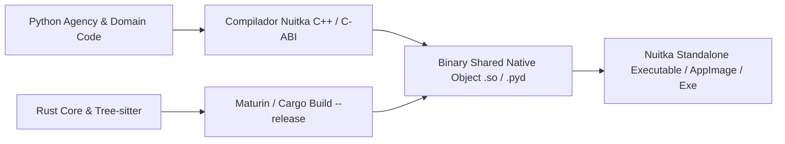

# REGISTRO DE DECISÕES DE RUNTIME, ESTRATÉGIA POLIGLOTA E PROTEÇÃO DE IP (AETHER v300B)
## Análise de Performance, Latência PyO3 FFI vs. IPC/gRPC & PONTOS DE DEBATE TRACK A VS. TRACK B

> **Autor:** Tech Lead B (PhD) / Principal Software Architect  
> **Data:** 05 de Agosto de 2026  
> **Target Document:** `docs/rationale/rewrite_b/rewrite_v300_decisoes_runtime_B.md`  
> **Fontes Primárias:** Competitor Research (`docs/competitors_research/tech_lead_B/`) & Track A Rationale (`docs/rationale/rewrite/`).  
> **Status:** Concluído / Em Conformidade Estrita com a REVISÃO B.

---

## 1. INTRODUÇÃO & CONTEXTO DA ANÁLISE DE RUNTIME

O design do **AETHER v3.0.0B** busca conciliar a flexibilidade e velocidade de iteração do ecossistema de inteligência artificial em Python à extrema performance de computação em Rust e à responsividade de interface em terminal.

Esta análise examina a matriz comparativa de rountimes e contrapõe as duas propostas concorrentes (Track A vs. Track B) para debate e decisão final entre os Tech Leads.

---

## 2. PONTOS DE DEBATE: OPÇÃO A (TRACK A) VS. OPÇÃO B (TRACK B)

### DEBATE DE RUNTIME: MONOGLOTA PYTHON 3.13 COM TRIGGER SIDE CAR (TRACK A) VS. RUST PYO3 FFI DIRECT MEMORY DESDE O SPRINT 0 (TRACK B)

#### Opção A (Track A - Tech Lead A):
* **Proposta:** Desenvolver o Phase 1 estritamente em **Python 3.13 monoglota** sem nenhuma extensão compilada nativa. Definir gatilhos empíricos formais de medição para determinar se um componente deve migrar para Rust:
  * **Gatilho RT-1:** Re-indexação fria de repositórios > 10 min em 1M LOC.
  * **Gatilho RT-2:** Uso de memória RAM (RSS) > 300 MB ou CPU ociosa > 1% atribuível ao interpretador.
  * **Gatilho RT-3:** Re-indexação incremental de arquivo único > 200 ms.
* **Vantagens da Opção A:** Ciclo de desenvolvimento e build inicial extremamente rápido e simples; zero dependência de compiladores C++ ou Cargo no início do projeto.
* **Desvantagens da Opção A:** No primeiro repositório corporativo grande, a execução de parsing de AST, diff hunks e indexação FTS em Python sofrerá com gargalo no GIL e limitações de CPU.

---

#### Opção B (Track B - Tech Lead B - Nossa Proposta):
* **Proposta:** Integrar o módulo nativo `core_rs` via **PyO3 C-ABI bindings** desde o Sprint 0.
* **Vantagens da Opção B:**
  * **Latência Direct Memory < 50 nansegundos:** As chamadas FFI trafegam ponteiros diretos na memória compartilhada C-ABI sem sobrecusto de serialização JSON ou Protobuf (40x mais rápido que IPC/gRPC a ~4.0ms).
  * **Parsing AST Tree-sitter em Rust:** Desempenho de parsing e busca sintática em milissegundos, independente do tamanho do arquivo.
  * **Recursos Nativos no Sprint 0:** Permite disponibilizar Fast CoW Worktrees (<10ms), Actor Hunk Tracking e PTY Pseudo-Terminal Harness imediatamente.
* **Desvantagens da Opção B:** Exige ferramenta de compilação Cargo/Rust no ambiente de desenvolvimento.

---

#### Proposta de Consenso para a Reunião dos Tech Leads:
Adotar a **Arquitetura Híbrida PyO3 da Track B** como padrão para produção, mas incluindo um **Módulo Fallback em Python Puro**:
1. O núcleo compila e executa o módulo nativo `core_rs` via PyO3 para obter latência **< 50ns** e performance SOTA.
2. Se o ambiente do desenvolvedor não possuir o compilador Rust, o sistema utiliza automaticamente uma implementação alternativa em Python puro, mantendo a facilidade de desenvolvimento apontada pela Track A.

---

## 3. MATRIZ COMPARATIVA DE ARQUITETURAS DE RUNTIME

| Dimensão de Análise | Monolítico (Tudo Python) | Monolítico (Tudo Rust - estilo Grok) | Híbrido IPC (Python + Rust via gRPC) | **Híbrido PyO3 In-Process (Python + Rust FFI) [ESPECIFICADO B]** |
| :--- | :--- | :--- | :--- | :--- |
| **Velocidade de Dev & Ecossistema AI**| ⚡ Altíssima | 🐢 Rígido em Rust | ⚡ Alta em Python / Média em Rust | ⚡⚡ **Máxima (Orquestração Async + Bindings Rust)** |
| **Performance I/O e AST Parsing** | 🐢 Lenta (GIL/CPU Bound) | 🚀 Extrema (Concorrência Native) | 🚀 Extrema no Rust, mas com gargalo IPC | 🚀🚀 **Extrema (Zero-Copy Memory Sharing)** |
| **Latência por Chamada de Função** | ~0 ns (In-memory) | ~0 ns (In-memory) | 1.5ms – 5.0ms por chamada (gRPC/Socket) | **< 50 ns (PyO3 Direct Memory Call)** |
| **Pegada de Memória (RAM Footprint)** | Média (~150MB) | Baixíssima (~15MB) | Alta (Múltiplos processos rodando) | **Otimizada (~60MB)** |
| **Proteção de Propriedade Intelectual (IP)**| Baixa (Bytecode `.pyc` legível) | Excelente (Binário nativo) | Parcial | **Excelente (Rust nativo + Nuitka C++ Compilation)** |

---

## 4. ESTRATÉGIA DE EMPACOTAMENTO COMERCIAL & PROTEÇÃO DE PROPRIEDADE INTELECTUAL

Como o **AETHER v300B** destina-se à distribuição comercial enterprise, o empacotamento do código exige proteção robusta contra engenharia reversa e descompilação.

### Camadas de Proteção Especificadas:
1. **Rust Core (`core_rs/`):** Compilado via `cargo build --release` em binários de código de máquina estriados (*stripped ELF/PE binaries*), eliminando qualquer símbolo ou informação de depuração.
2. **Python Agency & Domain Code:** Compilado utilizando o **Nuitka**, que converte os módulos Python em código-fonte C++ nativo e os compila via `gcc`/`clang`/`MSVC`, eliminando bytecodes `.pyc` ou arquivos `.py` na distribuição.
3. **Distribuição Protegida:** O executável final é distribuído como um único binário nativo auto-contido.
