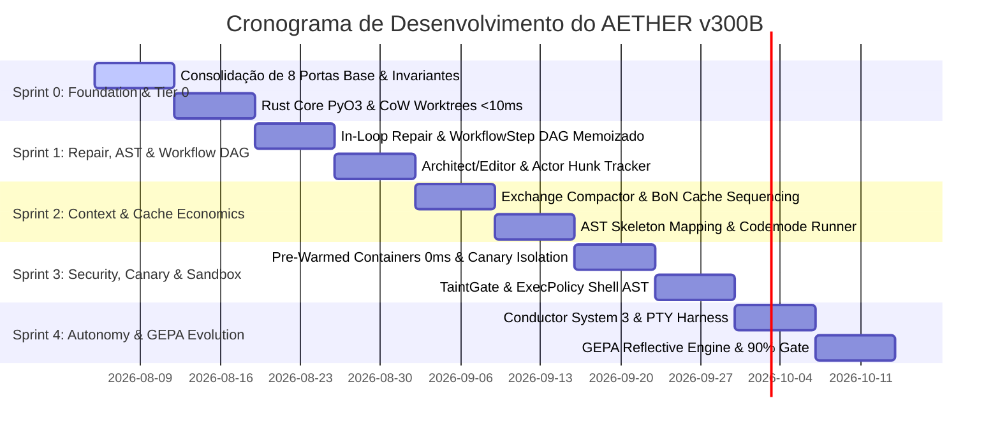
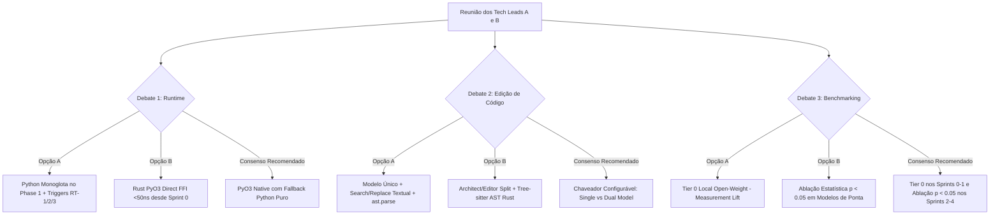

# ROADMAP DE SPRINTS, GATES DE ABLAÇÃO E CRITÉRIOS BENCHMARK (AETHER v300B)
## Cronograma de Implementação dos 15 Domínios Técnicos, Estratégia Tier 0 da Track A & Pontos de Alinhamento

> **Autor:** Tech Lead B (PhD) / Principal Software Architect  
> **Data:** 05 de Agosto de 2026  
> **Target Document:** `docs/rationale/rewrite_b/rewrite_v300_roadmap_sprints_B.md`  
> **Fontes Primárias:** Competitor Research (`docs/competitors_research/tech_lead_B/`) & Track A Rationale (`docs/rationale/rewrite/`).  
> **Status:** Concluído / Em Conformidade Estrita com a REVISÃO B.

---

## 1. OBJETIVO DO ROADMAP & ESTRATÉGIA DE MEDIÇÃO EM 2 ETAPAS

Este roadmap apresenta o plano de execução por Sprints para a construção do **AETHER v3.0.0B** no namespace `src/aether/`, integrando a infraestrutura de alta performance da REVISÃO B e a rigorosa disciplina de medição por etapas da **Track A**.

### Estratégia de Medição por Etapas:
1. **Fase 1 (Sprints 0 e 1 - Tier 0 Local da Track A):** Execução de testes contra modelos locais *open-weight* (Tier 0) a custo zero. Foco em validar o isolamento dos containers, eliminar o vazamento do `.pth` do ambiente virtual, validar os Canary Tests e medir o ruído A/A baseline e o *scaffold-attributable lift*.
2. **Fase 2 (Sprints 2 a 4 - Ablação Estatística da Track B):** Execução de ablações estatísticas rigorosas ($p < 0.05$, $N \ge 50$ instâncias) utilizando modelos de ponta (Opus 5 / Sonnet 3.5) para atingir as metas absolutas em benchmarks SOTA: **90.0%+ em SWE-bench Verified**, **60.0%+ em SWE-bench Pro** e **75.0%+ em Terminal-Bench**.

---

## 2. MÉTRICAS ALVO E EVOLUÇÃO POR SPRINT

| Benchmark / Métrica | Baseline Prototípico | Sprint 0 Target | Sprint 1 Target | Sprint 2 Target | Sprint 3 Target | Target Final (AETHER v300B) |
| :--- | :--- | :--- | :--- | :--- | :--- | :--- |
| **SWE-bench Verified** | ~68.0% | 72.0% (Tier 0) | 78.0% (Tier 0) | 84.0% | 88.0% | **90.0%+** (com Opus 5) |
| **SWE-bench Pro** | ~38.0% | 42.0% (Tier 0) | 46.0% (Tier 0) | 52.0% | 56.0% | **60.0%+** |
| **Terminal-Bench** | ~45.0% | 50.0% | 58.0% | 68.0% | 72.0% | **75.0%+** |
| **Prompt Cache Hit Rate**| ~50.0% | 65.0% | 75.0% | 88.0% | >92.0% | **>92.0%** (3 Cache Markers Fixos) |
| **Tempo de Criação de Worktree**| ~1.5s - 4.5s | <10ms | <10ms | <10ms | <10ms | **< 10 ms** (OverlayFS / Btrfs CoW) |
| **Alocação de Container Subagente**| ~3.5s | 1.0s | 0.5s | 0.2s | 0ms | **0 ms** (Pre-Warmed Container Pool) |
| **Latência por Chamada FFI**| ~1.5ms - 5.0ms (gRPC) | <50ns | <50ns | <50ns | <50ns | **< 50 ns** (Rust PyO3 Native Direct) |

---

## 3. PLANO FASEADO POR SPRINTS

---

### 3.1 SPRINT 0: FUNDAÇÃO HEXAGONAL, INVARIANTES I1-I9, RUST CORE & TIER 0
* **Escopo:** Estruturar o pacote `src/aether/` (`domain/`, `ports/`, `kernel/`, `adapters/`, `agency/`, `tui/`, `core_rs/`, `workflow/`).
* **Entregáveis Técnicos:**
  1. Aplicação dos 9 Invariantes Mecânicos (I1 a I9) com testes de `import-linter` e CI.
  2. Consolidação em 8 portas base essenciais (Regra A-010 da Track A).
  3. Módulo Rust `core_rs` compilado via Maturin (`fast_worktree_cow.rs` <10ms e `ast_treesitter.rs`).
  4. Configuração do ambiente **Tier 0 (Track A)** com modelo local open-weight para testes sem custo de API.
* **Gate de Aceite:** Passage em 100% dos testes de conformidade de portas e tempo de criação de worktree < 10ms.

---

### 3.2 SPRINT 1: IN-LOOP REPAIR, ARCHITECT/EDITOR, HUNK TRACKER & WORKFLOW DAG
* **Escopo:** Desenvolver a agência de reparo em tempo real, os diffs cirúrgicos e a abstração de DAG.
* **Entregáveis Técnicos:**
  1. **Architect/Editor Split:** `agency/architect.py` e `editor.py` com pré-checagem AST Tree-sitter em Rust (<50ns).
  2. **WorkflowStep DAG Memoizado (`workflow/` - Sugestão Track A):** Abstração `WorkflowStep[In, Out]` com caching por input digest para ablações baratas em subgrafos.
  3. **Actor Hunk Tracker (`core_rs/hunk_tracker.rs`):** Atribuição de autoria (`AuthorType::Agent` vs `AuthorType::User`) em ator Tokio.
  4. **Fuzzy Patch Sequence Seeking (`seek_sequence.rs`):** Realocação aproximada de hunks.
* **Gate de Aceite:** Reversão atômica de hunks na TUI, zero rejeições de patches por deslocamento de linha, e medição do *lift* inicial no Tier 0.

---

### 3.3 SPRINT 2: GESTÃO DE CONTEXTO, AST MAPPING, TOOL SEARCH & CACHE ECONOMICS
* **Escopo:** Otimizar o reaproveitamento de cache de prompt e eliminar o *Dumb Zone*.
* **Entregáveis Técnicos:**
  1. **Exchange-Granular Compactor (`compactor.py`):** Remoção estrita de trocas completas.
  2. **Best-of-N Cache Sequencing (Sugestão Track A):** Sequenciamento de chamadas BoN para evitar converter leituras de cache em gravações na Anthropic.
  3. **Tool Search on Demand (`dynamic_dispatch.py`):** Carregamento diferido de schemas (37% menos tokens).
  4. **Codemode Local Execution (`codemode.py`):** Execução programática de ferramentas em lote local.
* **Gate de Aceite:** **Prompt Cache Hit Rate > 92%** em repositórios de grande porte.

---

### 3.4 SPRINT 3: SANDBOXING RIGOROSO, PRE-WARMED CONTAINERS, TAINTGATE & CANARY TESTS
* **Escopo:** Garantir isolamento de execução, proteção contra Prompt Injection e integridade do teste.
* **Entregáveis Técnicos:**
  1. **Pre-Warmed Container Pool:** Pool de containers em background com alocação em **0ms**.
  2. **Canary Isolation Tests (Sugestão Track A):** Injeção de testes canário para provar a sensibilidade do Evaluator contra vazamentos do ambiente virtual (`.pth` bug).
  3. **TaintGate Sanitizer (`taint_gate.py`):** Tagging `UNTRUSTED_TAINTED` de dados externos.
  4. **ExecPolicy Shell AST (`exec_policy_ast.rs`):** Inspeção sintática de comandos shell via AST em Rust.
* **Gate de Aceite:** 0ms de espera no alocador de containers, 100% de bloqueio em testes TaintGate e passagem comprovada nos Canary Tests.

---

### 3.5 SPRINT 4: CONDUCTOR SYSTEM 3, PTY HARNESS, GEPA REFLECTIVE ENGINE & GATE FINAL (90% SWE-BENCH)
* **Escopo:** Finalizar a autonomia de longo prazo, emulação PTY, auto-evolução e validação final dos benchmarks.
* **Entregáveis Técnicos:**
  1. **Conductor System 3 (`conductor.py`):** Decomposição em DAGs com hibernação durável `FrozenRunState`.
  2. **PTY Pseudo-Terminal Harness (`pty_harness.rs`):** Execução não-bloqueante de ferramentas CLI interativas.
  3. **GEPA Reflective Auto-Evolver (`evolution/gepa_evolver.py`):** Otimização reflexiva de prompts e habilidades (`SKILL.md`) baseada no SessionDB Trace Miner.
  4. **Dataset Exporter (`dataset_exporter.py`):** Exportação SFT/DPO.
* **Gate de Aceite Final:** **90.0%+ SWE-bench Verified**, **60.0%+ SWE-bench Pro** e **75.0%+ Terminal-Bench** sob protocolo de ablação estatística ($p < 0.05$).

---

## 4. MATRIZ DE DEBATE E PONTOS DE DECISÃO NA REUNIÃO DOS TECH LEADS

A governança quantitativa rigorosa garante que apenas refinamentos comprovados por rigor estatístico sejam integrados ao **AETHER v300B**, assegurando excelência de engenharia e liderança SOTA incontestável.
