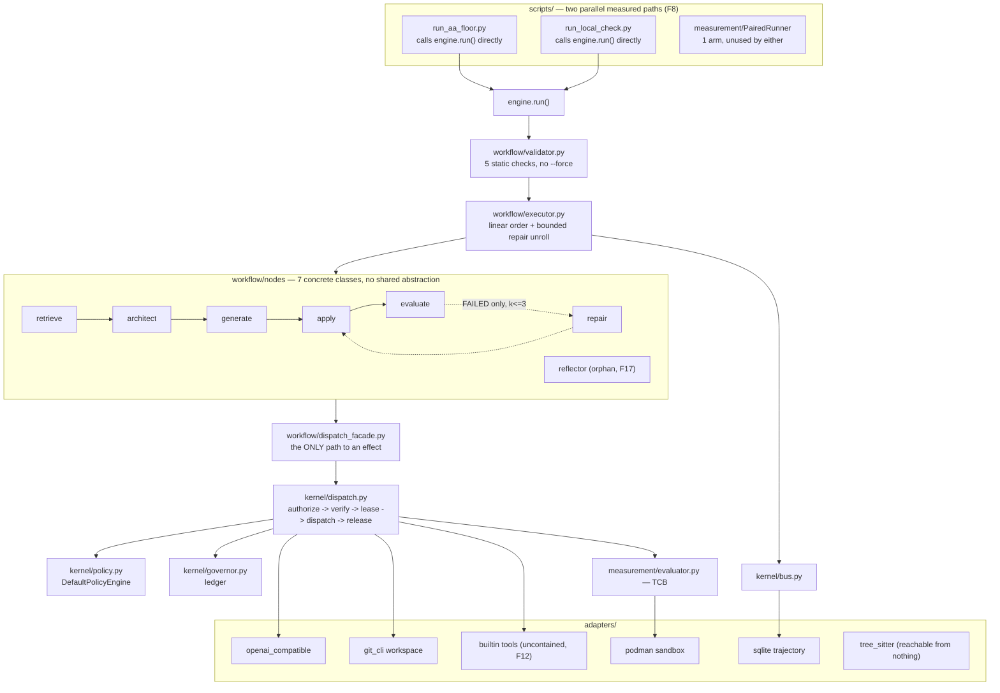
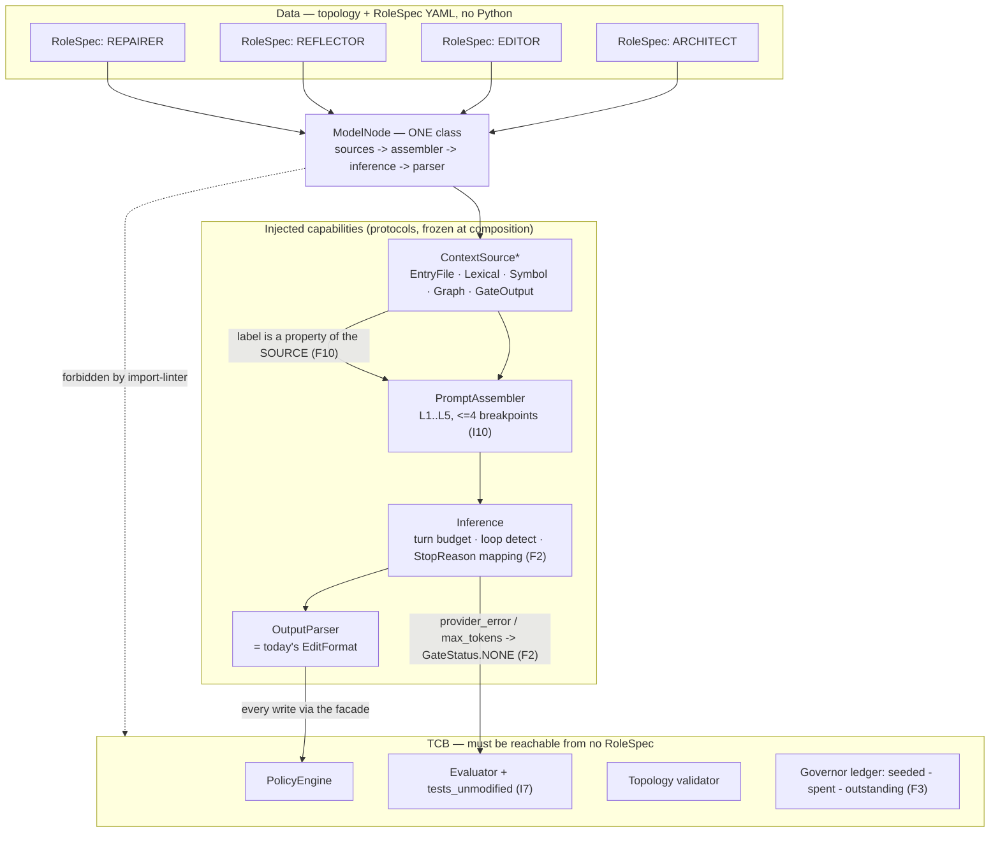
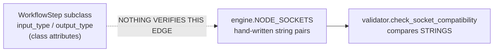
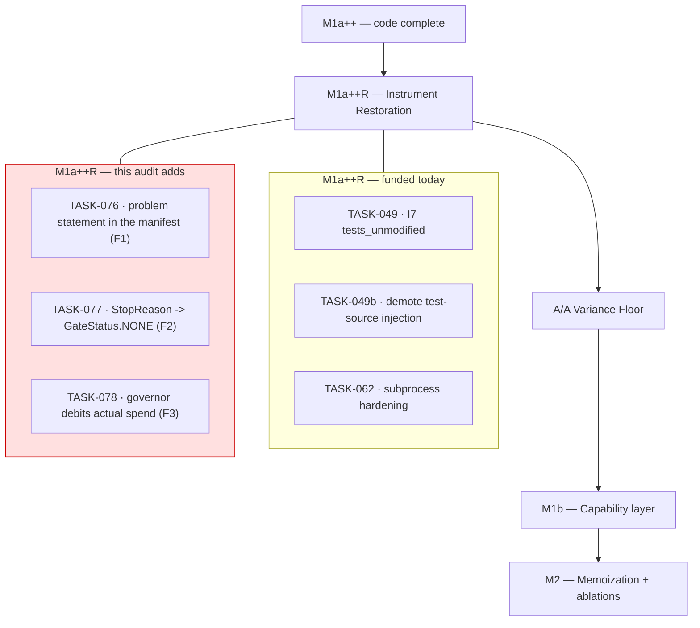

> [!NOTE]
> **Remediation landed 2026-08-07.** Eight of the eighteen findings below — **F1, F2, F3, F4,
> F5, F6, F7, F11** — are fixed in the working tree, each with a negative test that fails
> against the pre-fix code. The record of what changed and why is
> [`docs/STATUS.md`](docs/STATUS.md) → *Instrument-integrity fixes*; the follow-on work is
> [`docs/agile/backlog.md`](docs/agile/backlog.md) → **Epic 8**.
>
> **This report is left as written.** It is the diagnosis, not the changelog, and a finding
> rewritten after the fix loses the evidence that it was ever true. Two corrections of fact are
> marked inline where the original text was wrong: the severity note on `TASK-044` (§2 F3) and
> the task numbering in §5.2, which the backlog renumbered.
>
> Post-fix gate state: **402 passed / 6 skipped** (aether suites, +24 tests), pyright 0 errors,
> **10/10** import contracts, link gate **green** (it was red when this report was written).

# AETHER — Tech Lead Audit v3.2.0 · Part 1: Forensic Code Audit

**Reviewer role**: principal harness engineer, adversarial read.
**Scope**: `src/aether/` (64 files, 6,320 LOC) and the seven topologies under `workflows/`.
**Explicitly out of scope, per instruction**: `src/sagiha`, `src/claude_refs`, `src/kimi_cli`,
`src/openhands`, `src/hermes_agent`, `src/reasonix`, `src/grok_build`, `src/open_code` — study
references, not audited.
**Part 2** (`aether_tech_lead_review_v320_part_02.md`) covers the documentation tree and the plan.

---

## 0. Two corrections to the audit brief before anything else

The brief I was given asks me to audit a system that does not exist in this repository. Auditing
against it would produce a fictional report, so the premises are corrected here rather than
quietly worked around.

| The brief asserts | Reality in `src/aether/` |
| :--- | :--- |
| Self-improving meta-loop in `src/aether/evolution/` | **The directory does not exist.** `.importlinter` names `aether.evolution` as a forbidden importer — a vacuous contract target. Scheduled post-M4 |
| 5-layer context & prefix caching (L1–L5), byte-identical prefix rates (I10) | **Not built.** One frozen `system` message in `generate.py:117-129` is the "L1 seed". No assembler, no breakpoints, no prefix-stability metric. `TASK-056` |
| `ContextSource` seams — `FileContextSource`, `LexicalSource`, `SymbolSource`, `TestPathSource`, `HistorySource` | **None exist.** Retrieval is `RetrieveStep` reading a hard-coded list of filenames from YAML. `TASK-054`/`TASK-064` |
| Obsidian-like Second Brain knowledge graph, hybrid RAG, persistent trajectory-backed memory | **Not built.** `SqliteTrajectoryStore` is an append-only event log with no reader outside `engine.run`'s own drain |
| `RoutingModelProvider` composite, multi-model hybrid routing | **Not built.** The name appears only in a docstring (`openai_compatible.py:81-82`) as an unbuilt promise. One provider is constructed per run (`engine.py:178`) |
| MCP tool integration, external sensors, database connectors, attenuated subagent grants (ADR-0016/0017) | **Zero code.** Two built-in tools: `read_file`, `bash` |
| `tree-sitter` AST indexing wired into retrieval | `TreeSitterIndexer` exists, passes conformance, and is **reachable from no node and no topology** |
| Atomic `ModelNode` + `RoleSpec` composition, `schema_version: 1.1.0` fragments | Not built. Seven concrete `WorkflowStep` subclasses; schema is pinned at `1.0.0` |
| Turn budgets, consecutive-loop detection (`TASK-069`), L5 compaction (`TASK-024`), `RunConfig.mode` | None exist |

**This is not a criticism of the team.** `docs/STATUS.md` and `docs/PHASE-0-LOCK.md` §4 state
almost all of it plainly and without euphemism. The project's own documentation is *more honest
than the audit brief*. That is a rare and valuable property and it is the single strongest
signal in this repository.

**Second correction.** The brief's framing — "multi-billion-dollar candidate architecture,"
"statistical benchmark dominance" — invites a report that grades ambition. What is actually
here is a **6,320-line walking skeleton with an unusually rigorous measurement instrument
bolted to it, which has never produced a benchmark number.** `measurement.md` §1 says so in its
first line. The correct audit posture is therefore: *is the instrument sound enough that the
first number it produces will be believable?* Everything below answers that question.

---

## 1. Verdict

**The architecture is sound. The instrument is not yet trustworthy, and three of the reasons
are not recorded anywhere in the plan.**

What holds up under adversarial reading:

- The **choke point is real**. `DispatchFacade` is the only path from a node to an effect, and
  it takes no adapter handles. There is no bypass. This is the hardest thing on the list to
  retrofit and it is done.
- **Wire-serializability (I3) is genuinely enforced**, not aspirational. No `Path`, handle or
  live object crosses a port; the reflection contract proves it over all nine protocols.
- **Tri-state `GateReport` (B4) is correctly implemented** with one mapping function
  (`evaluator.py:84-96`) that both execution modes route through. `NONE` never routes into
  repair — enforced twice, in the executor and again in the node.
- The **container contract is a pure function** (`build_run_argv`), so every clause of the
  isolation contract is unit-testable on a machine with no runtime. That is the right shape.
- The **validator has no `--force`**, and each of its five checks has a malformed fixture.

Verified by running the gates myself, not from `STATUS.md`:

| Gate | Command | Result |
| :--- | :--- | :--- |
| Tests | `pytest tests/aether tests/conformance tests/integration -q` | **378 passed, 6 skipped** |
| Import lattice | `lint-imports` | **9 kept, 0 broken** |
| Docs word budget | `scripts/docs_budget.py` | **11,776 / 15,000 — OK** |
| Relative links | `scripts/check_links.py` | **RED — 109 dead links** (see Part 2) |

What does not hold up is in §2. The severity ranking is by *effect on the believability of the
first published number*, because that is what this project is for.

---

## 2. Forensic findings

`NEW` = not recorded in `backlog.md`, `STATUS.md` or `PHASE-0-LOCK.md`.
`KNOWN` = already funded by a task; listed because the audit must be complete, and in two cases
because the recorded description is **wrong about the mechanism**.

| # | Sev | File:line | Defect | Status |
| :--- | :--- | :--- | :--- | :--- |
| **F1** | **Critical** | `measurement/runner.py:139`, `:267` | The task's problem statement is never passed to any model. Both the baseline arm and `candidate_to_task` substitute `candidate.instance_id` | **NEW** |
| **F2** | **Critical** | `adapters/model_provider/openai_compatible.py:174-181` | A provider/transport failure yields `StopEvent(provider_error)` that **nothing consumes**. It becomes an empty completion → empty patch → `FAILED`. An instrument error enters the resolve-rate denominator as a task failure | **NEW** |
| **F3** | **High** | `kernel/governor.py:143-170` + all `BudgetDims` call sites | The `usd_micros` run ceiling is **never debited by actual spend**. `commit()` writes to `_spent`; `reserve()` reads `_run_root_remaining`. Nothing connects them | **FIXED.** Known as `TASK-044`, whose stated mechanism did not match the code — see the correction in §3 |
| **F4** | **High** | `kernel/dispatch.py:96` | Unknown `effect_class` raises `KeyError` **after** the lease is acquired and **outside** the `try`. The lease is never released or committed — a permanent leak from the parent/run pool | **NEW** |
| **F5** | **High** | `workflow/nodes/generate.py:187` | In the multi-round tool loop, `justifying_spans` is frozen at round 0. Untrusted tool output can steer a subsequent `bash` call and the policy engine will never see an untrusted span. I11's predicate is structurally unreachable on the tool path | **NEW** (adjacent to `TASK-030b`, not covered by it) |
| **F6** | **High** | `engine.py:50-60` vs `workflow/nodes/*` | `NODE_SOCKETS` is a hand-maintained string map duplicating each step's declared `input_type`/`output_type`. **No test ties them together.** Change a step's socket type and the validator keeps passing | **NEW** |
| **F7** | **High** | `workflow/edit_format.py:193-196` | `TASK-049` schedules deletion of the path inferrer at `:199-202` but not the `len(py_files) == 1` branch above it, which guesses the same way | KNOWN-partial (`TASK-049` scope is short) |
| **F8** | **Med** | `measurement/runner.py` (whole module) | The `HarnessUnderTest` rig has **one arm**. `scripts/run_aa_floor.py:163` calls `engine.run()` directly, bypassing `PairedRunner`. The measured path and the tested path are different code | **NEW** |
| **F9** | **Med** | `workflow/executor.py:176`, `:195` | Node budget is reserved then released with no commit; effect leases are **root** leases, not children of the node lease. The budget hierarchy in the topology is decorative | KNOWN — `TASK-045` |
| **F10** | **Med** | `workflow/nodes/generate.py:109`, `repair.py:160` | Repo content and test output are labelled `Provenance.AGENT`. `spec.md` §5 says both are `untrusted-external` **at birth**. No `UNTRUSTED_DERIVED` propagation exists anywhere | KNOWN — `TASK-048`, and `STATUS.md` records it |
| **F11** | **Med** | `.importlinter` `aether-tcb-isolation` | `spec.md` §6 lists the workflow schema, validator and executor as immutable TCB. The contract's `source_modules` **do not include them** | **NEW** |
| **F12** | **Med** | `adapters/tools/builtin.py:110-120` | `create_subprocess_shell` on the host, inheriting stdin and full env, no deadline | KNOWN — `TASK-062` |
| **F13** | **Med** | `measurement/evaluator.py:56` | `_EVAL_ENV = {**os.environ, ...}` hands the operator's full environment, API keys included, to model-written code on the uncontained path | KNOWN — `TASK-062` |
| **F14** | **Low** | `engine.py:217` | `outcome.report if isinstance(...) else outcome` — the `else` branch assumes an unrelated type. `executor.execute` returns `Any`; the generic parameters of `WorkflowStep[In, Out]` are erased along the entire payload path | **NEW** |
| **F15** | **Low** | `engine.py:112-117`, `workflows/hybrid_architect_editor_v1.yaml` | `params.base_url` is silently dropped; `params` has no `additionalProperties: false`, so any misspelled or unsupported param is accepted in silence | KNOWN (Epic 6 preamble), **schema half is NEW** |
| **F16** | **Low** | `workflow/executor.py:96-121` | `_topological_order` builds `{e["from"]: e["to"]}`, silently discarding a second outgoing edge | KNOWN — `TASK-059` |
| **F17** | **Low** | `engine.py:119-124` | `ReflectorStep` is registered, socket-mapped, and used by no topology and no test | KNOWN — `TASK-046` |
| **F18** | **Low** | `workflow/edit_format.py:176`, `:180`, `:186`, `:192` | Trailing whitespace inside the fallback block — ruff's default rule set does not select `W291`, so the "ruff green" claim does not cover it | **NEW** (cosmetic) |

---

## 3. The five that decide whether the first number is believable

### F1 — The harness has never been shown a problem statement

```python
# measurement/runner.py:135-142  (BareModelHarness.attempt)
text=self._template.format(problem_statement=candidate.instance_id),

# measurement/runner.py:263-271  (candidate_to_task)
instructions=candidate.instance_id,
```

`TaskCandidate` (`measurement/manifest.py:76-88`) has fields for `instance_id`, `repo`,
`base_commit`, `environment_image_digest`, `test_command`, `gold_patch`, `fail_to_pass`,
`pass_to_pass` — **and no problem statement.** The manifest schema cannot carry one. So the
SWE-bench inference template, held as a literal and hashed precisely so "we used the standard
prompt" is checkable, is formatted with a string like `django__django-11099`.

Both arms are affected identically, so a *lift* measurement would not be biased — it would be
`0 − 0`. The consequence is worse than bias: **on a real SWE-bench manifest, every task fails
for both arms, and the floor characterises the variance of a harness that was never told what to
do.** The three local end-to-end runs in `STATUS.md` did not catch this because
`scripts/run_local_check.py:107-117` builds its own instructions from a fixture directory and
never goes through `candidate_to_task`.

This is the single largest gap between the plan and the instrument, and it appears in no
document. `TASK-064` (localization) is downstream of it: choosing which files to open is
impossible when the task text does not exist.

**Fix**: `problem_statement: str` on `TaskCandidate`, required by `manifest_schema.yaml`
(a new manifest hash, per L15). `candidate_to_task` and `BareModelHarness.attempt` read it. A
manifest entry with an empty problem statement is an `instrument_error` exclusion.

### F2 — A provider failure is scored as a failed task

```python
# adapters/model_provider/openai_compatible.py:174-181
except Exception:
    yield StopEvent(reason="provider_error")
    return
...
yield StopEvent(reason="provider_error")
```

The module docstring is right that never raising past the generator is the correct shape.
The defect is that **`provider_error` has no consumer**. `grep -rn "provider_error" src/aether/`
returns only the definition, the literal type, and these two yields.

The path a 429, a socket reset or a read timeout takes:

```
provider raises → StopEvent(provider_error) → composition._model sees no UsageEvent
  → falls back to count_tokens() estimate → GenerateStep collects zero TextDeltas
  → GeneratedPatch(raw_output="") → ApplyStep: "the model produced no edit"
  → EvaluateStep runs the tests on an unmodified worktree → exit 1 → GateStatus.FAILED
```

`measurement.md` §2 B4 exists to prevent exactly this: *"an instrument failure is never a data
point."* B4 was implemented for the **evaluator** and not for the **model provider**, and the
asymmetry is invisible because both paths end in a `GateReport`. Under a rate-limited paid
provider — which is what a 300-task publication run on SEALED is — this silently depresses the
resolve rate on whichever arm hits the limit harder, and the instrument-error rate that
`measurement.md` §4.1 requires to be reported per arm reads zero.

**Fix**: `GeneratedPatch` carries the terminal `StopEvent.reason`; `ApplyStep` maps
`provider_error` to a `GateReport(NONE, instrument_error=…)` rather than a non-edit; the
executor's existing `NONE`-never-repairs rule then covers it for free. `max_tokens` deserves the
same treatment — a truncated completion is not a failed attempt either, and today it is
indistinguishable from one.

### F3 — The dollar ceiling still cannot fire (and the recorded reason is wrong)

`pricing.py`'s docstring says A4 made `usd_micros` real. `engine.py:186-190` says *"A real
ceiling, not a comment."* Both are still false, one layer further in than before.

Trace it:

1. Every `cost_estimate` at every call site is `BudgetDims(prompt_tokens=…)` or
   `BudgetDims(wall_clock_ms=…)`. **Not one call site sets `usd_micros`** — verified across
   `dispatch_facade.py` and all six node modules.
2. `seed_run_budget` sets `_run_constrained = {"usd_micros"}` (only dimensions `> 0`).
3. `reserve()` root path checks `getattr(dims, "usd_micros") > available.usd_micros` → `0 > N`
   → always false. Draw-down subtracts `0`.
4. `commit()` adds actuals to `self._spent[run_id]`, a **different dictionary**.
   `reserve()` never reads `_spent`.
5. The refund path: `overran` is true (actual usd > reserved 0), so `refund = BudgetDims()`.
   Nothing is debited on this path either.

`_run_root_remaining[run_id].usd_micros` is therefore **exactly the seeded value for the entire
run, regardless of spend**.

`TASK-044`'s description says *"an overrun is detected on the next reserve."* It is not detected
on any reserve, ever. Fixing only what `TASK-044` describes — reserving the dollar estimate
instead of zero — closes the *first-call* case and leaves the ledger still unable to accumulate.
The ceiling needs `reserve()` to check `seeded − spent − outstanding`, which is a change to
`ResourceGovernor`, not to the nodes.

> **Correction, and the fix that landed.** Calling `TASK-044` simply "wrong" was imprecise. It
> describes behaviour the code *did not have*: an overrun detected on the next reserve. One line
> in `commit()` — refunding `reserved − actual` including when that is negative, instead of
> clamping it to zero — makes its description true, and the cap now fires one call late.
> `TASK-044`'s remaining scope is to move that denial onto the offending call, and `TASK-078`
> carries the `seeded − spent − outstanding` change. Proof:
> `tests/aether/kernel/test_governor_ledger.py`, six tests, all red before the fix.

**This is a TCB-adjacent correctness fix and it gates M4**, because a publication run on a paid
provider with a cap that cannot fire is an unbounded spend authorisation.

### F4 — Lease leak at the choke point

```python
# kernel/dispatch.py:91-104
lease = await self._governor.reserve(request.run_id, cost_estimate)   # 3 lease
if isinstance(lease, ReservationDenied): ...
adapter = self._adapters[request.effect_class]                        # 4 dispatch  ← outside try
try:
    outcome = await adapter(request, lease)
    ...
except Exception:
    await self._governor.release(lease.lease_id)                      # 5 release
    raise
```

An `effect_class` with no adapter raises `KeyError` on the line *before* the `try`. The lease is
already held. It is never released, never committed, and `_leases` keeps it forever — under a
seeded ceiling or a parent lease, that budget is gone for the rest of the run.

Today the adapter table is closed and complete, so this is unreachable *in the current
composition*. It becomes reachable the moment MCP (ADR-0016) adds effect classes, or a subagent
grant is attenuated (ADR-0017), or `TASK-042`'s router introduces a per-node table. It is a
two-line fix now and a benchmark-corrupting mystery later.

Also worth noting on the same path: the `except` branch releases the lease but emits no
`EffectDispatched` event, so a crashed effect is the one outcome the event stream cannot show.

### F5 — I11 is unreachable on the tool loop, structurally

```python
# workflow/nodes/generate.py:131-196
spans = self._build_spans(payload, str(ctx.node_id))   # built ONCE, before the loop
for _round in range(self.MAX_ROUNDS):
    ...
    result = await self._dispatch.shell(
        ShellArgs(...), ..., justifying_spans=spans,   # ← same spans, every round
    )
    messages.append(ModelMessage(role="tool", spans=result.spans, tool_call_id=call_id))
```

`result.spans` is correctly labelled `UNTRUSTED_EXTERNAL` at birth by
`adapters/tools/builtin.py:91`. It is appended to `messages`, sent back to the model, and can
therefore influence the model's *next* tool call. But `justifying_spans` is the round-0
`OPERATOR`/`AGENT` tuple, so `DefaultPolicyEngine.authorize` (`kernel/policy.py:18`) evaluates
`any(span.label in UNTRUSTED …)` over a set that **cannot contain an untrusted span by
construction**.

Combined with F10 (repo content labelled `AGENT`) and the total absence of
`UNTRUSTED_DERIVED` propagation — `grep` finds the enum member and nothing that ever assigns
it — the result is that `DefaultPolicyEngine` has never denied anything and cannot. The
`i11-untrusted-widen` branch is dead code.

`PHASE-0-LOCK.md` §4 records *"I11 not enforced on the model path"* and calls the predicate
correct. The predicate **is** correct. What is missing is (a) monotone propagation and (b) the
call site passing the spans that actually justified the request. `TASK-030b` funds the red-team
corpus; neither of these two mechanisms is named by any task.

---

## 4. Architecture blueprint

### 4.1 What runs today



Two structural observations the diagram makes visible:

- **`PairedRunner` is off to one side.** The comparative rig lives in `measurement/`, is
  conformance-tested, and is used by neither script that produces a measured run. The code that
  will take the floor is `run_aa_floor.py`, which is not in `src/aether/` and not covered by the
  import lattice or the TCB contracts.
- **`workflow/nodes/` has no shared abstraction.** Seven classes each re-implement span
  construction, `ModelRequest` assembly, and `TextDelta` collection. `generate.py:93-129`,
  `architect.py:52-87`, `architect.py:116-141` and `repair.py:155-180` are four copies of the
  same twelve lines with different literals. This is the duplication `capability_layer.md`'s
  `ModelNode`/`RoleSpec` (M1b, `TASK-057`) is designed to collapse, and the design is correct.

### 4.2 Target shape — the ModelNode collapse, with the audit's additions

The brief asks for atomic-node composition. The project already has the right design in
`architecture/capability_layer.md`; what this audit adds is **where the instrument-integrity
seams belong inside it**, because retrofitting them after M1b is strictly harder.



Three seams this audit says must land **with** M1b rather than after it:

1. **`Inference` owns `StopReason` → verdict mapping (F2).** If it does not, every future node
   re-decides what a provider error means, and they will disagree.
2. **`ContextSource` declares its own `Provenance` (F10).** `knowledge_and_memory.md` §3.2 states
   this rule exactly and it is right: *"never decided at the call site."* Ten call sites each
   deciding is how repo content and tracebacks both drifted to `AGENT`.
3. **`justifying_spans` is whatever the assembler put in the prompt (F5)**, computed per turn,
   not per node. That is a one-line consequence of having an assembler and is unbuildable
   without one — which is why F5 is an M1b task and not a hotfix.

### 4.3 The socket-type hole (F6)



`tests/aether/workflow/test_step_registry.py:148` asserts that every topology's kinds appear in
`NODE_SOCKETS`. Nothing asserts that `NODE_SOCKETS[kind]` matches the registered step's own
declared types. The validator is therefore checking a hand-maintained shadow of the type system
against itself. A ten-line test closes it:

```
for kind, factory in registry.items():
    step = factory({})
    assert NODE_SOCKETS[kind] == (step.input_type.__name__, step.output_type.__name__)
```

Better still, derive `NODE_SOCKETS` from the registry and delete the literal — the duplication is
the defect, not the drift.

---

## 5. Roadmap and backlog delta

The existing roadmap (M0 → M5) and its gate structure are sound and I am not proposing to
restructure them. What follows is a **delta**: what this audit says must move, and what is new.

### 5.1 Sequencing change — one gate moves

`M1a++R` ("Instrument Restoration") is correctly identified as blocking the floor and currently
funds `TASK-049` (I7) and `TASK-049b` (test-source injection). **F1 and F2 belong in the same
gate and are not in it.** The argument is identical to the one the roadmap already makes for B4:
*a floor taken over an instrument that mislabels its own failures characterises the variance of
the wrong measurement.*



### 5.2 Proposed new tasks

> **Renumbered on landing.** The backlog's Epic 8 assigns these ids differently — `TASK-076`
> (problem statement), `TASK-077` (extend the instrument-error mapping), `TASK-078` (ledger),
> `TASK-079` (emit `EffectDispatched` on error), `TASK-080` (derive `NODE_SOCKETS`), `TASK-081`
> (`UNTRUSTED_DERIVED` propagation), `TASK-082` (one measured path), `TASK-083` (exit gates for
> M1b–M5), plus `TASK-084` (`docs/overview/`) and `TASK-085` (link gate sees backticked paths).
> **The backlog is authoritative.** The table below is kept as proposed.

| ID | Title | Milestone | Complexity | Exit criterion (must be able to fail) |
| :--- | :--- | :--- | :--- | :--- |
| **TASK-076** | Problem statement is manifest data (F1) | **M1a++R — blocks the floor** | M | `TaskCandidate.problem_statement` required by `manifest_schema.yaml`; `candidate_to_task` and `BareModelHarness` read it. **Negative test**: a manifest entry with an empty statement is excluded as `instrument_error`, and a fixture asserting the template still formats with `instance_id` must go red |
| **TASK-077** | Terminal `StopReason` maps to a tri-state verdict (F2) | **M1a++R — blocks the floor** | M | `provider_error` and `max_tokens` produce `GateStatus.NONE` with `instrument_error` set, never `FAILED`. **Negative test**: a mocked 429 that scores `FAILED` fails the suite. Instrument-error rate per arm becomes non-zero and is reported |
| **TASK-078** | The ledger debits actual spend (F3) — **TCB** | **M1a++R** | M | `reserve()` denies against `seeded − spent − outstanding`. **Negative test**: a run seeded at 1 µUSD whose first call costs more is denied *at the second call at the latest*. Supersedes the mechanism described in `TASK-044`, which does not close it |
| **TASK-079** | Lease is acquired inside the guarded region (F4) — **TCB** | M1b | S | Unknown `effect_class` returns a typed `EffectOutcome`, not `KeyError`; the lease is released; `EffectDispatched(status="error")` is emitted. Test asserts `governor.remaining()` is unchanged after the failure |
| **TASK-080** | `NODE_SOCKETS` derived from the registry (F6) | M1b, with `TASK-057` | S | The literal map is deleted or asserted equal to the steps' declared types. **Negative test**: changing `RepairStep.output_type` makes the suite red |
| **TASK-081** | Per-turn `justifying_spans` + `UNTRUSTED_DERIVED` propagation (F5) | M1b, with `TASK-054`/`TASK-055` | L | A shell call issued after untrusted tool output is denied by `DefaultPolicyEngine`. Red-team fixture required. Unblocks `TASK-030b`'s corpus from being vacuously green |
| **TASK-082** | TCB contract covers the workflow validator/executor (F11) | M1b | S | `aether-tcb-isolation` `source_modules` includes `aether.workflow.validator` and `aether.workflow.executor`, matching `spec.md` §6. Must be landed with `TASK-053`'s lattice change, since it constrains the same edge |
| **TASK-083** | One measured path (F8) | M4, before `TASK-072` | M | `run_aa_floor.py` drives an `AetherHarness(HarnessUnderTest)`; both arms go through `PairedRunner`. Deletes the second `except Exception → NONE` implementation |

### 5.3 Amendments to existing tasks

| Task | Amendment |
| :--- | :--- |
| **TASK-044** | Description is mechanically wrong ("detected on the next reserve"). Reduce its scope to *reserving the priced estimate*, and make it depend on **TASK-078** for the ledger half |
| **TASK-049** | Extend the deletion scope from `edit_format.py:198-202` to the whole fallback block `:172-216`. The `len(py_files) == 1` branch at `:193-196` guesses a target the same way (F7) |
| **TASK-062** | Already names `_EVAL_ENV` and `builtin.py`. Add `git_cli._run_git` — it also inherits the environment, and `apply_patch` feeds model-authored bytes to `git apply` over stdin |
| **TASK-042** | Add: `params` needs `additionalProperties: false` in `workflow_schema.yaml`, or a routed topology's typo stays silent exactly as `base_url` does today (F15) |
| **TASK-046** | Recommend **delete**, not wire. `ReflectorStep` duplicates `RepairStep`'s prompt-assembly shape and `TASK-057` will regenerate both from a `RoleSpec`. Keeping it means porting dead code |

### 5.4 Complexity distribution of the proposed additions

| Size | Tasks | Note |
| :--- | :--- | :--- |
| S (≤1 day) | 3 — `079`, `080`, `082` | All are contract or guard-placement fixes |
| M (2–4 days) | 4 — `076`, `077`, `078`, `083` | Three of them block the floor |
| L (5+ days) | 1 — `081` | Genuinely needs the assembler; correctly M1b |

**Total added to the floor's critical path: ~8 days.** That is the honest cost of the finding
that the harness has never been shown a problem statement, and it is cheaper than discovering it
after the floor run, which is what happened to the predecessor and is why `measurement.md`
exists.

---

## 6. What I would not change

Reviews of this kind tend to recommend restructuring. Three things here are right and should be
defended against future proposals:

- **The kernel is thin and stays thin.** `dispatch.py` is 104 lines and `policy.py` is 31. Every
  proposal to add a "deny ledger", a "grant cache" or a "rule DSL" should be refused until a
  measured need exists. The 3/20 deny-ledger bound (ADR-0008) is correctly deferred.
- **Topologies as data (ADR-0014) is working.** Seven topologies, one schema, zero code changes
  to add an arm. The whole-file-vs-diff ablation is a YAML diff. This is exactly what the M2
  ablation programme needs and it was built before it was needed, which is the right order.
- **`measurement/` is not a port and should never become one.** ADR-0005's boundary is correct;
  making the evaluator swappable would make I7 unenforceable.

One thing I would actively resist: **the brief's suggestion of a Rust/PyO3 fork under ADR-0001.**
`performance_timers.md` records F1 measured and RT-3 not crossed. Compiling anything now would be
the speculative optimisation ADR-0001 exists to forbid, and the current bottleneck is model
latency and container startup, neither of which a compiled sidecar touches.

---

*No code or existing documentation was modified in producing this report. Part 2 —
`aether_tech_lead_review_v320_part_02.md` — covers the documentation tree, the governance rules
it holds itself to, and where it drifts from them.*
