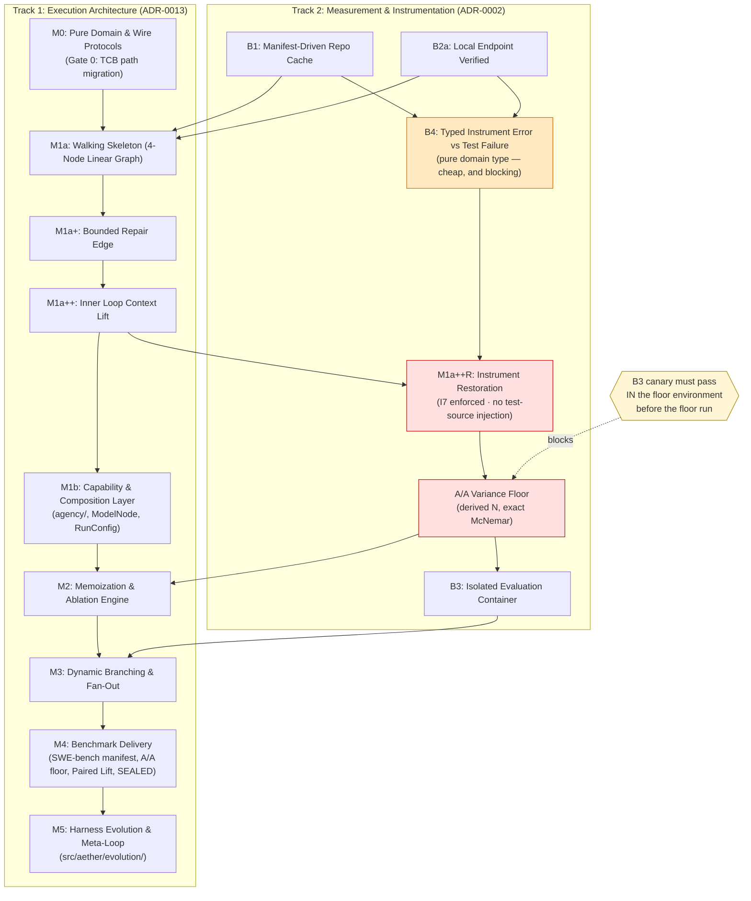

# AETHER v3.0.0 — Phased Execution Roadmap

This roadmap governs the sequencing of AETHER v3.0.0 development. It combines the phased **Workflow DAG rollout** ([ADR-0013](../decisions/0013-workflow-dag-phased.md)) and the **Instrument Unblocking track** ([`measurement.md` §2](../measurement.md#2-instrument-blockers)).

**This file is `normative`.** Its dependency edges bind: an edge here is a precondition, not a preference. Ordering defects in an earlier revision of this DAG would have polluted every number the project ever produced.

**Why B4 precedes the floor.** The floor's job is to characterise instrument *variance*. If exit-127 and uncollectable-test events are still scored as failures when the floor is taken, the floor measures instrument noise **plus instrument error**, and every later admission decision inherits a polluted denominator. B4 is a typed `GateReport` tri-state and a result-mapping rule — a pure domain type with no dependency on M2. Sequencing it after the floor contradicted [`measurement.md`](../measurement.md) §2's own rule, *"an instrument failure is never a data point,"* inside the document that states it.

**Why B3 may follow the floor, conditionally.** The `.pth` leak made candidate diffs invisible to the gates scoring them. In an A/A run both arms are affected identically, so the *variance* estimate may survive — **but only if the leak is arm-symmetric and does not interact with task identity.** That is an assumption about an instrument, and this project's doctrine gives assumptions about instruments a canary. **Before the floor run, the B3 canary (a deliberately broken candidate must fail evaluation) executes in the floor environment.** If the broken candidate "succeeds", the floor is blocked on B3 regardless of what this DAG says.

---

## Phase Matrix & Dependencies

| Phase / Track | Focus | Key Normative References | Dependencies | Tripwire |
| :--- | :--- | :--- | :--- | :--- |
| **Milestone M0** | Domain Models, Wire Ports & **TCB path migration** | [`spec.md` §3–4](../spec.md#3-structure), [ADR-0005](../decisions/0005-eight-ports-adapter-first.md), [ADR-0006](../decisions/0006-tcb-boundary-and-meta-loop-authority.md) | None | 3 Days |
| **Blocker B1** | Manifest-Driven Upstream Repository Cache | [`measurement.md` §2 (B1)](../measurement.md#2-instrument-blockers) | None | 2 Days |
| **Blocker B2a** | Local Endpoint Reachability | [`measurement.md` §2 (B2)](../measurement.md#2-instrument-blockers) | **None** — endpoint validation does not need the repo cache | 1 Day |
| **Blocker B2b** | `ModelProvider` Adapter Passes Conformance | [`measurement.md` §2 (B2)](../measurement.md#2-instrument-blockers), [ADR-0005](../decisions/0005-eight-ports-adapter-first.md) | M0, B2a | 2 Days |
| **Blocker B4** | Typed Instrument Error vs Test Failure | [`measurement.md` §2 (B4)](../measurement.md#2-instrument-blockers) | M0 (domain type) | 1 Day |
| **Milestone M1a** | Walking Skeleton (4-Node Linear DAG) | [ADR-0013](../decisions/0013-workflow-dag-phased.md), [ADR-0014](../decisions/0014-workflow-topology-is-data.md), [ADR-0001](../decisions/0001-python-first-compiled-on-trigger.md) | M0, B1, B2b | 5 Days |
| **Milestone M1a+** | Bounded Repair Edge | [ADR-0013](../decisions/0013-workflow-dag-phased.md) (rev. 2) | M1a | 3 Days |
| **Milestone M1a++** | Inner Loop Context Lift (Auto-discovery, Repair Context Re-reading, Test assertion prompt injection) | [Sprint 3.5 Rationale](../fixes/sprint-3.5-inner-loop-improvements.md), [ADR-0010](../decisions/0010-context-prefix-layers.md), [ADR-0014](../decisions/0014-workflow-topology-is-data.md) | M1a+ | **Code complete; gate open** — see M1a++R |
| **Milestone M1a++R** | **Instrument Restoration.** I7 enforcement (`tests_unmodified`), the `.py`-token inferrer removed, test-source injection demoted to a named ablation arm, CI green at step one | [`measurement.md` §2](../measurement.md#2-instrument-blockers), [`measurement.md` §4.1](../measurement.md#41-the-baseline-is-part-of-the-instrument), [`spec.md` §2 (I7)](../spec.md#2-invariants) | M1a++ | 3 Days |
| **A/A Noise Floor** | Statistical Variance Baseline; **derives N for every later family** | [`measurement.md` §3](../measurement.md#3-the-aa-variance-floor), [ADR-0002](../decisions/0002-no-number-before-the-floor.md), [ADR-0003](../decisions/0003-statistical-admission-protocol.md) | B1, B2b, **B4**, B3 canary, **M1a++R** | 3 Days |
| **Milestone M1b** | **Capability & Composition Layer.** `agency/` created, capability protocols, `ModelNode` + `RoleSpec`, `RunConfig`. Runs in parallel with the floor — it is refactoring, not measurement | [ADR-0005](../decisions/0005-eight-ports-adapter-first.md), [ADR-0014](../decisions/0014-workflow-topology-is-data.md), ADR-0018 (lattice), [`spec.md` §3](../spec.md#3-structure) | M1a++R | 8 Days |
| **Milestone M2-eng** | Per-Node Memoization | [ADR-0013](../decisions/0013-workflow-dag-phased.md) | M1a+, A/A Floor | 5 Days |
| **Milestone M2-abl** | Ablation Execution (repair · context · Architect/Editor) | [ADR-0003](../decisions/0003-statistical-admission-protocol.md), [ADR-0007](../decisions/0007-architect-editor-seam.md), [ADR-0010](../decisions/0010-context-prefix-layers.md) | M2-eng | **Unsized** — see below |
| **Blocker B3** | Isolated Evaluation Container & Canary | [`measurement.md` §2 (B3)](../measurement.md#2-instrument-blockers) | M2-eng | 4 Days |
| **Milestone M3** | Branching, Fan-Out & Statistical Admission | [ADR-0003](../decisions/0003-statistical-admission-protocol.md), [ADR-0013](../decisions/0013-workflow-dag-phased.md) | M2, B3 | 10 Days |
| **Milestone M4** | **Benchmark Delivery.** SWE-bench manifest, A/A floor, paired lift runs (bare-model & OpenHands arms), publication on SEALED | [`measurement.md` §4, §6](../measurement.md#6-pre-publication-verification-gate) | M3 | 7 Days |
| **Milestone M5** | **Harness Evolution & Meta-Loop.** `src/aether/evolution/`, topology self-redesign, subagent capability attenuation | [ADR-0006](../decisions/0006-tcb-boundary-and-meta-loop-authority.md), [ADR-0014](../decisions/0014-workflow-topology-is-data.md), [ADR-0017](../decisions/0017-subagent-capability-attenuation.md) | M4 | 10 Days |

**Why M1a++R exists, and why it blocks the floor.** Sprint 3.5 raised the inner loop's win rate
and did not extend the instrument's validity guards in the same change. Two consequences are
reproducible: `grep -rn "tests_unmodified" src/aether/` returns nothing, so I7 — *the agent that
writes code cannot modify the tests grading it* — has no enforcement in this tree; and
`scripts/run_local_check.py` injects the full text of `run_tests.py` into the prompt, which
measures assertion-fitting rather than bug-fixing and contradicts
[`measurement.md` §4.1](../measurement.md#41-the-baseline-is-part-of-the-instrument)'s
pre-registered baseline (*"no retrieval beyond benchmark-provided context"*). A floor taken over
that instrument characterises the variance of the wrong measurement, and every derived N inherits
it. This is the same class of defect as B3 and B4 and it is sequenced the same way: **before the
floor, not after.**

**Why M1b sits between the floor and M2, and may start in parallel.** M1b is a refactor: it
creates `agency/`, extracts the capability protocols, and collapses the duplicated node classes
([`proposal_abstraction_and_harness_composition.md`](../fixes/proposal_abstraction_and_harness_composition.md)).
It produces no number, so [ADR-0002](../decisions/0002-no-number-before-the-floor.md) does not
gate it and it can run alongside the floor. It is placed **before M2** because three M2/M3 tasks —
`TASK-031` (five-layer assembler), `TASK-024` (compaction), `TASK-033` (cache sequencing) — all
target `src/aether/agency/context/`, a package that does not exist and that the current
`.importlinter` lattice forbids `workflow/` from importing. M2 cannot start without it.

**M2 is split, and M2-abl is deliberately unsized.** An ablation's wall-clock is dominated by inference across N ≥ derived-N paired tasks, not by engineering. Publishing a tripwire for it today would be an unmeasured number used as a schedule commitment — the exact thing [ADR-0009](../decisions/0009-gates-are-the-schedule.md) forbids. **M2-abl is sized after the floor run reports per-task wall-clock**, and not before.

---

## Tripwire Policy (ADR-0009)

- Exit gates **decide when a phase completes**. Durations listed above are **tripwires, not deadlines**.
- If a phase exceeds its tripwire duration by **>50%**, a scope-review meeting is triggered immediately to trim non-essential features, but **gates are never skipped or lowered**.
- A tripwire that fires repeatedly with no scope change following it is being ignored, and is re-estimated or dropped ([ADR-0009](../decisions/0009-gates-are-the-schedule.md) reversal condition). A tripwire nobody responds to manufactures a false sense of monitoring.
