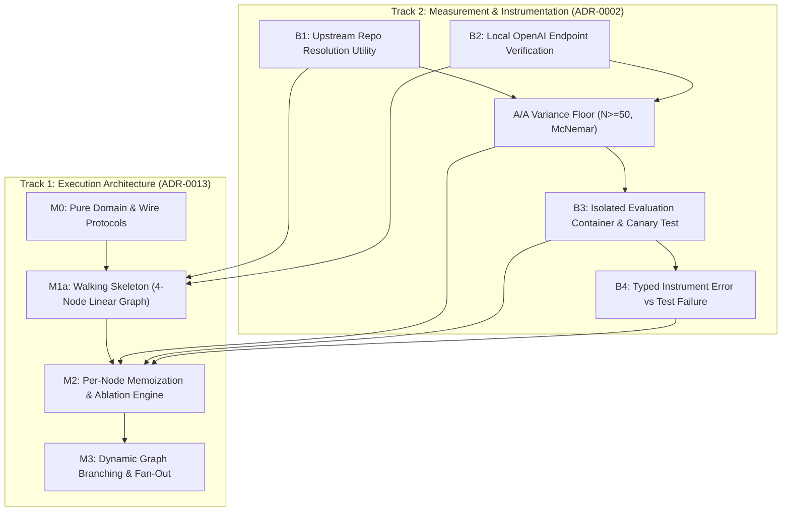

# AETHER v3.0.0 — Phased Execution Roadmap

This roadmap governs the sequencing of AETHER v3.0.0 development. It combines the phased **Workflow DAG rollout** ([ADR-0013](../decisions/0013-workflow-dag-phased.md)) and the **Instrument Unblocking track** ([`measurement.md` §2](../measurement.md#2-instrument-blockers)).

---

## Phase Matrix & Dependencies

| Phase / Track | Focus | Key Normative References | Dependencies | Tripwire |
| :--- | :--- | :--- | :--- | :--- |
| **Blocker B1** | Upstream SWE-bench Repository Cache Utility | [`measurement.md` §2 (B1)](../measurement.md#2-instrument-blockers) | None | 2 Days |
| **Milestone M0** | Domain Models & Wire-Serializable Ports | [`spec.md` §3–4](../spec.md#3-structure), [ADR-0005](../decisions/0005-eight-ports-adapter-first.md) | None | 3 Days |
| **Blocker B2** | Local Endpoint Validation & Baseline Setup | [`measurement.md` §2 (B2)](../measurement.md#2-instrument-blockers) | B1 | 1 Day |
| **Milestone M1a** | Walking Skeleton (4-Node Linear DAG) | [ADR-0013](../decisions/0013-workflow-dag-phased.md), [ADR-0001](../decisions/0001-python-first-compiled-on-trigger.md) | M0, B1, B2 | 5 Days |
| **A/A Noise Floor** | Statistical Variance Baseline ($N \ge 50$) | [`measurement.md` §3](../measurement.md#3-the-aa-variance-floor), [ADR-0002](../decisions/0002-no-number-before-the-floor.md) | B1, B2 | 3 Days |
| **Milestone M2** | Per-Node Memoization & First Ablations | [ADR-0013](../decisions/0013-workflow-dag-phased.md), [ADR-0010](../decisions/0010-context-prefix-layers.md) | M1a, A/A Floor | 7 Days |
| **Blockers B3 & B4** | Container Isolation & Typed Diagnostics | [`measurement.md` §2 (B3, B4)](../measurement.md#2-instrument-blockers) | M2 | 4 Days |
| **Milestone M3** | Branching, Fan-Out & Statistical Admission | [ADR-0003](../decisions/0003-statistical-admission-protocol.md), [ADR-0013](../decisions/0013-workflow-dag-phased.md) | M2, B3, B4 | 10 Days |

---

## Tripwire Policy (ADR-0009)

- Exit gates **decide when a phase completes**. Durations listed above are **tripwires, not deadlines**.
- If a phase exceeds its tripwire duration by **>50%**, a scope-review meeting is triggered immediately to trim non-essential features, but **gates are never skipped or lowered**.
