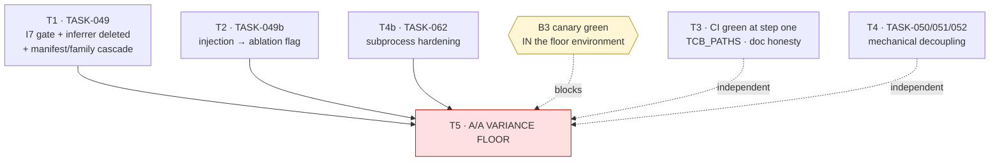

# Sprint 4 Developer Prompt — Instrument Restoration and the Floor

*Handoff prompt for whoever (human or agent) executes Sprint 4. Grounded in the actual
tree as of 2026-08-07, not just the sprint doc — read this before
[`sprint-04.md`](./sprint-04.md), which is the normative task list this document is
commentary on.*

---

## 1. Where you are picking up

Sprints 1–3 built the instrument: pure domain and wire ports, the TCB dispatch choke point,
real adapters, the M1a walking skeleton, the bounded repair edge, the containerized
evaluator with a green B3 canary, the pinned 84-task manifest, and the statistics engine
whose derived-N simulation reproduces ADR-0003's published table in all twelve cells.

**Sprint 3.5 then did something valuable and something dangerous in the same commit.** It
raised the inner loop's win rate — a system layer, a swappable edit-format seam, repair
re-reading the worktree, an architect node — and it did **not** extend the instrument's
validity guards alongside. Two consequences are reproducible today:

- `grep -rn "tests_unmodified" src/aether/` returns **nothing**. I7 — *the agent that writes
  code cannot modify the tests grading it* — has no enforcement in this tree.
- `scripts/run_local_check.py` injects the full text of `run_tests.py` into the prompt, so
  the harness measures **assertion-fitting**, not bug-fixing.

A live trajectory shows the second mode plainly: on `internal__clamp_low-046` the model
emitted `return b`, satisfied `assert f(6, 9) == 9`, and the gate had no capability that
could object.

**This sprint pays that debt and then takes the A/A variance floor** — the run
[`sprint-03.md`](./sprint-03.md) scoped as its Task 5 and deferred by decision. Until the
floor lands a real number in `docs/benchmarks/results/noise-floor.md`,
[ADR-0002](../../decisions/0002-no-number-before-the-floor.md) means this project publishes
**no capability number at all**, no admission run can be sized, and M2-abl stays unsized.

Nothing here is optional scaffolding. Tasks 1–4b are preconditions; Task 5 is the reason
the sprint exists.

---

## 2. Reading order

Read **§2.1 and §2.2 before writing anything.** §2.3 is the plan you are executing. §2.4 is
per-task — read a row when you start that task, not before.

### 2.1 Doctrine — why this project distrusts its own numbers

| File | Read | Why it matters here |
| :--- | :--- | :--- |
| `docs/vision.md` | §4 | The prototype produced **zero** valid numbers and three instrument defects. The rule that follows — *instruments are built and verified before the capability they measure; every gate ships with a test proving it can fail* — is the whole basis of Tasks 1–4b |
| `docs/measurement.md` | §2 (blockers), §3 (the floor), §4.1 (**the baseline is part of the instrument**), §5 (gate design), §6 (what a claim needs) | §4.1 is why Task 2 exists; §5 is why every task below ships a negative test; §6 is the checklist Task 5's write-up must satisfy |
| `docs/decisions/0002-no-number-before-the-floor.md` | All (short) | **Reversal Conditions: None.** Read it before you feel tempted to report a resolve rate from a smoke run |
| `docs/decisions/0003-statistical-admission-protocol.md` | §1, §3–4 | Derived N, the family gatekeeper, and the cost column. Task 5 produces the p₀₁/p₁₀ that every later family cites |

### 2.2 Normative contracts — what the code is not allowed to break

| File | Read | Why it matters here |
| :--- | :--- | :--- |
| `docs/spec.md` | §2 (invariants I1–I11), §3 (structure & lattice), §4 (ports + **TCB residency** + **additive-only versioning**), §5 (execution), §6 (TCB) | §4's port-versioning rule is what lets Task 1 add a field to `EvalSpec` without an ADR. §6 tells you which files need human review |
| `.importlinter` | The `aether-*` contracts | `aether-tcb-isolation` names `aether.measurement.evaluator` as forbidden from importing `aether.adapters`. Task 1 lands **inside** that constraint — see §5.1 |
| `src/aether/measurement/schemas/manifest_schema.yaml` | All | Task 1 extends it. TCB data: a change is a new hash, never an edit |
| `src/aether/workflow/schemas/workflow_schema.yaml` | The `repair` block, `x-static-checks` | Context for what the validator already enforces. **You do not change this file this sprint** |
| `docs/architecture/schemas_and_contracts.md` | §2 | The manifest's specified shape — extend in its idiom, don't redesign |

### 2.3 The plan you are executing

| File | Read | Why |
| :--- | :--- | :--- |
| `docs/agile/sprints/sprint-04.md` | **All** | **The normative task list.** This prompt is commentary; where they disagree, that file wins and this one is a bug |
| `docs/agile/roadmap.md` | The `M1a++R` and `A/A Noise Floor` rows, plus *"Why M1a++R exists"* | The dependency edges bind. M1a++R is a precondition of the floor, not a preference |
| `docs/agile/backlog.md` | `TASK-049`, `TASK-049b`, `TASK-050/051/052`, `TASK-062` | Exit criteria per task, in their canonical form |
| `docs/agile/milestones.md` | B3, B4 gates | The gates Task 5 inherits |
| `docs/STATUS.md` | All (it is short) | What is claimed today. **You will be editing it** — every green must name the command that produced it |
| `docs/agile/sprints/sprint-03-dev-prompt.md` | §"Non-negotiable house rules" | Sprint 3's version of §3 below. Still binding |

### 2.4 The audit trail — read the row for the task you are on

| File | For which task | The finding it documents |
| :--- | :--- | :--- |
| `docs/proposals/proposal_architecture_audit.md` | T1, T3 | The original I7 / CI / TCB_PATHS findings |
| `docs/proposals/proposal_abstraction_and_harness_composition.md` | T4 | §4.2 — nodes transitively import `httpx`; the four `worktree_path` copies; the repeated envelope |
| `docs/proposals/proposal_competitors_execution_mechanics_evaluation.md` | T4b | §2 — stdin, env and timeout defects, and why they are an *instrument* fix |
| `docs/proposals/proposal_workflows_hybrids_improvements.md` | Anti-drift (§9) | Why the hybrid topology must not run before the floor |
| `docs/proposals/implemented_sprint_3.5_complete_report.md` | T3 | The document you are downgrading to `rationale` |
| `docs/proposals/proposal_sota_gap_analysis.md` | **After the sprint** | Localization, ranking, `SearchReplaceFormat`. Sprint 5+. Do not start |

### 2.5 The code you will touch

```
src/aether/measurement/evaluator.py     T1  RealEvaluator, _report_from_exit, tail_biased, hash_command
src/aether/measurement/schemas/         T1  manifest_schema.yaml  ← additive change
src/aether/ports/evaluator.py           T1  EvalSpec  ← additive field
src/aether/workflow/edit_format.py      T1  WholeFileCodeblockFormat.parse  ← delete lines 198-202
scripts/build_floor_manifest.py         T1  manifest rebuild
src/aether/measurement/families/        T1  aa_floor_smoke_01.yaml  ← re-register
scripts/run_local_check.py              T2  build_task_instructions, auto_discover_entry_files
src/aether/domain/config.py             T2  NEW — AblationFlags only (not full RunConfig; that is Sprint 5)
.github/workflows/ci.yml                T3  TCB_PATHS
tests/unit/test_path_constant_drift.py  T3  + reverse direction
src/aether/domain/effects.py            T4  NEW — moved out of composition.py
src/aether/domain/workspace.py          T4  one worktree_path
src/aether/adapters/subprocess_env.py   T4b NEW
src/aether/adapters/tools/builtin.py    T4b _bash
scripts/run_aa_floor.py                 T5  already built — read it, don't rewrite it
```

---

## 3. House rules

Carried from `sprint-03-dev-prompt.md` and still binding:

- **No `--force` flags, ever.** The topology validator, the manifest validity gate and the
  family gatekeeper all exist so a failing check cannot be bypassed. If a check is
  inconvenient, fix what it is checking.
- **TCB residency is an import-linter contract, not a convention.** Check `.importlinter`
  before you write a module, not after CI fails.
- **Every gate ships with a negative test proving it can fail.** Not a nice-to-have. It is
  the founding rule, after the predecessor's gates silently passed over broken instruments
  three separate times.
- **`GateStatus.NONE` is not `FAILED`.** If you write `if not passed: repair()` you have
  merged them. Use the tri-state.
- **A number without its instrument tuple is not a result.** Manifest hash, split, model
  fingerprint, topology hash, container digests, lockfile hash, seed.
- **Wire-serializable payloads, JSON descriptors through the dispatcher.**

Three more, learned from Sprint 3.5 specifically:

- **A mechanism that raises the win rate must extend the validity guards in the same
  change.** That is the entire lesson of 3.5, and this sprint is the invoice.
- **A gate recorded Green in `STATUS.md` must name the command that produced the green.**
  Four gates were recorded Green while exiting non-zero.
- **TCB data changes cascade — check what pins the hash before you change it.** §4 is what
  happens when you don't.

---

## 4. Read this before sequencing: the manifest cascade

**Task 1 changes TCB data, and two other artifacts pin its hash.** Discover this now, not
at Task 5.

```
   manifest_schema.yaml            add `test_paths` (additive → schema_version 1.1.0)
            │
            ▼
   benchmarks/manifests/…          REBUILD → NEW MANIFEST HASH
   internal-floor-01.yaml          (a change is a new manifest, never an edit)
            │
            ▼
   measurement/families/           aa_floor_smoke_01.yaml pins
   aa_floor_smoke_01.yaml            manifest_hash: sha256:7c2c2467…
                                   → MUST BE RE-REGISTERED, committed before any arm runs
            │
            ▼
   scripts/run_aa_floor.py         require_declared_family() checks it.
   (Task 5)                        Skip the re-registration and Task 5 dies at the gatekeeper.
```

**Two related facts to fix while you are in there.** `aa_floor_smoke_01.yaml` carries
`config_hash` and `topology_hash` as `sha256:0000…` placeholders for both arms, while
`run_aa_floor.py:210` computes `topology_hash=_file_hash(TOPOLOGY)`. They disagree today.
Fill them, or the family declares an instrument the run does not use.

**Why the manifest needs a new field at all.** The schema records `test_command_hash` — the
hash of the *invocation* — and nothing identifying the test *files*. `fail_to_pass` and
`pass_to_pass` are optional and **absent from all 84 tasks** in `internal-floor-01.yaml`.
So `tests_unmodified` has nothing to compare against until you add it.

---

## 5. The six tasks

### T1 — `TASK-049`: I7 enforcement, and delete the inferrer · **blocks T5**

> Documented in: `PHASE-0-LOCK.md`. Exit criteria: `backlog.md` TASK-049.

**Verified state:** `grep -rn "tests_unmodified" src/aether/` → 0 matches.

#### T1.1 — the schema addition (locked)

Add to each task in `manifest_schema.yaml`, and bump `schema_version` to `1.1.0`:

```yaml
test_paths:
  type: array
  minItems: 1
  items: { type: string }
  description: >
    Repo-relative globs identifying the files that constitute this task's gate.
    A candidate that modifies OR ADDS a file matching any of these has edited its
    own judge: the evaluator returns GateStatus.NONE (I7, spec.md §2). Globs
    rather than per-file hashes on purpose — a hash list cannot catch a file the
    candidate creates.
```

For `internal-floor-01`, every task's value is `["run_tests.py"]`.

**Why globs, not hashes.** A hash list detects edits to files you already knew about. It
does not detect `tests/test_gate_override.py` appearing from nowhere with a passing
assertion. Globs catch both, and the manifest stays small.

#### T1.2 — the check (locked)

Put it in `RealEvaluator.evaluate`, **before** the test command runs, next to the existing
`test_command_hash` verification which it mirrors exactly.

**The constraint that shapes the implementation:** `aether-tcb-isolation` forbids
`aether.measurement.evaluator` from importing `aether.adapters`, so you **cannot** call
`GitCliWorkspace`. You can spawn `git` — a subprocess is not an import, and the evaluator
already spawns processes. (`GitCliWorkspace.diff()` runs `git diff --no-color` against the
working tree anyway, which is not what you need.)

```python
async def _tests_unmodified(self, spec: EvalSpec, path: str) -> str | None:
    """None if clean; an instrument_error string if the candidate touched its judge.

    `--name-only` against the pinned base commit catches edits AND additions,
    which is why the manifest carries globs rather than a digest list.
    """
    if not spec.test_paths:
        return None
    proc = await asyncio.create_subprocess_exec(
        "git", "diff", "--name-only", spec.base_commit, "--", *spec.test_paths,
        cwd=path, stdout=asyncio.subprocess.PIPE, stderr=asyncio.subprocess.PIPE,
        stdin=asyncio.subprocess.DEVNULL,          # T4b's rule applies here too
    )
    stdout, stderr = await proc.communicate()
    if proc.returncode != 0:
        # Cannot verify ⇒ cannot score. Failing open here would make the gate
        # decorative on exactly the runs where git is misbehaving.
        return f"tests_unmodified check failed: {stderr.decode(errors='replace')[:200]}"
    touched = [ln for ln in stdout.decode().splitlines() if ln.strip()]
    if touched:
        return f"candidate modified its own test files (I7): {', '.join(sorted(touched))}"
    return None
```

Wired in, returning `NONE` and never `FAILED`:

```python
async def evaluate(self, spec: EvalSpec) -> GateReport:
    command = self._resolve_command(spec)
    if hash_command(command) != spec.test_command_hash:
        return GateReport(gate="tests", status=GateStatus.NONE, instrument_error=...)

    path = _worktree_path(self._worktrees_root, spec.worktree)
    tampered = await self._tests_unmodified(spec, path)
    if tampered is not None:
        return GateReport(gate="tests", status=GateStatus.NONE, instrument_error=tampered)
    ...
```

**`GateStatus.NONE`, not `FAILED` — and this is worth sitting with.** A tampered candidate
is *unmeasured*, not *failed*: we do not know whether its code was correct, only that we
cannot score it. `NONE` is excluded from the resolve-rate denominator, so tampering can
neither help nor hurt the rate — it removes the task. Mapping it to `FAILED` would make
tampering *costly*, which sounds like a deterrent and is actually a measurement error.

`EvalSpec` gains two optional fields:

```python
class EvalSpec(Frozen):
    task_id: TaskId
    worktree: WorktreeRef
    image_digest: str
    test_command_hash: str
    timeout_ms: int
    base_commit: str = ""                    # NEW
    test_paths: tuple[str, ...] = ()         # NEW
```

**This is not a new protocol.** `spec.md` §4: *"a new optional method or an added optional
field is a minor change; anything that breaks an existing adapter is a new protocol name."*
Both have defaults, so every existing caller and the conformance suite keep working. No ADR.

#### T1.3 — delete the inferrer

`src/aether/workflow/edit_format.py`, in `WholeFileCodeblockFormat.parse`:

```python
if not path:
    # Single file mode fallback when target is present in prompt context
    match_mod = re.search(r"\b([\w./\-]+\.py)\b", raw)
    if match_mod:
        path = match_mod.group(1)
```

**Delete this branch.** It takes the *first `.py` token appearing anywhere in the model's
prose* and writes there — reproducibly including `run_tests.py`. Keep the three principled
paths above it (`# filename:` comment, `=== path ===` header, exactly-one-`.py`-in-output).
With no resolvable target the existing `else` already appends
`"unlabelled codeblock found but could not infer file path"` to `errors`, which `ApplyStep`
surfaces and the repair edge can read. That is the correct behaviour: **no edit beats a
guessed edit.**

#### T1.4 — negative tests (both required)

```python
def test_i7_gate_catches_a_modified_test_file():
    """Write to a path matching test_paths, evaluate, assert NONE + instrument_error."""

def test_i7_gate_can_fail():
    """Delete/bypass the check and assert this suite goes RED.
    A gate that cannot fail is not counted as a gate (measurement.md §5)."""

def test_unlabelled_fence_with_no_target_yields_no_edit():
    """parse() returns ParsedEdit with errors and zero files — never a guessed path."""
```

#### T1.5 — the cascade (§4)

Rebuild the manifest with `test_paths`; record the new hash; update
`families/aa_floor_smoke_01.yaml`'s `manifest_hash`, `config_hash` and `topology_hash`;
**commit the family before any arm runs.** `scripts/build_floor_manifest.py` is the builder.

---

### T2 — `TASK-049b`: demote test-source injection · **blocks T5**

> Documented in: `measurement.md` §4.1. Exit criteria: `backlog.md` TASK-049b.

`scripts/run_local_check.py::build_task_instructions` reads `run_tests.py` and embeds it in
the prompt. The pre-registered baseline is *"no retrieval beyond benchmark-provided
context"*, so this is not a tweak — it changes what the harness measures.

```python
class AblationFlags(Frozen):
    """Named deviations from the pre-registered baseline (measurement.md §4.1).

    Every field defaults to the baseline. A run that deviates says so in its own
    config hash, which is what makes it an *arm* rather than a contaminated run.
    """
    inject_test_source: bool = False


def build_task_instructions(task_dir, entry_files, *, ablations=AblationFlags()) -> str:
    parts = [base_instructions(task_dir, entry_files)]
    if ablations.inject_test_source:
        parts.append(f"## run_tests.py\n```python\n{read_tests(task_dir)}\n```")
    return "\n\n".join(parts)
```

Surface it as `--ablation-inject-test-source` (off by default), print the active arm in the
run banner, and include the flags in whatever hash the run reports.

**Scope discipline:** create `domain/config.py` with `AblationFlags` **only**. The full
`RunConfig` is `TASK-058`, Sprint 5. Resist building it now.

**Expect resolve rates to drop.** That is the point — the previous numbers measured
assertion-fitting. Record what you see; do not tune to recover it.

---

### T3 — CI green at step one, and gates that match reality

> Documented in: `PHASE-0-LOCK.md`. Exit criteria: `sprint-04.md` Task 3.

**Verified state, 2026-08-07** (re-run these — the tree moves):

| Gate | Command | Result |
| :--- | :--- | :--- |
| ruff check | `uv run ruff check .` | **16 errors** |
| ruff format | `uv run ruff format --check .` | **46 files** would reformat |
| event catalog | `uv run python scripts/gen_event_catalog.py --check` | **exit 1** |
| pyright | `uv run pyright src/aether/` | 0 errors ✅ |
| lint-imports | `uv run lint-imports` | 9 kept, 0 broken ✅ |
| links | `uv run python scripts/check_links.py` | exit 0 ✅ |
| docs budget | `uv run python scripts/docs_budget.py` | exit 0 ✅ |
| tests | `uv run pytest tests/aether tests/conformance tests/integration -q` | 384 collected |

**Note the command: `uv run pyright src/aether/`, not `pyright --strict`.** Strict mode is
configured in `pyproject.toml`'s `[tool.pyright]`; passing `--strict` on the CLI errors out
with *"Unexpected option"*. The Sprint 3.5 report cites the wrong invocation.

**The point of this task:** CI dies at ruff, so **pyright and lint-imports have never
actually executed in CI** — they pass locally and are recorded Green on the strength of that.
Fixing ruff is not cosmetic; it is what makes four other gates real.

1. `uv run ruff format .`, then fix the 16 errors (all in helper scripts).
2. Repoint the event-catalog gate off `docs/_archive/04-workflows-and-loops/event-catalog.md`.
   An archived file is not a contract.
3. **`TCB_PATHS`** (`.github/workflows/ci.yml:22`) currently reads:
   ```
   src/sagiha/kernel/policy|src/sagiha/outer_loop/evaluator|src/aether/kernel/policy|
   src/aether/kernel/dispatch|benchmarks/definitions|\.github/workflows|\.importlinter
   ```
   It selects **neither the evaluator, the manifest, the families, the validator nor the
   executor** — every file `spec.md` §6 calls TCB except the two kernel ones. Add them.
   Then add the **reverse** drift test: today `test_path_constant_drift.py` checks
   *fragment → file exists*; nothing checks *every spec-declared TCB path is covered by a
   fragment*. That direction is the one that catches an omission.
4. Downgrade `implemented_sprint_3.5_complete_report.md` to `status: rationale` and
   re-caption its resolve-rate table as wiring verification: N=1–5, no family declared,
   assertions injected. Its `100% 🚀` cells are an ADR-0002 breach while
   `STATUS.md` says results are None.
5. Add to `STATUS.md`'s deviations section: **I11 is not enforced on the model path.**
   `DefaultPolicyEngine`'s predicate is correct, but nothing on that path produces untrusted
   spans, and repository content is labelled `AGENT` precisely so the tool loop keeps
   working. Today I11 reads as enforced.

---

### T4 — `TASK-050/051/052`: mechanical decoupling

> Documented in: `capability_layer.md` §4.2. No behaviour change.

**T4a — `domain/effects.py`.** `ReadArgs`, `WriteArgs`, `ApplyPatchArgs`, `ShellArgs` are
pure frozen models living in `composition.py` (lines 36-62), the module that imports
`OpenAICompatibleProvider`, `BuiltinToolRegistry` and `GitCliWorkspace` at module scope.
Every node imports them from there. Move them; `composition.py` imports them like everyone
else.

```python
def test_node_imports_are_pure():
    """Importing a node must not drag in the adapter stack."""
    before = set(sys.modules)
    importlib.import_module("aether.workflow.nodes.retrieve")
    pulled = set(sys.modules) - before
    assert not any(m.startswith("httpx") for m in pulled)
    assert not any(m.startswith("aether.adapters") for m in pulled)
```

**This test fails today** — it pulls in `httpx` and three adapters. It is also the
precondition for any out-of-process extraction under ADR-0001.

**T4b — one `worktree_path`.** Four independent definitions: `measurement/evaluator.py:71`,
`adapters/tools/builtin.py:53`, `adapters/indexer/tree_sitter.py:24`, and a 4-arg variant at
`adapters/workspace/git_cli.py:39`. One is inside the TCB. Put it on `WorktreeRef` in
`domain/workspace.py` and delete the copies — the judge and the tool registry must be
structurally unable to disagree about where a worktree is.

**T4c — the envelope.** `RetrievedContext`, `GeneratedPatch`, `AppliedPatch` and
`EvaluatedCandidate` each re-declare `task` + `worktree`; three re-declare `iteration`.
Share a base. **Keep the four types distinct** — `validator.check_socket_compatibility`
distinguishes them by name, and collapsing them defeats the check.

---

### T4b — `TASK-062`: non-interactive subprocess hardening · **blocks T5**

> Documented in: `proposal_competitors_execution_mechanics_evaluation.md` §2.

Three defects in eight lines of `adapters/tools/builtin.py:110-120`: **stdin inherited**,
**no timeout at all**, **the whole host environment inherited**. The
`BudgetDims(wall_clock_ms=30000)` passed at `generate.py:189` is a *cost estimate* the
governor reserves against — nothing enforces it as a deadline. And `_EVAL_ENV = {**os.environ,
...}` (`evaluator.py:56`) hands model-written code the operator's `OPENROUTER_API_KEY` on the
uncontained path.

```python
# src/aether/adapters/subprocess_env.py
NON_INTERACTIVE: dict[str, str] = {
    "GIT_TERMINAL_PROMPT": "0",     # git fails instead of prompting
    "GIT_ASKPASS": "",              # and does not fall back to an askpass helper
    "DEBIAN_FRONTEND": "noninteractive",
    "PAGER": "cat",
    "MANPAGER": "cat",              # git and pydoc read MANPAGER before PAGER
    "PYTHONUNBUFFERED": "1",
    "PYTHONDONTWRITEBYTECODE": "1",
}

def spawn_env(*, extra: Mapping[str, str] = {}) -> dict[str, str]:
    """An ALLOWLIST, not a copy of os.environ. An evaluation whose behaviour
    depends on the launching shell cannot name its instrument (measurement.md §6)."""
    base = {k: os.environ[k] for k in ("PATH", "HOME", "LANG") if k in os.environ}
    return {**base, **NON_INTERACTIVE, **extra}
```

Apply at all three host spawn sites with `stdin=asyncio.subprocess.DEVNULL` and a real
`asyncio.wait_for` deadline derived from the lease.

**`CI=1` is deliberately absent from that dict.** It changes what test suites do — some
skip, some enable strict mode, some change output format — so it is part of the *evaluation
environment*, not the *spawn hygiene*. It belongs in the container's `--env` allowlist
(`podman.py:92-110`) as a declared, pinned value. Changing it there is a new manifest hash.

**Why this blocks the floor.** A hung tool call runs to the timeout, returns
`GateStatus.NONE`, and `NONE` is excluded from the denominator. So an unanswered interactive
prompt shrinks N **non-randomly** — repositories that prompt get systematically dropped —
and it is invisible in the aggregate. That is a selection effect entering the sample through
a subprocess default.

```python
def test_command_needing_stdin_fails_fast():
    """A command that reads stdin returns promptly, not at the timeout."""
```

The container path is already correct (explicit `--env` allowlist, no `-i`). Do not
"fix" it.

---

### T5 — Run the A/A variance floor

> `sprint-04.md` Task 5 · `measurement.md` §3 · ADR-0002/0003.

`scripts/run_aa_floor.py` (443 lines) is **already built**: it has `require_b3_canary()`,
`require_declared_family()`, a `--dry-run` stub SSE endpoint that serves empty completions
with zero API calls, tier-floor enforcement, instrument-tuple capture and report generation.
**Read it before changing it.** Most of what this task needs is to satisfy its
preconditions, not to write code.

**Blocking preconditions, all four:**

1. T1 and T2 closed — otherwise the floor characterises the variance of the wrong
   measurement, and every derived N inherits it.
2. T4b closed — otherwise N shrinks non-randomly.
3. §4's cascade done: manifest rebuilt, **family re-registered with the new
   `manifest_hash`** and real `config_hash`/`topology_hash`.
4. **The B3 canary passes in the floor environment**, with a deliberately broken candidate
   failing there:
   ```bash
   AETHER_REQUIRE_CONTAINER=1 uv run pytest tests/integration/test_b3_canary.py -q
   ```
   If a broken candidate passes here, **stop** — the floor is blocked on B3 regardless of
   everything else being ready.

**Rehearse first, at zero cost:**
```bash
uv run python scripts/run_aa_floor.py --dry-run
```

**Then the real run.** Two identical configurations, paired: same tasks (DEV split), same
order, same seeds, N ≥ 50 at the smoke tier. Note the family declares
`model_fingerprint: openai_compatible:qwen/qwen3-coder:openrouter` — **this run costs real
money.** Confirm the budget ceiling before starting.

**What must be recorded, and why each one:**

| Record | Because |
| :--- | :--- |
| **p₀₁, p₁₀ discordance** | Every future family's derived N is computed from these. Without them no admission run in this project can ever be sized |
| **Per-task wall-clock** | The one input that sizes M2-abl, currently the only unsized item in `roadmap.md` |
| **Full instrument tuple** | manifest hash · split · model fingerprint · topology hash · container digests · lockfile hash · seed (`measurement.md` §6) |
| **Instrument-error rate** | `NONE` outcomes reported separately, never folded into the denominator |

Write up at `docs/benchmarks/results/noise-floor.md`, replacing its "not yet taken"
content, with the same honesty discipline as `performance_timers.md`.

**A wide floor is a measurement, not a failure.** It changes N; it does not invalidate the
work. A run that shows nothing is recorded as showing nothing — that rule is the one that
would have saved the predecessor. And an A/A run producing a *significant* result is **a bug
report about the harness**, not a discovery: two identical configurations disagreeing
systematically means something is not identical.

---

## 6. Sequencing



**Parallel from day one:** T1, T3, T4, T4b share no files. T2 is small and independent.

**Strictly serial:** T5 is last. It needs T1's honest gate, T2's honest baseline, T4b's
deterministic subprocesses, and the canary green in its own environment.

**Start T1 first regardless of who does what** — its manifest cascade (§4) is the longest
pole and it is the only task whose output another task consumes.

---

## 7. Definition of done

Beyond the standing Sprint 1–3 DoD:

- [ ] `grep -rn "tests_unmodified" src/aether/measurement/evaluator.py` returns matches, and
      the negative test goes **red** when the gate is removed.
- [ ] The `.py`-token inferrer branch is gone; an unlabelled fence with no target yields
      `errors`, not a guessed path.
- [ ] Default `run_local_check.py` shows the model **no test source**; the ablation flag is
      in the config hash.
- [ ] `uv run ruff format --check . && uv run ruff check . && uv run pyright src/aether/ &&
      uv run lint-imports` — all four exit 0, **in that order**, so CI reaches the last two
      for the first time.
- [ ] `TCB_PATHS` selects every path `spec.md` §6 declares TCB; the drift test runs **both**
      directions.
- [ ] `test_node_imports_are_pure` passes (it fails today).
- [ ] One `worktree_path` in the tree.
- [ ] Every host spawn site: `stdin=DEVNULL`, env allowlist, lease-derived deadline.
- [ ] Manifest rebuilt with `test_paths`; **family re-registered** with the new hash and
      real `config_hash`/`topology_hash`.
- [ ] `noise-floor.md` contains p₀₁/p₁₀, per-task wall-clock, and the full instrument tuple.
- [ ] `STATUS.md` and `sprint-04.md`'s gate table updated with **pasted real output** — no
      claim without a command behind it.
- [ ] `docs/benchmarks/results/` write-ups carry hardware and method.

```bash
# Full verification block. No `python` on PATH in this environment — always `uv run`.
uv run ruff format --check . && uv run ruff check .
uv run pyright src/aether/                      # NOT --strict; strict is in pyproject.toml
uv run lint-imports                             # must stay 9 kept, 0 broken
uv run python scripts/gen_event_catalog.py --check; echo "catalog=$?"
uv run python scripts/check_links.py;            echo "links=$?"
uv run python scripts/docs_budget.py;            echo "budget=$?"
uv run pytest tests/aether tests/conformance tests/integration -q
uv run pytest tests/unit/test_path_constant_drift.py -q
AETHER_REQUIRE_CONTAINER=1 uv run pytest tests/integration/test_b3_canary.py -q
uv run python scripts/run_aa_floor.py --dry-run  # rehearse, zero API calls
```

---

## 8. Anti-drift — what NOT to do this sprint

Each of these is real, scheduled, and **out of scope now**.

| Do not | Why |
| :--- | :--- |
| Run or fix `hybrid_architect_editor_v1.yaml` | It reports **$0.00 spend for real DeepSeek charges** (`pricing.py:71-73` keys on the run's `base_url`). An arm reporting zero cost passes ADR-0003's non-inferiority check **vacuously**. Worse than not running it. Epic 6, post-floor |
| Build `RoutingModelProvider` | `TASK-042`. Needs `TASK-043` beside it or it produces the above |
| Create `agency/` or `ModelNode` | Sprint 5. Needs ADR-0018's lattice change first |
| Build the full `RunConfig` | `TASK-058`, Sprint 5. This sprint creates `AblationFlags` **only** |
| Add background/async task execution | Breaks the governor lease triple, `spec.md` §8 (*events never schedule nodes*), and replay determinism. Deferred to M3 under `TASK-035` |
| Add localization, a ranker, or `SearchReplaceFormat` | `TASK-064/066/067`. Genuinely high-value — see `proposal_sota_gap_analysis.md` — and all Sprint 5+ |
| Add a new port | ADR-0005: a port arrives with its first adapter. Nothing this sprint needs one |
| Touch `workflow_schema.yaml` or the executor | TCB, and no task here requires it |
| Publish any resolve rate | Until `noise-floor.md` holds a number, ADR-0002 forbids it. **Reversal Conditions: None** |

---

## 9. What comes next

**Sprint 5 — the Capability Layer** ([`sprint-05.md`](./sprint-05.md)): ADR-0018's lattice
change, `agency/`, the capability protocols, `ModelNode` + `RoleSpec`, `RunConfig`. It may
start **in parallel with T5** — it produces no number, so ADR-0002 does not gate it — but
only after T1–T4b are closed, because it moves the same files.

It is sequenced before M2 for a mechanical reason: `TASK-031`/`TASK-056` (the five-layer
assembler), `TASK-024` (compaction) and `TASK-033` (cache sequencing) all target
`src/aether/agency/context/`, a package that does not exist and that the current lattice
forbids `workflow/` from importing. **M2 cannot start until that lands.**

Everything past M2-eng stays unsized until T5 reports per-task wall-clock. That is not a gap
in the planning; it is [ADR-0009](../../decisions/0009-gates-are-the-schedule.md) refusing to
turn an unmeasured number into a schedule commitment.
