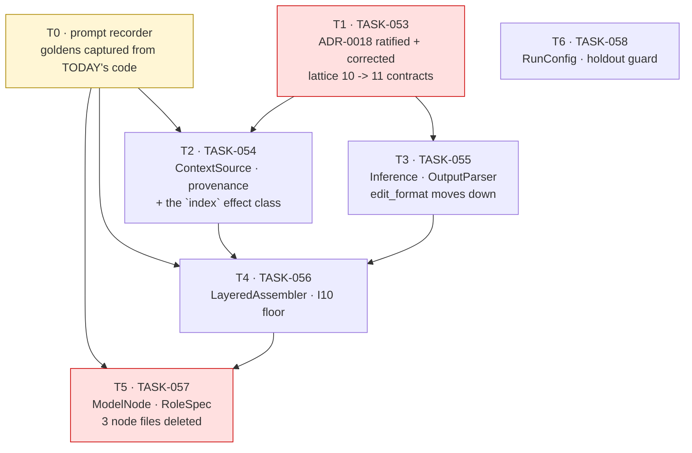

# Sprint 5 Developer Prompt — The Capability Layer

*Handoff prompt for whoever (human or agent) executes Sprint 5. Grounded in the actual tree
as of 2026-08-08, not only in the sprint doc — read this before
[`sprint-05.md`](./sprint-05.md), which is the normative task list this document is
commentary on. Where they disagree, **that file wins and this one is a bug** — except for
the six items in §4, which are places where the planning documents disagree with the code,
and there the code wins over both.*

---

## 1. Where you are picking up

Sprints 1–4 built and then repaired the instrument. Sprint 4 restored I7 (`tests_unmodified`
in `measurement/evaluator.py:104`), deleted the `.py`-token inferrer that could rewrite
`run_tests.py`, demoted test-source injection to `AblationFlags.inject_test_source`, hardened
host subprocesses, and rehearsed the A/A floor end to end. The tree is green:

| Gate | Command | Result, run 2026-08-08 |
| :--- | :--- | :--- |
| tests | `uv run pytest tests/aether tests/conformance tests/integration -q` | **415 passed, 4 skipped** |
| import lattice | `uv run lint-imports` | **10 kept, 0 broken** |
| format (`src/aether/`) | `uv run ruff format --check src/aether/` | **68 files already formatted** |
| lint (`src/aether/`) | `uv run ruff check src/aether/` | **All checks passed** |
| docs budget | `uv run python scripts/docs_budget.py` | **12,539 / 15,000 normative words** |
| links | `uv run python scripts/check_links.py` | **68 files checked, 0 dead links** |

**Two caveats on that green, both true of the working tree you will inherit.**
`uv run ruff format --check .` reports **4 files would be reformatted** and `uv run ruff check .`
reports **7 errors** — every one of them in uncommitted helper scripts
(`scripts/run_aether_task.py`, `scripts/run_aether_demo.py`,
`scripts/compare_ollama_vs_aether.py`) and untracked directories under `src/`, **none in
`src/aether/`**. Clear them or stash them before you start; a red first gate that is not your
fault still costs you the ability to tell when it becomes your fault.

**This sprint adds no capability and claims no lift.** It changes what is *cheap to try*.
Every mechanism it unblocks still has to clear the floor on its own ablation
([`spec.md` §7](../../spec.md#7-measurement)), and one that does not clear is deleted rather
than left dormant. It produces no number, so
[ADR-0002](../../decisions/0002-no-number-before-the-floor.md) does not gate it and it may run
**alongside** the A/A floor run.

**Why it is sequenced before M2 and not after.** Three funded M2/M3 tasks — `TASK-056`
(five-layer assembler), `TASK-024` (compaction), `TASK-033` (cache sequencing) — all name
`src/aether/agency/context/` as their target. That package does not exist, and `.importlinter`'s
`aether-layers` currently reads `(aether.agency) | aether.workflow`, making them *independent
siblings*, so a `WorkflowStep` cannot import from `agency/` at all. **M2 cannot start until T1
lands.** That is the whole reason this sprint is where it is.

---

## 2. Reading order

Read **§2.1 and §2.2 before writing anything.** §2.3 is the plan you are executing. §2.4 is
per-task — read a row when you start that task, not before. §4 is mandatory before you
sequence anything.

### 2.1 Doctrine — why this refactor is allowed to exist at all

| File | Read | Why it matters here |
| :--- | :--- | :--- |
| `docs/architecture/coding_guidelines.md` | **All** (it is short and it is the *how*) | §2.1 is the Protocol+registry template every capability in this sprint copies verbatim. §2.2 is why `ModelNode` has no subclasses. §2.4 is how `agency/` talks to a facade it may not import. §3's refusal table is the list of shortcuts this sprint will tempt you into |
| `docs/architecture/capability_layer.md` | **All** | The design of record. A1–A8 are the eight measured findings this sprint closes; §3.1's four structural constraints are the ones that make or break T5 |
| `docs/vision.md` | §4 | Instruments before capability; every gate ships with a test proving it can fail. T4's prefix floor and T5's golden-prompt test are both gates, so both need one |
| `docs/decisions/0002-no-number-before-the-floor.md` | All (short) | **Reversal Conditions: None.** This sprint touches prompt assembly, which changes resolve rates. Do not report one |

### 2.2 Normative contracts — what the code is not allowed to break

| File | Read | Why it matters here |
| :--- | :--- | :--- |
| `docs/spec.md` | §2 (I1–I11), §3 (structure & lattice), §4 (ports + TCB residency + **additive-only versioning**), §5, §6 | §3 is what T1 edits. §4's additive-only rule is what lets T2 add `"index"` to `EffectRequest.effect_class` without an ADR. §2's I10 is T4's whole reason for existing |
| `docs/PHASE-0-LOCK.md` | §1 (L1, L7, L10), §4, §6 | **L1's own note says the enforced lattice is siblings and ADR-0018's is proposed.** §6 lists what Phase 1 may change without an ADR — new capability implementations in `agency/` are explicitly on it |
| `.importlinter` | the `aether-*` contracts, and read `aether-layers`' trailing comment | 10 contracts today, not 9 (§4.1). T1 edits `aether-layers` and adds one |
| `docs/decisions/0018-agency-below-workflow.md` | **All** | **Status: Proposed.** T1 ratifies it — and corrects two factual errors in it (§4.2) |
| `docs/decisions/0010-context-prefix-layers.md` | All | The L1–L5 table is normative and T4 implements exactly it. The gated metric is *harness-side*, deliberately not a provider hit rate |
| `docs/decisions/0015-taintgate-provenance-model.md` | The binding rule | T2 makes provenance a property of a source. Getting the labels *right* is a separate, sequenced decision — see T2.5 |
| `docs/decisions/0007-architect-editor-seam.md` | All | Why architect and editor are separate roles at all, which is what T5 turns into data |
| `docs/decisions/0014-workflow-topology-is-data.md` | All | Roles extend the same principle one level down |
| `docs/measurement.md` | §5 (gate design), §6 (what a claim needs) | §6's instrument tuple is literally what `sha256(RunConfig)` becomes in T6 |

### 2.3 The plan you are executing

| File | Read | Why |
| :--- | :--- | :--- |
| `docs/agile/sprints/sprint-05.md` | **All** | **The normative task list.** Six tasks, six exit gates |
| `docs/agile/backlog.md` | Epic 5 (`TASK-050`–`058`), plus `TASK-046/047/048`, `TASK-064`, `TASK-083` | Exit criteria in canonical form. Note `TASK-050/051/052` are Sprint 4 carry-over and `TASK-052` is **only half done** (§4.5) |
| `docs/agile/roadmap.md` | the `M1b` row and *"Why M1b sits between the floor and M2"* | The dependency edges bind |
| `docs/STATUS.md` | All | What is claimed today. **You will be editing it** — every green names the command that produced it |
| `docs/agile/sprints/sprint-04-dev-prompt.md` | §3 house rules, §8 anti-drift | Still binding, and §8's "do not create `agency/` yet" expires with this sprint |

### 2.4 The evidence trail — read the row for the task you are on

| File | For which task | The finding it documents |
| :--- | :--- | :--- |
| `capability_layer.md` §1 | T1 | A1–A8, each verified by execution — the measured cost of not having this layer |
| `capability_layer.md` §3.1 | **T5** | The four structural constraints. Get any of them wrong and the refactor fails |
| `capability_layer.md` §7 | T6 | `RunConfig`'s shape and the two modes' opposite requirements |
| `docs/proposals/proposal_sota_gap_analysis.md` | **after** T2 | Localization, ranking, `SearchReplaceFormat`. `TASK-064/066/067`. Real, funded, and **not this sprint** |
| `docs/architecture/knowledge_and_memory.md` §3.2 | T2 | Where "a label is a property of its source" comes from |

### 2.5 The code you will touch

```
.importlinter                                T1  aether-layers + new agency-tcb-isolation contract
docs/decisions/0018-agency-below-workflow.md T1  Proposed -> Accepted, and two corrections
docs/spec.md §3                              T1  the lattice line and the package table
src/aether/domain/context.py                 T2  NEW  ContextBlock, Layer, ContextRequest
src/aether/domain/effects.py                 T2  +    IndexArgs / IndexResult
src/aether/domain/text.py                    T2  NEW  tail_biased moves here (see T1.4)
src/aether/ports/policy_engine.py            T2  +    "index" in the effect_class Literal
src/aether/agency/__init__.py                T1  NEW  the package, created with T1's first real file
src/aether/agency/dispatch.py                T2  NEW  EffectDispatch structural Protocol
src/aether/agency/registry.py                T2  NEW  name -> capability, frozen at composition (I6)
src/aether/agency/capabilities/sources.py    T2  NEW  five ContextSource implementations
src/aether/agency/capabilities/edit_format.py T3 MOVED from workflow/edit_format.py
src/aether/agency/capabilities/inference.py  T3  NEW  SingleTurn, ToolLoop
src/aether/agency/capabilities/parsers.py    T3  NEW  EditFormatParser, PlanParser, LessonParser
src/aether/agency/context/assembler.py       T4  NEW  LayeredAssembler (L1-L5)
src/aether/agency/roles.py                   T5  NEW  ARCHITECT/EDITOR/REPAIRER/REFLECTOR as data
src/aether/workflow/nodes/model_node.py      T5  NEW  the one node class (NOT under agency/, §4.3)
src/aether/workflow/nodes/{architect,generate,repair}.py  T5  DELETED at the end of T5
src/aether/workflow/dispatch_facade.py       T2  +    index()
src/aether/composition.py                    T2  +    _index adapter closure
src/aether/domain/config.py                  T6  +    RunConfig, ModelRoute, SandboxConfig
src/aether/measurement/floor.py              T6  NEW  published_floor() — the holdout guard's predicate
src/aether/engine.py                         T5,T6 registry rewrite; run(config: RunConfig)
scripts/gen_prompt_replay.py                 T0  NEW  the recorder both T4 and T5 gate on
scripts/run_aa_floor.py                      T6  DEFAULT_REPORT path drift (§4.6)
```

---

## 3. House rules

Carried from `sprint-03-dev-prompt.md` and `sprint-04-dev-prompt.md`, still binding:

- **No `--force` flags, ever.** If a check is inconvenient, fix what it is checking.
- **Every gate ships with a negative test proving it can fail.** T4 and T5 each introduce a
  brand-new gate. Neither is done without one.
- **Fail at load, not at the node's turn.** `UnknownEditFormat` and `UnregisteredNodeKind` are
  the precedent; every registry this sprint adds follows it (`UnknownSource`, `UnknownParser`,
  `UnknownRole`, `UnknownInference`).
- **`GateStatus.NONE` is not `FAILED`.** Unchanged, and nothing in this sprint touches it.
- **TCB residency is an import-linter contract, not a convention.** Check `.importlinter`
  *before* you write a module.
- **A number without its instrument tuple is not a result.**
- **Wire-serializable payloads, JSON descriptors through the dispatcher.**

Four more that this sprint specifically will test:

- **A refactor that changes a prompt byte is not a refactor.** T5's gate is byte-identical
  prompts across every shipped topology. If you find yourself "improving" a prompt while
  moving it, stop: that is a mechanism change, it needs its own ablation, and it belongs in
  a different commit with a different name.
- **Capture the *before* image before you touch anything.** T0 exists for exactly this. Once
  T2 has rewritten the ten `TaintSpan(...)` call sites there is no baseline left to compare to,
  and T5's exit gate becomes unprovable.
- **A protocol arrives with two implementations or it is not a protocol.** One implementation
  behind an interface is indirection with extra steps. Every capability in T2/T3 ships with at
  least two, or it ships as a function.
- **`agency/` is created in the same commit as its first real file.** ADR-0018's own
  Enforcement section names this trap: a contract that selects zero modules forbids nothing and
  passes green. Do not land an empty package and a lattice edit in one commit and the contents
  in the next.

---

## 4. Read this before sequencing — six places the plan and the code disagree

Each was verified by command or line-level read on 2026-08-08. Fixing them **is** part of the
tasks they belong to; none is a separate deliverable.

### 4.1 `lint-imports` is **10 contracts, not 9**

`sprint-05.md` Task 1 AC2, ADR-0018's Enforcement section and `backlog.md` `TASK-053` all say
*"stays 9/9 with `agency` populated."* Verified:

```
$ uv run lint-imports
Contracts: 10 kept, 0 broken.
```

The tenth is `aether-workflow-tcb-isolation`, added by Sprint 4's forensic-audit finding F11.
ADR-0018's *"Contract count stays at 9"* was written before it existed. **T1 raises it to 11**
(§4.2), so the exit gate reads **11 kept, 0 broken** — and the exit gate in `sprint-05.md`
must be corrected in the same change, or you will be checking a number nobody can reach.

### 4.2 ADR-0018's stated guarantee is **not** the guarantee its contracts enforce

ADR-0018 §"What does not change" says:

> `agency/` cannot import `workflow/`, `measurement/`, or the evaluator. Layer order forbids
> it, and `aether-tcb-isolation` names `aether.agency` as a forbidden importer of
> `measurement.evaluator` explicitly.

**Both halves are wrong, and in the same direction.**

- After the proposed lattice `workflow > agency > measurement`, layer order forbids
  `measurement → agency`. It **permits** `agency → measurement` — that is what a downward edge
  *is*. The ADR reads its own diagram backwards.
- `aether-tcb-isolation` has `source_modules = kernel.policy, kernel.dispatch,
  measurement.evaluator, measurement.manifest, measurement.statistics` and
  `forbidden_modules = agency, workflow, evolution, adapters`. It names `aether.agency` as a
  forbidden **importee**, not a forbidden **importer**. The direction is reversed.

So after T1 lands as written, nothing stops `agency/capabilities/verdict.py` from importing
`RealEvaluator` and constructing a second judge. That is not a style problem: **I7 is the
invariant that there is exactly one judge**, and the whole reason `capability_layer.md` §2.2
declares the `Verdict` capability *deliberately closed*.

**T1 makes the ADR's own sentence true by adding the contract it claims exists:**

```ini
[importlinter:contract:aether-agency-cannot-reach-the-judge]
name = AETHER: the mutable capability layer cannot reach the TCB judge (I7, ADR-0018)
type = forbidden
source_modules =
    aether.agency
forbidden_modules =
    aether.workflow
    aether.measurement
    aether.evolution
# `aether-layers` already forbids agency -> workflow by layer order; this contract states it
# explicitly and additionally forbids agency -> measurement, which layer order PERMITS because
# measurement sits below agency. Without this, a capability could construct a RealEvaluator and
# produce its own GateReport — a second judge, which is the one thing I7 forbids. ADR-0018's
# prose already claimed this constraint; until this contract existed the claim was enforced by
# nothing, which is the exact failure mode ADR-0006 names about itself.
```

Note the ordinary cost this imposes, and pay it rather than routing around it: `agency/` may
not import `measurement.pricing` either. T3 needs a cost estimate and T2 needs `tail_biased`;
both are handled in T1.4 and T3.3 by moving the pure helper down into `domain/`, **not** by
adding an `ignore_imports` entry. ADR-0018's third reversal condition says exactly this:
an `ignore_imports` entry here is evidence the boundary is in the wrong place, and the response
is a new ADR, not a suppression.

### 4.3 `ModelNode` lives in `workflow/nodes/`, not `agency/nodes/`

`backlog.md` `TASK-057` names `src/aether/agency/nodes/model_node.py`. `capability_layer.md`
§3.1 and `sprint-05.md` Task 5 both name `src/aether/workflow/nodes/model_node.py`.

**The latter is correct.** `WorkflowStep` is defined in `workflow/step.py`. After ADR-0018,
`agency` sits *below* `workflow`, so a node under `agency/` importing `WorkflowStep` is an
upward import and breaks `aether-layers`. The backlog line is a bug; fix it in T5's commit.

### 4.4 `SymbolSource` has **no dispatch path** — this is T2's hidden cost

`sprint-05.md` Task 2 AC4 says *"`SymbolSource` wraps `TreeSitterIndexer` — a
conformance-passing adapter that is today reachable from no node and no topology."* True. What
is not said is *why* it is unreachable, and it is not an oversight anyone forgot to wire:

```python
# src/aether/ports/policy_engine.py:14
effect_class: Literal["read", "write", "shell", "network", "model", "evaluate"]
```

There is no `index`. `DispatchFacade` (`workflow/dispatch_facade.py`) has five verbs and none
of them is search. `composition.build_adapter_table` has no indexer closure, and `engine.run`
never constructs a `TreeSitterIndexer`. So `SymbolSource` has exactly two ways to exist, and
one of them is forbidden:

| Option | Verdict |
| :--- | :--- |
| `SymbolSource` holds an `Indexer` handle directly | **Refused.** I5: every effect passes `kernel/dispatch.py`. A capability holding an adapter handle is a second path to the filesystem, which is the thing the choke point exists to make impossible |
| Add an `index` effect class end to end | **Correct.** Five small additive edits, spelled out in T2.4 |

`spec.md` §4's port-versioning rule covers this: *"a new optional method or an added optional
field is a minor change; anything that breaks an existing adapter is a new protocol name."*
Adding a member to `EffectRequest.effect_class` breaks no existing adapter — every current
caller keeps validating. **No ADR, no new port.** But budget for it: it is four files plus a
negative test, and it is the difference between AC4 being met and being quietly dropped.

### 4.5 `Envelope` is only half-landed — `TASK-052` is carry-over, not done

Sprint 4's T4c is recorded complete. Verified:

```
$ grep -rn "Envelope" src/aether/ --include=*.py
src/aether/domain/envelope.py:28:class Envelope(Frozen):
src/aether/workflow/nodes/retrieve.py:30:class TaskInput(Envelope):
src/aether/workflow/nodes/retrieve.py:34:class RetrievedContext(Envelope):
```

`GeneratedPatch` (`generate.py:57`), `AppliedPatch` (`apply.py:26`) and `EvaluatedCandidate`
(`evaluate.py:26`) still declare `task: Task` and `worktree: WorktreeRef` on a bare `Frozen`.
Three of the four payloads never got the base. This matters now rather than as tidiness:
`ModelNode.run` ends in `parser.parse(reply).into(payload)`, and `into` needs **one** envelope
shape to copy forward. **Finish it in T5, and keep the four classes nominally distinct** —
`validator.check_socket_compatibility` tells node kinds apart by socket *type name*, and
collapsing them defeats the check.

### 4.6 `run_aa_floor.py` writes its report to a directory that does not exist

Not a Sprint 5 task, and T6 depends on it, so discover it now:

```python
# scripts/run_aa_floor.py:71
DEFAULT_REPORT = REPO_ROOT / "docs" / "rationale" / "benchmarks" / "noise-floor.md"
```

`docs/rationale/` does not exist. The real file is `docs/benchmarks/results/noise-floor.md`.
And `_write` (line 242) does `path.parent.mkdir(parents=True, exist_ok=True)`, so the floor run
**silently creates a stray tree**, writes the report into it, and leaves the canonical
`noise-floor.md` reading *"not yet taken"* — while `STATUS.md` would be updated by hand to say
the floor was taken. That is the "gate reported green while red" class this project keeps
finding, one directory over.

`tests/unit/test_path_constant_drift.py` guards `.importlinter` source modules and `TCB_PATHS`
and nothing else, so no gate catches it. **T6 fixes the constant and extends the drift test to
cover script output-path constants**, because T6's holdout guard reads that artifact and a
guard pointed at a path nothing writes is worse than no guard.

**This has been found before and is still open**, which is the argument for the gate rather
than the fix: an archived review already recorded the same `docs/rationale/benchmarks/` drift
across `sprint-03.md`, `sprint-04.md`, `sprint-04-dev-prompt.md` and `sprints/README.md`. It
was written down, it was not enforced by anything, and the constant is unchanged in the tree
today. A finding with no gate behind it is a note, and notes do not survive four sprints.

---

## 5. The six tasks

### T0 — the prompt recorder · **do this first, before T2 touches a span**

> Not a seventh task. It is the first hour of T4 and T5, pulled forward because **both** need a
> *before* image and T2 destroys it.

T4's exit gate is prefix stability over "a fixed replay". T5's exit gate is byte-identical
prompts "before and after". Neither fixture exists. Build one recorder that serves both.

**What is recorded.** Not `TaintSpan` objects — they carry `created_at=datetime.now(UTC)` and
`span_id=SpanId(f"{node_id}-...")`, so an object-level comparison is guaranteed to differ on
every run and would make the gate unusable. Record **the wire text a provider actually
receives**, which is what `adapters/model_provider/openai_compatible.py:34` already defines:

```python
# scripts/gen_prompt_replay.py
def wire_form(request: ModelRequest) -> dict[str, Any]:
    """The bytes that reach the endpoint, and nothing else.

    Deliberately excludes span_id, created_at and source: they are harness
    bookkeeping, they differ on every run by construction, and a golden keyed
    to them tests the clock. `label` IS included — a provenance change is a
    real change and T2 is allowed to make one only on purpose (T2.5).
    """
    return {
        "model": request.model,
        "max_tokens": request.max_tokens,
        "temperature": request.temperature,
        "tools": [t.model_dump(mode="json") for t in request.tools],
        "messages": [
            {
                "role": m.role,
                "text": "".join(s.text for s in m.spans),
                "labels": [s.label.value for s in m.spans],
                "cache_breakpoint": m.cache_breakpoint,
                "tool_calls": [c.model_dump(mode="json") for c in m.tool_calls],
                "tool_call_id": m.tool_call_id,
            }
            for m in request.messages
        ],
    }
```

**How it is driven.** A stub provider that returns a fixed, deterministic completion per node
kind and captures every `ModelRequest` that reaches it. `scripts/run_aa_floor.py`'s `--dry-run`
stub SSE endpoint is the precedent — read it before writing a second one. Run every file in
`workflows/*.yaml` against one pinned fixture task and write:

```
tests/fixtures/aether_prompt_replay/
├── manifest.json                       # topology file -> sha256 of the topology, recorder version
├── linear_v1/000-generate.json
├── linear_repair_v1/000-generate.json
├── linear_repair_v1/001-repair.json    # iteration 1 — the repair prompt is a different prompt
├── decomposed_planning_v1/000-architect.json
├── decomposed_planning_v1/001-generate.json
└── ...
```

Seven topologies × their model nodes. `hybrid_architect_editor_v1.yaml` is included as a
*recording* — see the anti-drift table before you try to *run* it.

**Two gates come out of this, and both are new:**

```python
# tests/aether/agency/test_golden_prompts.py         (T5's gate)
def test_every_shipped_topology_produces_the_recorded_prompt() -> None:
    """Byte-identical wire form, per topology, per model node. This is the
    entire safety argument for deleting three node classes."""


# tests/aether/agency/test_prefix_stability.py       (T4's gate)
def test_l1_l4_prefix_is_byte_identical_across_every_request_in_a_run() -> None:
    """I10's mechanism. L1-L4 never mutate within a run by construction, so the
    gated rate is exactly 1.0 and anything less is a defect, not a tuning knob."""
```

**Regenerating the goldens is a reviewed act, not a convenience.** `--update` on the recorder
is fine; a reviewer seeing `tests/fixtures/aether_prompt_replay/**` in a diff must be able to
read what changed in the prompt. That is the whole value. Say so in the script's docstring.

---

### T1 — `TASK-053`: ADR-0018 and the lattice change · **blocks T2–T5**

> Exit criteria: `backlog.md` `TASK-053`. Design: ADR-0018.

**Verified state:** `.importlinter`'s `aether-layers` reads
`(aether.agency) | aether.workflow` — parenthesised because the package does not exist, and
piped because they are siblings. `src/aether/agency/` is absent.

#### T1.1 — the lattice edit

```diff
 layers =
     aether.engine
-    (aether.agency) | aether.workflow
+    aether.workflow
+    aether.agency
     aether.measurement
     aether.kernel
     aether.adapters
     aether.ports
     aether.domain
```

Drop the parentheses. They exist because import-linter treats a parenthesised layer as
optional rather than erroring on a missing module; the moment `agency/` has a real file the
parentheses become the vacuous-contract trap ADR-0018's Enforcement section names. Update
`aether-layers`' trailing comment in the same edit — it currently explains why `agency` is
parenthesised, and that explanation is about to be false.

#### T1.2 — the contract ADR-0018 claims already exists

Add `aether-agency-cannot-reach-the-judge` exactly as written in **§4.2**. Contract count goes
**10 → 11**.

#### T1.3 — the ADR, ratified and corrected

- `Status: Proposed` → `Status: Accepted · Date: 2026-08-08 · Ratified by TASK-053`.
- Correct the two errors in "What does not change" (§4.2). State plainly that layer order
  *permits* `agency → measurement` and that the new contract is what forbids it. An ADR that
  misdescribes its own enforcement is worse than one with no enforcement section, because it
  stops the next reader from checking.
- Correct `Neutral. Contract count stays at 9.` → `Contract count goes from 10 to 11: this ADR
  corrects one contract and adds one.`
- The reversal conditions stay verbatim. Do not soften them.

#### T1.4 — the two downward moves the new contract forces

`agency/` may no longer import `measurement/`. Two pure helpers currently live there and are
needed above:

| Helper | Today | Move to | Why it is safe |
| :--- | :--- | :--- | :--- |
| `tail_biased(text, limit)` | `measurement/evaluator.py:95` | `domain/text.py` | Six lines, `return text[-limit:]`, no I/O, no imports. `domain-is-pure` is satisfied trivially. Re-export from `evaluator.py` for one release so `workflow/nodes/repair.py` and the evaluator's own callers keep working |
| the priced cost estimate | `measurement/pricing.py::priced` | **stays put** | T3 does *not* move pricing. See T3.3 — the reservation estimate is expressed in `BudgetDims` token dimensions, and `usd_micros` is filled by `composition.py`'s `_model` closure at the one place that knows both the model and the real token counts. Do not duplicate that |

**The `tail_biased` move is the one that matters**, because `GateOutputSource(tail=3000)` in T2
is a direct replacement for `repair.py:76`'s call and must truncate identically — *"the gate
keeps the fuller detail for the trajectory, the prompt pays tokens for it"* is a property of
the pair, not of either side.

#### T1.5 — `spec.md` §3

Update the lattice line and the package table's `agency/` row to `workflow > agency`. This is
the **only normative-word edit in the sprint**; keep it to the two lines. Budget headroom is
2,461 words and T6 does not need any of it.

#### T1.6 — gates

```python
# tests/unit/test_path_constant_drift.py — already asserts no contract selects zero modules.
# Confirm it still passes with agency populated; if agency/ lands empty it will not.

# tests/aether/agency/test_lattice.py
def test_an_agency_module_importing_workflow_breaks_lint_imports() -> None:
    """Write a temp module under agency/ that imports aether.workflow.step,
    shell out to lint-imports, assert non-zero and assert the contract name
    appears. Then delete it. ADR-0018's Enforcement section requires exactly
    this negative test, and a lattice with no proof it can fail is a comment."""


def test_an_agency_module_importing_the_evaluator_breaks_lint_imports() -> None:
    """The one §4.2 exists for. Same shape, importing
    aether.measurement.evaluator, asserting `aether-agency-cannot-reach-the-judge`."""
```

**T1 is done when `agency/` contains its first real file**, which means T1 and T2's first
capability land together or T1 lands a package that forbids nothing.

---

### T2 — `TASK-054`: `ContextSource`, and provenance declared once

> Exit criteria: `backlog.md` `TASK-054`. Closes audit findings **A4** and **A5**.

**Verified state:**

```
$ grep -rc "TaintSpan(" src/aether/workflow/nodes/*.py
architect.py:5   generate.py:3   repair.py:2      # ten sites, three files
```

Two independent implementations of "read files into a prompt block":
`retrieve.py:63-89` (byte budget, publishes `missing`) and `repair.py:122-132` (no budget,
swallows every exception into a string). They disagree about truncation *and* about what a
missing file means.

#### T2.1 — the domain types

```python
# src/aether/domain/context.py  (NEW — pure, no I/O, I1)
from enum import IntEnum

from aether.domain.ids import Frozen
from aether.domain.taint import Provenance


class Layer(IntEnum):
    """ADR-0010's five prefix layers. IntEnum so ordering is the ordering —
    an assembler that sorts by layer cannot emit L5 before L4 by accident."""

    L1_SYSTEM = 1      # system prompt, policy text, standing instructions
    L2_TOOLS = 2       # tool schemas (frozen at composition, I6)
    L3_REPO = 3        # generated repo brief — THE ablated layer (ADR-0010)
    L4_TASK = 4        # task statement
    L5_DIALOGUE = 5    # dialogue, trajectory, tool output — the only layer that moves


class ContextBlock(Frozen):
    """One labelled slice of prompt content.

    `label` is set by the SOURCE and never by the node. That single sentence is
    the whole of finding A4: provenance was a decision made ad hoc at ten call
    sites, which is how repository file slices and test tracebacks both came to
    be labelled `Provenance.AGENT`.
    """

    layer: Layer
    label: Provenance
    heading: str        # "=== mod.py ===" — rendered, so it is part of the golden
    text: str
    source_id: str      # which source produced it; for trajectory and for ablation accounting
```

#### T2.2 — the protocol, and the registry template

Copy `edit_format.py` verbatim. It is the template `coding_guidelines.md` §2.1 names and it is
the best abstraction in the codebase for one reason: *the thing that asks and the thing that
reads the answer are one object, so they cannot disagree.*

```python
# src/aether/agency/capabilities/sources.py
@runtime_checkable
class ContextSource(Protocol):
    """What goes in the prompt, and under whose authority."""

    name: str
    layer: Layer
    label: Provenance     # declared ONCE, here, per source class

    async def gather(self, dispatch: EffectDispatch, req: ContextRequest) -> tuple[ContextBlock, ...]:
        ...


SOURCES: dict[str, type[ContextSource]] = {...}


class UnknownSource(Exception):
    """Raised at construction. A role naming a source nobody implements must
    fail at load, not at the moment the first prompt is assembled."""


def get_source(name: str, **params: Any) -> ContextSource: ...
```

`ContextRequest` is the read-only view a source gets. It must not be `RetrievedContext` or
`EvaluatedCandidate` — those live in `workflow/nodes/` and `agency` may not import them:

```python
# src/aether/domain/context.py
class ContextRequest(Frozen):
    """Everything a source may look at. A frozen projection of whatever payload
    the node holds, built by ModelNode — which is why sources are testable with
    no worktree, no executor and no topology."""

    task: Task
    worktree: WorktreeRef
    instructions: str
    entry_files: tuple[str, ...] = ()
    plan: str = ""                       # architect output, if any (TASK-048)
    previous_attempt: str = ""           # the patch text being repaired
    gate_detail: str = ""                # the failing test output
    iteration: int = 0
    max_bytes: int = 20_000
```

#### T2.3 — the five implementations, and the one byte-budget policy

| Source | Layer | Label | Replaces | Notes |
| :--- | :--- | :--- | :--- | :--- |
| `InstructionsSource` | L4 | `OPERATOR` | `generate.py:104-110`, `architect.py:53-59` | The task statement is operator-authored. This is the only `OPERATOR` label in the set |
| `EntryFileSource` | L3 | `AGENT` | `retrieve.py:63-89` | Owns the byte budget and `missing` |
| `CurrentFileSource` | L5 | `AGENT` | `repair.py:122-132` | Re-reads the worktree *after* an attempt. Same budget policy, same `missing` semantics — that is the point |
| `PreviousAttemptSource` | L5 | `AGENT` | `repair.py:75` | The model's own prior output |
| `GateOutputSource(tail=N)` | L5 | `AGENT` | `repair.py:76`, `architect.py:112-123` | **Uses `domain.text.tail_biased`, not a second truncation** |
| `PlanSource` | L4 | `AGENT` | `architect.py:92` | Model-authored, and today it is concatenated into an `OPERATOR` instruction string. See T2.5 |
| `SymbolSource(query=…)` | L3 | `AGENT` | *(nothing — new reach)* | Wraps `TreeSitterIndexer` through the choke point. §4.4 |

**One budget policy, stated once:**

```python
def _budgeted(self, paths, req, read) -> tuple[list[ContextBlock], list[str]]:
    """`retrieve.py`'s policy, promoted, because it is the one that publishes
    what it dropped. `repair.py`'s copy had no ceiling and swallowed errors into
    a string the model then read as content.

    Truncation and unreadability are BOTH published in `missing`, never
    silently skipped: "the model was not shown the file" and "the model was
    shown the file and failed" are different diagnoses, and the second is only
    believable when the first is excluded (coding_guidelines.md §2.5).
    """
```

`missing` must reach the caller. `RetrievedContext.missing` exists today and must survive the
refactor: it is a published-exclusion field, and silent exclusion is the overfitting vector.

#### T2.4 — the `index` effect class, end to end (§4.4)

Five edits, all additive:

```python
# 1. src/aether/ports/policy_engine.py
effect_class: Literal["read", "write", "shell", "network", "model", "evaluate", "index"]

# 2. src/aether/domain/effects.py
class IndexArgs(Frozen):
    worktree: WorktreeRef
    query: str
    limit: int = 20


class IndexResult(Frozen):
    hits: tuple[SymbolHit, ...] = ()

# 3. src/aether/workflow/dispatch_facade.py
async def index(self, args: IndexArgs, cost_estimate: BudgetDims = _ZERO_BUDGET) -> IndexResult:
    outcome = await self._dispatch("index", args.model_dump_json(), cost_estimate)
    assert outcome.result_json is not None
    return IndexResult.model_validate_json(outcome.result_json)

# 4. src/aether/composition.py — inside build_adapter_table
async def _index(request: EffectRequest, lease: Lease) -> EffectOutcome:
    args = IndexArgs.model_validate_json(request.descriptor)
    await indexer.build(args.worktree)     # per-worktree, held in process memory
    hits = await indexer.search(args.worktree, args.query, args.limit)
    return EffectOutcome(status="ok", result_json=IndexResult(hits=hits).model_dump_json())

# 5. src/aether/engine.py — construct TreeSitterIndexer(worktrees_root) and pass it in
```

**`DefaultPolicyEngine` needs no change.** An index read does not widen capability, so
`widens_capability=False` and the I11 predicate is not consulted — the same treatment `read`
already gets. Do not set `widens_capability=True` "to be safe": it would make every symbol
lookup fail closed the moment repository content is correctly labelled, which is precisely the
sequencing trap recorded against `TASK-030a`.

Two negative tests:

```python
def test_an_unregistered_effect_class_still_raises_before_a_lease_exists() -> None:
    """F4's guarantee must survive a widened Literal. Adding a member to the
    enum is exactly the change that made UnknownEffectClass reachable."""


def test_symbol_source_reaches_tree_sitter_through_the_dispatcher() -> None:
    """The AC that was unmeetable before this sub-task: assert the adapter is
    reached AND that the source holds no Indexer handle (I5)."""
```

#### T2.5 — the labels you are allowed to change, and the one you are not

T2 makes labels a *property of a source*. It is not licence to make them *correct*.

- **`PlanSource` is the one genuine label change**, and it is a fix: today `architect.py:92`
  concatenates model-authored plan text into `payload.instructions`, which
  `generate.py:104-110` then labels `Provenance.OPERATOR`. That is model output acquiring
  operator authority through string concatenation — `TASK-048`'s finding, and the exact I11
  shape. Under T2 the plan is its own block with its own label and cannot be merged. Because
  the merged form is currently *indistinguishable in the wire text*, this change is
  **invisible to the golden-prompt comparison of `text`, and visible in `labels`** — which is
  why T0's `wire_form` records labels. Record it in `STATUS.md` as an intentional golden
  update with the reason.
- **Repository content stays `AGENT`.** `spec.md` §5 says it should be
  `UNTRUSTED_EXTERNAL`. Labelling it correctly today makes `DefaultPolicyEngine` fail closed on
  **every** shell tool call, because `DispatchFacade.shell` passes `widens_capability=True`.
  That is recorded in `STATUS.md`'s deviations, in `backlog.md` `TASK-048`, and in
  `TASK-030b`, all of which sequence it behind the shell AST classifier. **Do not fix it in
  this sprint.** Note in the source class docstring that the label is a sequenced deviation,
  with the task number, so the next reader does not think it was a judgement call made here.

#### T2.6 — exit gate

```
$ grep -rn "TaintSpan(" src/aether/workflow/nodes/     # must return nothing after T5
$ grep -rln "TaintSpan(" src/aether/agency/capabilities/  # must return the assembler only
```

`sprint-05.md`'s gate says *"`TaintSpan(` appears in `agency/capabilities/`, nowhere in
`workflow/nodes/`."* Precise form: **exactly one construction site**, in the assembler
(T4), which turns a `ContextBlock` into a `TaintSpan` carrying the block's own label. Sources
produce `ContextBlock`s and never `TaintSpan`s. That is what makes A6 structurally impossible
rather than merely discouraged — a node cannot concatenate model output into an
`OPERATOR`-labelled string because it never touches strings.

---

### T3 — `TASK-055`: one `Inference`, one `OutputParser`

> Exit criteria: `backlog.md` `TASK-055`. Closes **A3**.

**Verified state:**

```
$ grep -rn "prompt_tokens=self._max_tokens" src/aether/
architect.py:88   architect.py:139   generate.py:164   repair.py:180
```

Four sites, one bug, four copies: `max_tokens` is a **completion** ceiling and every one of
them reserves it in the `prompt_tokens` dimension. And the collect idiom
(`"".join(e.text for e in events if isinstance(e, TextDelta))`) is written five times across
the tree.

#### T3.1 — the protocol and two implementations

```python
# src/aether/agency/capabilities/inference.py
class InferenceResult(Frozen):
    text: str
    stop_reason: StopReason = "end"
    rounds: int = 1


@runtime_checkable
class Inference(Protocol):
    """How the model is called and how its stream is reduced."""

    name: str

    async def invoke(
        self, dispatch: EffectDispatch, request: ModelRequest, spans: tuple[TaintSpan, ...]
    ) -> InferenceResult: ...


class SingleTurn:
    """One request, collect deltas, stop. Today's architect / reflector / repair."""

    name = "single_turn"


class ToolLoop:
    """`generate.py:157-212`'s MAX_ROUNDS loop, promoted.

    Two properties come free once it is behind the protocol. Any role can use
    it — today a planner that wants to list the repository structurally cannot,
    because the loop exists only inside GenerateStep. And the `justifying`
    accumulation (F5) is written once instead of being a property one node
    happens to have: tool output is UNTRUSTED_EXTERNAL at birth and is fed back
    to the model, so from round 2 it can steer a tool call, and the spans
    justifying the NEXT call are not the spans that justified the first.
    """

    name = "tool_loop"
    MAX_ROUNDS = 4
```

**Port `ToolLoop` from `generate.py` line by line and change nothing.** The assistant
`tool_calls` message preceding the `tool` results, and the `tool_call_id` on each result, are
protocol requirements every OpenAI-compatible endpoint enforces; Sprint 2 shipped neither and
it went unnoticed because the path had only run against mocks that returned no tool calls.
That is not a detail to re-derive from memory.

#### T3.2 — the reservation fix

```python
def _reserve(self, request: ModelRequest, prompt_estimate: int) -> BudgetDims:
    """`max_tokens` is a COMPLETION ceiling. All four pre-M1b sites reserved it
    as `prompt_tokens` — one bug, four copies (A3).

    `usd_micros` stays 0 here on purpose and this is not the same bug. The
    dollar figure is filled by `composition.py`'s `_model` closure, at the one
    place that knows both the model and the REAL token counts, and F3 made the
    ledger debit an overrun rather than clamping the refund at zero. Estimating
    dollars here as well would give the governor two disagreeing numbers for
    the same effect. Moving the DENIAL onto the offending call is TASK-044's
    remaining scope and is not this sprint.
    """
    return BudgetDims(prompt_tokens=prompt_estimate, completion_tokens=request.max_tokens)
```

`prompt_estimate` comes from `ModelProvider.count_tokens` — the port already declares it and
`composition.py:93` already falls back to it when a provider reports no usage.

**Expect the reservation change to be visible.** Node budgets in `workflows/*.yaml` declare
`prompt_tokens` and `completion_tokens` separately; a topology whose `completion_tokens` is
smaller than its node's `max_tokens` will now be denied where it previously was not. That is
the ceiling starting to work. Fix the topology, do not weaken the reservation — and note in
the commit which topologies moved.

#### T3.3 — `OutputParser`

```python
# src/aether/agency/capabilities/parsers.py
@runtime_checkable
class OutputParser(Protocol):
    """How the reply is read — and, beside it, what was asked for."""

    name: str

    def instructions(self) -> str: ...
    def parse(self, raw: str) -> ParsedOutput: ...
```

Implementations: `EditFormatParser(fmt_name)` (delegates to the existing `EditFormat`),
`PlanParser`, `LessonParser`, `PassthroughText`.

**`edit_format.py` moves to `agency/capabilities/edit_format.py` and is not otherwise
touched.** It is pure (`aether.domain.ids.Frozen` is its only import) and it is consumed by
both `ApplyStep` in `workflow/` (downward — legal) and the new parsers in `agency/`. Leave a
re-export shim at `workflow/edit_format.py` for one release; `apply.py`, `generate.py`,
`repair.py` and `engine.py` all import from there today, and T5 deletes three of those four
files anyway.

`ParsedOutput` needs one method that does not exist yet:

```python
class ParsedOutput(Frozen):
    def into(self, payload: EnvelopeT) -> EnvelopeT:
        """Fold this parse into the node's output payload.

        The reason §4.5 matters: `into` needs ONE envelope shape to copy
        forward. Three of the four node payloads still declare `task` and
        `worktree` on a bare Frozen, so T5 finishes TASK-052 before this
        method can be written honestly.
        """
```

#### T3.4 — exit gate

`sprint-05.md` says *"`grep -c "TextDelta)" src/aether/` returns 1."* Verified today it returns
**5**: `runner.py:191`, `repair.py:182`, `architect.py:89`, `architect.py:140`,
`generate.py:168`. Four of those five are deleted by T3+T5. **The fifth,
`measurement/runner.py:191`, is `BareModelHarness` — a TCB-side measurement harness that
`agency/` may not be imported by and must not import from.** It stays. So the honest gate is:

```bash
grep -rn "TextDelta)" src/aether/ | grep -v measurement/runner.py | wc -l   # must be 1
```

Correct the gate in `sprint-05.md` rather than deleting a line of `runner.py` to make a number
come out right.

---

### T4 — `TASK-056` (was `TASK-031`): `PromptAssembler` and the five layers

> Exit criteria: `backlog.md` `TASK-056`. Normative: ADR-0010, `spec.md` §2 (I10).
> **This closes one of the four invariants `PHASE-0-LOCK.md` §4 records as enforced by nothing.**

**Verified state:** prompt layering is `f"{payload.instructions}\n\n## Architect Plan\n{plan}"`
at `architect.py:92` and `f"{payload.task.instructions}\n\n## Reflection..."` at
`architect.py:144-148`. There is no object that holds layers, so I10 has nothing to gate.

#### T4.1 — the assembler

```python
# src/aether/agency/context/assembler.py
class LayeredAssembler:
    """ADR-0010's five layers, in fixed order, as the only path from blocks to
    a ModelRequest.

    Compaction operates on L5 only, and that is enforced by type rather than by
    discipline: this class exposes no API that can rewrite L1-L4 (TASK-024).
    """

    name = "layered_v1"

    def assemble(
        self,
        *,
        role: str,
        blocks: tuple[ContextBlock, ...],
        contract: str,
        model: str,
        max_tokens: int,
        tools: tuple[ToolSpec, ...] = (),
        node_id: str,
    ) -> ModelRequest: ...
```

**The layer → wire mapping, stated once because it is the part that is easy to get wrong:**

| Layer | Where it lands on the wire | Mutates within a run? |
| :--- | :--- | :--- |
| L1 | the `system` message: `role` text + the parser's `contract` | Never |
| L2 | `ModelRequest.tools` — **not a message** | Never (catalog frozen at composition, I6) |
| L3 | a `user` message, repo brief blocks | Never |
| L4 | a `user` message, task blocks | Never |
| L5 | subsequent messages | **Every turn** |

One message per layer boundary, so a `cache_breakpoint` can sit on a message boundary. Three
breakpoints are used (end of L1, L3, L4); L2 is not a message, so the fourth is spare. **At
most four** is ADR-0010's ceiling and the assembler asserts it.

`openai_compatible.py:40` records that `cache_breakpoint` is deliberately not emitted on the
wire for OpenAI-compatible endpoints — they cache implicitly on a stable prefix. It is a
harness-side layout fact there and becomes a wire field only in an Anthropic adapter. Do not
"fix" that adapter.

#### T4.2 — the one `TaintSpan` construction site

```python
def _span(self, block: ContextBlock, node_id: str, ordinal: int) -> TaintSpan:
    """The ONLY place a TaintSpan is constructed from context in this tree.

    It carries the block's own label. A node cannot launder provenance by
    concatenating, because a node never touches strings — it hands blocks to
    this method (capability_layer.md §3.2, closing A4 and A6).
    """
    return TaintSpan(
        span_id=SpanId(f"{node_id}-{block.layer.name.lower()}-{ordinal}"),
        label=block.label,
        text=f"{block.heading}\n{block.text}" if block.heading else block.text,
        source=block.source_id,
        created_at=datetime.now(UTC),
    )
```

#### T4.3 — the gate, and what it is honestly measuring

```python
# src/aether/agency/context/stability.py
def stable_prefix(request: ModelRequest) -> str:
    """Canonical bytes of everything through L4: role|text per message up to
    the first L5 message, plus the canonical tools JSON."""


def prefix_stability(requests: Sequence[ModelRequest]) -> float:
    """Fraction of requests in one run whose L1-L4 prefix is byte-identical to
    the first request's."""
```

**The gate is `prefix_stability(replay) == 1.0`.** Not 0.92. ADR-0010's >92% figure is a
*cache-hit-rate* target to calibrate against our own replay, and `spec.md` §9 forbids a number
we did not measure from entering a regression gate. L1–L4 do not mutate within a run **by
construction**, so anything below 1.0 is a defect and a threshold below 1.0 would just hide it.

Report `stable_prefix_byte_share` — what fraction of total prompt bytes sit in the stable
prefix — as an **observation with no threshold**, in the T4 write-up. It is the number that
will eventually calibrate ADR-0010's target, and it is not a gate until it has been measured
on a real run.

The negative test is the one that makes it a gate:

```python
def test_prefix_stability_goes_red_when_a_layer_mutates() -> None:
    """Mutate an L4 block between two requests in the replay and assert the
    rate drops below 1.0. A gate that cannot fail is not counted as a gate
    (measurement.md §5)."""


def test_assembler_rejects_a_fifth_cache_breakpoint() -> None:
    """ADR-0010 caps it at four. Raise at assembly, not at the provider."""


def test_the_assembler_exposes_no_way_to_rewrite_l1_through_l4() -> None:
    """TASK-024's precondition, asserted now while there is no compactor to
    tempt anyone."""
```

#### T4.4 — CI

Add the replay gate to the standing suite. It runs against a checked-in fixture and makes no
network call, so it belongs in `tests/aether/`, not in `tests/integration/`.

---

### T5 — `TASK-057`: `ModelNode` + `RoleSpec`

> Exit criteria: `backlog.md` `TASK-057`. Absorbs `TASK-046` and `TASK-047`.
> **The risk in this task is silent prompt drift, which is why the gate is T0's goldens and
> not unit coverage.**

**Verified state:** `architect.py` 153 lines, `generate.py` 222, `repair.py` 199 — 574 lines
answering the same five questions three different ways. `engine.py:82-132` holds seven
near-identical factory closures, so registering a kind means editing the assembly root: the one
file ADR-0014 wanted to stop editing (**A8**).

#### T5.1 — the four structural constraints (`capability_layer.md` §3.1)

Get any of these wrong and the refactor fails. They are not preferences.

| Constraint | Consequence of breaking it |
| :--- | :--- |
| **Node *kinds* stay distinct** — `architect`, `generate`, `repair`, `reflector` | `NODE_SOCKETS` is keyed by kind and `check_socket_compatibility` resolves sockets by kind alone. `kind: model` + `params.role` collapses four different socket pairs into one and the validator stops being able to reject a mis-wired graph. **One class, four factories** — zero validator change, zero topology change |
| **Nodes stay in `workflow/nodes/`** | §4.3. An upward import breaks `aether-layers` |
| **`EffectDispatch` is a structural Protocol declared where consumed** | `agency/` cannot import `DispatchFacade`. Precedent: `SandboxRunner` in `measurement/evaluator.py:60` — *"Not a port; a structural collaborator."* Neither module imports the other, so **no new port and no ADR** |
| **`edit_format.py` moves down** | Done in T3.3 |

```python
# src/aether/agency/dispatch.py
@runtime_checkable
class EffectDispatch(Protocol):
    """The five verbs `agency/` needs, declared where they are consumed.

    `workflow.dispatch_facade.DispatchFacade` satisfies this structurally and
    neither module imports the other — which is the only reason a capability
    below `workflow/` can reach the choke point at all.
    """

    async def read(self, args: ReadArgs, cost_estimate: BudgetDims = ...) -> FileSlice: ...
    async def index(self, args: IndexArgs, cost_estimate: BudgetDims = ...) -> IndexResult: ...
    async def shell(
        self, args: ShellArgs, cost_estimate: BudgetDims = ..., *,
        justifying_spans: tuple[TaintSpan, ...] = (),
    ) -> ToolResult: ...
    async def model(
        self, request: ModelRequest, cost_estimate: BudgetDims
    ) -> list[ModelStreamEvent]: ...
```

```python
# tests/aether/agency/test_dispatch_protocol.py
def test_the_real_facade_satisfies_the_structural_protocol() -> None:
    """Structural typing is checked by nobody unless something checks it. A
    facade method signature drifting away from this Protocol would surface as
    an AttributeError mid-run, which is the failure mode F6 documents."""
    assert isinstance(DispatchFacade(dispatcher, "run-x"), EffectDispatch)
```

#### T5.2 — the node

```python
# src/aether/workflow/nodes/model_node.py
class ModelNode(WorkflowStep[Any, Any]):
    """Any node whose work is: gather context, assemble a prompt, call a model,
    parse the reply. Architect, generate, repair and reflector are all this
    node with different capabilities bound at composition.

    No subclasses, ever. A `SubclassArchitectStep` would rebuild exactly the
    duplication this layer removes (coding_guidelines.md §2.2).
    """

    def __init__(
        self,
        dispatch: EffectDispatch,
        *,
        node_kind: str,
        input_type: type[Frozen],
        output_type: type[Frozen],
        spec: RoleSpec,
        model_name: str,
        max_tokens: int,
        tool_catalog: tuple[ToolSpec, ...] = (),
    ) -> None:
        # `node_kind`, `input_type` and `output_type` are set as INSTANCE
        # attributes over WorkflowStep's class-level declarations. This is
        # load-bearing: `test_node_sockets_matches_what_the_steps_actually_declare`
        # (audit F6) builds every registered factory with `{}` params and asserts
        # NODE_SOCKETS[kind] == (step.input_type.__name__, step.output_type.__name__).
        # A ModelNode declaring `input_type = Any` at class level fails that test,
        # and rightly — it would put the validator back to checking a shadow of
        # the type system against itself.
        self.node_kind = node_kind
        self.input_type = input_type
        self.output_type = output_type
        ...

    async def run(self, ctx: StepContext, payload: Any) -> Any:
        req = self._spec.request_from(payload)
        blocks = tuple(
            b for s in self._spec.sources for b in await s.gather(self._dispatch, req)
        )
        request = self._assembler.assemble(
            role=self._spec.role,
            blocks=blocks,
            contract=self._spec.parser.instructions(),
            model=self._model_name,
            max_tokens=self._max_tokens,
            tools=self._tool_catalog if self._spec.wants_tools else (),
            node_id=str(ctx.node_id),
        )
        result = await self._spec.inference.invoke(self._dispatch, request, spans=request_spans)
        return self._spec.parser.parse(result.text).into(payload, result)
```

`result` is threaded into `into` because `stop_reason` must survive: `GeneratedPatch.stop_reason`
is what `ApplyStep` reads to turn a provider failure into `GateStatus.NONE` instead of a
`FAILED` on an unmodified worktree (audit F2). **Losing it in the refactor would silently
re-open F2**, and the golden-prompt test would not catch it because it is about the reply, not
the prompt. Add:

```python
def test_a_provider_error_still_reaches_the_gate_as_none_through_model_node() -> None:
    """F2's guarantee, re-asserted against the new node. The one regression
    this refactor can cause that the prompt goldens cannot see."""
```

#### T5.3 — roles as data

```python
# src/aether/agency/roles.py
class RoleSpec(Frozen):
    """A role is a source list, a parser, an inference strategy and a role
    string. Defining a new role adds NO class — which is the exit criterion."""

    role_id: str
    role_text: str
    sources: tuple[str, ...]            # names, resolved through the registry at composition
    parser: str
    inference: str = "single_turn"
    wants_tools: bool = False


ARCHITECT = RoleSpec(
    role_id="architect",
    role_text=ARCHITECT_SYSTEM_ROLE,        # verbatim from architect.py:21-27
    sources=("instructions", "entry_files"),
    parser="plan",
)
EDITOR = RoleSpec(
    role_id="editor",
    role_text=SYSTEM_ROLE,                  # verbatim from generate.py:47-50
    sources=("instructions", "plan", "entry_files"),
    parser="edit_format",
)
REPAIRER = RoleSpec(
    role_id="repairer",
    role_text=SYSTEM_ROLE,
    sources=("instructions", "plan", "current_files", "previous_attempt", "gate_output"),
    parser="edit_format",
)
REFLECTOR = RoleSpec(
    role_id="reflector",
    role_text=REFLECTOR_SYSTEM_ROLE,        # verbatim from architect.py:29-33
    sources=("gate_output", "previous_attempt"),
    parser="lesson",
)
```

`sources` are **names, not instances**, so a `RoleSpec` round-trips through JSON — which
`sprint-05.md`'s exit gate requires and which is what makes a role a data change the meta-loop
may propose under ADR-0014, rather than code it may not.

**`REPAIRER` is `EDITOR` plus two sources, and `ARCHITECT` differs from `EDITOR` by its source
list and its parser and by nothing else.** If that is not true when you finish, the sources
are cut in the wrong places.

`build_repair_prompt`'s ordering (`repair.py:92-100`) is a golden. Task, then files, then
previous attempt, then the isolated assertion, then the failing output last — *"failure last,
because that is where the model's attention and the truncation budget should land."* The
source list must reproduce that order exactly. The isolated-assertion scan
(`repair.py:78-88`) belongs to `GateOutputSource`, not to a node.

#### T5.4 — the registry, and unknown params

`engine.py`'s seven closures collapse to one:

```python
def _model_node(kind: str, spec: RoleSpec, sockets: tuple[type[Frozen], type[Frozen]]) -> StepFactory:
    def factory(params: Mapping[str, Any]) -> WorkflowStep[Any, Any]:
        unknown = set(params) - _ACCEPTED_PARAMS[kind]
        if unknown:
            # `hybrid_architect_editor_v1.yaml` declares `params.base_url` on its
            # architect node. `build_step_registry`'s architect() reads only `model`
            # and `max_tokens`, so the URL is silently dropped and the "hybrid"
            # topology runs entirely against the run's single endpoint. Nothing in
            # this tree reports that. A topology naming a param nobody consumes
            # must fail at load (coding_guidelines.md §1.3).
            raise UnknownNodeParam(f"node kind {kind!r} does not consume {sorted(unknown)}")
        ...
    return factory
```

That will make `hybrid_architect_editor_v1.yaml` **fail to load**, which is correct and is the
first time the tree has told the truth about it. Do not add `base_url` support to fix it —
per-node endpoint routing is `TASK-042` and needs `TASK-043`'s node-scoped pricing beside it
(see anti-drift). Either remove the param from the topology with a comment pointing at
`TASK-042`, or accept the load failure and record it. Removing it is the honest move: the
topology has never behaved as its `topology_id` claims.

#### T5.5 — deletion, and the two absorbed tasks

Delete `workflow/nodes/{architect,generate,repair}.py` **once the goldens pass**, not before,
and not later than the end of the sprint — *"they stay one release, not indefinitely."*
Keep `generate.py`'s `GeneratedPatch` and `SYSTEM_ROLE`; move them to
`domain/envelope.py` (§4.5) and `agency/roles.py` respectively.

- **`TASK-047`** — the architect and reflector get their first tests, *including a test that
  the architect's plan reaches the generate node's prompt*. That mechanism is the entire point
  of ADR-0007's seam and it is unasserted today:

  ```python
  def test_the_architects_plan_reaches_the_editors_prompt() -> None:
      """decomposed_planning_v1: run architect, feed its output to the editor,
      assert the plan text appears in the editor's L4 block AND that it carries
      the plan's own label rather than the task's OPERATOR label (T2.5)."""
  ```

- **`TASK-046`** — `reflector` gets a topology or comes out. **Not both, and not neither.** It
  is registered in `NODE_SOCKETS` and `build_step_registry` and appears in zero files under
  `workflows/`. As a `RoleSpec` it costs four lines, so shipping a topology that exercises it
  is now cheaper than deleting it — but it must be a topology with a test, not a file nobody
  runs. If you cannot justify the topology, delete the role and its sockets entry.

---

### T6 — `TASK-058`: `RunConfig`, one typed engine input

> Exit criteria: `backlog.md` `TASK-058`. Normative: `spec.md` §8, `measurement.md` §6.
> Rated **2 · Easy** and it has the largest downstream leverage in the sprint.

**Verified state:** `engine.run` takes 15 keyword arguments (`engine.py:145-161`) and is called
from six places, each assembling a different subset. `run_local_check.py` passes
`usd_micros_ceiling` and `entry_files`; `run_aa_floor.py` passes neither and passes
`entry_file="README.md"` instead — the two measured paths are configured differently and
nothing states it.

#### T6.1 — the model

```python
# src/aether/domain/config.py  (joins AblationFlags, which stays)
class ModelRoute(Frozen):
    role: str                      # "" = the run default; a role_id overrides it
    base_url: str
    model: str
    api_key_env: str | None = None   # the NAME of an env var, NEVER a value


class SandboxConfig(Frozen):
    runtime: str | None = None       # "podman" | "docker" | None (uncontained)
    image_digest: str = ""


class RunConfig(Frozen):
    """One frozen parameter replacing 15 keyword arguments.

    `sha256(RunConfig)` IS `measurement.md` §6's instrument tuple, which is why
    every field below is either part of the instrument or absent.
    """

    topology_path: str
    manifest_hash: str
    split: Literal["dev", "holdout", "sealed"]
    mode: Literal["benchmark", "interactive"] = "benchmark"
    routes: tuple[ModelRoute, ...] = ()
    budget: BudgetDims = BudgetDims()
    sandbox: SandboxConfig = SandboxConfig()
    ablation: AblationFlags = AblationFlags()
    seed: int = 0
    repo_path: str = ""
    worktrees_root: str = ""
    trajectory_db_path: str = ":memory:"
    entry_files: tuple[str, ...] = ()
    test_command: str = ""
```

Three shape decisions, each with a reason you will otherwise re-litigate:

- **`str`, not `Path`.** `RunConfig` must be JSON round-trippable so its sha256 is stable
  across processes and so a client can post one. Every path-like field in this tree is already
  `str` (`worktrees_root`, `repo_path`); keep it.
- **`api_key_env`, not `api_key`.** A secret in a `RunConfig` is a secret in the instrument
  hash, in the trajectory store, and in any config file a user commits. Gate it:
  ```python
  def test_a_run_config_hash_contains_no_secret() -> None:
      """Set OPENROUTER_API_KEY to a sentinel, build a RunConfig, assert the
      sentinel appears in neither model_dump_json() nor the hash input."""
  ```
- **`resolve_command` cannot live here.** It is `Callable[[EvalSpec], str]` and a callable is
  not serializable — `spec.md` §4 forbids one in a port and the same reasoning applies to an
  instrument-defining domain model. In all six call sites it is `lambda spec: TEST_COMMAND`,
  i.e. a constant, so it becomes `test_command: str` and `engine.run` builds the closure
  internally. **Record the gap:** a real SWE-bench manifest carries a per-task command, and
  `EvalSpec.test_command_hash` is already per-task. Reconciling them is `TASK-036`'s territory.
  Put it in `STATUS.md`'s deviations, do not build it here.

#### T6.2 — the hash

```python
def instrument_hash(config: RunConfig, *, topology_hash: str, lockfile_hash: str) -> str:
    """`measurement.md` §6 item 7 in one call, replacing the hand-assembly in
    `run_aa_floor.py` that can silently omit a field.

    `topology_hash` and `lockfile_hash` are passed rather than computed here
    because `domain/` performs no I/O (I1) — the caller reads the files, this
    function decides what the tuple IS.
    """
```

Same canonical-JSON convention as `measurement/manifest.py::canonical_json` and
`domain/config.py::config_hash` — sorted keys, no whitespace. There are now three hashers in
the tree using the same convention; **make it one helper in `domain/`** and have the other two
call it. Three copies of a canonicalisation rule is the same shape of defect as four copies of
`_worktree_path`.

#### T6.3 — the holdout guard

```python
# src/aether/measurement/floor.py
FLOOR_ARTIFACT = Path("docs/benchmarks/results/noise-floor.json")


class FloorNotPublished(RuntimeError):
    """A holdout or sealed run was requested while no A/A floor exists.

    ADR-0002, reversal conditions: none. Enforced in the engine and not in a
    client, because a config layer that makes runs easy to launch makes
    premature runs equally easy (capability_layer.md §7).
    """


def published_floor(repo_root: Path) -> NoiseFloor | None: ...
```

**It must read the machine artifact, not the markdown.** A grep over
`noise-floor.md` for a number is a gate that passes on prose. `run_aa_floor.py` already writes
a JSON sibling containing `arm_a`, `arm_b` and `floor` — point the guard at that.

**And fix §4.6 in this task, because the guard depends on it:**

1. `DEFAULT_REPORT` → `REPO_ROOT / "docs" / "benchmarks" / "results" / "noise-floor.md"`.
2. Extend `tests/unit/test_path_constant_drift.py` with the generalisable check:
   ```python
   def test_script_output_path_constants_have_an_existing_parent_directory() -> None:
       """`run_aa_floor.py` wrote its report to docs/rationale/benchmarks/, which
       does not exist, and `_write` mkdir's parents — so the floor run would have
       created a stray tree and left the canonical noise-floor.md saying "not yet
       taken". No gate caught it, because the drift test covered .importlinter and
       TCB_PATHS and nothing else."""
   ```

Two tests, one of which must be the negative:

```python
def test_the_engine_refuses_a_holdout_run_while_the_floor_is_empty() -> None:
    """FloorNotPublished, raised before any worktree is created."""


def test_the_guard_admits_a_holdout_run_once_a_floor_artifact_exists() -> None:
    """The gate must be able to go both ways, or it is a permanent block
    dressed as a check."""
```

#### T6.4 — the call sites, and the schema

`engine.run(config: RunConfig)` — one parameter. Update all six callers
(`run_local_check.py`, `run_aa_floor.py`, `run_aether_task.py`, `run_aether_demo.py`,
`compare_ollama_vs_aether.py`, `tests/integration/test_engine_smoke.py`). No
back-compat shim: this is an internal API in one repository, and a shim would let a caller
keep the 15-argument form and stay out of the instrument hash.

```python
def test_run_config_covers_engine() -> None:
    """Every parameter engine.run needs comes from RunConfig. Assert by
    reflection over the signature so a re-added keyword argument fails here
    rather than quietly escaping the instrument tuple."""


def test_the_json_schema_renders_every_field() -> None:
    """`model_json_schema()` is what a CLI --help, a TUI panel and a future
    React form all generate from. One schema, three renderers, nothing kept in
    sync by hand (spec.md §8)."""
```

`docs/GUIDELINES_CLI.md` is the first consumer of that schema and should be updated to
describe the `RunConfig` surface rather than the keyword-argument surface it documents now.

---

## 6. The tree after this sprint

```
engine  >  workflow  >  agency  >  measurement  >  kernel  >  adapters  >  ports  >  domain
```

```
src/aether/
├── domain/
│   ├── context.py       ContextBlock · Layer · ContextRequest        T2
│   ├── text.py          tail_biased (moved down)                     T1.4
│   ├── envelope.py      the shared payload base — all four now       T5 (§4.5)
│   ├── effects.py       + IndexArgs / IndexResult                    T2.4
│   └── config.py        AblationFlags · ModelRoute · RunConfig       T6
├── agency/                                          ← NEW, mutable capability layer
│   ├── dispatch.py      EffectDispatch structural Protocol           T5.1
│   ├── registry.py      name -> capability, frozen at composition (I6)
│   ├── roles.py         ARCHITECT · EDITOR · REPAIRER · REFLECTOR    T5.3
│   ├── capabilities/    sources · inference · parsers · edit_format  T2, T3
│   └── context/         assembler.py · stability.py                  T4
│                        (compactor.py is TASK-024 — M2, not now)
├── workflow/            step · validator · executor · nodes/         (TCB)
│   └── nodes/           retrieve · model_node · apply · evaluate
├── measurement/         + floor.py                                   T6.3
├── engine.py            run(config: RunConfig); one node factory
└── composition.py       wiring only; + the index closure             T2.4
```

**Four things that do not change, and are worth saying out loud because a refactor this size
invites all four:** the dispatch choke point, the five static topology checks, the tri-state
`GateReport`, and the single judge. If a task in this sprint seems to require touching one of
them, it does not — re-read §5's constraint table for that task.

---

## 7. Sequencing



**Strictly serial, and each edge is mechanical, not stylistic:**

- **T0 before everything.** Once T2 rewrites the ten `TaintSpan` sites the *before* image is
  gone and T5's exit gate becomes unprovable. This is the single sequencing mistake that
  cannot be recovered from without `git stash`.
- **T1 before T2 and T3.** `agency/` cannot hold a file until the lattice permits it, and T1
  is a two-line config change plus an ADR — start it on day one and it is not a bottleneck.
- **T2 and T3 before T4.** The assembler consumes `ContextBlock`s and a parser's
  `instructions()`. Building it against types that do not exist yet produces a second
  interface you then have to reconcile.
- **T4 before T5.** `ModelNode.run` calls `assembler.assemble`. There is no useful partial
  order here — do not start T5 "to save time" and then discover the assembler's signature.

**Genuinely parallel:** **T6** shares no files with T1–T5 except `engine.py`, and only at the
end. Give it to a second pair of hands from day one; it is the easiest task and it unblocks
`TASK-061` and every client surface. Land it *after* T5's registry rewrite to avoid one merge
in `engine.py`, or accept the merge — it is small either way.

**Not in this sprint at all:** the A/A floor run may be executing in parallel on another
machine. Nothing here touches `measurement/evaluator.py`, the manifest, or the family
declaration, so the two do not collide. If they would, stop and re-read `roadmap.md`.

---

## 8. Definition of done

Beyond the standing Sprint 1–4 DoD:

- [ ] `src/aether/agency/` exists, holds **at least three** capability implementations, and
      landed in the same commit as the lattice change.
- [ ] `uv run lint-imports` → **11 kept, 0 broken**; no contract selects zero modules; both
      negative lattice tests go red when the forbidden import is added.
- [ ] ADR-0018 is `Accepted`, its two directional errors are corrected, and its contract-count
      note matches reality.
- [ ] `grep -rn "TaintSpan(" src/aether/workflow/nodes/` returns **nothing**; exactly one
      construction site exists, in the assembler.
- [ ] `grep -rn "TextDelta)" src/aether/ | grep -v measurement/runner.py` returns **1**.
- [ ] `grep -rn "prompt_tokens=self._max_tokens" src/aether/` returns **nothing**.
- [ ] `TreeSitterIndexer` is reachable from a topology through the dispatcher, and
      `SymbolSource` holds no adapter handle.
- [ ] `prefix_stability` gate is in CI at **1.0** over the checked-in replay, with a negative
      test that drops it below 1.0.
- [ ] Golden-prompt equivalence is green for **every** file in `workflows/`; any intentional
      golden change (T2.5's plan label) is recorded in `STATUS.md` with its reason.
- [ ] `workflow/nodes/{architect,generate,repair}.py` are **deleted**.
- [ ] All four node payloads share `Envelope` and remain nominally distinct;
      `test_node_sockets_matches_what_the_steps_actually_declare` still passes unmodified.
- [ ] `reflector` has a topology with a test, **or** it and its `NODE_SOCKETS` entry are gone.
- [ ] A `RoleSpec` round-trips through JSON. Defining a fifth role adds no class.
- [ ] `engine.run(config: RunConfig)` — one parameter; all six call sites updated; no shim.
- [ ] A `holdout` run is refused with the floor artifact absent, and admitted with it present.
- [ ] `run_aa_floor.py`'s `DEFAULT_REPORT` points at `docs/benchmarks/results/`, and the drift
      test covers script output-path constants.
- [ ] No secret appears in `RunConfig.model_dump_json()` or in its hash.
- [ ] `STATUS.md` updated with **pasted real output** — every green names the command.
- [ ] **No resolve rate published.** ADR-0002, reversal conditions: none.

```bash
# Full verification block. No `python` on PATH in this environment — always `uv run`.
uv run ruff format --check . && uv run ruff check .
uv run pyright src/aether/                       # NOT --strict; strict is in pyproject.toml
uv run lint-imports                              # must be 11 kept, 0 broken after T1
uv run pytest tests/aether tests/conformance tests/integration -q
uv run pytest tests/unit/test_path_constant_drift.py -q
uv run pytest tests/aether/agency -q             # the new gates: goldens, prefix, lattice
uv run python scripts/gen_event_catalog.py --check; echo "catalog=$?"
uv run python scripts/check_links.py;             echo "links=$?"
uv run python scripts/docs_budget.py;             echo "budget=$?"
uv run python scripts/gen_prompt_replay.py --check   # goldens are current
```

---

## 9. Anti-drift — what NOT to do this sprint

Each of these is real, scheduled, and **out of scope now**.

| Do not | Why |
| :--- | :--- |
| Build `ExecutionStrategy` (`TASK-059`) | **TCB.** It needs `TASK-035`'s branching beside it, and sizing it before the floor reports wall-clock is the estimate-as-commitment ADR-0009 forbids. `sprint-05.md` defers it explicitly |
| Build topology fragments (`TASK-060`) | TCB-adjacent — the expander runs *before* the validator, so it needs its own malformed fixtures. M3 |
| Build `RoutingModelProvider` (`TASK-042`) | T5.4 makes the `base_url` param failure *visible*; it does not make it *work*. `TASK-042` without `TASK-043`'s node-scoped pricing produces an arm reporting **$0.00 for real charges**, which passes ADR-0003's cost non-inferiority check **vacuously** |
| Run or "fix" `hybrid_architect_editor_v1.yaml` | Same reason. Recording its prompts in T0 is fine; running it against a paid endpoint is not |
| Add localization sources (`TASK-064`) | The `ContextSource` protocol is built here **so that** `LexicalSource`/`TestPathSource`/`HistorySource` are cheap later. Building them now means five unablated retrieval mechanisms entering at once, before the floor can size their ablation. It is also the largest genuine SWE-bench gap — resist it hardest |
| Add `SearchReplaceFormat` (`TASK-066`) or a ranker (`TASK-067`) | M2/M3. A third edit format is a class and a registry entry *after* T3, which is the point |
| Build the L5 compactor (`TASK-024`) | M2. T4 must only prove the assembler exposes no way to rewrite L1–L4 |
| Make repository content `UNTRUSTED_EXTERNAL` | T2.5. It fails `DefaultPolicyEngine` closed on every shell call. Sequenced behind `TASK-030a` |
| Add an `ignore_imports` entry to `.importlinter` | ADR-0018's third reversal condition: it is evidence the boundary is wrong, and the response is a new ADR |
| Add a DI container or a plugin loader | `spec.md` §3 and I6. `coding_guidelines.md` §3 refuses both by name |
| Make `Verdict` pluggable | I7 depends on exactly one judge. The capability is named in `capability_layer.md` §2.2 **so the closure is a recorded decision** |
| "Improve" a prompt while moving it | It is a mechanism change, it needs its own ablation, and it silently invalidates T5's only safety argument |
| Publish any resolve rate | ADR-0002. **Reversal Conditions: None** |

---

## 10. What comes next

**M2-eng — per-node memoization (`TASK-032`)** is the next milestone, and it is unblocked by
this sprint in the literal sense: `WorkflowStep.input_digest` (`step.py:37`) has raised
`NotImplementedError` since M0 because there was no stable payload shape to digest. After
§4.5's envelope completion and T5's single node class, there is.

**M2-abl stays unsized** until the floor run reports per-task wall-clock. That is not a gap in
the planning; it is ADR-0009 refusing to turn an unmeasured number into a schedule commitment.

**Two reversal conditions start their clock the day this sprint lands**, and somebody has to
own them rather than rediscovering them in six months:

- **ADR-0018:** if `agency/` still holds fewer than three capability implementations two
  sprints from now, the layer is unearned and its contents fold back into `workflow/`. T2 and
  T3 land five sources and two inference strategies, so this is satisfied on day one — but
  the *second* clause is the live one: `capability_layer.md` §8 says that **if after two
  sprints no role has been defined by composing existing capabilities — if every new role still
  needs a new capability implementation — `ModelNode` collapses back into per-role classes.**
  The first honest test of that is whichever role M2 adds. Write it down when it happens.
- **`RunConfig`:** none. It is a precondition for every client surface in `spec.md` §8 and for
  `measurement.md` §6's instrument tuple.

And the standing one, which this sprint is unusually well placed to violate and unusually well
gated against: **a mechanism that raises the win rate must extend the validity guards in the
same change.** This sprint raises no win rate. If it appears to, something in the golden-prompt
equivalence test is not actually comparing what reaches the model.
