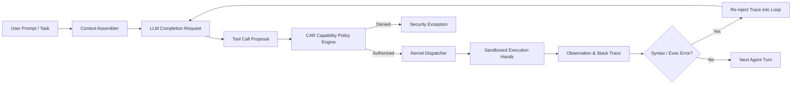
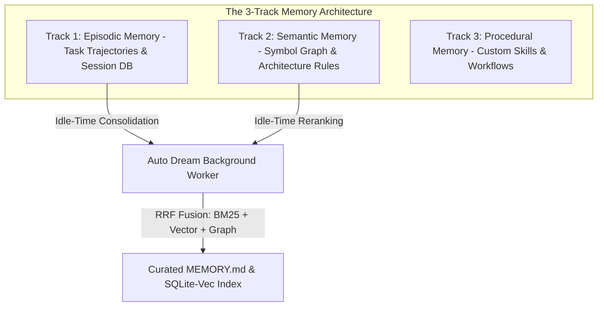
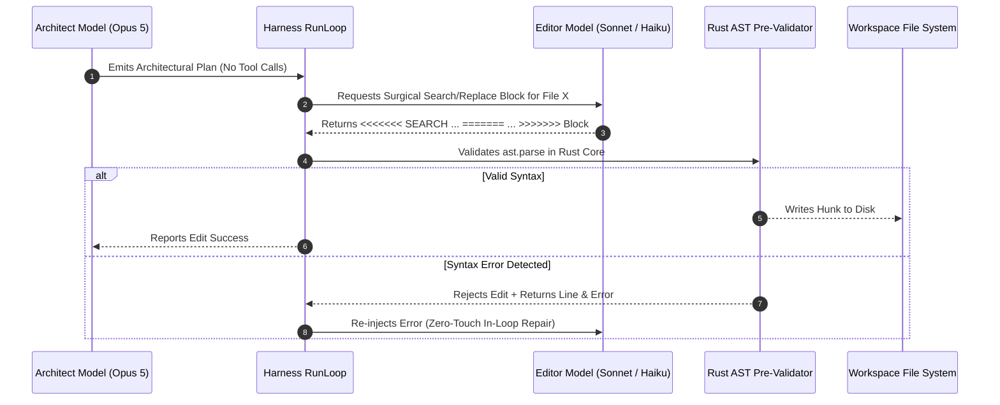
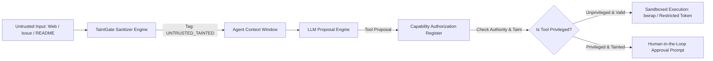
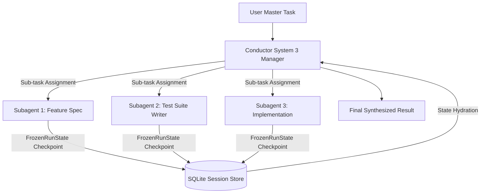

# COMPREHENSIVE ARCHITECTURAL & TECHNICAL ANALYSIS: CLAUDE REFS (`src/claude_refs`)

> **Author:** Gemini (Antigravity AI Coder)  
> **Date:** August 05, 2026  
> **Target Document:** `docs/competitors/claude_refs_B_gemini.md`  
> **Source Material:** `src/claude_refs` (628 markdown files, >100k lines of reverse-engineering teardowns, academic papers, and architectural reference specifications).  
> **Scope:** Deep-dive technical teardown of the Claude Code CLI, Anthropic Managed Agents 2026 architecture, Agent Harness Engineering (arXiv 2605.18747), Context Engineering (arXiv 2602.11988), 3-Track Memory Systems, TaintGate Security, and Subagent Orchestration.

---

## TABLE OF CONTENTS
1. **Executive Architecture Overview: The Managed Agents 2026 Tri-Layer Model**
2. **Core Agent Harness Engine & Foundational Properties (arXiv 2605.18747)**
3. **Context Engineering, Cache Alignment & Attention Diffusion Dynamics (arXiv 2602.11988)**
4. **Memory Systems Architecture: The 3-Track Model & Auto Dream Consolidation**
5. **Code Editing Mechanics: Architect/Editor Split & Surgical Search/Replace Blocks**
6. **Security Architecture: TaintGate, The Lethal Trifecta & Sandboxing Isolations**
7. **Subagent Orchestration, Conductor System 3 & Workflows**
8. **Operational & Telemetry Infrastructure: OpenTelemetry, Hooks & Governance**
9. **Synthesis & Deep Technical Mapping for AETHER v300B**

---

## 1. EXECUTIVE ARCHITECTURE OVERVIEW: THE MANAGED AGENTS 2026 TRI-LAYER MODEL

The Claude Code CLI architecture is structured around an explicit tri-layer model that separates reasoning, sandboxed execution, and append-only state persistence. This design addresses the core failure modes of early agent implementations—namely, state corruption, unauthorized tool invocation, and token thrashing.

```mermaid
graph TB
    subgraph BRAIN_LAYER [1. THE BRAIN - Orchestration & Reasoning Engine]
        LLM Core [LLM Engine - Opus 5 / Sonnet 3.5]
        PromptCache [Prompt Cache Alignment Engine >92%]
        ContextAssembler [Context Assembler & Compactor]
        DynamicTools [Tool Search on Demand Selector]
        TaintFilter [TaintGate Input Sanitizer]
    end

    subgraph HANDS_LAYER [2. THE HANDS - Isolated Execution Environment]
        RustAST [Rust AST Tree-sitter Pre-Validator]
        NativeSandbox [Bubblewrap / Windows Token Sandbox]
        ContainerPool [Pre-Warmed Docker Container Pool]
        PTYHarness [PTY Pseudo-Terminal Runner]
    end

    subgraph LOG_LAYER [3. SESSION EVENT LOG - External Append-Only Persistence]
        SQLiteWAL [SQLite WAL Mode Journaling]
        EventBus [Async Event Bus & OTel Telemetry]
        MemoryStore [3-Track Memory Engine & Auto Dream]
        FrozenState [FrozenRunState Hibernation Store]
    end

    BRAIN_LAYER -->|Authorized Tool Proposals| HANDS_LAYER
    HANDS_LAYER -->|Execution Observations & Stack Traces| BRAIN_LAYER
    BRAIN_LAYER -->|Append State Events| LOG_LAYER
    HANDS_LAYER -->|Record Raw Execution Artifacts| LOG_LAYER
    LOG_LAYER -->|Replay / Context Injection| BRAIN_LAYER
```

### 1.1 Structural Invariants of the Tri-Layer Architecture
1. **The Brain (Harness & LLM Reasoning):** Operates strictly out-of-process from raw command execution. It handles natural language understanding, planning, tool selection via *Tool Search on Demand*, and prompt compaction. The Brain never executes untrusted code directly.
2. **The Hands (Sandboxed Execution Layer):** A stateless, isolated environment running commands inside Bubblewrap (`bwrap`), Windows Restricted Tokens, or pre-warmed Docker containers. Tool executions pass through a Rust AST pre-validator before hitting disk.
3. **The Session Event Log (Externalized Append-Only Persistence):** All conversation turns, tool calls, execution outputs, and telemetry events are recorded in an externalized SQLite WAL database. The Brain can be restarted, hibernated, or swapped without losing session state.

---

## 2. CORE AGENT HARNESS ENGINE & FOUNDATIONAL PROPERTIES (arXiv 2605.18747)

Based on the paper *"Code as Agent Harness"* (arXiv 2605.18747), an autonomous agent harness is defined as the deterministic software wrapper surrounding the LLM that converts model completion intents into real-world code mutations and environment observations.



### 2.1 The Three Foundational Properties of a SOTA Harness
1. **Parity:** The agent must perceive the repository, directory structure, environment variables, and execution outputs exactly as a human developer would in a standard shell. Artificial abstractions or lossy wrappers introduce decision drift.
2. **Receptivity:** The harness loop must accept environment feedback (compilation errors, test failures, linter warnings, stack traces) as high-priority observations in the immediate next iteration, allowing in-loop real-time repair without destroying the prompt cache.
3. **Observability:** Every action, decision, tool invocation, and state transition must be logged to an append-only event stream, enabling exact cassette replay, auditing, and dataset extraction.

### 2.2 The 9 Core Modules of the Agent Harness
| Harness Component | Operational Function | Implementation Rule |
| :--- | :--- | :--- |
| **RunLoop** | The primary async turn iterator (`RunLoop.run()`). | Executes turns sequentially; re-injects errors into the active context without resetting cache prefix boundaries. |
| **ContextAssembler** | Constructs prompt payloads aligned with LLM provider caching rules. | Fixes system prompts, tool schemas, and repository maps as immutable top blocks. |
| **Compactor** | Manages context window limits when history approaches budget. | Employs *Exchange-Granular Compaction*—never removes partial tool call/result pairs. |
| **Dispatcher** | The single choke-point for executing tool proposals. | All tool calls pass through `PolicyEngine.authorize()` before execution. |
| **PolicyEngine (CAR)** | Enforces capability authorization rules. | Maintains a Capability Authorization Register (CAR) gating file and shell access. |
| **Sandbox** | Isolates file mutations and command execution. | Combines Git Worktrees (zero-copy local) with Docker/bwrap containers. |
| **EventBus** | Publishes real-time telemetry and state changes. | Asynchronous event bus feeding the TUI, loggers, and OpenTelemetry exporters. |
| **ResourceGovernor** | Controls token spend, execution cost, and time budgets. | Enforces hard thresholds; triggers clean state hibernation (`FrozenRunState`) on budget exhaustion. |
| **Evaluator (Gates)** | Admits or rejects candidate code modifications. | Evaluates candidate solutions against test suites under the `require_tests_unmodified` constraint. |

---

## 3. CONTEXT ENGINEERING, CACHE ALIGNMENT & ATTENTION DIFFUSION DYNAMICS (arXiv 2602.11988)

Context engineering is the science of structuring the token window to maximize model reasoning accuracy, optimize attention allocation, and minimize financial cost via prompt caching.

### 3.1 The "Dumb Zone" & $O(n^2)$ Attention Diffusion Dynamics
Research demonstrates that as context windows scale past 100k-200k tokens, pairwise transformer attention computation scales as $O(n^2)$. This creates an attention degradation zone—the **"Dumb Zone"**—typically situated between the 40% and 60% relative depth of the context window.

```
CONTEXT WINDOW ATTENTION ACCURACY PROFILE
100% ┌──────────────────────────────────────────────────────────┐
     │ Top Instructions & System Prompt (High Attention)        │
 80% │──────────────────────────────────────────────────────────│
     │ Recent User Messages & Tools (High Attention)            │
 60% │..........................................................│
     │                                                          │
 40% │         THE DUMB ZONE (Attention Diffusion Drop)         │
     │      Pairwise Attention Rot & Instruction Decay          │
 20% │..........................................................│
     │ Historical Middle Messages (Degraded Retention)          │
  0% └──────────────────────────────────────────────────────────┘
```

#### Mitigations Implemented in Claude Code:
1. **Exchange-Granular Compaction:** Removes entire historical user-assistant-tool exchanges rather than truncating individual messages.
2. **AST Skeleton Mapping (Agentless Pattern):** Projects a compact syntax tree map of the repository at the top of the context window, fixing symbol references in the high-attention zone.
3. **Ephemeral CoT Truncation:** Strips verbose intermediate reasoning thoughts from past turns, keeping only the final tool calls and observations.

### 3.2 Prompt Cache Alignment Strategy (>92% Target Hit Rate)
To achieve >92% prompt cache hit rates, prompt payloads are structured into strict immutable prefix blocks:

```
┌───────────────────────────────────────────────────────────────┐
│ BLOCK 1: System Identity & Base Instructions (Immutable)      │ -> Cache Marker 1
├───────────────────────────────────────────────────────────────┤
│ BLOCK 2: Tool Definitions / Tool Search Schemas (Static)      │ -> Cache Marker 2
├───────────────────────────────────────────────────────────────┤
│ BLOCK 3: Repository AST Skeleton Map (Static per Session)     │ -> Cache Marker 3
├───────────────────────────────────────────────────────────────┤
│ BLOCK 4: Dynamic Conversation Exchanges (Appended)            │ -> Dynamic
└───────────────────────────────────────────────────────────────┘
```

### 3.3 ETH Zürich Config Inflation Research (arXiv 2602.11988)
Empirical study by ETH Zürich on agent context configuration revealed:
* **Targeted Developer Rules (`CLAUDE.md` / `AGENTS.md`):** Manually curated, targeted rules increase agent success rate by **+4.0%**.
* **LLM-Generated System Dumps (`/init` scripts):** Automatically generated, bloated configuration files increase token consumption by **+23%** while **reducing success rate by -3.0%**.
* **Takeaway:** Agent configuration files must be curated, concise, and targeted—never raw dumps of repository files.

---

## 4. MEMORY SYSTEMS ARCHITECTURE: THE 3-TRACK MODEL & AUTO DREAM CONSOLIDATION

The memory architecture of Claude Code avoids storing unbounded conversation logs by organizing memory into three distinct tracks, backed by a background consolidation engine ("Auto Dream").



### 4.1 The 3 Memory Tracks
1. **Episodic Memory:** Records past session trajectories, executed commands, failed attempts, and resolution paths. Stored in SQLite WAL databases and queried during similar task scenarios.
2. **Semantic Memory:** Represents the domain knowledge of the codebase—architectural rules, module boundaries, design decisions, and symbol graphs. Persisted in workspace-scoped `MEMORY.md` files.
3. **Procedural Memory:** Procedural workflows, specialized skills (`SKILL.md`), build scripts, and organizational coding standards.

### 4.2 Auto Dream Memory Consolidation Engine
During agent idle time, the **Auto Dream** background process executes:
* **Recency & Relevance Decay (TTL):** Applies temporal decay to old episodic memories.
* **Reciprocal Rank Fusion (RRF):** Combines keyword search (BM25), vector similarity (SQLite-vec), and knowledge graph traversal to rank memory relevance.
* **De-duplication & Synthesis:** Merges redundant session logs into concise architectural guidelines in `MEMORY.md`.

---

## 5. CODE EDITING MECHANICS: ARCHITECT/EDITOR SPLIT & SURGICAL SEARCH/REPLACE BLOCKS

Full file rewrites (*Full File Rewrite*) fail on large files (>300 LOC) due to context drift and syntax hallucinations. Claude Code implements a two-model editing architecture.



### 5.1 Architect / Editor Split
* **The Architect (Opus 5):** Handles high-level reasoning, code exploration, dependency analysis, and structural planning. It emits clear text plans without calling code modification tools directly.
* **The Editor (Sonnet 3.5 / Haiku):** Receives specific edit instructions from the Architect and generates precise Search/Replace blocks. It is optimized for low-latency string manipulation.

### 5.2 Search/Replace Block Format
Editions are formatted as surgical blocks:
```
<<<<<<< SEARCH
def old_function_name(param1, param2):
    return param1 + param2
=======
def new_function_name(param1: int, param2: int) -> int:
    return param1 + param2
>>>>>>>
```
* **Rust AST Pre-Validation:** Before writing to disk, the harness passes the proposed hunk to Tree-sitter in Rust. If `ast.parse` fails, the edit is rejected deterministically, and the syntax error is re-injected into the Editor's context loop.

---

## 6. SECURITY ARCHITECTURE: TAINTGATE, THE LETHAL TRIFECTA & SANDBOXING ISOLATIONS

Autonomous agents executing terminal commands and reading external data face severe security threats, primarily **Indirect Prompt Injection**.



### 6.1 The Lethal Trifecta Threat Model
Security breaches occur when three conditions coincide:
1. **Private Data Access:** The agent can read local environment variables, credentials, or private source code.
2. **Untrusted Data Ingestion:** The agent ingests external data (GitHub issue descriptions, external web pages, third-party package READMEs).
3. **Exfiltration Channel:** The agent has network access or shell execution privileges that can transmit data externally.

### 6.2 TaintGate Input Sanitization
* **Taint Tagging:** Any string ingested from an external or unverified source is tagged with `UNTRUSTED_TAINTED` in the kernel state.
* **Policy Enforcement:** If a tool call proposal contains `UNTRUSTED_TAINTED` variables and targets a sensitive tool (e.g., `curl`, `git push`, arbitrary shell execution), the CAR Policy Engine automatically blocks execution or escalates to an explicit user confirmation modal.

### 6.3 Sandboxing Isolation Layers
* **Linux:** Bubblewrap (`bwrap`) unshare mounts providing isolated network, filesystem, and PID namespaces.
* **Windows:** Windows Restricted Tokens and Job Objects restricting process privileges and inter-process communication.
* **Docker/Podman:** Rootless container execution with read-only root filesystems and tmpfs mounts.

---

## 7. SUBAGENT ORCHESTRATION, CONDUCTOR SYSTEM 3 & WORKFLOWS

Complex coding tasks require multi-agent decomposition without creating infinite recursion loops or memory leaks.



### 7.1 Conductor System 3 Architecture
* **Task Decomposition:** The Conductor breaks complex tasks into an acyclic directed graph (DAG) of sub-tasks.
* **Isolated Subagent Spawn:** Each subagent is spawned in a separate conversation context inheriting a warm prefix cache, preventing subagent thoughts from polluting the main context window.
* **Durable Hibernation (`FrozenRunState`):** Subagent state (call stack, local memory, active diffs) is serialized to SQLite. Subagents can be suspended, hibernated, or resumed across network drops or machine restarts.

---

## 8. OPERATIONAL & TELEMETRY INFRASTRUCTURE: OPENTELEMETRY, HOOKS & GOVERNANCE

Claude Code provides enterprise-grade observability and lifecycle hooks to integrate with corporate CI/CD pipelines.

### 8.1 OpenTelemetry (OTel) Integration
All kernel events, tool invocations, token spend metrics, and model completion latencies are exported via OpenTelemetry collectors (Jaeger, Zipkin, Datadog).

### 8.2 Lifecycle Hooks Reference
* **`pre_tool_execution`:** Fired before tool execution; can mutate arguments or reject execution based on security policies.
* **`post_tool_execution`:** Fired after tool execution; captures raw stdout/stderr for telemetry and memory extraction.
* **`on_context_compaction`:** Fired when context compaction triggers, recording compacted token counts.
* **`on_session_end`:** Triggers background memory consolidation (Auto Dream) and trajectory export.

---

## 9. SYNTHESIS & DEEP TECHNICAL MAPPING FOR AETHER v300B

To achieve a world-class autonomous agent harness (**AETHER v300B**) competing with Claude Code, the following implementation map is specified:

| Claude Code Mechanism | Target AETHER Module (`src/aether/`) | Technical Implementation Directive |
| :--- | :--- | :--- |
| **Brain / Hands / Log Decoupling** | `src/aether/agency/` & `kernel/` | Separate RunLoop logic from Sandboxed execution and SQLite event persistence. |
| **Exchange-Granular Compactor** | `src/aether/agency/context/compactor.py` | Truncate only complete exchanges (`user->assistant->tool->result`) to maintain API parity. |
| **Architect / Editor Split** | `src/aether/agency/architect.py` & `editor.py` | Opus 5 for high-level plans; Sonnet/Haiku for Search/Replace blocks with AST checks. |
| **Rust AST Pre-Validation** | `src/aether/core_rs/ast_treesitter.rs` | Validate Search/Replace hunks using Tree-sitter in Rust (<50ns) before writing to disk. |
| **TaintGate Security** | `src/aether/agency/context/taint_gate.py` | Tag external inputs with `UNTRUSTED_TAINTED` and gate privileged tool execution. |
| **Conductor System 3** | `src/aether/agency/conductor.py` | Manage subagent DAGs with durable `FrozenRunState` SQLite serialization. |
| **Auto Dream Memory** | `src/aether/evolution/gepa_evolver.py` | Idle-time memory consolidation using RRF fusion (BM25 + SQLite-vec). |
