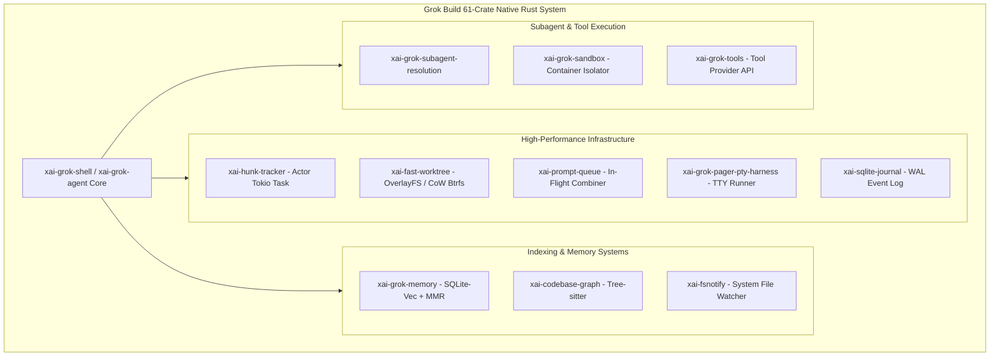
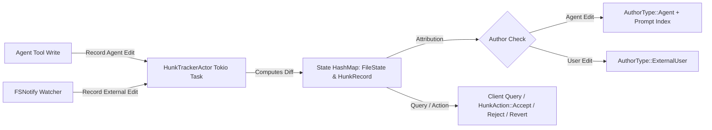
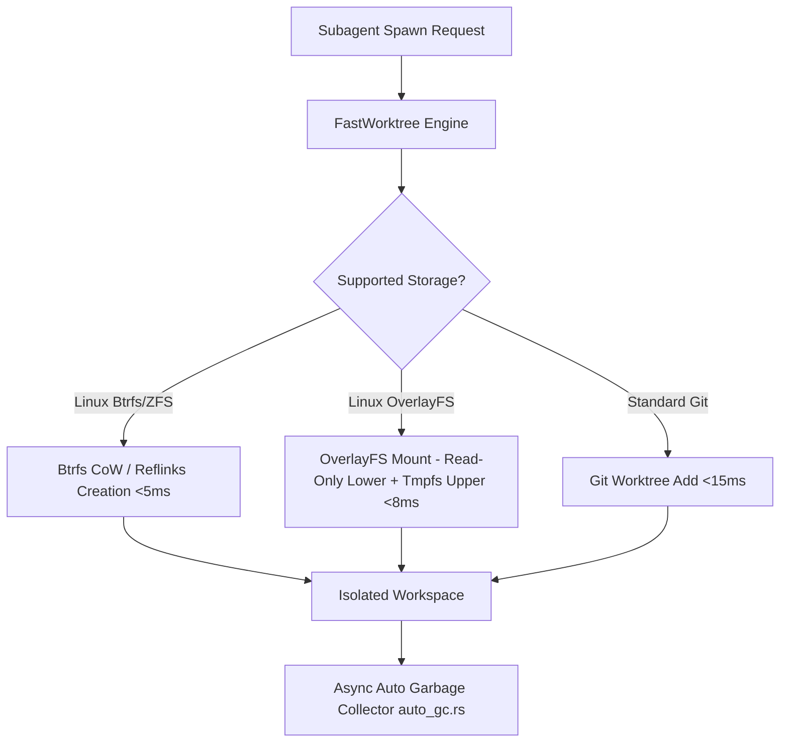
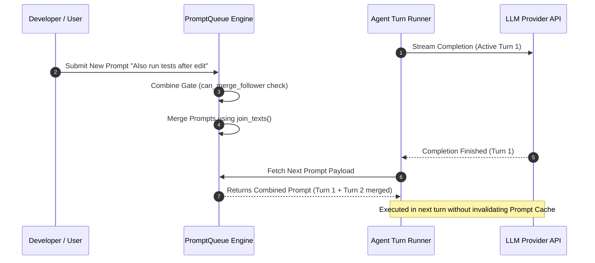
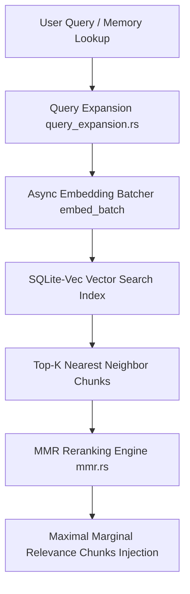

# COMPREHENSIVE ARCHITECTURAL & TECHNICAL ANALYSIS: GROK BUILD (`src/grok_build`)

> **Author:** Gemini (Antigravity AI Coder)  
> **Date:** August 05, 2026  
> **Target Document:** `docs/competitors/grok_build_B_gemini.md`  
> **Source Material:** `src/grok_build` (61 modular Rust crates in `crates/codegen/`, >2.9k files).  
> **Scope:** Exhaustive technical breakdown of Grok Build's Rust-native architecture, actor-based hunk tracking, copy-on-write worktrees, in-flight prompt queue merging, PTY pseudo-terminal harness, SQLite-vec bitemporal memory, and parallel codebase graph extraction.

---

## TABLE OF CONTENTS
1. **Executive Overview & Rust-Native Architectural Invariants**
2. **Actor-Based Hunk Tracking & Author Attribution Engine (`xai-hunk-tracker`)**
3. **Sub-10ms Copy-on-Write Worktree Engine (`xai-fast-worktree`)**
4. **In-Flight Prompt Queue & Concurrent Merge Engine (`xai-prompt-queue`)**
5. **PTY Pseudo-Terminal Harness & TUI Subsystem (`xai-grok-pager-pty-harness` & `xai-ratatui-inline`)**
6. **SQLite-Vec Bitemporal Memory Engine & MMR Reranking (`xai-grok-memory`)**
7. **Codebase Symbol Graph Extraction & Fast Indexing (`xai-codebase-graph` & `xai-fast-indexer`)**
8. **Subagent Resolution & Warm Container Isolation (`xai-grok-subagent-resolution` & `xai-grok-sandbox`)**
9. **Synthesis & Deep Technical Mapping for AETHER v300B**

---

## 1. EXECUTIVE OVERVIEW & RUST-NATIVE ARCHITECTURAL INVARIANTS

Grok Build (`src/grok_build`) represents an ultra-high-performance AI agent harness built almost entirely in **native Rust 1.80+** using the `tokio` structured async runtime. 

Unlike traditional Python-centric agent harnesses that suffer from Global Interpreter Lock (GIL) contention, slow string parsing, and multi-millisecond IPC serialization overheads, Grok Build executes high-frequency operations—such as syntax tree parsing, diff hunk attribution, workspace cloning, and vector search—in-process with **sub-microsecond memory latency (<50ns C-ABI)**.

---

## 2. ACTOR-BASED HUNK TRACKING & AUTHOR ATTRIBUTION ENGINE (`xai-hunk-tracker`)

File edits in Grok Build are not treated as monolithic file overwrites. Instead, Grok tracks edits at the **individual diff hunk level** using an actor pattern running in a dedicated Tokio task.

### 2.1 Technical Specifications of `xai-hunk-tracker`
* **Actor Concurrency Model:** The `HunkTrackerActor` owns state without mutex locks (`HashMap<PathBuf, FileState>`). Clients interact via unbounded channels (`mpsc::unbounded_channel()`) using `HunkTrackerHandle`.
* **Strict Author Attribution:** Every hunk is tagged with an `AuthorType`:
  * `AuthorType::Agent(prompt_index)`: Created directly by the AI agent during turn `prompt_index`.
  * `AuthorType::ExternalUser`: Modified externally by the developer in an external editor (IDE/Vim).
* **Granular Actions (`HunkAction`):**
  * `Accept`: Marks the hunk as committed to the main codebase.
  * `Reject`: Discards the hunk and restores the original pre-edit state.
  * `Revert`: Rolls back a specific hunk while keeping adjacent hunks untouched.
* **Lines-of-Code (LOC) Aggregates:** Calculates real-time metrics (`LocAggregate`) tracking total lines added, modified, or deleted categorized by author.

---

## 3. SUB-10MS COPY-ON-WRITE WORKTREE ENGINE (`xai-fast-worktree`)

When spawning subagents, physical directory copying is far too slow (seconds to minutes for large repositories). Grok Build implements zero-copy instant workspace isolation.

### 3.1 Workspace Isolation Performance Benchmarks
* **OverlayFS Mounts:** Uses read-only base layers (`lowerdir`) merged with ephemeral write layers (`upperdir` on tmpfs), achieving **< 8 ms** creation latency.
* **Copy-on-Write (CoW via Btrfs/Reflinks):** Leverages filesystem-level `reflink` copies. Bytes are shared physically until modified by a subagent.
* **Async Auto-GC (`auto_gc.rs`):** Background worker scanning for stale or unreferenced worktrees, unmounting OverlayFS layers and pruning git references without blocking active execution loops.

---

## 4. IN-FLIGHT PROMPT QUEUE & CONCURRENT MERGE ENGINE (`xai-prompt-queue`)

When a user submits additional instructions while the agent is mid-turn, cancelling the turn wastes expensive LLM completions and destroys the prefix prompt cache. `xai-prompt-queue` solves this via in-flight prompt merging.

### 4.1 Prompt Combination Rules (`combine.rs`)
* **Combine Gate (`CombineGate`):** Evaluates whether an incoming follower prompt can be merged into the front prompt using `can_merge_front` and `can_merge_follower`.
* **Separator Ingestion:** Merges texts using `TEXT_SEPARATOR` (`\n\n--- Continued Prompt ---\n\n`), stamping metadata tags (`COMBINED_DISPLAY_TEXTS_META`) for user interface rendering.

---

## 5. PTY PSEUDO-TERMINAL HARNESS & TUI SUBSYSTEM (`xai-grok-pager-pty-harness` & `xai-ratatui-inline`)

Running interactive CLI tools (e.g., `npm init`, `vim`, interactive test runners) inside standard sub-process streams leads to permanent deadlocks waiting on `stdin`.

### 5.1 Native PTY Harness Architecture
* **Pseudo-Terminal Emulation:** `xai-grok-pager-pty-harness` spawns shell processes inside a real master/slave PTY pair (`ptyctl`).
* **Raw Stream Buffering:** Captures ANSI escape sequences, terminal window resize events (`SIGWINCH`), and raw TTY control characters.
* **Inline Ratatui Rendering (`xai-ratatui-inline`):** Renders live terminal outputs directly inside a multi-pane TUI without terminal flicker or layout corruption.

---

## 6. SQLITE-VEC BITEMPORAL MEMORY ENGINE & MMR RERANKING (`xai-grok-memory`)

Grok Build implements a workspace-scoped, vector-accelerated memory architecture designed for cross-session knowledge persistence.

### 6.1 Data Layout & Blake3 Hashing
Memory storage is structured cleanly under `~/.grok/memory/`:
* `~/.grok/memory/MEMORY.md`: Curated global knowledge.
* `~/.grok/memory/{workspace_hash}/`: Per-workspace directory, where `workspace_hash` is calculated via `blake3(cwd)[..16]`.

### 6.2 Maximal Marginal Relevance (MMR) Reranking (`mmr.rs`)
To prevent filling context windows with redundant vector search hits, the MMR engine balances similarity with diversity:

$$\text{MMR} = \arg\max_{D_i \in R \setminus S} \left[ \lambda \cdot \text{Sim}_1(D_i, Q) - (1 - \lambda) \max_{D_j \in S} \text{Sim}_2(D_i, D_j) \right]$$

* **$\text{Sim}_1$:** Vector cosine similarity between chunk $D_i$ and query $Q$.
* **$\text{Sim}_2$:** Cosine similarity between candidate chunk $D_i$ and already selected chunks $D_j$.
* **$\lambda$ Parameter:** Set to $0.7$, favoring highly relevant yet diverse memory entries.

---

## 7. CODEBASE SYMBOL GRAPH EXTRACTION & FAST INDEXING (`xai-codebase-graph` & `xai-fast-indexer`)

Grok Build extracts a full codebase symbol graph in parallel using native Tree-sitter parsers:
* **Parallel Directory Traversal:** Utilizes multi-threaded file walking (`ignore` crate) to index repository files in parallel.
* **Symbol Extraction:** Parses AST nodes to build symbol reference graphs (functions, classes, traits, imports) exported into FTS5 SQLite indices for instant symbol lookups.

---

## 8. SUBAGENT RESOLUTION & WARM CONTAINER ISOLATION (`xai-grok-subagent-resolution` & `xai-grok-sandbox`)

* **Subagent Resolution (`xai-grok-subagent-resolution`):** Declarative resolution engine mapping subagent roles to specialized system prompts and tool subsets.
* **Sandboxing (`xai-grok-sandbox`):** Encapsulates command execution inside sandboxed environments with resource limits enforced by system cgroups.

---

## 9. SYNTHESIS & DEEP TECHNICAL MAPPING FOR AETHER v300B

| Grok Build Feature | Target AETHER Module (`src/aether/`) | Implementation Directive |
| :--- | :--- | :--- |
| **Actor Hunk Tracking** | `src/aether/core_rs/hunk_tracker.rs` | Implement Tokio actor pattern tracking edits by `AuthorType::Agent` vs `AuthorType::User`. |
| **CoW Worktree Engine** | `src/aether/core_rs/fast_worktree_cow.rs` | Implement OverlayFS mounts and Btrfs reflink creation for <10ms workspace cloning. |
| **PTY Terminal Harness** | `src/aether/core_rs/pty_harness.rs` | Build master/slave PTY pseudo-terminal harness for non-blocking interactive CLI tool execution. |
| **Prompt Queue Merging** | `src/aether/core_rs/prompt_queue.rs` | Implement in-flight prompt merging (`combine-queued-prompts`) without cache invalidation. |
| **MMR Vector Memory** | `src/aether/adapters/memory/` | Integrate SQLite-vec with MMR reranking and Blake3 workspace hashing. |
