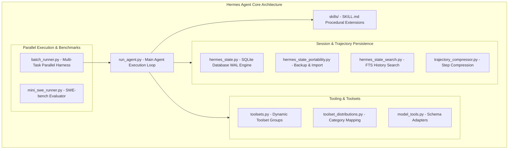
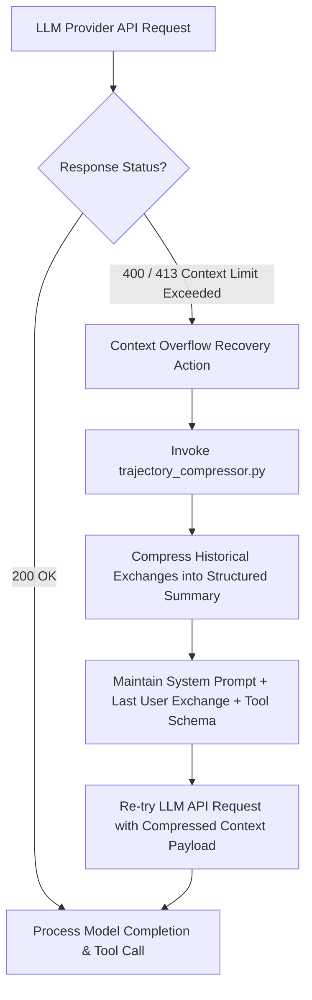
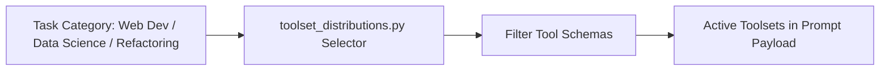

# COMPREHENSIVE ARCHITECTURAL & TECHNICAL ANALYSIS: HERMES AGENT (`src/hermes_agent`)

> **Autor:** Gemini (Antigravity AI Coder)  
> **Date:** August 05, 2026  
> **Target Document:** `docs/competitors/hermes_agent_B_gemini.md`  
> **Source Material:** `src/hermes_agent` (Nous Research Hermes Agent core backend, >2k files).  
> **Scope:** Deep-dive technical breakdown of Hermes Agent execution engine, context overflow recovery taxonomy, SessionDB SQLite persistence, trajectory compression, dynamic toolset distributions, and parallel SWE-bench evaluation runners.

---

## TABLE OF CONTENTS
1. **Executive Overview & Backend Architecture**
2. **Context Limit Exception Handling & Automatic Recovery Taxonomy (`run_agent.py`)**
3. **SessionDB SQLite Persistence & Portable Backups (`hermes_state.py`)**
4. **Trajectory Compressor & Dataset Exporter (`trajectory_compressor.py`)**
5. **Dynamic Toolsets & Task-Specific Distributions (`toolsets.py` & `toolset_distributions.py`)**
6. **Parallel Benchmark Runners & SWE-bench Harness (`batch_runner.py` & `mini_swe_runner.py`)**
7. **Procedural Skill System (`skills/`)**
8. **Synthesis & Deep Technical Mapping for AETHER v300B**

---

## 1. EXECUTIVE OVERVIEW & BACKEND ARCHITECTURE

Developed by Nous Research, **Hermes Agent** (`src/hermes_agent`) focuses on maximum fault tolerance, execution resilience, and state recovery. While written primarily in Python, its design introduces crucial architectural innovations for handling LLM provider API errors, context window overflow exceptions, and long-horizon multi-session task state.

---

## 2. CONTEXT LIMIT EXCEPTION HANDLING & AUTOMATIC RECOVERY TAXONOMY (`run_agent.py`)

Standard AI agent implementations crash or fail permanently when an API request exceeds the model's maximum context window length (*Context Window Exceeded*). Hermes Agent treats context window exceptions not as fatal errors, but as **typed recovery triggers**.

### 2.1 Context Error Taxonomy Rules
1. **Error Classification:** Intercepts HTTP 400/413 codes containing `"context_length_exceeded"`, `"max_tokens_reached"`, or `"prompt_is_too_long"`.
2. **Emergency Compaction Pipeline:** Triggers immediate invocation of `trajectory_compressor.py` to condense historical turns into structured Markdown/JSON summaries.
3. **Zero-Drop Parity:** Guarantees that the system prompt, tool definitions, and the most recent user turn are never dropped during emergency compaction.

---

## 3. SESSIONDB SQLITE PERSISTENCE & PORTABLE BACKUPS (`hermes_state.py`)

Session state in Hermes Agent is fully externalized and persisted in SQLite databases (`SessionDB`), avoiding total state loss during process terminations or network outages.

### 3.1 Data Schema & Search Capabilities
* **SQLite WAL Engine (`hermes_state.py`):** Records every prompt, tool call, raw execution output, token spend, and timing metric in Write-Ahead Logging mode.
* **FTS Search (`hermes_state_search.py`):** Implements Full-Text Search (FTS) across historical sessions, allowing the agent to query how similar tasks or bug fixes were solved in past runs.
* **Portability (`hermes_state_portability.py`):** Provides serialization and deserialization routines to export complete agent execution states across machines.

---

## 4. TRAJECTORY COMPRESSOR & DATASET EXPORTER (`trajectory_compressor.py`)

`trajectory_compressor.py` (~70 KB) is a dedicated module that parses execution logs and compresses multi-turn agent trajectories.

### 4.1 Trajectory Compression & SFT/DPO Dataset Export
* **Step Reduction:** Strips verbose intermediate debug traces and repetitive tool outputs while preserving key decision nodes and final diffs.
* **Dataset Exporter:** Exports validated successful trajectories directly into JSONL formats suitable for Supervised Fine-Tuning (SFT) and Direct Preference Optimization (DPO).

---

## 5. DYNAMIC TOOLSETS & TASK-SPECIFIC DISTRIBUTIONS (`toolsets.py` & `toolset_distributions.py`)

Registering hundreds of tool schemas simultaneously bloats context windows and increases LLM hallucination rates.

* **Tool Grouping:** Tools are categorized into task-specific distributions (e.g., `web_search_tools`, `file_edit_tools`, `python_eval_tools`).
* **Context Efficiency:** Reduces input token consumption by loading only the tools required for the current task domain.

---

## 6. PARALLEL BENCHMARK RUNNERS & SWE-BENCH HARNESS (`batch_runner.py`)

* **Parallel Task Execution:** `batch_runner.py` spawns concurrent agent instances across SWE-bench task instances.
* **Empirical Metric Tracking:** Logs resolution rates (*pass rates*), total token consumption, and execution time per task instance.

---

## 7. PROCEDURAL SKILL SYSTEM (`skills/`)

Hermes Agent extends system instructions using procedural `SKILL.md` files:
* **Procedural Workflows:** Step-by-step guidance for specialized development tasks (e.g., code reviews, PR creation, database migrations).
* **On-Demand Loading:** Skills are loaded dynamically into system prompts when matched against user request intents.

---

## 8. SYNTHESIS & DEEP TECHNICAL MAPPING FOR AETHER v300B

| Hermes Agent Feature | Target AETHER Module (`src/aether/`) | Implementation Directive |
| :--- | :--- | :--- |
| **Context Overflow Recovery** | `src/aether/agency/run_loop.py` | Intercept context window limit errors and trigger emergency compaction recovery without process crash. |
| **SessionDB SQLite WAL** | `src/aether/adapters/trajectory/` | Persist full execution event streams to SQLite WAL with FTS5 search capabilities. |
| **Trajectory Compression** | `src/aether/evolution/dataset_exporter.py` | Compress successful trajectories for SFT/DPO dataset export. |
| **Task Toolsets** | `src/aether/agency/context/dynamic_dispatch.py` | Group tool schemas by task category to optimize input token overhead. |
