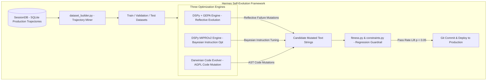
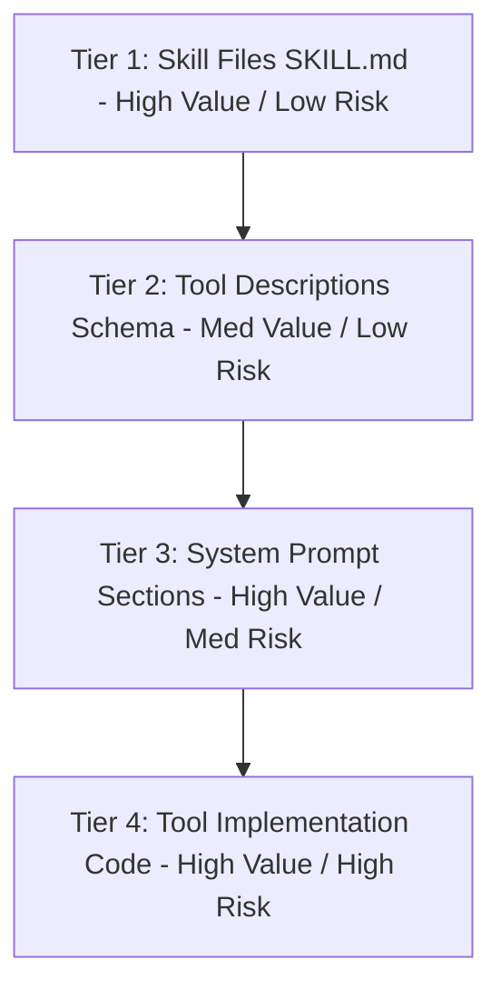
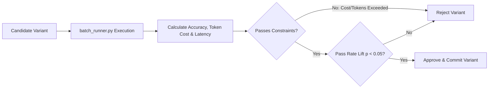

# COMPREHENSIVE ARCHITECTURAL & TECHNICAL ANALYSIS: HERMES SELF-EVOLUTION (`src/hermes_self_evolution`)

> **Autor:** Gemini (Antigravity AI Coder)  
> **Date:** August 05, 2026  
> **Target Document:** `docs/competitors/hermes_self_evolution_B_gemini.md`  
> **Source Material:** `src/hermes_self_evolution` (Nous Research Hermes Self-Evolution standalone optimization framework, >780 lines PLAN.md).  
> **Scope:** Deep-dive technical breakdown of Hermes Self-Evolution pipeline, GEPA reflective evolution engine via DSPy, MIPROv2 Bayesian instruction optimizer, Darwinian code evolver, SessionDB trajectory mining, and zero-GPU text optimization mechanics.

---

## TABLE OF CONTENTS
1. **Executive Overview & Vision**
2. **The 3 Optimization Engines (GEPA, MIPROv2, Darwinian Code Evolver)**
3. **The 4 Optimization Tiers (Skills, Tools, Prompts, Code)**
4. **SessionDB Trajectory Mining & Dataset Generation (`dataset_builder.py`)**
5. **Fitness Evaluation, Cost Constraints & Statistical Validation (`fitness.py` & `constraints.py`)**
6. **Zero-GPU Text Mutation Mechanics**
7. **Synthesis & Deep Technical Mapping for AETHER v300B**

---

## 1. EXECUTIVE OVERVIEW & VISION

**Hermes Self-Evolution** (`src/hermes_self_evolution`) is a standalone, reflective optimization framework designed to systematically improve agent performance by mutating skills (`SKILL.md`), system prompts, tool descriptions, and helper code.

The core paradigm shift in Hermes Self-Evolution is **Zero-GPU Text Optimization**: instead of updating model neural weights via expensive RL or fine-tuning, the framework treats prompts, skills, and code files as optimizable text strings, using LLM-based reflective feedback to evolve higher-performing variants.

---

## 2. THE 3 OPTIMIZATION ENGINES

| Engine | Optimization Target | License | Operational Mechanism |
| :--- | :--- | :--- | :--- |
| **DSPy + GEPA** | Skills (`SKILL.md`), prompts, tool descriptions. | MIT | Native Python reflective optimizer. Analyzes execution traces to understand **WHY** a task failed and mutates prompt text to fix root causes. |
| **DSPy MIPROv2** | Few-shot examples and instruction text. | MIT | Bayesian instruction optimizer. Selects optimal few-shot examples and tunes system instructions. |
| **Darwinian Evolver**| Tool implementation code (`.py` files). | AGPL v3 | Genetic algorithm mutating Python tool code, validated against `pytest` suites. |

---

## 3. THE 4 OPTIMIZATION TIERS

1. **Tier 1: Skill Files (`SKILL.md`):** Highest value, lowest risk. Wraps procedural instructions as DSPy modules, evaluates test tasks, and mutates wording using GEPA.
2. **Tier 2: Tool Descriptions (`description` in JSON Schemas):** Improves tool selection accuracy by optimizing description text seen by the model during tool routing.
3. **Tier 3: System Prompt Components:** Refines persona rules, formatting instructions, and safety guardrails while preserving prompt caching alignment.
4. **Tier 4: Tool Implementation Code:** Refactors Python tool implementations using Darwinian evolutionary search, guarded by strict `pytest` test suites.

---

## 4. SESSIONDB TRAJECTORY MINING & DATASET GENERATION (`dataset_builder.py`)

* **Mining Real Execution Logs:** `dataset_builder.py` mines `hermes_state.py` (SessionDB) to extract real user tasks, execution steps, tool outputs, and resolution results.
* **Automatic Dataset Splitting:** Formats extracted tasks into train, validation, and test datasets for optimization benchmarking.

---

## 5. FITNESS EVALUATION, COST CONSTRAINTS & STATISTICAL VALIDATION (`fitness.py` & `constraints.py`)

### 5.1 Evaluation & Validation Rules
* **Fitness Metric (`fitness.py`):** Evaluates task accuracy, execution cost (tokens), latency, and error rates across test tasks.
* **Constraints Enforcer (`constraints.py`):** Ensures mutated prompts do not exceed character limits, break prompt caching alignment, or inflate token spend.
* **Statistical Significance Gate:** Demands $p < 0.05$ across at least 50 test instances before promoting a mutated skill or prompt to production.

---

## 6. ZERO-GPU TEXT MUTATION MECHANICS

* **API-Only Execution:** Operates entirely via LLM API calls (Opus, Sonnet, GPT-4o), eliminating GPU cluster requirements.
* **Reflective Trace Analysis:** Instead of binary pass/fail feedback, GEPA reads execution traces (thought process, tool calls, error logs) to understand the failure root cause and generate targeted prompt modifications.

---

## 7. SYNTHESIS & DEEP TECHNICAL MAPPING FOR AETHER v300B

| Hermes Self-Evolution Mechanism | Target AETHER Module (`src/aether/`) | Implementation Directive |
| :--- | :--- | :--- |
| **GEPA Reflective Engine** | `src/aether/evolution/gepa_evolver.py` | Implement reflective trace analysis and prompt/skill text mutation via DSPy/GEPA. |
| **SessionDB Trajectory Miner** | `src/aether/evolution/trace_miner.py` | Mine SQLite trajectories to auto-generate evaluation datasets. |
| **Statistical Ablation Gate** | `src/aether/ports/evaluator.py` | Require $p < 0.05$ pass rate lift on 50+ test instances before merging prompt/skill updates. |
