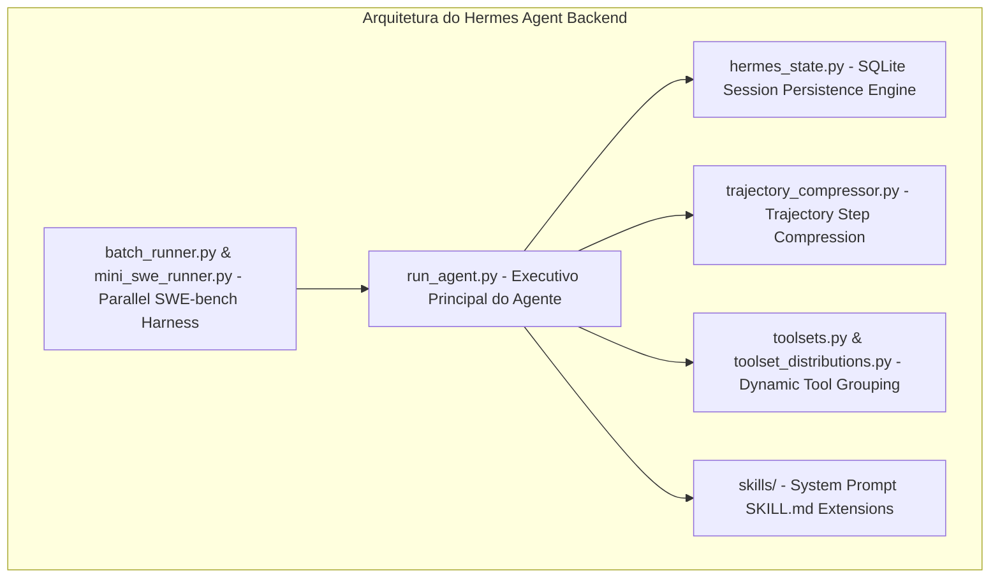

# RELATÓRIO DE ANÁLISE TÉCNICA E ARQUITETURA: HERMES AGENT (`src/hermes_agent`)

> **Autor:** Gemini (Antigravity AI Coder)  
> **Data:** 05 de Agosto de 2026  
> **Target:** `docs/competitors/hermes_agent_B_gemini.md`  
> **Escopo:** Análise profunda da arquitetura do Hermes Agent backend Python (`src/hermes_agent`), focando em recuperação de falhas, compressão de trajetórias, SessionDB, runners paralelos e distribuição de conjuntos de ferramentas (*toolset distributions*).

---

## 1. INTRODUÇÃO & VISÃO GERAL DO HERMES AGENT

O **Hermes Agent** (`src/hermes_agent`), desenvolvido pela Nous Research, é uma das implementações de agentes de código autônomos mais resilientes em termos de recuperação de erros de APIs e gerenciamento de estado episódico.

Apesar de ser estruturado predominantemente em Python síncrono/assíncrono tradicional (com o loop principal concentrado em `run_agent.py` e `hermes_state.py`), o Hermes introduz padrões de resiliência e tratamento de exceções de contexto extremamente valiosos.

---

## 2. PILARES ARQUITETURAIS & COMPONENTES CHAVE

---

### 2.1 Taxonomia de Erros de API & Recuperação via Compressão
* **Tratamento de Exceções de Provedor:** O Hermes trata estouros de contexto (*Context Window Exceeded*) não como falhas fatais, mas como um **sinal de recuperação**.
* **Compressão de Emergência:** Ao receber uma exceção de limite de contexto, o motor invoca o `trajectory_compressor.py`, que resume as trocas antigas mantendo a paridade do histórico e re-injeta a requisição sem derrubar o processo.

---

### 2.2 Motor de Estado SQLite SessionDB (`hermes_state.py`)
* **Persistência Completa de Estado:** Todo o histórico de mensagens, chamadas de ferramentas, saídas brutas do terminal e estado de variáveis é serializado continuamente em um banco SQLite (`SessionDB`).
* **Portabilidade e Backup (`hermes_state_portability.py`):** Permite exportar e importar a sessão completa entre diferentes máquinas ou ambientes sem perder o progresso da tarefa.
* **Busca em Histórico (`hermes_state_search.py`):** Mecanismo de busca FTS no histórico de sessões anteriores para recuperar soluções aplicadas a tarefas similares.

---

### 2.3 Trajectory Compressor (`trajectory_compressor.py`)
* **Compressão Estruturada de Trajetórias:** Redução de trajetórias de execução de milhares de passos para resumos estruturados em JSONL/Markdown.
* **Benefício de Treinamento:** Permite exportar trajetórias de sucesso sanitizadas diretamente para datasets de alinhamento e fine-tuning local (SFT/DPO).

---

### 2.4 Distribuição Dinâmica de Conjuntos de Ferramentas (`toolsets.py`)
* **Agrupamento por Tarefa:** As ferramentas são agrupadas em conjuntos específicos (*toolsets*) conforme o tipo de tarefa (ex: desenvolvimento web, refatoração de código, análise de dados).
* **Economia de Tokens:** Em vez de registrar todas as centenas de ferramentas MCP disponíveis, o Hermes ativa apenas o *toolset* relevante para a tarefa solicitada.

---

### 2.5 Runner Paralelo de Benchmarks (`batch_runner.py` & `mini_swe_runner.py`)
* **Execução Paralela de Avaliações:** Harness de avaliação capaz de subir múltiplas instâncias de tarefas do SWE-bench simultaneamente, gerando relatórios de acerto (*pass rate*), consumo de tokens e latência.

---

## 3. AVALIAÇÃO DE PONTOS FORTES E LIMITAÇÕES

| Componente / Característica | Ponto Forte no Hermes | Limitação / Oportunidade de Melhoria |
| :--- | :--- | :--- |
| **Tratamento de Erros de Contexto** | Altíssima resiliência; converte erro em ação de compressão. | Operações de compressão em Python síncrono podem ser lentas. |
| **Persistência de Sessão** | `SessionDB` robusto em SQLite com busca FTS. | Monólito em `hermes_state.py` (~428 KB) dificulta manutenção. |
| **Autonomia & Re-execução** | Excelentes runners paralelos (`batch_runner.py`). | Não possui pré-validação sintática de AST em Rust antes da edição. |
| **Segurança & Sandboxing** | Execução isolada via Docker. | Ausência de autorização estrita por capacidades (CAR Policy Engine). |

---

## 4. CONCLUSÃO & RECOMENDAÇÕES PARA O AETHER v300B

1. **Incorporar a Taxonomia de Erros de Contexto:** Adotar a estratégia do Hermes de converter erros de estouro de limite de contexto da API da LLM em ações de recuperação automática via `compactor.py`.
2. **Adotar o Trajectory Compressor:** Implementar o `dataset_exporter.py` no módulo `evolution/` do AETHER inspirado no `trajectory_compressor.py` do Hermes para geração de datasets SFT/DPO.
3. **Utilizar Distribuições Dinâmicas de Ferramentas:** Integrar o agrupamento por *toolsets* ao `dynamic_dispatch.py` (Tool Search on Demand) no AETHER.
