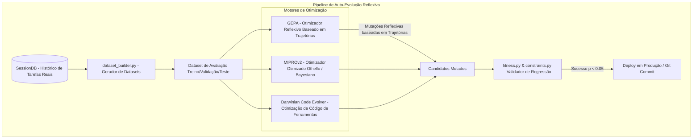

# RELATÓRIO DE ANÁLISE TÉCNICA E ARQUITETURA: HERMES SELF-EVOLUTION (`src/hermes_self_evolution`)

> **Autor:** Gemini (Antigravity AI Coder)  
> **Data:** 05 de Agosto de 2026  
> **Target:** `docs/competitors/hermes_self_evolution_B_gemini.md`  
> **Escopo:** Análise técnica profunda do ecossistema de auto-evolução reflexiva do Hermes (`src/hermes_self_evolution`), abordando os três motores de otimização (GEPA, Darwinian Evolver, MIPROv2), mineração de datasets de avaliação por SessionDB e evolução zero-GPU baseada em trajetórias.

---

## 1. INTRODUÇÃO & VISÃO GERAL DO HERMES SELF-EVOLUTION

O **Hermes Self-Evolution** (`src/hermes_self_evolution`), desenvolvido pela Nous Research, é uma pipeline autônoma projetada para otimizar sistematicamente o desempenho do agente de codificação sem necessidade de fine-tuning de pesos em GPUs.

A pipeline opera sobre quatro camadas de otimização (*Tier 1* a *Tier 4*), utilizando análise reflexiva de trajetórias para mutar prompts, habilidades (*skills*) e descrições de ferramentas.

---

## 2. ARQUITETURA DOS TRÊS MOTORES DE OTIMIZAÇÃO

---

### 2.1 Os Três Motores de Otimização

| Motor | Objeto da Otimização | Mecanismo de Funcionamento | Requer GPU? |
| :--- | :--- | :--- | :--- |
| **DSPy + GEPA** | Skills (`SKILL.md`), instruções de prompts e descrições de ferramentas. | Análise reflexiva das trajetórias de falha para entender **POR QUE** o agente errou, propondo mutações textuais. | **Não** (100% via chamadas de API de LLM). |
| **DSPy MIPROv2** | Exemplos de *few-shot* e texto de instruções do system prompt. | Otimização Bayesiana de instruções e seleção de exemplos contextuais. | **Não** (Apenas otimização de strings). |
| **Darwinian Evolver** | Código fonte das ferramentas e algoritmos em Python. | Algoritmo genético evolutivo que muta arquivos `.py` e valida via `pytest`. | **Não** (Execução local de suítes de teste). |

---

### 2.2 As Quatro Camadas de Otimização (*Tier 1* a *Tier 4*)

1. **Tier 1: Arquivos de Habilidades (Skills - `SKILL.md`):**  
   * **Relevância:** Altíssimo valor e baixo risco.  
   * **Funcionamento:** O texto do procedimento é encapsulado como um módulo DSPy, testado contra datasets de avaliação e evoluído via GEPA para cobrir cenários de falha reais.
2. **Tier 2: Descrições de Ferramentas (`description` em JSON Schema):**  
   * **Relevância:** Médio valor e baixo risco.  
   * **Funcionamento:** Otimização dos textos descritivos das ferramentas para garantir que o modelo escolha a ferramenta correta no momento exato (resolvendo problemas de classificação de tool calls).
3. **Tier 3: Componentes do System Prompt:**  
   * **Relevância:** Alto valor e risco moderado.  
   * **Funcionamento:** Otimização das seções de regras e persona do system prompt sem violar as fronteiras de alinhamento de Prompt Cache.
4. **Tier 4: Evolução de Código de Ferramentas:**  
   * **Relevância:** Alto valor e alto risco.  
   * **Funcionamento:** Refatoração de funções auxiliares de ferramentas utilizando algoritmos evolutivos validados por suítes de testes (`pytest`).

---

### 2.3 Mineração de Trajetórias & Avaliação Reflexiva
* **`dataset_builder.py`:** Extrai casos de uso reais a partir dos arquivos SQLite do `SessionDB`, dividindo-os automaticamente em conjuntos de treino, validação e teste.
* **Reflexão sobre o Porquê da Falha:** Diferente de otimizadores tradicionais que usam apenas métricas binárias (passou/falhou), o GEPA inspeciona a saída intermediária (*thought trace*) e identifica se o erro foi provocado por ambiguidade no prompt ou falta de contexto.

---

## 3. OTIMIZAÇÕES E BENCHMARKS EMPÍRICOS

* **Zero-GPU Efficiency:** Todos os processos de mutação de prompts e skills operam via chamadas à API de LLMs (como Claude Opus/Sonnet ou GPT-4o), eliminando a necessidade de clusters de GPUs de alto custo.
* **Validação Estatística:** Mutações só são promovidas se demonstrarem ganhos estatisticamente significantes ($p < 0.05$) no conjunto de teste sem aumentar o consumo de tokens além dos limites estabelecidos em `constraints.py`.

---

## 4. CONCLUSÃO & RECOMENDAÇÕES PARA O AETHER v300B

1. **Implementar o Módulo `src/aether/evolution/`:** Adotar o motor **GEPA Reflective Auto-Evolver** (`gepa_evolver.py`) para otimização automatizada offline do texto de skills e descrições de ferramentas do AETHER.
2. **Utilizar Mineração de Trajetórias (`trace_miner.py`):** Minar os bancos SQLite de trajetórias do AETHER para gerar benchmarks sintéticos internos de regressão.
3. **Estabelecer Regras de Validação com Regressão Estatística:** Garantir que mutações de prompts só sejam mescladas no código de produção após aprovação no `GateEvaluator` com $p < 0.05$.
