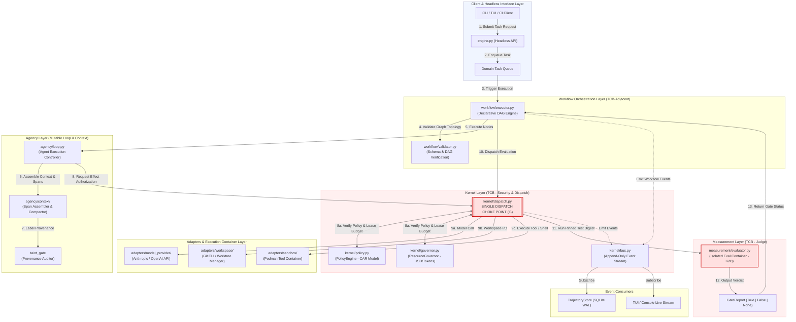
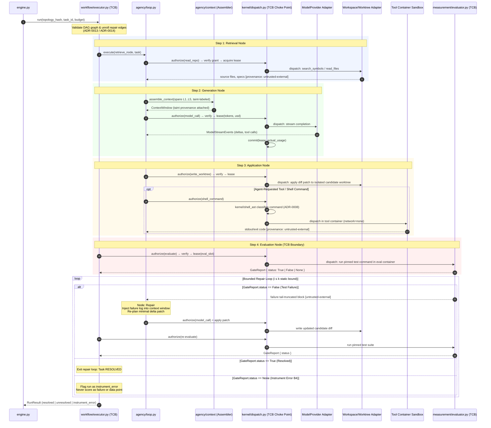
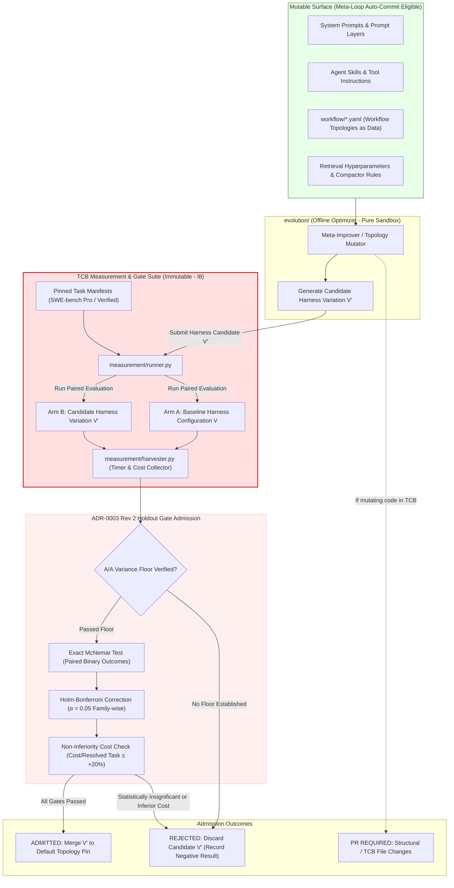
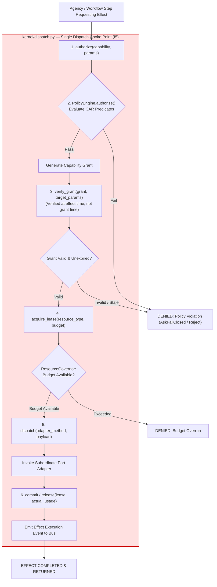

# Architecture Diagrams

**Four diagrams, consolidated from the six files that used to be `docs/workflows/` plus
`development/system_workflows_and_diagrams.md`.** Everything that merely restated
[`spec.md` §3](./spec.md#3-structure)'s lattice table or [`vision.md` §3](./vision.md#3-architecture-at-altitude)'s
component graph was dropped rather than merged — a diagram whose only content is a second
rendering of a normative table is a drift risk, not an aid.

> [!IMPORTANT]
> **These diagrams show the target architecture, and parts of it are not built.**
> `agency/loop.py`, `agency/context/`, `kernel/shell_ast.py` and `evolution/` appear below and
> **do not exist in `src/aether/` today** — they are `TASK-053`–`058`, `TASK-030a` and a
> post-M4 milestone respectively. [`STATUS.md`](./STATUS.md) is the authority on what is
> implemented; when a diagram and the code disagree, **the diagram is the bug**
> ([`README.md`](../README.md)).

---

## 1. End-to-end orchestration

Client → headless engine → validated topology → executor → the dispatch choke point → adapters
→ TCB evaluator → event bus. Every arrow into an adapter passes through `kernel/dispatch.py`;
there is no second path, and an architecture test proves it.

---

## 2. The inner loop — one task

`retrieve → generate → apply → evaluate`, then the bounded repair edge statically unrolled to
`max_iterations`. Two properties this diagram is drawn to show: **a `GateStatus.NONE` never
routes into repair** (an instrument failure is not a repair candidate), and **each iteration
reserves its own budget** through the governor's reserve/commit/release triple.

---

## 3. The outer loop — measurement and admission

A run over N tasks × arms producing paired outcomes, through the statistics engine, against a
**pre-declared** gate family. The TCB boundary is the point: the mutable surface on the left
proposes; the immutable measurement suite on the right decides, and cannot be edited by what it
is judging.

---

## 4. The dispatch lifecycle (CAR model)

`authorize → verify grant → acquire lease → dispatch → release`. **Verification happens at the
point of effect, not at authorization time** — arguments can drift between issuance and use,
and a resumed run can carry a stale grant. That re-check is the subtle requirement, and it is
why the seam stays a distinct named step even where it is currently a precondition rather than
a full two-phase flow.

---

## What was dropped, and why

| Source | Disposition |
| :--- | :--- |
| `workflows/architecture.md` | Port/adapter lattice — duplicated `spec.md` §3's table and `vision.md` §3's graph, both normative or canonical |
| `workflows/README.md` | An index for a directory that no longer exists |
| `workflows/main_features.md` §2–3 | Governor reservation and taint propagation — `spec.md` §5 and ADR-0015 state both, and stated once is enough |
| `development/system_workflows_and_diagrams.md` | Orphan; overlapped every diagram above |
