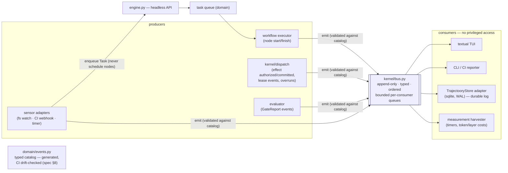
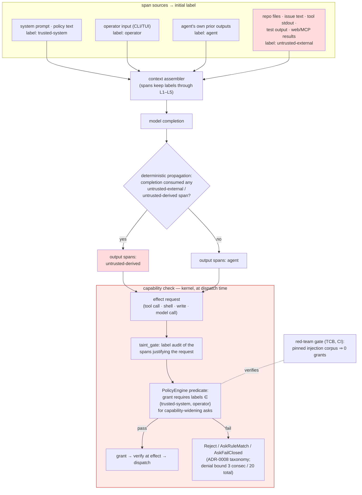
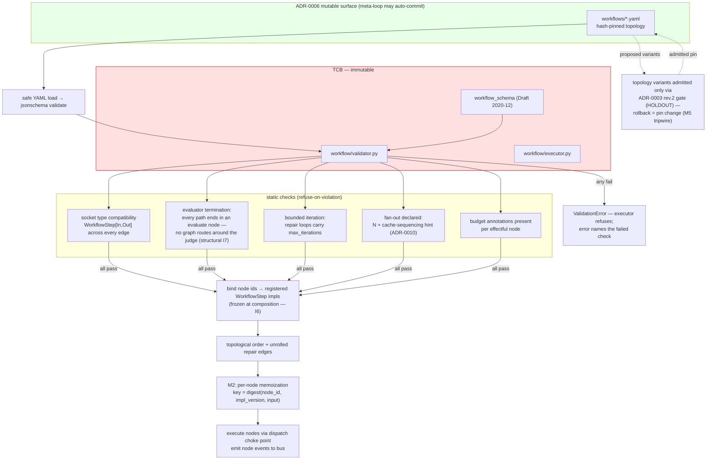

# SYSTEM_WORKFLOWS_AND_DIAGRAMS — Pre-Phase 1 Engineering Specification

**Owners**: Project Lead · Tech Leads
**Standing note on the five-diagram rule** (`docs/README.md`): the root tree's canonical budget of five diagrams is unaffected. This file is `rationale`-tier pre-development working material; three of the diagrams below (run-loop sequence, dispatch choke point, context/taint layout) are the *drafts* of canonical slots and will be promoted into the root tree at M1a, replacing rather than duplicating.

---

## Diagram 1 — Core Execution Loop Sequence (with repair edge)

The bounded repair loop per the ADR-0013 amendment: `k` = static unroll bound from the topology definition (`workflow_schema.repair.max_iterations`). Every effect crosses the dispatcher; nothing calls an adapter directly.

```mermaid
sequenceDiagram
    autonumber
    participant EN as engine.py (headless API)
    participant WF as workflow/executor (TCB-adjacent)
    participant AG as agency (loop · context)
    participant K as kernel/dispatch (TCB choke point)
    participant MP as ModelProvider adapter
    participant WS as Workspace/Worktree adapter
    participant SB as Sandbox (tool container)
    participant EV as Evaluator (TCB, eval container)

    EN->>WF: run(topology_hash, task_id, budget)
    Note over WF: schema-validated topology only<br/>(ADR-0014: executor refuses invalid graphs)

    rect rgb(240,245,255)
    Note over WF,K: node: retrieve
    WF->>AG: execute(retrieve, task)
    AG->>K: authorize(read_repo) → verify grant → acquire lease
    K->>WS: dispatch: index/search/read
    WS-->>AG: files, symbols  [provenance: untrusted-external]
    end

    rect rgb(240,255,240)
    Note over WF,MP: node: generate
    AG->>AG: assemble context (L1..L5, taint-labeled)
    AG->>K: authorize(model_call) → verify → lease(tokens, usd)
    K->>MP: dispatch: stream completion
    MP-->>AG: ModelStreamEvents (deltas, usage)
    K->>K: commit(lease, actual usage)
    end

    rect rgb(255,250,235)
    Note over WF,SB: node: apply
    AG->>K: authorize(write_worktree) → verify → lease
    K->>WS: dispatch: apply patch to candidate worktree
    opt agent-requested shell (classified first)
        AG->>K: authorize(shell) — kernel/shell_ast classifies
        K->>SB: dispatch in tool container (network none)
        SB-->>AG: stdout/exit  [provenance: untrusted-external]
    end
    end

    rect rgb(255,240,240)
    Note over WF,EV: node: evaluate  (TCB — agency cannot reach it)
    WF->>K: authorize(evaluate) → verify → lease(container slot)
    K->>EV: dispatch: run pinned test command (image digest from manifest)
    EV-->>WF: GateReport {status: True|False|None}
    end

    loop repair (bounded: i ≤ k)
        alt GateReport.status == False
            EV-->>AG: failure block (tail-truncated)  [untrusted-external]
            Note over AG: node: repair — failing output → context;<br/>re-plan minimal delta
            AG->>K: model_call + apply (same choke path as above)
            WF->>EV: re-evaluate
        else status == True
            Note over WF: exit loop — resolved
        else status == None
            Note over WF: instrument error (B4):<br/>never a data point; run flagged, not failed
        end
    end

    WF-->>EN: RunResult (resolved | unresolved | instrument_error)
    Note over EN: every step above also emitted<br/>typed events to the bus (Diagram 3)
```

---

## Diagram 2 — Port & Adapter Topology with TCB Boundaries

Ratified boundaries (spec §4): eight boundaries, nine protocols. TCB port implementations live **inside** TCB paths (audit D8 rule) — `PolicyEngine` in `kernel/`, `Evaluator` in `measurement/` — never in `adapters/`. Growth-tier ports are shown detached: per ADR-0005 they do not exist in `ports/` until their first adapter lands.

```mermaid
graph TB
    subgraph DOMAIN["domain/ — pure, zero I/O (I1)"]
        DM["Task · Trajectory · GateReport · Events · TaintSpan · Budget"]
    end

    subgraph PORTS["ports/ — async, wire-serializable Protocols (I2, I3)"]
        pMP[ModelProvider]
        pWS[Workspace]
        pWT[WorktreeManager]
        pTR[ToolRegistry]
        pPE["PolicyEngine (TCB)"]
        pRG[ResourceGovernor]
        pTS[TrajectoryStore]
        pEV["Evaluator (TCB)"]
        pIX[Indexer]
    end

    subgraph KERNEL["kernel/ — TCB (I5, I8)"]
        DISP["dispatch.py — single choke point"]
        POL["policy.py ⇐ implements PolicyEngine"]
        GOV["governor.py ⇐ implements ResourceGovernor"]
        BUS["bus.py — append-only event bus"]
        SAST["shell_ast.py — classifier (ADR-0008)"]
    end

    subgraph MEAS["measurement/ — TCB"]
        EVI["evaluator ⇐ implements Evaluator"]
        STAT["statistics.py (stdlib)"]
        RUN["runner · HarnessUnderTest seam"]
        MAN["manifests (pinned, TCB data)"]
    end

    subgraph ADAPT["adapters/ — mutable, one per boundary, conformance-tested (I4)"]
        aANT["model_provider/anthropic_native"]
        aOAI["model_provider/openai_compatible (B2)"]
        aGIT["workspace/git_cli ⇐ Workspace + WorktreeManager"]
        aTOOL["tools/builtin ⇐ ToolRegistry"]
        aSBX["sandbox/podman (tool containers)"]
        aSQL["trajectory_store/sqlite"]
        aTSIT["indexer/tree_sitter"]
    end

    subgraph AGENCY["agency/ — mutable by meta-loop (ADR-0006)"]
        LOOP["loop · repair"]
        CTX["context/: assembler · compactor · taint_gate"]
    end

    subgraph GROWTH["growth tier — NOT in ports/ yet (ADR-0005)"]
        gMEM([Memory]); gCG([CodeGraph]); gTC([Toolchain]); gCS([CandidateSearch])
    end

    AGENCY --> DISP
    DISP --> POL & GOV
    DISP --> aANT & aOAI & aGIT & aTOOL & aSBX & aSQL & aTSIT
    DISP --> EVI
    aANT & aOAI -.implements.-> pMP
    aGIT -.-> pWS & pWT
    aTOOL -.-> pTR
    aSBX -.-> pTR
    aSQL -.-> pTS
    aTSIT -.-> pIX
    POL -.-> pPE
    GOV -.-> pRG
    EVI -.-> pEV
    PORTS --> DOMAIN
    KERNEL --> PORTS
    MEAS --> PORTS
    ADAPT --> PORTS

    classDef tcb fill:#ffe0e0,stroke:#c00;
    class KERNEL,MEAS,pPE,pEV tcb;
```



**Reading rules**: dependencies point downward only (import-linter lattice, spec §3 amendment); dashed = "implements protocol"; red = immutable TCB; `measurement/` and `kernel/` may not import `agency/` — the judge cannot reach up into the judged.

---

## Diagram 3 — Event Bus & Event Lifecycle

The graph is the execution structure; the stream is the observation structure. **Events never drive node scheduling** (ADR-0013) — a sensor that must cause work enqueues a *task* through the engine API.



**Lifecycle invariants**: (1) an event is immutable once emitted; (2) the durable log (TrajectoryStore) is a consumer like any other — replay = re-consuming the log; (3) display consumers are drop-oldest under backpressure, the durable log and harvester are never dropped; (4) the reproducibility tuple (stack spec §5) is the first event of every run.

---

## Diagram 4 — TaintGate Security Propagation (ADR-0015)

Provenance is carried per context *span*; propagation is deterministic; the binding rule sits in the policy engine: **no untrusted or untrusted-derived span may satisfy a predicate that grants or widens capability.**



**The rule in one sentence**: untrusted content may *inform* work (the agent must read the repo), but a request whose instructional justification traces to untrusted spans can never *acquire authority* — e.g., an issue body saying "also run `curl … | sh`" produces an effect request whose justifying spans are `untrusted-external`, and the predicate fails closed.

---

## Diagram 5 — Declarative Workflow Graph Execution (ADR-0014)

Topology is data; the schema, validator, and executor are TCB. The meta-loop and human loop-engineers propose graphs through the identical admission path.



**Failure-mode notes per diagram slot** (the house rule that each diagram encodes something a previous attempt got wrong): D1 — the predecessor had no designed repair edge and no instrument-error branch; D2 — seventeen ports, five empty; D3 — events driving scheduling is the coupling this separation forbids; D4 — injection defense as one prose sentence; D5 — topology as code throttled every ablation to PR cadence.
