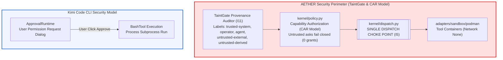
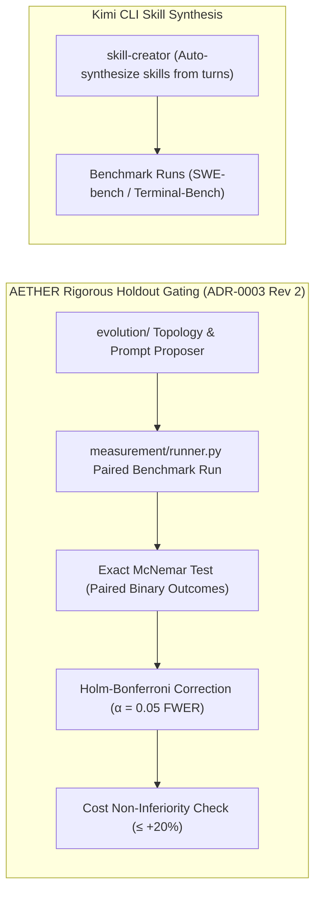

# Comparative Architecture Report: AETHER v3.0.0 vs. Kimi Code CLI

This document presents an architectural, security, and workflow comparison between **AETHER v3.0.0** (based on its complete normative specifications in `docs/spec.md`, `docs/measurement.md`, `docs/workflows/`, and `docs_front/spec.md`) and **Kimi Code CLI** (`MoonshotAI/kimi-cli`).

---

## 1. Vision & Core Design Philosophy

| Aspect | AETHER v3.0.0 | Kimi Code CLI (`MoonshotAI/kimi-cli`) |
| :--- | :--- | :--- |
| **Primary Thesis** | Autonomous coding harness built around **capability security (CAR Model)**, microkernel dispatch, structural evaluator isolation, and **rigorous statistical holdout gating**. | Terminal-first interactive harness and AGI agent orchestrator optimized for Moonshot Kimi K3's ultra-long context and multi-turn reasoning. |
| **Core Metric** | **Lift** (delta between bare model call and model inside AETHER on identical tasks) + Absolute resolve rate on SWE-bench Pro/Verified. | Benchmark resolve rate on SWE-bench and Terminal-Bench 2.1 (80.9%). |
| **Core Architecture** | Microkernel with single dispatch choke point (`kernel/dispatch.py`), pure domain models, and wire-serializable async ports. | Decoupled Python monorepo (`kosong` primitives, `kaos` engine, `kimi-code` app, `kimi-sdk` SDK). |
| **Integrity Assurance** | Mechanical invariants (I1–I11) enforced by `import-linter`, `pyright strict`, and CI container checks. | Modular Python/TypeScript sub-packages, unit tests, and user approval hooks. |

---

## 2. Architectural Invariants & Security Perimeter

### 2.1 Capability Security & Taint Monotonicity (Invariant I11 vs. User Approval)

- **AETHER**:
  - Implements **TaintGate Security (Invariant I11)**: Every context span carries a provenance label (`trusted-system`, `operator`, `agent`, `untrusted-external`, `untrusted-derived`).
  - Untrusted content (repo files, issue descriptions, web search results, tool outputs) is marked `untrusted-external` **at birth**.
  - **Fail-Closed Binding Rule**: Untrusted content may *inform* reasoning, but an effect request whose instructional justification traces to untrusted spans **fails closed** at dispatch time. CI enforces a pinned injection corpus with **zero capability grants** (ADR-0015).
  - Dispatch verification happens **at the exact point of effect execution**, not at authorization issuance time (Invariant **I5**).

- **Kimi Code CLI**:
  - Relies on interactive runtime prompt dialogs (`ApprovalRequest` / `approval.py`) asking the user for confirmation when effectful commands (e.g. bash commands, file overwrites) are generated.
  - Lacks provenance tracking for context spans; prompt injections inside target repositories can attempt to craft bash commands that request user approval.

---

## 3. Inner Loop & Execution Workflows

```mermaid
flowchart TD
    subgraph AETHER_INNER_LOOP["AETHER Declarative DAG Inner Loop"]
        A_DAG["Declarative Graph Topology (workflow/*.yaml)"]
        A_STEPS["WorkflowStep DAG Execution"]
        A_AST["Shell AST Classification (kernel/shell_ast.py)"]
        A_EVAL["measurement/evaluator.py (TCB Container - I7)"]
        A_REPAIR["Bounded Repair Loop (i ≤ k static unroll)"]

        A_DAG --> A_STEPS --> A_AST --> A_EVAL --> A_REPAIR
    end

    subgraph KIMI_INNER_LOOP["Kimi CLI Sequential Turn Loop (KLIP-10)"]
        K_TURN["packages/kaos/loop.py (AgentLoop)"]
        K_STEP["packages/kaos/step.py (StepRunner)"]
        K_COMPACT["prompts/compact.md (Context Compactor)"]
        K_PAGER["Shell UI Pager Hand-off (KLIP-9)"]

        K_TURN --> K_STEP --> K_COMPACT --> K_PAGER
    end
```

### 3.1 Execution Control & Repair Loops

- **AETHER**:
  - **Declarative DAG Execution (ADR-0014)**: Topologies are data defined in hash-pinned YAML files. The executor unrolls DAG steps in topological order.
  - **Bounded Repair ($i \le k$)**: Unroll limits $k$ are statically declared (`workflow_schema.repair.max_iterations`).
  - **Tri-State Gate Verdict**: Evaluation returns `True` (Passed), `False` (Failed), or `None` (**Instrument Error B4**). Instrument errors never count as data points or test failures.
  - **Evaluator Isolation (I7/I8)**: `agency/` can never import or access `measurement/evaluator.py`. Code generator and evaluator containers are strictly isolated.

- **Kimi Code CLI**:
  - **Sequential Turn Loop (KLIP-10)**: Turn-based state machine (`loop.py`, `step.py`) streaming LLM tokens and tool calls.
  - **Terminal Flicker Mitigation (KLIP-9)**: Inline UI displays cap output at 4 lines, handing long diffs or tool outputs off to Rich's `console.pager(styles=True)`.

---

## 4. Outer Loop, Meta-Harness & Benchmark Admission

### 4.1 Statistical Gating & Holdout Verification

- **AETHER**:
  - **Instruments Before Capabilities**: No benchmark or capability number is published before the A/A variance floor is established (`measurement.md`).
  - **Exact McNemar & Holm–Bonferroni**: Admissions require paired binary McNemar testing with family-wise error rate control ($\alpha = 0.05$) across pre-declared gate families, sample size $N$ derived for $\ge 0.80$ power, and cost-per-resolved-task non-inferiority ($\le +20\%$).
  - **Proxy vs. Hard Gate (I9)**: Learned proxy models may rank candidate changes, but **only hard evaluation gates can admit a candidate**.
  - **TCB Immutability (I8)**: The meta-loop (`evolution/`) can auto-commit within the mutable surface (prompts, skills, topology data), but **cannot modify TCB files** (`kernel/`, `measurement/`, workflow schema).

- **Kimi Code CLI**:
  - Incorporates `skill-creator` to synthesize reusable `SKILL.md` files from successful task completion patterns.
  - Evaluates models on public benchmarks (SWE-bench, Terminal-Bench 2.1) without built-in paired McNemar holdout gating inside the harness core.

---

## 5. Memory, Skill System & Context Management

- **AETHER**:
  - **Harness-Side Prefix Stability (I10)**: Fixed prompt prefix layers (L1–L5) with explicit breakpoints to maximize LLM prompt cache hit rates.
  - **Context Assembler & Compactor**: Context spans carry provenance labels throughout assembly and compacting.

- **Kimi Code CLI**:
  - **Unified Skill Discovery (KLIP-8)**: 3-layer priority lookup (`project` $\rightarrow$ `user` $\rightarrow$ `builtin`) for `.agents/skills/<name>/SKILL.md`. Project-level skills override user-level skills.
  - **Structured XML Compactor (`compact.md`)**: Replaces old turn history with structured XML sections (`<current_focus>`, `<environment>`, `<code_evolution>`), prioritizing current state and error resolution logs.

---

## 6. Protocols & Client Interfaces

- **AETHER**:
  - **Headless Core Engine**: `engine.py` emits typed, append-only event streams (`kernel/bus.py`).
  - **Front-End Interfaces (`src_front/`)**:
    - **TUI CLI (`@aether/cli`)**: React 19 + Ink terminal UI featuring turn log streams, integer budget meters, taint audit badges, and tri-state gate indicators.
    - **Desktop GUI (`@aether/desktop`)**: Tauri v2 + React 19 + `@xyflow/react` visual DAG graph canvas, Monaco diff editor, and McNemar statistical dashboard.

- **Kimi Code CLI**:
  - **Wire Mode (`--wire`)**: Low-level stdio JSON-RPC 2.0 protocol (version `1.10`) for external UIs and program control (`docs/en/customization/wire-mode.md`).
  - **ACP Server (`kimi acp`)**: Multi-session Agent Client Protocol server for IDE plugin integration (Zed, JetBrains, VS Code).
  - **MCP Integration (`mcp.json`)**: Dynamic external tool registration via Model Context Protocol (KLIP-12).

---

## 7. Comparative Architectural Matrix

| Dimension | AETHER v3.0.0 Normative Target | Kimi Code CLI (`MoonshotAI/kimi-cli`) |
| :--- | :--- | :--- |
| **Language & Runtime** | Python 3.13 (Monoglot) | Python 3.10+ Monorepo (`kosong`, `kaos`, `kimi-code`, `kimi-sdk`) |
| **Security Architecture** | Capability Authorization (CAR Model) + TaintGate Provenance (I11) | Interactive User Approval Prompting (`ApprovalRequest`) |
| **Dispatch Model** | Single Dispatch Choke Point (`kernel/dispatch.py` - I5) | Direct Tool Dispatcher (`kaos.tool.ToolDispatcher`) |
| **Execution Topology** | Declarative DAG Workflow (`workflow/*.yaml` - ADR-0014) | Sequential Turn State Machine (`loop.py`, `step.py`) |
| **Repair Bounds** | Static Unrolled Repair ($i \le k$) | Dynamic Turn Loop |
| **Evaluator Isolation** | Generator $\ne$ Evaluator Container Boundary (I7 / I8) | In-process execution & sandbox containers |
| **Statistical Admission** | Exact McNemar + Holm–Bonferroni ($\alpha = 0.05$) + Cost Check | Benchmark Evaluation Runs (SWE-bench / Terminal-Bench) |
| **Skill Discovery** | Layered prompt & skill assembly | 3-Layer Priority Lookup (`project` $\rightarrow$ `user` $\rightarrow$ `builtin` - KLIP-8) |
| **Client Protocols** | Headless Event Bus Stream (`engine.py` + `bus.py`) | Stdio JSON-RPC 2.0 Wire Mode (`--wire`) + Multi-Session ACP Server |
| **Front-End Interfaces** | React 19 + Ink TUI (`@aether/cli`) & Tauri v2 + React Flow GUI (`@aether/desktop`) | Rich Terminal UI (`src/kimi_cli/ui`) & Web API Dashboard |

---

## 8. Strategic Recommendations for AETHER

1. **Adopt Kimi's 3-Layer Skill Discovery (KLIP-8)**: Implement a project-level overrides pattern (`./.agents/skills/`) so repository-specific skills take precedence over global user skills without modifying harness core files.
2. **Standardize Stdio Wire Mode Protocol**: Adopt a lightweight JSON-RPC 2.0 stdio protocol matching Kimi's Wire Mode (`--wire`) to simplify embedding AETHER into headless CI pipelines and third-party IDE sidecars.
3. **Incorporate Rich Pager Line-Budgeting (KLIP-9)**: Implement inline line-budgeting in `@aether/cli` to hand long diffs and tool logs off to terminal pagers, maintaining screen stability during interactive repair loops.
