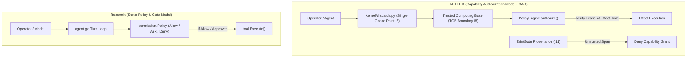
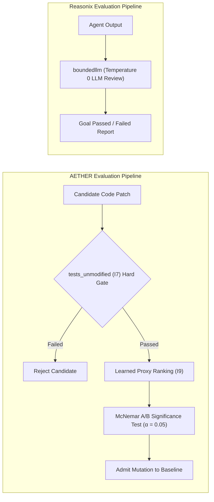

# Comparative Analysis Report: AETHER Architecture vs. Reasonix Agent Harness

## Executive Summary

This report presents a deep architectural comparison between **AETHER v3.0.0** (as specified in [`docs/spec.md`](file:///F:/Coding/Harness-D-power/docs/spec.md)) and **Reasonix** (as audited in `docs/_archive/competitors_research/tech_lead_B/`).

This comparison evaluates both systems as **fully realized, production-grade agent harnesses**, comparing their security perimeters, transport protocols, workflow DAG topologies, evaluation gates, and prompt cache engineering.

---

## 1. System Altitude & Comparison Matrix

| Architectural Dimension | AETHER v3.0.0 (Our Target Architecture) | Reasonix (DeepSeek-Native Harness) |
| :--- | :--- | :--- |
| **Primary Goal** | **Autonomous Coding Harness with Measured Lift** & Pristine Evaluation Gates | Fast, Cache-First CLI/TUI Terminal Coding Agent for DeepSeek |
| **Language & Runtime** | Monoglot Python 3.13 (`asyncio`, `TaskGroup`) + React 19 / Tauri v2 Front-End | Pure Go (`go >= 1.22`, `CGO_ENABLED=0`) single static binary |
| **Security Perimeter** | **Capability Authorization (CAR Model)** with Trusted Computing Base (TCB) | Static per-call rule policy (`Allow`/`Ask`/`Deny`) + Seatbelt sandbox |
| **Effect Dispatch** | **Single Dispatch Choke Point** (`kernel/dispatch.py`); lease verification at point of effect (**I5**) | Immediate tool execution inside `Agent.executeOne()` after policy check |
| **Wire Boundaries** | **100% Wire-Serializable Ports (I3)**; zero live objects or file handles across boundaries | Go `interface` contracts; process-internal method calls or stdio MCP |
| **Workflow Engine** | **WorkflowStep DAG** with `xyflow` visual routing and tri-state `GateStatus` | Linear turn loop or two-model `Coordinator` (Planner + Executor) |
| **Evaluation & Gates** | **Pristine Evaluation Gates**: `tests_unmodified` (**I7**), Hard Gates vs Proxies (**I9**), McNemar A/B significance | LLM-assisted goal evaluation (`boundedllm`), user task contracts |
| **Context & Taint** | **TaintGate Provenance (I11)**; untrusted spans can never acquire capability grants | Context Engine v2; tiered compaction ($0.6/0.8/0.9$), BM25 memory recall |
| **Prompt Caching** | **Prompt Cache as Architecture (I10)**; gated on byte-identical prefix stability rate | Static system prefix layers; turn-suffix memory recall |

---

## 2. Core Architecture & Security Model



### 2.1 Capability Security & TCB Isolation

* **AETHER (CAR Model & TCB Invariant I8)**:
  * Security is rooted in a strict **Trusted Computing Base (TCB)** comprising `kernel/`, `measurement/`, `workflow/`, and benchmark definitions.
  * Agents and meta-loops can **never modify TCB files**.
  * Tool execution is gated through `PolicyEngine.authorize()`. Under **I5**, verification occurs *immediately at the point of effect* (`authorize → verify grant → acquire lease → dispatch → release`), preventing TOCTOU races.
  * Under **I11 (TaintGate)**, every context span carries a provenance label (`TRUSTED_SYSTEM`, `OPERATOR`, `AGENT`, `UNTRUSTED_EXTERNAL`). An untrusted or derived span can **never** satisfy a policy predicate to acquire capability grants.

* **Reasonix (Policy & Gate Model)**:
  * Uses a pure Go `Policy` struct evaluating per-call rules (`Allow`, `Ask`, `Deny`) against tool names and extracted arguments (`Bash(npm test)`).
  * Lacks a formal TCB isolation boundary between kernel code and agency logic. Security relies on interactive human prompts (`Approver`) and optional OS sandboxing (macOS Seatbelt).

---

## 3. Port-Adapter Architecture & Wire Boundaries

### 3.1 Wire-Serializable Ports (Invariant I3)

* **AETHER**:
  * All I/O crosses typed `Protocol` boundaries in `src/aether/ports/` (**I2**).
  * **Invariant I3 (The architectural superpower)**: Every port method is `async` and accepts **only wire-serializable payloads** (Pydantic models, primitive types). Zero file handles, callables, generators, or live objects cross a boundary.
  * **Benefit**: Any port can be split out-of-process—to a Rust sidecar, Docker sandbox, or remote gRPC peer—with zero code changes in callers.

* **Reasonix**:
  * Uses standard Go interfaces (`Provider`, `Tool`, `Gate`).
  * Built-in tools and providers run in-process using native Go data structures.
  * External tools communicate via MCP over stdio/HTTP/SSE JSON-RPC 2.0.

---

## 4. Verification, Evaluation Gates & Statistical Science



### 4.1 Pristine Evaluation Gates vs Heuristic Goal Checking

* **AETHER**:
  * **Invariant I7 (`tests_unmodified`)**: The agent writing code can never modify the test suite grading it.
  * **Invariant I9 (Hard Gates Admit; Proxies Rank)**: Machine-learned proxy models may rank or candidate-filter, but **only deterministic hard gates can admit a candidate**.
  * **McNemar Statistical A/B Significance**: Evaluates code and topology mutations using McNemar tests with Holm–Bonferroni 95% confidence intervals ($\alpha = 0.05$).
  * **Committed Metric**: Absolute resolve rate on SWE-bench Verified **plus Harness Lift** (the delta between bare model calls vs model inside AETHER).

* **Reasonix**:
  * Evaluates task completion using **Task Contracts** (Context, Request, Output format, Constraints, Pause policy).
  * Uses `boundedllm` (isolated, temperature-0 LLM calls) to evaluate goal completion heuristics. Lacks statistical significance testing or immutable test gates.

---

## 5. Workflow Topology: Visual DAG vs. Linear Agent Loops

```mermaid
graph TD
    subgraph AETHER WorkflowStep DAG
        Node1["Retrieve Context"] -->|always| Node2["Generate Candidate Patch"]
        Node2 -->|on_pass (Green)| Node3["Run Gate Verification"]
        Node3 -->|on_fail (Red)| Node4["Repair Loop (Iter N)"]
        Node3 -->|on_instrument_error (Amber Dotted)| Node5["Flag Sandbox Error"]
    end
```

* **AETHER (WorkflowStep DAG & Front-End Integration)**:
  * Workflows are defined as structured **WorkflowStep DAGs** (ADR-0013, ADR-0014) executed by a deterministic DAG engine.
  * Integrates with the `@aether/desktop` GUI via `xyflow` rendering nodes, mini-maps, and custom SVG conditional edges.
  * Enforces **Tri-State `GateStatus`**:
    * `PASSED` (Green solid edge)
    * `FAILED` (Red dashed edge)
    * `NONE` (Amber dotted edge — signifies an *instrument error* such as container OOM or timeout; never silently passes or distorts failure statistics).

* **Reasonix**:
  * Runs a single linear turn loop or a two-model `Coordinator` (Planner session + Executor session).
  * Relies on custom slash commands (`/goal`, `/plan`, `/remember`) to manage workflow phases.

---

## 6. Synthesis: Architectural Superpowers for AETHER

From our investigation of Reasonix, AETHER can integrate 3 key architectural refinements into its agency layer (`src/aether/agency/`):

1. **Static Prompt Cache Prefix Layering (Formalizing I10)**:
   - Adopt Reasonix's technique of strict prefix layer isolation: place standing instructions (`AGENTS.md`) and tool schemas into an immutable head block, and append dynamic memory recall solely to the *user turn-suffix*. This maximizes DeepSeek/Kimi prompt cache hit rates ($>90\%$).

2. **Isolated Bounded Reviewer Pattern (`boundedllm`)**:
   - Implement isolated, no-tool, temperature-0 reviewer callers for TCB evaluation steps so background verification calls never pollute the main agent's prompt cache or session history.

3. **Deterministic Tool Result Snipping Before Compaction**:
   - Before executing full LLM summary compaction, run Reasonix's lightweight 2-phase result snipping: first trim historical tool outputs with head/tail markers at ratio $0.6$, and only trigger LLM summary compaction when context exceeds ratio $0.8$.

---

## 7. Conclusion

**AETHER v3.0.0** represents a superior, enterprise-grade capability harness with **mathematically sound security (CAR/TCB)**, **wire-serializable protocol boundaries (I3)**, and **pristine statistical evaluation science (I7, I9)**.

**Reasonix** excels as a pragmatic, highly optimized CLI tool harness that demonstrates how to achieve maximum prompt cache performance on DeepSeek models.

By incorporating Reasonix's prompt caching prefix discipline into AETHER's `agency/context/` module, AETHER combines the world's most rigorous security & evaluation harness with elite LLM prompt cache economics.
