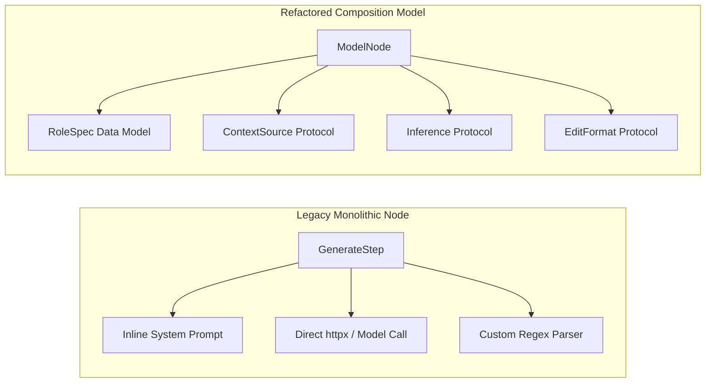

# AETHER Full Documentation — Part 3: Harness Abstraction, Capability Composition & Reusable Core

> **Original Source Documents:** [`docs/fixes/proposal_abstraction_and_harness_composition.md`](../fixes/proposal_abstraction_and_harness_composition.md), [`docs/fixes/proposal_architectural_abstraction_and_harness_engineering_gem.md`](../fixes/proposal_architectural_abstraction_and_harness_engineering_gem.md), [`docs/fixes/implemented_sprint_3.5_complete_report.md`](../fixes/implemented_sprint_3.5_complete_report.md), [`docs/fixes/sprint-3.5-inner-loop-improvements.md`](../fixes/sprint-3.5-inner-loop-improvements.md), [`docs/fixes/proposal_improvements_and_fixes.md`](../fixes/proposal_improvements_and_fixes.md), [`docs/fixes/proposal_capability_extension_roadmap.md`](../fixes/proposal_capability_extension_roadmap.md), [`docs/fixes/proposal_harness_evolution.md`](../fixes/proposal_harness_evolution.md), and [`docs/future_improvements/`](../future_improvements/).

---

## 1. Problem Diagnosis & Architectural Refactoring Rationale

Early node implementations (`ArchitectStep`, `GenerateStep`, `RepairStep`) suffered from monolithic design: 60–150 line Python classes that inlined prompt assembly, span labeling, model calls, stream reduction, output parsing, and payload plumbing.



### 1.1 Verified Code Defects Solved (Sprint 3.5 Report)

1. **Defect A1 (Transitive Adapter Imports)**: `workflow/nodes/*` directly imported concrete adapters and `httpx`. Solved by moving effect payloads (`ReadArgs`, `WriteArgs`, `ShellArgs`) to `src/aether/domain/effects.py`.
2. **Defect A2 (`_worktree_path` Duplication)**: Duplicated in 4 separate files (including inside the TCB `evaluator.py`). Refactored into a single method on `WorktreeRef`.
3. **Defect A3 (Completion Ceiling Distortion)**: `architect.py`, `generate.py`, and `repair.py` reserved prompt token budgets using `self._max_tokens` (a completion limit). Fixed by separating prompt reservation from completion limits in `ResourceGovernor`.
4. **Defect A4 (Unregistered Pricing)**: Added explicit cost calculations for local, OpenRouter, and direct provider endpoints in `measurement/pricing.py`.
5. **Defect A5 (Malformed OpenAI Tool Calls)**: Fixed tool-call format by ensuring assistant messages precede tool result inputs with valid `tool_call_id`.

---

## 2. Generic `ModelNode` & `RoleSpec` Catalog Architecture

To eliminate duplicated node logic, AETHER replaces dedicated step classes with a single generic `ModelNode` parameterized by a declarative `RoleSpec`.

### 2.1 The `RoleSpec` Domain Model

```python
class RoleSpec(BaseModel):
    """Declarative specification for an LLM role capability."""
    name: str
    system_prompt_template: str
    allowed_tools: list[str]
    default_edit_format: str = "unified_diff"
    context_sources: list[str] = Field(default_factory=list)
    completion_token_limit: int = 4096
    temperature: float = 0.0
```

### 2.2 Standard Role Catalog
* **`ARCHITECT`**: High-level reasoning, plan generation, read-only tools (`read_file`, `grep_search`), zero write grants.
* **`EDITOR`**: Surgical code patch generation (`apply_patch`, `write_file`), strict diff syntax validation.
* **`REPAIR`**: Test failure diagnosis, traceback analysis, iterative patch repair ($k \le 3$).
* **`REFLECTOR`**: Post-evaluation trajectory analysis, root-cause tagging for failure categorization.

---

## 3. Protocol Seams (`ContextSource` & `EditFormat`)

AETHER enforces modular protocol seams so context retrieval and code editing strategies can be ablated independently without changing workflow nodes.

### 3.1 `ContextSource` Protocol & Implementations

```python
class ContextSource(Protocol):
    """Protocol boundary for repository context retrieval."""
    async def fetch_context(
        self, 
        task: Task, 
        workspace: Workspace
    ) -> list[ContextBlock]: ...
```

1. **`FileContextSource`**: Reads explicit entry files declared in task manifest.
2. **`LexicalSource`**: Greps repository for identifiers extracted from issue descriptions.
3. **`SymbolSource`**: Indexer-backed symbol table and AST call-graph retrieval via `tree-sitter`.
4. **`TestPathSource`**: Extracts imported modules from failing test tracebacks.
5. **`HistorySource`**: Searches recent git commit diffs for relevant file modifications.

### 3.2 `EditFormat` Protocol & Implementations (`TASK-037`, `TASK-066`)

```python
class EditFormat(Protocol):
    """Protocol for applying LLM edits to worktree files."""
    def parse_and_apply(
        self, 
        content: str, 
        completion: str
    ) -> EditResult: ...
```

1. **`UnifiedDiffFormat`**: Standard unified diff patches (`--- a/file`, `+++ b/file`) with `--3way` fallback.
2. **`WholeFileFormat`**: Full file replacement wrapped in AST parse-and-validate checks.
3. **`SearchReplaceFormat`**: Surgical `<<<<<<< SEARCH ... ======= ... >>>>>>> REPLACE` blocks.

---

## 4. `RunConfig` Domain Model & Instrument Hashes (`TASK-058`)

The `RunConfig` domain model aggregates all 15 execution keyword arguments into a single frozen Pydantic structure.

```python
class RunConfig(BaseModel):
    """Execution configuration model for AETHER runs."""
    model_name: str
    topology_file: str
    manifest_file: str
    temperature: float = 0.0
    max_repair_iterations: int = 3
    edit_format: str = "unified_diff"
    mode: Literal["benchmark", "interactive"] = "benchmark"
    require_container: bool = True
    seed: int = 42

    def instrument_hash(self) -> str:
        """Returns SHA-256 hash identifying the complete instrument configuration tuple."""
        raw = self.model_dump_json(sort_keys=True)
        return hashlib.sha256(raw.encode("utf-8")).hexdigest()
```

> **Downstream Leverage**: `sha256(RunConfig)` forms the exact instrument tuple required by [`measurement.md` §6](../measurement.md#6-pre-publication-verification-gate). GUI, TUI, and CLI forms auto-generate from `RunConfig.model_json_schema()`.

---

## 5. Topology Fragments (`schema_version: 1.1.0`) (`TASK-060`)

Topology Fragments allow declarative workflow graphs to reuse recurring subgraphs (e.g., standard `apply → evaluate → repair` loops) without copy-pasting YAML definitions.

### Fragment Expansion Rules
1. **Expansion Precedes Validation**: Graph macro expansion occurs *before* `TopologyValidator` checks edges.
2. **Static Check Preservation**: All 5 static graph checks run on the fully expanded graph.
3. **Hash-Pinned References**: Fragments are referenced by SHA-256 hash, never relative file paths (ADR-0014).

```yaml
schema_version: "1.1.0"
name: "linear_repair_fragment_v1"
imports:
  - fragment: "fragments/eval_repair_loop_v1.yaml"
    sha256: "a3f8c...91b"
nodes:
  - id: "retrieve"
    kind: "retrieve"
  - id: "generate"
    kind: "generate"
  - include: "eval_repair_loop_v1"
```

---

## 6. Capability Extension Roadmap & Competitor Analysis

AETHER evaluates external agent frameworks to adopt SOTA execution mechanics while enforcing internal TCB invariants.

### 6.1 AETHER vs. Kimi-CLI Analysis
* **Kimi-CLI Strength**: Highly optimized wire format and fast local file context caching.
* **AETHER Alignment**: Adopted Kimi's compact context buffer concept into L5 Compactor (`TASK-024`) while preserving AETHER's 5-layer prefix stability (I10).

### 6.2 AETHER vs. Reasonix Analysis
* **Reasonix Strength**: Multi-agent reasoning chains and tree-search exploration.
* **AETHER Alignment**: Integrated Reasonix's search-tree exploration mechanics into Milestone M3's Best-of-N cache-sequenced fan-out (`TASK-033`, `TASK-035`) gated by McNemar statistical admission (ADR-0003).
