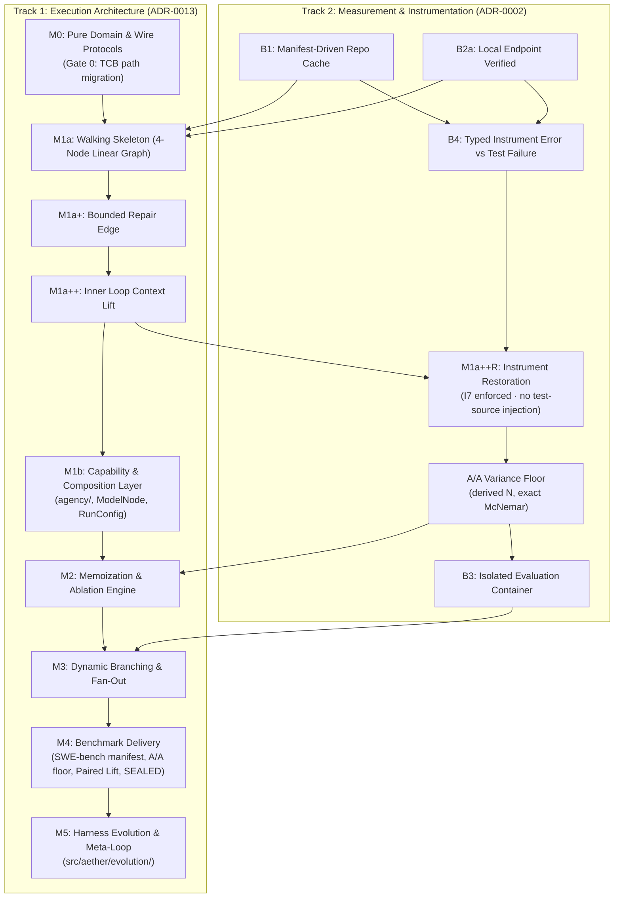

# AETHER Full Documentation — Part 4: Agile Execution Roadmap, Backlog & Milestones

> [!WARNING]
> **Stale snapshot. Not authoritative, and not maintained.**
>
> This folder is a hand-written re-rendering of documents that already have an
> authoritative home, which `README.md` names as the one thing this tree forbids:
> *"if you find the same thing stated in two places, the second one is the bug."*
> It has already drifted — it cites `docs/development/`, `docs/fixes/` and
> `docs/future_improvements/`, none of which exist, and Part 2 covers only ADRs
> 0001–0018 of 21.
>
> For anything binding read [`spec.md`](../spec.md), [`measurement.md`](../measurement.md),
> [`PHASE-0-LOCK.md`](../PHASE-0-LOCK.md), [`decisions/`](../decisions/README.md) and
> [`STATUS.md`](../STATUS.md). Tagged `retrieval: excluded` so no retrieval surfaces it
> and the link gate does not check it; see `TASK-084`.

> **Original Source Documents:** [`docs/agile/roadmap.md`](../agile/roadmap.md), [`docs/agile/backlog.md`](../agile/backlog.md), [`docs/agile/milestones.md`](../agile/milestones.md), [`docs/agile/coverage_audit.md`](../agile/coverage_audit.md), [`docs/agile/sprints/README.md`](../agile/sprints/README.md), [`docs/agile/sprints/sprint-01.md`](../agile/sprints/sprint-01.md) through [`sprint-05.md`](../agile/sprints/sprint-05.md), [`docs/agile/sprints/sprint-03-dev-prompt.md`](../agile/sprints/sprint-03-dev-prompt.md), and [`docs/agile/sprints/sprint-04-dev-prompt.md`](../agile/sprints/sprint-04-dev-prompt.md).

---

## 1. Phased Execution Roadmap

AETHER development is governed by a **two-track normative execution DAG** ([ADR-0013](../decisions/0013-workflow-dag-phased.md) and [`measurement.md`](../measurement.md)):

---

## 2. Milestone Exit Gates Catalog

Per [ADR-0009](../decisions/0009-gates-are-the-schedule.md), a milestone is complete **only when all its exit gates pass cleanly in CI**.

### 2.1 Blocker Exit Gates

#### Blocker B1 — Manifest-Driven Upstream Repository Cache
* **Exit Gate 1**: Repo set derived from pinned task manifest, not hard-coded.
* **Exit Gate 2**: Resolves 100% of base commits for pinned floor manifest with zero invalid reference errors.
* **Exit Gate 3**: Content-addressed and offline-replayable without network.

#### Blocker B2 — Local OpenAI-Compatible Endpoint
* **Exit Gate 1 (B2a)**: Endpoint reachable; structured JSON generation request completes.
* **Exit Gate 2 (B2b)**: `ModelProvider` adapter passes parametrized conformance suite ([ADR-0005](../decisions/0005-eight-ports-adapter-first.md)).

#### Blocker B4 — Typed Instrument Error Handling
* **Exit Gate 1**: `Evaluator` returns typed tri-state `GateReport` (`PASSED` / `FAILED` / `NONE`).
* **Exit Gate 2**: Exit code 127, uncollectable runner errors, and test-command hash mismatches map to `NONE` (never `FAILED`).
* **Exit Gate 3**: Outcomes with `NONE` are excluded from the resolve-rate denominator.

#### Blocker B3 — Isolated Evaluation Container & Canary Test
* **Exit Gate 1**: Worktree execution isolated inside rootless Podman / Docker container.
* **Exit Gate 2 (Canary Test)**: CI includes canary asserting a deliberately broken candidate fails evaluation.
* **Exit Gate 3**: Gate 2 canary executes in the A/A floor environment before the floor run.

---

### 2.2 Milestone Exit Gates

#### Milestone M0 — Pure Domain & Wire Protocols
* **Exit Gate 0 (TCB Path Migration — `TASK-000`)**: `.importlinter` `tcb-isolation` and CI `TCB_PATHS` name `src/aether/…` paths. Acceptance is negative: `test_path_constant_drift.py` demonstrably fails if paths select `src/sagiha/`.
* **Exit Gate 1 (`domain-is-pure`)**: `import-linter` contract asserts zero I/O imports in `src/aether/domain/`.
* **Exit Gate 2 (`wire-serializable-ports`)**: Reflection contract asserts all `ports/` methods are `async` and use serializable payloads.
* **Exit Gate 3 (`tcb-isolation`)**: `import-linter` contract asserts `kernel/` and `measurement/` cannot import `agency/` or `workflow/`.
* **Exit Gate 4**: `WorkflowStep[In, Out]` node and socket types land with strict Pyright typing.
* **Exit Gate 5 (`TASK-005`)**: Conformance meta-suite fails when an adapter parameter list is empty.

#### Milestone M1a — Walking Skeleton (4-Node Linear DAG)
* **Exit Gate 1**: 4-node pipeline (`retrieve → generate → apply → evaluate`) executes from declarative topology YAML.
* **Exit Gate 2 (`dispatch-choke-point`)**: Architecture test proves all side-effects pass through `kernel/dispatch.py`.
* **Exit Gate 3**: Conformance suites pass for four walked ports (`ModelProvider`, `Workspace`/`WorktreeManager`, `ToolRegistry`, `Evaluator`).
* **Exit Gate 4**: Worktree-creation and AST parse timers recorded.
* **Exit Gate 5**: `ResourceGovernor` reserve $\rightarrow$ commit $\rightarrow$ release exercised; dispatcher refuses effects without a live lease.

#### Milestone M1a+ — Bounded Repair Edge
* **Exit Gate 1**: `evaluate →(fail, k)→ repair → apply → evaluate` statically unrolled to `max_iterations`.
* **Exit Gate 2**: Validator rejects repair blocks lacking `max_iterations` or exceeding bound.
* **Exit Gate 3**: `GateReport` of `NONE` routes to terminal flag node and never into repair.
* **Exit Gate 4**: Each repair iteration reserves its own budget; exhaustion terminates loop.

#### Milestone M1a++ — Inner Loop Context Lift
* **Exit Gate 1**: `EditFormat` seam (`TASK-037`) passes generic conformance suite for diff & whole-file.
* **Exit Gate 2**: Node registry resolves step implementations dynamically from kind (`TASK-038`).
* **Exit Gate 3**: `RepairStep` re-reads worktree files dynamically (`TASK-039`).

#### Milestone M1a++R — Instrument Restoration
* **Exit Gate 1**: Invariant I7 (`tests_unmodified`) enforced in TCB evaluator with negative test (`TASK-049`).
* **Exit Gate 2**: Test-source injection demoted to named ablation arm with `False` default (`TASK-049b`).
* **Exit Gate 3**: Internal A/A floor executed with derived N and exact McNemar variance metrics.

#### Milestone M1b — Capability & Composition Layer
* **Exit Gate 1**: `agency/` created under `workflow/` in import lattice (`TASK-053`).
* **Exit Gate 2**: `ContextSource` and `Inference` protocols extracted and swappable (`TASK-054`, `TASK-055`).
* **Exit Gate 3**: `ModelNode` + `RoleSpec` replace old monolithic node classes with golden-prompt test (`TASK-057`).
* **Exit Gate 4**: Record/replay cassette engine achieves 100 turns in <50ms with byte-for-byte determinism (`TASK-006`).

#### Milestone M2 — Memoization & Ablation Engine
* **Exit Gate 1 (M2-eng)**: Subtree re-execution skips unchanged nodes on input-digest match.
* **Exit Gate 2 (Ablation 1 — repair)**: Repair-on vs repair-off clears noise floor under ADR-0003 rev. 2 at derived N.
* **Exit Gate 3 (Ablation 2 — context)**: Generated context layer tested against hand-authored brief; cleared or deleted per ADR-0010.
* **Exit Gate 4 (Ablation 3 — Architect/Editor)**: Dual-model seam ablated against single-model baseline.
* **Exit Gate 5 (compaction)**: Trajectory exceeding context window completes via L5 compaction on pinned long-task fixture.
* **Exit Gate 6 (prompt-cache floor)**: Harness-side prefix stability meets calibrated floor (I10).

#### Milestone M3 — Dynamic Branching & Best-of-N Fan-Out
* **Exit Gate 1**: DAG supports conditional branches and declared multi-candidate fan-out with declared joins.
* **Exit Gate 2**: Enforces exact McNemar, Holm–Bonferroni correction ($\alpha = 0.05$), and derived N at $\ge 0.80$ power.
* **Exit Gate 3**: Best-of-N fan-out is cache-sequenced (candidate 1 warms prefix before 2..N release).
* **Exit Gate 4**: Child leases carve from parent reservation; cancelling losers refunds parent.

#### Milestone M4 — Benchmark Delivery (SWE-bench & SEALED Publication)
* **Exit Gate 1 (`TASK-071`)**: Pinned SWE-bench manifest with bidirectional validity canary passed on 100% of candidate tasks.
* **Exit Gate 2 (`TASK-072`)**: SWE-bench A/A floor executed, deriving benchmark-specific discordance rate ($p_{01}, p_{10}$) and required $N$.
* **Exit Gate 3 (`TASK-073` & `TASK-015b`)**: Paired lift runs executed for AETHER vs. bare-model and AETHER vs. OpenHands arm on same manifest.
* **Exit Gate 4 (`TASK-074`)**: Publication run on SEALED dataset satisfying all 7 conditions of `measurement.md` §6.

#### Milestone M5 — Harness Evolution & Meta-Loop
* **Exit Gate 1**: `src/aether/evolution/` package established and covered under TCB isolation.
* **Exit Gate 2**: Declarative topology mutation engine operates under attenuated subagent capabilities.

---

## 3. Coverage Audit Resolution & Gap Analysis

The audit documented in [`docs/agile/coverage_audit.md`](coverage_audit.md) identified 6 critical planning gaps (**G1–G6**):

| # | Gap | Severity | Audit Resolution & Target Task |
| :--- | :--- | :--- | :--- |
| **G1** | Mission has no milestone/gate/task | **Critical** | Created **Milestone M4 (Benchmark Delivery)** with `TASK-071` (manifest), `TASK-072` (SWE floor), `TASK-073` (paired lift), `TASK-074` (SEALED publication). |
| **G2** | `TASK-006` (cassettes) never built | **High** | Pulled `TASK-006` (Record/Replay Cassette Engine) into **Sprint 5** plan beside `TASK-057`. |
| **G3** | I9 type separation enforced by nothing | **High** | Folded type-level `rank()` / `admit()` separation into `TASK-067` and recorded deviation in `STATUS.md`. |
| **G4** | M1a++, M1a++R, M1b have no exit gates | **Medium** | Promoted DoD sections into normative `milestones.md` exit gates. |
| **G5** | No client task anywhere | **Medium** | Created `TASK-075` (Read-only TUI Client over Event Bus) scheduled after `TASK-058`. |
| **G6** | No `evolution/` or meta-loop task | **Medium** | Mapped **Milestone M5 (Evolution & Meta-Loop)** post-M4 and recorded vacuous contract target in `STATUS.md`. |

---

## 4. Technical Backlog Summary (`TASK-000` through `TASK-075`)

Tasks are prioritized and assigned a technical complexity score (1 = Very Easy, 5 = Very Hard):

### Completed Foundations (Sprints 1 – 3.5)
* `TASK-000` (1): TCB Path Constants Migration — ✅ DONE
* `TASK-001` (2): Pure Domain Data Models — ✅ DONE
* `TASK-002` (3): Wire-Serializable Port Protocols — ✅ DONE
* `TASK-003` (4): Kernel Dispatch & Policy Engine Choke Point — ✅ DONE
* `TASK-004` (2): WorkflowStep Node & Socket Types — ✅ DONE
* `TASK-005` (3): Conformance Meta-Suite Harness — ✅ DONE
* `TASK-010` (2): Manifest-Driven Repo Cache — ✅ DONE
* `TASK-011` (3): Local Model Provider Adapter — ✅ DONE
* `TASK-012` (5): Statistical Engine & A/A Variance Floor — ✅ DONE
* `TASK-013` (1): Typed Tri-State GateReport — ✅ DONE
* `TASK-014` (3): Task-Manifest Tooling & Validity Canary — ✅ DONE
* `TASK-015` (5): Comparative-Lift Rig (Bare-model arm) — ✅ DONE
* `TASK-016` (5): Evaluation Container & B3 Canary — ✅ DONE
* `TASK-017` (3): Git Workspace & Worktree Adapter — ✅ DONE
* `TASK-018` (4): Built-in Tool Registry — ✅ DONE
* `TASK-019` (4): TCB Evaluator Implementation — ✅ DONE
* `TASK-020` (4): Declarative Topology Executor — ✅ DONE
* `TASK-021` (1): Worktree & AST Performance Timers — ✅ DONE
* `TASK-022` (4): Headless Engine API & Event Bus — ✅ DONE
* `TASK-023` (4): Bounded Repair Loop Node — ✅ DONE
* `TASK-026` (2): SQLite Trajectory Store Adapter — ✅ DONE
* `TASK-034` (4): ResourceGovernor Ledger — ✅ DONE
* `TASK-037`–`TASK-041` (3): Sprint 3.5 Inner Loop Improvements — ✅ DONE

### Planned & Upcoming Execution (Sprint 4 Onward)
* **Sprint 4**: `TASK-049` (I7 enforcement), `TASK-049b` (Demote injection), `TASK-050` (Effect payloads), `TASK-051` (Worktree path), `TASK-052` (Envelope base), Internal A/A Floor run.
* **Sprint 5**: `TASK-053` (Lattice change), `TASK-054` (ContextSource), `TASK-055` (Inference protocol), `TASK-056` (PromptAssembler), `TASK-057` (ModelNode), `TASK-058` (RunConfig), `TASK-006` (Cassette Replay Engine).
* **Sprint 6 (M2-eng)**: `TASK-032` (Digest Memoization).
* **Sprint 7+ (M2-abl)**: `TASK-025` (Architect/Editor seam), `TASK-024` (L5 Compactor), `TASK-030a` (Shell AST), `TASK-030b` (TaintGate Corpus).
* **Sprint 8 (M3)**: `TASK-035` (Dynamic Branching), `TASK-033` (Cache Sequencing), `TASK-067` (Candidate Ranker & I9 type separation).
* **Sprint 9 (M4 Benchmark Delivery)**: `TASK-071` (SWE Manifest), `TASK-072` (SWE Floor), `TASK-073` (Paired Lift), `TASK-074` (SEALED Publication), `TASK-015b` (OpenHands Arm), `TASK-075` (Read-only TUI).
* **Post-M4 (M5 Evolution)**: `src/aether/evolution/` subagent self-redesign engine.
