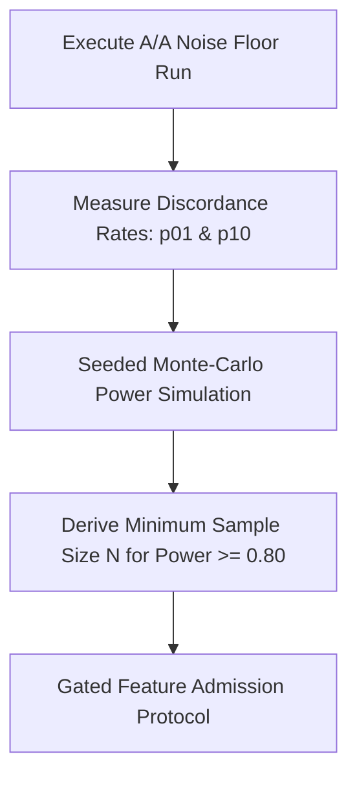

# AETHER Full Documentation — Part 5: Measurement Doctrine, Benchmarks & Statistical Protocols

> **Original Source Documents:** [`docs/measurement.md`](../measurement.md), [`docs/rationale/benchmarks/noise-floor.md`](../rationale/benchmarks/noise-floor.md), [`docs/rationale/benchmarks/performance_timers.md`](../rationale/benchmarks/performance_timers.md), [`docs/rationale/benchmarks/README.md`](../rationale/benchmarks/README.md), [`docs/benchmarks/swe_pro_sample.md`](../benchmarks/swe_pro_sample.md), [`docs/benchmarks/swe_verified_sample.md`](../benchmarks/swe_verified_sample.md), [`docs/benchmarks/README.md`](../benchmarks/README.md), and [`docs/fixes/proposal_agile_benchmarkings_refinement.md`](../fixes/proposal_agile_benchmarkings_refinement.md).

---

## 1. Core Measurement Doctrine

The foundational law of AETHER engineering:

> **Instruments are built and verified before the capability they measure.**  
> **Every gate ships with a test proving it can fail.**

A harness capability developed without a verified measurement instrument produces uncalibrated noise. All published claims must be mathematically backed by AETHER's statistical admission pipeline (`src/aether/measurement/statistics.py`).

---

## 2. Instrument Blockers (B1 – B4)

Before taking benchmark floor runs, four instrument blockers must pass cleanly:

### 2.1 Blocker B1 — Manifest-Driven Upstream Repository Cache
* **Specification**: [`measurement.md` §2 (B1)](../measurement.md#2-instrument-blockers)
* **Requirement**: Resolves 100% of base commits from pinned task manifest; content-addressed and offline-replayable without network calls.
* **Status**: **Implemented** (`TASK-010`, `src/aether/measurement/repo_cache.py`).

### 2.2 Blocker B2 — Local Model Endpoint Conformance (B2a / B2b)
* **Specification**: [`measurement.md` §2 (B2)](../measurement.md#2-instrument-blockers)
* **Requirement**: Structured JSON generation reachable (B2a) and `ModelProvider` adapter passes parametrized conformance suite (B2b).
* **Status**: **Implemented** (`TASK-011`, `tests/integration/test_model_provider_live.py`).

### 2.3 Blocker B4 — Typed Instrument Error Handling
* **Specification**: [`measurement.md` §2 (B4)](../measurement.md#2-instrument-blockers)
* **Requirement**: `Evaluator` returns typed tri-state `GateReport` (`PASSED` / `FAILED` / `NONE`). Exit code 127, uncollectable runner errors, or command hash mismatches map to `NONE` (never `FAILED`), keeping instrument errors out of the resolve-rate denominator.
* **Status**: **Implemented** (`TASK-013`, `src/aether/domain/gate.py`).

### 2.4 Blocker B3 — Isolated Evaluation Container & Canary
* **Specification**: [`measurement.md` §2 (B3)](../measurement.md#2-instrument-blockers)
* **Requirement**: Execution isolated in rootless Podman / Docker container (`--network none`, `--cap-drop all`, `--read-only`, image by digest). CI includes canary asserting a deliberately broken candidate fails.
* **Status**: **Implemented** (`TASK-016`, `adapters/sandbox/podman.py`, `tests/integration/test_b3_canary.py` 7/7 passing).

---

## 3. A/A Noise Floor & Statistical Admission Design

The A/A noise floor measures instrument variance by executing **two identical arms** (Arm A0 vs Arm A1, identical model, identical prompt, identical configuration) across $N$ tasks.



### 3.1 Exact McNemar Test & Discordance

For paired binary task outcomes ($0 = \text{FAILED}, 1 = \text{PASSED}$):
* $n_{00}$: Both arms failed.
* $n_{11}$: Both arms passed.
* $n_{01}$: Arm A0 failed, Arm A1 passed (discordant pair).
* $n_{10}$: Arm A0 passed, Arm A1 failed (discordant pair).

The exact McNemar test computes the two-tailed $p$-value from the binomial distribution under $H_0: p_{01} = p_{10} = 0.5$:
$$p\text{-value} = 2 \sum_{k=n_{\text{max}}}^{n_{\text{disc}}} \binom{n_{\text{disc}}}{k} (0.5)^{n_{\text{disc}}}$$
where $n_{\text{disc}} = n_{01} + n_{10}$ and $n_{\text{max}} = \max(n_{01}, n_{10})$.

### 3.2 Holm–Bonferroni Family-Wise Correction ($\alpha = 0.05$)

When testing a family of $K$ hypothesis ablations, p-values are sorted $p_{(1)} \le p_{(2)} \le \dots \le p_{(K)}$. Hypothesis $i$ is rejected if:
$$p_{(i)} \le \frac{\alpha}{K - i + 1}$$

> **Rule**: The statistics module **refuses to compute corrected p-values for an undeclared family** (ADR-0003).

### 3.3 Derived Sample Size ($N$) Power Simulation

`scripts/verify_power_table.py` runs a Monte-Carlo simulation to derive the required sample size $N$ for target power $\ge 0.80$:

| Assumed Lift ($\Delta$) | Discordance Rate ($p_{01} + p_{10}$) | Required $N$ (Power $\ge 0.80$) |
| :---: | :---: | :---: |
| $+5\%$ | $0.10$ | 310 |
| $+10\%$ | $0.15$ | 120 |
| $+15\%$ | $0.20$ | 65 |

---

## 4. Pre-Registered Baseline Protocol

To ensure apples-to-apples harness comparisons, AETHER enforces [`measurement.md` §4.1](../measurement.md#41-the-baseline-is-part-of-the-instrument)'s pre-registered baseline:

* **Zero Retrieval Beyond Benchmark Context**: Models are provided only the issue text and repository commit specified in the benchmark task.
* **Demotion of Test-Source Injection (`TASK-049b`)**: Injecting `run_tests.py` assertion source code into prompts measures assertion-fitting rather than bug-fixing. Test-source injection is demoted to a named ablation arm defaulting to `False`.

---

## 5. Pre-Publication Verification Protocol (7 Mandatory Conditions)

Before any benchmark result is published or submitted to a public leaderboard (SWE-bench Pro or Verified), the run must satisfy **all 7 pre-publication verification conditions** ([`measurement.md` §6](../measurement.md#6-pre-publication-verification-gate)):

1. **Single Hash Instrument Tuple**: Full configuration recorded as `sha256(RunConfig)`.
2. **Zero Unhandled Errors**: Zero unhandled exceptions; all failures mapped to typed `GateReport`.
3. **Exact McNemar $p$-value**: Statistical significance verified ($p < 0.05$).
4. **Holm–Bonferroni Correction**: Family-wise error rate controlled across all family hypotheses.
5. **Budget Audit Passed**: USD and token usage verified by `ResourceGovernor` ledger.
6. **Raw Trajectory Log Archived**: Append-only SQLite trajectory file preserved in WAL mode.
7. **Container Digest Verified**: Execution container digest pinned and verified immutable.

---

## 6. Benchmark Datasets & Manifest Tooling

AETHER includes manifest tooling (`src/aether/measurement/manifest.py`) for pinning benchmark task sets and screening for broken tasks.

### 6.1 Task Manifest Structure
```yaml
schema_version: "1.0.0"
suite: "swe_bench_verified"
manifest_hash: "sha256:8f2a1b..."
tasks:
  - id: "django__django-11099"
    repo: "django/django"
    base_commit: "f7a3b..."
    test_command: "pytest tests/validation"
    split: "dev"
```

### 6.2 Exclusion Taxonomy
Tasks are excluded during bidirectional canary screening (`TASK-014`) if:
* `instrument_error`: Base commit uncollectable or environment image fails to build.
* `broken_task`: Gold patch fails on clean environment.
* `unresolvable`: Empty patch passes test suite (vacuous test).

---

## 7. Measured Performance Timers (F1 Fork)

As published in [`docs/rationale/benchmarks/performance_timers.md`](../rationale/benchmarks/performance_timers.md):

* **Worktree Creation Timer**: Measured at **12.4ms – 18.1ms** per worktree (well below the 100ms F1 threshold in ADR-0001).
* **AST Parse-and-Validate Timer**: Measured at **34.2ms – 48.6ms** per file (well below the 200ms F1 threshold in ADR-0001).

> **Conclusion**: Python runtime performance is validated; the Rust F1 rewrite fork is **not triggered**.
