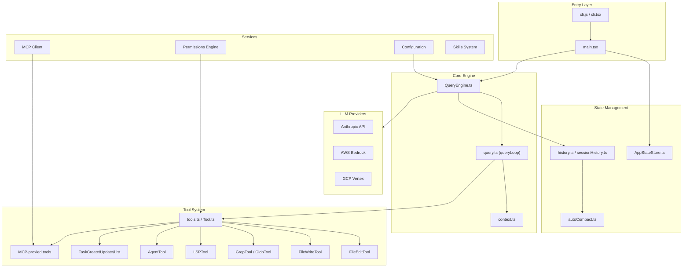
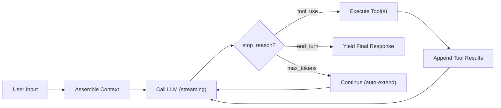

# Claude Code — Architectural Overview

> **Project**: Claude Code (by Anthropic)
> **Language**: TypeScript (Node.js / Bun)
> **License**: Proprietary (source-available)
> **Source Path**: `src/claude_code/`
> **Source Files**: ~1,897 TypeScript files (`.ts`/`.tsx` under `src/`)

---

## 1. Project Identity

Claude Code is Anthropic's flagship autonomous coding agent, shipped as a CLI tool
that brings Claude's capabilities directly into a developer's terminal. It is written
in TypeScript targeting Node.js with Bun compatibility shims, and renders its terminal
UI using React via the Ink library.

| Attribute | Value |
|-----------|-------|
| Language | TypeScript |
| Runtime | Node.js / Bun |
| UI Framework | React (Ink) for terminal rendering |
| Package Manager | npm / bun |
| Build System | Custom `build.mjs` (esbuild-based) |
| Key Dependencies | `@anthropic-ai/sdk`, AWS Bedrock SDK, GCP Vertex SDK, `@modelcontextprotocol/sdk`, `zod`, `chokidar`, `commander`, `ink` |

---

## 2. Architecture Overview

Claude Code follows a **layered service architecture** with clear separation between
CLI entry, state management, the query engine (LLM orchestration), tools, and UI
rendering.



**Key architectural traits:**
- **Monolithic core**: The query engine (`QueryEngine.ts` + `query.ts`) concentrates
  most orchestration logic in ~1,700 lines.
- **Tool-first design**: Nearly all agent capabilities are exposed as tools with
  `zod`-validated schemas.
- **React-based TUI**: The terminal UI is a full React component tree rendered via Ink.

---

## 3. Execution Loop

The core agent loop lives in `src/query.ts` as an **async generator** function:

```
export async function* query() → AsyncGenerator<StreamEvent | Message>
```

This delegates to `queryLoop()`, which implements the classic agentic cycle:



**Loop mechanics:**
- The loop checks `stop_reason` from the LLM response after each streaming completion.
- If `stop_reason === 'tool_use'`, it executes the requested tools and appends results
  back to the message array, then re-calls the LLM.
- If `stop_reason === 'end_turn'`, the loop terminates and yields the final message.
- If `stop_reason === 'max_tokens'`, it auto-extends by continuing the conversation.
- **Error recovery**: Tool execution errors are caught and returned as tool error
  results to the LLM, allowing self-correction.
- **Recursive tool handling**: Multiple tool calls in a single response are executed
  and their results batched before the next LLM call.

---

## 4. Context Management

Context assembly is handled by `src/context.ts` and the `QueryEngine`:

| Context Layer | Source | Description |
|---------------|--------|-------------|
| **System Context** | `context.ts` → `SystemContext` | Git branch, repo status snapshot, working directory |
| **User Context** | `context.ts` → `UserContext` | Reads `CLAUDE.md` files (project-level instructions, similar to `.cursorrules`) |
| **Tool Definitions** | `tools.ts` | All registered tool schemas are serialized into the system prompt |
| **Conversation History** | `history.ts` | Rolling message array with dynamic truncation |

**Token budgeting:**
- The `QueryEngine` dynamically manages the context window size.
- When the conversation grows too large, **auto-compaction** kicks in
  (`src/services/compact/autoCompact.ts`), which summarizes older messages to
  reclaim token budget.
- System and user context are reconstructed on each call to ensure freshness.

---

## 5. Short-Term Memory

Short-term memory is the **in-session conversation history** — the array of messages
passed to the LLM on each turn.

| Component | File | Role |
|-----------|------|------|
| Message history | `src/history.ts` | Maintains the ordered list of user/assistant/tool messages |
| Session history | `src/assistant/sessionHistory.ts` | Manages session-level conversation state |
| Auto-compaction | `src/services/compact/autoCompact.ts` | Dynamically summarizes old messages to fit within token limits |
| App state | `src/bootstrap/AppStateStore.ts` | React-managed state for the active session |

**Auto-compaction strategy:**
- When the message array approaches the context window limit, older messages are
  collapsed into a summary message.
- This preserves recent context while compressing historical context.
- The compaction is transparent to the LLM — it sees a coherent conversation.

---

## 6. Long-Term Memory

Claude Code implements **file-based persistent memory** across sessions, and the
system is considerably richer than a flat `CLAUDE.md` file. The `src/memdir/`
module implements a full **auto-memory subsystem** with a typed taxonomy,
semantic-ish retrieval, and (in team contexts) synced shared memory.

| Mechanism | File | Description |
|-----------|------|-------------|
| Memory taxonomy | `memdir/memoryTypes.ts` | Memories are constrained to four types: `user`, `feedback`, `project`, `reference` — each with its own save/use heuristics baked into the system prompt |
| Memory index | `memdir/memdir.ts` | Writes an `MEMORY.md` entrypoint file (capped at 200 lines / ~25KB) that indexes individual memory files, each with YAML frontmatter (`name`, `description`, `metadata.type`) |
| Relevance selection | `memdir/findRelevantMemories.ts` | Uses a small/fast model (`sideQuery`) to pick up to 5 relevant memory files from the manifest for a given user query — not embeddings, but an LLM-driven retrieval step |
| Memory age tracking | `memdir/memoryAge.ts`, `memdir/memoryScan.ts` | Scans and ages memory files to support staleness handling |
| Team memory sync | `memdir/teamMemPaths.ts`, `services/teamMemorySync/` | A `TEAMMEM` feature-gated path lets memories be shared across a team, with path-traversal sanitization and a secret scanner (`teamMemorySync/secretScanner.ts`) before syncing |
| Automatic extraction | `services/extractMemories/extractMemories.ts` | Background job that extracts candidate memories from session activity rather than relying solely on explicit user asks |
| Memory consolidation ("dream") | `services/autoDream/autoDream.ts` | A background consolidation pass (with a lock file to prevent concurrent runs) that periodically merges/prunes memory files, analogous to sleep consolidation |
| Away-session recap | `services/awaySummary.ts` + `services/SessionMemory/` | Builds a short "where we left off" summary from recent messages and session memory when a session resumes after being away |
| Session transcripts | `~/.claude/sessions/` | Full conversation logs persisted to disk |
| CLAUDE.md | Project root / directories | User-authored persistent instructions read on every session |
| Project config | `.claude.json` | Per-project configuration persisted between sessions |

**Notable:** There is still no embedding-based vector store — retrieval is
LLM-driven manifest selection over flat files, not nearest-neighbor search over
embeddings. But calling the system "just `CLAUDE.md` files" undersells it: it's a
structured, typed, self-curating memory store with explicit save/don't-save rules,
team synchronization, secret scanning, and a background consolidation process.

---

## 7. Indexing & Code Intelligence

**Claude Code does NOT implement custom AST parsers or tree-sitter integration.**

Instead, it takes a brilliant shortcut: **it delegates code intelligence entirely to
the Language Server Protocol (LSP)**.

| Component | File | Description |
|-----------|------|-------------|
| LSP Tool | `src/tools/LSPTool/LSPTool.ts` | Exposes standard LSP methods as tools |

**LSP methods exposed to the LLM** (`tools/LSPTool/LSPTool.ts`):
- `workspace/symbol` — find symbols across the workspace
- `textDocument/definition` — go to definition
- `textDocument/references` — find all references
- `textDocument/hover` — get type information
- `textDocument/documentSymbol` — outline symbols in a single file
- `textDocument/implementation` — find implementations of an interface/abstract member
- `textDocument/prepareCallHierarchy` — incoming/outgoing call hierarchy
- `textDocument/didOpen` — sent internally before other operations, since most LSP servers require a file to be "open" first

This means the LLM can leverage the same code intelligence that IDEs use (TypeScript
language server, Pyright, gopls, etc.) without the agent needing to implement any
language-specific parsing.

**Design insight:** This is a highly pragmatic approach — instead of reinventing code
analysis, it piggybacks on the mature LSP ecosystem.

---

## 8. Search Capabilities

| Capability | Tool | Implementation |
|------------|------|----------------|
| Text search | `GrepTool.ts` | Wraps `ripgrep` via `src/utils/ripgrep.ts` |
| File discovery | `GlobTool.ts` | Glob-based file pattern matching |
| Symbol search | `LSPTool.ts` | LSP `workspace/symbol` |
| File reading | `ReadFileTool.ts` | Direct file content reading with line ranges |

**Ripgrep integration:**
- The `ripgrep.ts` utility wraps the `rg` binary with structured output parsing.
- Results are formatted for LLM consumption with file paths, line numbers, and
  context lines.
- The `GrepTool` supports regex patterns, case-insensitive search, and include/exclude
  glob filters.

---

## 9. File Editing & Patching

Claude Code uses a **literal string replacement** approach for file editing:

| Tool | File | Strategy |
|------|------|----------|
| FileEditTool | `src/tools/FileEditTool/FileEditTool.ts` | `old_string` → `new_string` exact replacement |
| FileWriteTool | `src/tools/FileWriteTool/` | Full file creation/overwrite |

**FileEditTool mechanics:**
1. The LLM provides an `old_string` (exact text to find) and `new_string` (replacement).
2. The tool searches for the literal `old_string` in the file.
3. If exactly one match is found, it replaces it with `new_string`.
4. If zero or multiple matches are found, an error is returned.

**No unified diffs, no AST-aware edits, no patch files.** The approach is simple but
has known failure modes:
- LLM whitespace hallucination (indentation mismatches)
- Ambiguous matches when the same code pattern appears multiple times
- No semantic understanding of the edit's impact

**Rollback:** No built-in undo mechanism — the agent relies on git for rollback.

---

## 10. Tool System

Tools are the primary extension point for Claude Code's capabilities.

**Tool registration (`src/tools.ts` + `src/Tool.ts`):**

```typescript
// Conceptual tool interface
interface Tool {
  name: string;
  description: string;
  inputSchema: ZodSchema;      // zod-validated input
  checkPermissions(): boolean;  // capability-based authorization
  execute(input): Promise<ToolResult>;
}
```

Tools are built using `buildTool()` from `Tool.ts`, which enforces:
- `zod` schema validation for all inputs/outputs
- Permission checks before execution
- Structured result formatting

**Built-in tools** (`src/tools/`, ~40 tool directories — the table below is not
exhaustive):
| Tool | Purpose |
|------|---------|
| `FileEditTool` | Edit files via string replacement |
| `FileWriteTool` | Create/overwrite files |
| `FileReadTool` | Read file contents (doc previously said `ReadFileTool` — the actual name is `FileReadTool`) |
| `NotebookEditTool` | Edit Jupyter notebook cells |
| `GrepTool` | Ripgrep-based text search |
| `GlobTool` | File pattern matching |
| `LSPTool` | Language server integration |
| `BashTool` / `PowerShellTool` | Execute shell commands (POSIX and Windows) |
| `AgentTool` | Spawn sub-agents (single agent, optionally in an isolated worktree) |
| `TeamCreateTool` / `TeamDeleteTool` | Spawn and tear down a multi-agent **team/swarm** (distinct from single-agent `AgentTool`) |
| `SendMessageTool` | Send a message to a running agent/teammate to resume or steer it |
| `TaskCreateTool` / `TaskUpdateTool` / `TaskListTool` / `TaskGetTool` / `TaskOutputTool` / `TaskStopTool` | Shared task board: create, update, list, inspect, read output from, and stop tasks |
| `SkillTool` | Invoke a packaged skill |
| `ToolSearchTool` | Look up deferred/not-yet-loaded tool schemas on demand |
| `TodoWriteTool` | Maintain an in-session todo/plan list |
| `EnterPlanModeTool` / `ExitPlanModeTool` | Toggle read-only planning mode |
| `EnterWorktreeTool` / `ExitWorktreeTool` | Explicit git worktree isolation controls |
| `ScheduleCronTool` | Schedule recurring/cloud-run agent invocations |
| `WebFetchTool` / `WebSearchTool` | Fetch a URL / perform a web search |
| `AskUserQuestionTool` | Ask the user a structured clarifying question |
| `ConfigTool` | Read/update harness configuration |
| `MCPTool` / `ListMcpResourcesTool` / `ReadMcpResourceTool` / `McpAuthTool` | MCP-proxied tools, resource listing/reading, and MCP OAuth |
| `SleepTool` | Pause execution for a duration (e.g. polling loops) |
| `SyntheticOutputTool` | Emit synthetic/structured output for internal worker flows |
| `REPLTool` | Interactive REPL execution |
| `BriefTool` | Produce a condensed brief/summary |

Tool availability is further gated by feature flags — e.g. `isAgentSwarmsEnabled()`
gates `TeamCreateTool`/`TeamDeleteTool`, and `coordinator/coordinatorMode.ts`
restricts *internal worker* agents to a narrower allowlist
(`TeamCreate`, `TeamDelete`, `Agent`, `Bash`, `FileRead`, `SendMessage`,
`SyntheticOutput`, `TaskStop`) than a normal top-level session.

---

## 11. LLM Integration

| Component | File | Description |
|-----------|------|-------------|
| Model config | `src/utils/model/model.ts` | Model selection, parameter defaults |
| Providers | `src/utils/model/providers.ts` | Multi-provider abstraction |

**Supported providers:**
- **Anthropic API** (first-party) — primary provider
- **AWS Bedrock** — enterprise deployment
- **GCP Vertex AI** — enterprise deployment

**Model defaults:** Claude Opus 4.6 / Sonnet 4.6 (configurable).

**Streaming:** All LLM calls use streaming responses. The async generator in
`query.ts` yields `StreamEvent` objects as tokens arrive, enabling real-time
UI updates.

**Token counting:** Built-in token estimation for context window management,
used by the auto-compaction system to decide when to summarize older messages.

---

## 12. Permissions & Security

Claude Code has a sophisticated **pluggable permission system**:

| Component | File | Description |
|-----------|------|-------------|
| Permission modes | `src/utils/permissions/` | Configurable permission policies |
| YOLO classifier | `yoloClassifier.ts` | Heuristic/LLM classifier for dangerous operations |
| Tool-level checks | `Tool.ts` → `checkPermissions` | Per-tool permission gates |

**Permission modes:**
- **`plan`** mode — read-only, no file modifications or command execution
- **`auto`** mode — automatic approval for safe operations, prompt for dangerous ones
- **Custom** modes — configurable via settings

**YOLO classifier:**
- A heuristic classifier that analyzes shell commands to detect potentially
  dangerous operations (e.g., `rm -rf`, `sudo`, network access).
- Can be backed by an LLM call for more nuanced classification.
- Acts as a safety net even in permissive modes.

---

## 13. Multi-Agent / Sub-Agent Support

Claude Code has **first-class sub-agent support**, and it goes beyond a single
`AgentTool` — there is a distinct, feature-gated **Teams/swarm layer** on top of it.

| Component | File | Description |
|-----------|------|-------------|
| Agent tool | `src/tools/AgentTool/AgentTool.tsx` | Spawns a single sub-agent |
| Team tools | `src/tools/TeamCreateTool/`, `src/tools/TeamDeleteTool/` | Create/tear down a named team of teammates that coordinate via the task board; gated by `isAgentSwarmsEnabled()` |
| Coordinator mode | `src/coordinator/coordinatorMode.ts` | Restricts internal worker agents spawned as part of a team to a narrow tool allowlist (team/agent/bash/file-read/send-message/task-stop) distinct from a normal session's tools |
| Send-message tool | `src/tools/SendMessageTool/` | Lets an agent (or the user) resume/steer a running teammate mid-task |
| Task tools | `src/utils/tasks.ts`, `src/tools/TaskCreateTool/` etc. | Shared task board for coordination |
| Lock files | `src/utils/lockfile.ts` | File-system locks for concurrent access |

**Teams vs. single AgentTool:** `TeamCreateTool` stands up `~/.claude/teams/{team-name}/`
and `~/.claude/tasks/{team-name}/` directories that multiple teammates read/write
concurrently (lock-protected), and `TeamDeleteTool` refuses to clean up while any
member is still active. This is a heavier-weight coordination primitive than a
single `AgentTool` spawn/return call — it's built for standing up a persistent
group of collaborating agents rather than a one-shot delegated task.

**Git Worktree Isolation:**
The most innovative feature — sub-agents are spawned in **isolated git worktrees**:
- When `isolation: 'worktree'` is specified, a temporary git worktree is created.
- The sub-agent operates in this isolated copy of the repository.
- File edits by the sub-agent don't corrupt the parent agent's working directory.
- On success, changes can be merged back into the main worktree.
- On failure, the worktree is simply discarded.

**Swarm Task Board:**
- `TaskCreateTool`, `TaskUpdateTool`, and `TaskListTool` implement a shared task
  coordination system.
- Tasks are serialized to disk with file-system locks (`lockfile.ts`) enabling
  multiple concurrent agents to coordinate.
- Agents can create tasks, claim them, update status, and mark completion.

---

## 14. Workflow & Task Management

Beyond the sub-agent task board, Claude Code supports:

| Feature | Description |
|---------|-------------|
| Task creation | LLM can decompose work into discrete tasks |
| Task status tracking | States: pending, in-progress, completed, failed |
| File-based persistence | Tasks survive process restarts |
| Lock-based concurrency | Multiple agents can safely read/write the task board |

**No built-in planning/goal decomposition algorithm** — the LLM itself decides how
to decompose tasks. The infrastructure provides the coordination primitives.

---

## 15. CLI & User Interface

| Component | File | Description |
|-----------|------|-------------|
| CLI entry | `src/entrypoints/cli.tsx` | Commander-based CLI argument parsing |
| Main render | `src/main.tsx` | React (Ink) root component |
| Components | `src/ink/` | Reusable Ink components |

**Terminal UI features:**
- Full React component tree rendered in the terminal via Ink
- Streaming LLM output displayed in real-time
- Interactive permission prompts
- Tool execution status display
- Multi-line input handling

**Modes:**
- Interactive terminal mode (default)
- Headless/pipe mode (`--print` flag for non-interactive use)
- Daemon mode for background operation
- MCP server mode

---

## 16. MCP (Model Context Protocol) Support

| Component | File | Description |
|-----------|------|-------------|
| MCP client | `src/services/mcp/client.ts` | Connects to external MCP servers |
| Tool proxy | MCP → native tools | MCP resources mapped to Claude tools |
| MCP server mode | `src/entrypoints/` | Claude Code itself can run as an MCP server |

**MCP integration:**
- Claude Code acts as an **MCP client**, connecting to configured MCP servers.
- Tools exposed by MCP servers are dynamically discovered and registered as native
  Claude tools.
- The LLM can invoke MCP tools transparently — no special syntax needed.
- Claude Code can also run **as an MCP server**, exposing its own tools to other
  MCP clients.

---

## 17. Remote Bridge (Mobile/Companion Sessions)

Undocumented in the original overview: `src/bridge/` implements a **remote
session bridge** that lets a Claude Code session be driven from another device
(e.g. a mobile companion app) rather than only the local terminal.

| Component | File | Description |
|-----------|------|-------------|
| Bridge core | `bridge/remoteBridgeCore.ts`, `bridge/bridgeMain.ts` | Establishes and runs the remote bridge connection |
| Session transport | `bridge/replBridge.ts`, `bridge/replBridgeTransport.ts`, `bridge/replBridgeHandle.ts` | Transports REPL I/O over the bridge |
| Messaging | `bridge/inboundMessages.ts`, `bridge/inboundAttachments.ts`, `bridge/bridgeMessaging.ts` | Handles inbound messages/attachments from the remote client |
| Auth | `bridge/jwtUtils.ts`, `bridge/trustedDevice.ts`, `bridge/workSecret.ts` | JWT-based auth and trusted-device pairing for the bridge |
| Permission callbacks | `bridge/bridgePermissionCallbacks.ts` | Routes permission prompts to the remote device |
| Session creation | `bridge/createSession.ts`, `bridge/codeSessionApi.ts`, `bridge/sessionRunner.ts` | Creates/runs a bridgeable session and exposes a session API |

This is effectively a mobile/remote control plane bolted onto the same session
state used by the terminal UI — permission prompts, tool execution, and REPL
output are all mirrored across the bridge to a remote client.

---

## 18. Voice Input

`src/services/voice.ts` and related files implement **push-to-talk voice input**:

| Component | File | Description |
|-----------|------|-------------|
| Audio capture | `services/voice.ts` | Native audio capture (`cpal`-based) on macOS/Linux/Windows, with a fallback to `sox rec` / ALSA `arecord` on Linux |
| Streaming STT | `services/voiceStreamSTT.ts` | Streams captured audio to a speech-to-text backend |
| Keyterm biasing | `services/voiceKeyterms.ts` | Supplies domain/keyterm hints to bias transcription |

---

## 19. Configuration & Extensibility

| Mechanism | File | Scope |
|-----------|------|-------|
| Global config | `~/.claude.json` | User-wide settings |
| Project config | `.claude.json` | Per-project settings |
| Project instructions | `CLAUDE.md` | Per-project/directory instructions for the agent |
| Skills | `src/skills/` | Reusable skill definitions |
| MCP plugins | Via MCP config | External tool providers |

**`CLAUDE.md` system:**
- `CLAUDE.md` files at the project root and in subdirectories provide persistent
  instructions to the agent.
- These are read on every session start and included in the system prompt.
- Acts as a project-specific "memory" that persists across sessions.

---

## 20. Testing & Quality

**No test files** (`*.test.ts`, `*.spec.ts`) are present in the distributed source
tree. Tests were stripped before packaging/distribution.

The build system (`build.mjs`) uses esbuild for bundling. TypeScript type checking
is configured via `tsconfig.json` with strict mode.

---

## 21. Key Strengths

1. **Git Worktree Isolation** — Spawning sub-agents in isolated worktrees is a
   genius approach to safe parallel execution. Sub-agents can freely edit files
   without risk of corrupting the main workspace.

2. **LSP Delegation** — Instead of building custom language parsers, Claude Code
   leverages the mature LSP ecosystem. This gives it world-class code intelligence
   for every language with an LSP server, with zero maintenance burden.

3. **Swarm Task Board** — The file-system-based, lock-protected task board enables
   multi-agent coordination without requiring a database or message broker.

4. **React Terminal UI** — Using Ink for the terminal UI enables a rich, responsive
   interface with the same component model used in web development.

5. **Auto-Compaction** — Dynamic conversation summarization keeps the agent
   functional over very long sessions without losing important context.

6. **MCP Ecosystem** — Full MCP client+server support makes Claude Code extensible
   through the emerging standard protocol.

---

## 22. Key Weaknesses / Gaps

1. **File Editing Fragility** — The literal `old_string` → `new_string` replacement
   is brittle. LLM whitespace hallucination frequently causes edit failures.
   No fallback to diff-based or AST-aware editing.

2. **Monolithic Core** — `QueryEngine.ts` and `query.ts` concentrate ~1,700 lines
   of orchestration logic. This makes the core loop hard to test, extend, or
   reason about independently.

3. **No Semantic Search** — Despite being a code agent, there is no embedding-based
   semantic search. All search is literal (ripgrep) or LSP-based.

4. **No Database-Backed Memory** — Even accounting for the typed auto-memory
   system (§6), retrieval is still flat-file + LLM-driven manifest selection, not
   embeddings or a queryable store. There's no structured query capability (e.g.
   "show me all `feedback` memories from the last month") over history.

5. **No Test Suite** — The distributed source contains no tests, making it
   impossible to verify correctness or run regression tests.

6. **Single-Model Lock-in** — While it supports Bedrock/Vertex, the system is
   deeply optimized for Claude models. Switching to non-Anthropic models would
   require significant adaptation.

---

## 23. Lessons for SAGIHA

### Patterns to Adopt

| Pattern | Rationale |
|---------|-----------|
| **LSP as a tool** | Delegate code intelligence to LSP servers rather than building custom parsers. Map LSP methods to agent tools. |
| **Git worktree isolation** | Give sub-agents isolated worktrees for safe parallel file editing. Merge on success, discard on failure. |
| **Shared task board** | Implement a lock-protected, file-based task board for multi-agent coordination. |
| **Auto-compaction** | Dynamic conversation summarization to manage long sessions within token limits. |
| **`CLAUDE.md`-style project files** | Let users provide persistent per-project instructions via markdown files. |
| **Zod-validated tool schemas** | Use strong schema validation (Pydantic in SAGIHA's case) for all tool inputs/outputs. |
| **Typed memory taxonomy** | Constrain long-term memory to a small set of explicit types (user/feedback/project/reference) with save/don't-save rules, instead of one undifferentiated notes file. Keeps memory precise and prevents it from absorbing things better derived from code/git. |
| **Background memory consolidation** | A periodic "dream" pass (`services/autoDream`) that merges/prunes stale memories keeps the memory store from growing unbounded, without requiring the user to curate it manually. |
| **Tiered multi-agent primitives** | Distinguish a lightweight single sub-agent spawn (`AgentTool`) from a heavier persistent multi-agent team (`TeamCreateTool`/`TeamDeleteTool`) with its own restricted tool allowlist for internal workers. Don't force every delegation through the same heavyweight mechanism. |

### Anti-Patterns to Avoid

| Anti-Pattern | Why |
|--------------|-----|
| **Literal string replacement for edits** | Too fragile — SAGIHA should use diff-based or AST-aware editing. |
| **Monolithic query loop** | Decompose the agent loop into composable, testable stages via the microkernel. |
| **No persistent structured memory** | SAGIHA should implement database-backed long-term memory. |
| **Stripping tests from distribution** | SAGIHA's evaluation gates and test suites must be part of the distribution. |
