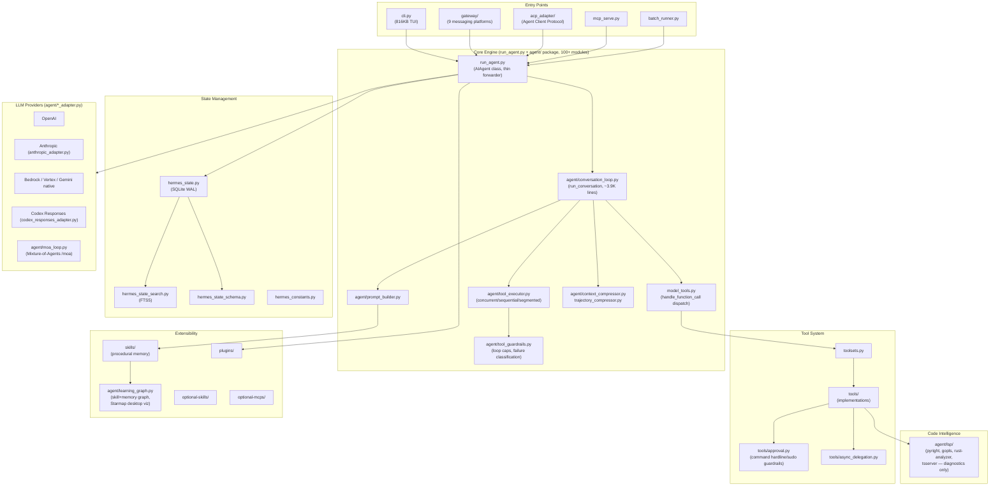
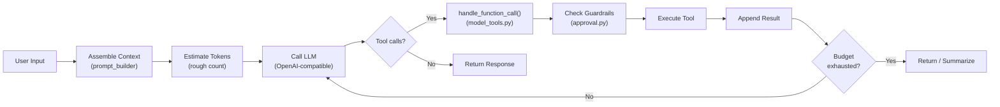

# Hermes Agent — Architectural Overview

> **Project**: Hermes Agent (by Nous Research)
> **Language**: Python
> **License**: MIT
> **Source Path**: `src/hermes_agent/`
> **Source Files**: ~3,634 Python files

---

## 1. Project Identity

Hermes Agent is Nous Research's massive, Python-based autonomous AI agent designed for
self-improving closed-loop operation. It creates and refines skills from experience,
and runs across an extraordinary range of deployment targets: local CLI/TUI, Discord,
Telegram, Slack, Docker, SSH, and Daytona cloud environments.

| Attribute | Value |
|-----------|-------|
| Language | Python 3.11–3.13 |
| Package Manager | `uv` |
| UI Framework | `prompt_toolkit` (TUI), `fastapi` (gateway) |
| Build System | `pyproject.toml` + `setup.py` |
| Key Dependencies | `openai` (as proxy API), `prompt_toolkit`, `fastapi`, `anyio`, `psutil`, `sqlite3` |
| Deployment | Local CLI, Discord, Telegram, Slack, Docker, SSH, Daytona |

**Monolithic core files (remarkably large):**

| File | Size | Purpose |
|------|------|---------|
| `cli.py` | 816 KB / ~17.9K lines | Full TUI/CLI implementation |
| `hermes_state.py` | 352 KB / ~8.0K lines | SQLite-backed state management |
| `run_agent.py` | 332 KB / ~7.4K lines | `AIAgent` class and lifecycle (now largely a forwarder — see below) |
| `hermes_state_search.py` | 88 KB | FTS5 full-text search |
| `trajectory_compressor.py` | 72 KB | Conversation history compression |
| `model_tools.py` | 68 KB | Tool definitions and dispatch (`handle_function_call`) |
| `hermes_constants.py` | 48 KB | Constants and configuration |
| `toolsets.py` | 36 KB | Tool registration and filtering |

**Important correction vs. earlier notes:** `run_agent.py` is no longer where most
of the agent logic actually lives. Its `run_conversation()` method is a thin
forwarder into `agent.conversation_loop.run_conversation()` — a ~3,900-line
function that was extracted out, along with tool execution
(`agent/tool_executor.py`), loop guardrails (`agent/tool_guardrails.py`),
trajectory handling (`agent/trajectory.py`), compression
(`agent/context_compressor.py`, `agent/conversation_compression.py`), and
provider adapters (`agent/*_adapter.py`). The `agent/` package now contains
100+ modules and is the real center of gravity — `run_agent.py` and `cli.py`
remain the two genuine monoliths, not the whole core.

---

## 2. Architecture Overview

Hermes Agent follows a **semi-monolithic architecture** with massive core files
augmented by extensive plugin/tool directories.

**Key architectural traits:**
- **No longer purely monolithic**: `cli.py` (816KB) is still a genuine monolith,
  but the agent core has been substantially decomposed into an `agent/` package
  of 100+ focused modules (conversation loop, tool execution, guardrails,
  compression, provider adapters). `run_agent.py`'s `AIAgent.run_conversation()`
  is now a thin forwarder into `agent.conversation_loop`.
- **Multi-deployment**: Same agent core serves CLI, 9+ messaging platforms, MCP,
  ACP (Zed-style editor integration), and batch evaluation.
- **Self-improving**: Skill generation loop that captures successful patterns as
  reusable skills, now visualized as a learning graph (desktop "Starmap" view).
- **LSP-assisted (not full code intelligence)**: A gated LSP subsystem feeds
  post-write diagnostics back to the agent, but does not expose symbol
  definitions/references — see §7.

---

## 3. Execution Loop

The core agent loop lives in `run_agent.py` within the `AIAgent` class:

**Loop mechanics:**
- Entry: `_create_openai_client()` resolves the workspace and LLM provider.
- `AIAgent.run_conversation()` in `run_agent.py` is a thin forwarder; the actual
  ~3,900-line loop body lives in `agent/conversation_loop.py`'s
  `run_conversation()`, which takes the `AIAgent` instance and drives message
  assembly, retries, fallback, compression, and post-turn hooks.
- Tool calls are executed via `agent/tool_executor.py`, which supports
  **concurrent**, **sequential**, and **segmented** execution modes
  (`execute_tool_calls_concurrent/_sequential/_segmented`), and dynamically
  mapped through `handle_function_call()` in `model_tools.py`, which resolves
  the function name to a Python tool implementation.
- `IterationBudget` (`agent/iteration_budget.py`) bounds the loop.
- **Loop guardrails**: `agent/tool_guardrails.py`'s `ToolCallGuardrailController`
  tracks per-turn tool-call signatures, distinguishes idempotent tools (reads,
  searches) from mutating ones (writes, terminal, delegation), and classifies
  repeated failures — separate from the command-safety guardrails in
  `tools/approval.py` (§12).
- Tool results are fed back into the conversation trajectory (`agent/trajectory.py`)
  for the next LLM call.

---

## 4. Context Management

Context is assembled dynamically through multiple layers:

| Layer | Component | Description |
|-------|-----------|-------------|
| **System prompt** | `DEFAULT_AGENT_IDENTITY` | Base agent identity and instructions |
| **Skills** | `skills/` directory | Loaded procedural memory injected into context |
| **Context files** | Explicit file loading | Project-specific context files |
| **Prompt builder** | `agent/prompt_builder` | Assembles all layers into final prompt |

**Token management:**
- `estimate_request_tokens_rough()` ensures inputs fit within the LLM's context window.
- **Input sanitization**: Handles surrogate scrubbing (`_sanitize_surrogates`), image
  stripping, and unicode sanitation to keep API calls compliant.
- The `ContextCompressor` dynamically compresses conversation history when approaching
  token limits.

---

## 5. Short-Term Memory

Managed via conversation trajectory lists — the array of messages exchanged with
the LLM during a session.

| Component | File | Role |
|-----------|------|------|
| Trajectory | `run_agent.py` | In-memory message list |
| Compressor | `trajectory_compressor.py` | Budget-based history compression |

**Trajectory compression strategy (standout feature):**
1. The first N turns and last N turns are **protected** (never compressed).
2. The middle turns are replaced with a **generated summary** message.
3. The summary is produced by a fast, cheap model (typically via OpenRouter).
4. This preserves both the initial context and recent work while compressing
   the potentially enormous middle.

This is a sophisticated approach — more nuanced than simple truncation or
sliding window strategies.

---

## 6. Long-Term Memory

Persistent storage uses **SQLite in WAL mode** for multi-process safety:

| Component | File | Description |
|-----------|------|-------------|
| State manager | `hermes_state.py` | SQLite-backed session/state storage |
| Schema | `hermes_state_schema.py` | Database schema definitions |
| Search | `hermes_state_search.py` | FTS5 full-text search over history |

**Persistence features:**
- Stores complete trajectories, configuration, and workspace metadata.
- Enables **session resumption** based on git repository root or working directory.
- Uses `_delegate_from` tags to track hierarchical sub-agent session relationships.
- WAL mode enables concurrent read/write from multiple processes (critical for
  sub-agent scenarios).

**Procedural memory (skills):**
- Skills generated during operation are persisted in the `skills/` directory.
- These are loaded back into context on future sessions, creating a
  **self-improving feedback loop**.

**Learning graph (`agent/learning_graph.py`):**
- Builds a graph of `SkillNode`s from skill frontmatter plus recorded usage
  timestamps, links related skills and memory cards by tokenized similarity
  (`_memory_skill_edges`), and computes density stats over the result.
- Two renderers consume the same graph data: `apps/desktop/src/app/starmap`
  paints it as a GPU radial constellation in the desktop app; the TUI gets a
  terminal fallback (`agent/learning_graph_render.py`) — a timeline bar chart
  with an age-gradient and cumulative sparkline, explicitly ported from the
  desktop source rather than reimplemented from scratch.
- This turns procedural memory from "just files in a directory" into a
  browsable, visualized structure of what the agent has learned and when.

---

## 7. Indexing & Code Intelligence

**Correction to earlier notes:** Hermes does have an LSP subsystem
(`agent/lsp/`), it just serves a narrower purpose than full code intelligence.

| Approach | Description |
|----------|-------------|
| **LSP diagnostics** (`agent/lsp/`) | Runs real language servers as subprocesses — `pyright`, `gopls`, `rust-analyzer`, `typescript-language-server` — and pipes `textDocument/publishDiagnostics` into a post-write lint-delta filter used by the `write_file` and `patch` tools |
| **FTS5 search** | Full-text search over historical interactions via SQLite |
| **On-demand reading** | Files read and analyzed iteratively via tools |
| **Regex search** | Pattern matching via ripgrep/grep tools |
| **Runtime probing** | Code analysis happens through tool execution, not pre-indexing |

**LSP design (`agent/lsp/manager.py`, `LSPService`):**
- **Gated on git workspace detection** — LSP only spawns inside a git repo; a
  bare cwd (e.g. a Telegram gateway chat) falls back to the existing in-process
  syntax checks, so casual sessions never pay the daemon-spawn cost.
- **Single background asyncio loop**, one client per `(server_id, workspace_root)`,
  lazily spawned and reused; a "broken-set" remembers servers that failed to
  start so they aren't retried for the life of the process.
- **Delta baseline**: `snapshot_baseline()` is called before a write, and the
  next diagnostics fetch returns only *new* diagnostics — the same
  "diagnostics-as-of-the-last-snapshot" lift as Claude Code's
  `beforeFileEdited`/`getNewDiagnostics`, wired to a local LSP client instead of
  MCP IDE RPC (explicitly credited in the module's own docstring, along with a
  broken-server-tracking pattern ported from OpenCode).

**What it does *not* do:** the client only consumes `publishDiagnostics` —
there's no evidence of `textDocument/definition`, `references`, or `hover`
being called anywhere in `agent/lsp/` or `tools/`. So Hermes gets compiler-grade
lint feedback after edits, but not the symbol-level "go to definition / find
references" reasoning that a scope graph or full LSP-as-context-source would
give. **Design trade-off:** deployment flexibility is still prioritized over
deep static analysis — LSP is opt-in-by-context and diagnostics-only, not a
persistent code graph.

---

## 8. Search Capabilities

| Capability | Component | Description |
|------------|-----------|-------------|
| **Session search** | `hermes_state_search.py` | FTS5 full-text search across all historical sessions |
| **File search** | `tools/` | Shell-based `find`, `ripgrep` |
| **Web search** | `providers/` | Web search via Firecrawl and other providers |
| **Codebase search** | Via terminal tools | `grep`, `rg`, `find` executed in terminal |

The FTS5 integration is notable — it enables searching across all past interactions,
not just the current session. This gives the agent a form of "experiential memory"
search.

---

## 9. File Editing & Patching

File editing is implemented through tool invocations in the `tools/` directory:

| Mechanism | Description |
|-----------|-------------|
| **Terminal tools** | Shell commands via `ptyprocess`/`winpty` for native interactivity |
| **Specialized edit tools** | Diff and replacement tools in `tools/` |
| **Guardrail checks** | All file mutations trigger `ToolGuardrailDecision` security checks |

**Terminal integration:**
- Uses `ptyprocess` (Unix) and `winpty` (Windows) for full PTY support.
- This enables interactive tool execution — the agent can use editors, REPL
  sessions, and other interactive programs.
- File-mutating actions are gated through the approval system before execution.

---

## 10. Tool System

The tool system is governed by two key files:

| Component | File | Role |
|-----------|------|------|
| Tool registration | `toolsets.py` | Dynamic tool registration and filtering |
| Tool dispatch | `model_tools.py` | `handle_function_call()` maps names to implementations |
| Tool implementations | `tools/` directory | Individual tool modules |
| Tool guardrails | `tools/approval.py` | Security checks before execution |

**Tool registration:**
- Tools are defined dynamically and filtered by the active **toolset**.
- `sandbox_enabled` flag controls which tools are available in sandboxed environments.
- Specific environments disable specific tools based on risk profiles — this is
  capability-based authorization.

**Toolset distributions** (`toolset_distributions.py`) allow different tool
configurations for different deployment contexts (e.g., local dev vs. cloud
vs. messaging bot).

---

## 11. LLM Integration

Hermes uses a **lazy-loading provider model** with unified OpenAI-compatible API.

**Correction to earlier notes:** the top-level `providers/` directory is
nearly empty (`base.py` + `__init__.py`, essentially a stub interface) — the
real provider adapters live under `agent/` as individual `*_adapter.py`
modules:

| Provider | File | Description |
|----------|------|-------------|
| Anthropic | `agent/anthropic_adapter.py` | Claude via native/OpenAI-compatible wrapper |
| AWS Bedrock | `agent/bedrock_adapter.py` | Bedrock-hosted models |
| Google Vertex | `agent/vertex_adapter.py` | Vertex AI models |
| Gemini (native) | `agent/gemini_native_adapter.py` | Gemini native API (vs. OpenAI-compatible) |
| Codex Responses | `agent/codex_responses_adapter.py` | OpenAI's Responses API surface |
| Azure | `agent/azure_identity_adapter.py` | Azure identity/auth adapter |
| Copilot | `agent/copilot_acp_client.py` | GitHub Copilot via ACP |
| Nous Portal / OpenRouter / others | `agent/relay_llm.py`, `agent/auxiliary_client.py` | Generic relay + auxiliary-model calls (compression, title generation, etc.) |

**Key design:**
- Most calls are proxied through an **OpenAI-compatible contract**, but
  provider-specific adapters exist precisely where that contract leaks
  (Gemini native schema, Bedrock/Vertex auth, Codex's Responses API) —
  richer than a single OpenAI-only wrapper.
- Custom behaviors are injected via thin wrappers (e.g., `_effective_temperature_for_model`
  for per-model temperature overrides).
- Lazy loading: Provider SDKs are only imported when actually needed, keeping
  startup fast and memory low.
- Multiple models can be used within a single session (e.g., fast model for
  trajectory compression, powerful model for reasoning).
- **Mixture-of-Agents (`agent/moa_loop.py`)**: a `/moa` slash command marks a
  turn as MoA-enabled — the normal agent loop still owns tool calling and turn
  termination, but this module gathers reference-model context from multiple
  models in parallel (`ThreadPoolExecutor`) before each iteration, letting a
  single turn synthesize several models' opinions.

---

## 12. Permissions & Security

Hermes has an **extremely sophisticated guardrail system**, split across two
independent layers:

| Component | File | Description |
|-----------|------|-------------|
| Command approval | `tools/approval.py` | Regex-based analysis of shell commands before execution; human-in-the-loop approval prompts |
| Loop guardrails | `agent/tool_guardrails.py` | `ToolCallGuardrailController` / `ToolGuardrailDecision` — tracks tool-call *patterns* across a turn, not command text |

**Command-level guardrails (`tools/approval.py`):**
- **Regex-based command analysis**: Iteratively analyzes shell commands for dangerous
  patterns (e.g., `rm -rf /`, `sudo`, destructive lifecycle commands).
- **Domain-based restrictions**: Background tools are restricted in unapproved domains.
- **Human-in-the-loop**: Sensitive operations trigger human approval prompts.
- **Environment-aware**: Different guardrail levels based on deployment context
  (local dev is more permissive than cloud/messaging bot).

**Loop-level guardrails (`agent/tool_guardrails.py`):**
- Classifies tools into `IDEMPOTENT_TOOL_NAMES` (reads, searches — safe to
  repeat) and `MUTATING_TOOL_NAMES` (writes, terminal, delegation, messaging —
  loop-capped via `LoopCapConfig`).
- `canonical_tool_args()` + a result hash build a `ToolCallSignature` to detect
  the agent repeating an identical call, and `classify_tool_failure()`
  distinguishes real failures from expected/transient ones.
- Decisions are pure/side-effect-free — the controller only returns a
  `ToolGuardrailDecision`; calling code (in `agent/tool_executor.py`) decides
  whether that becomes a warning, a synthetic tool result, or a hard turn halt.

**This closely aligns with SAGIHA's CAR (Capability Authorization) model.**

---

## 13. Multi-Agent / Sub-Agent Support

| Component | File | Description |
|-----------|------|-------------|
| Async delegation | `tools/async_delegation.py` | Sub-agent spawning for parallel work |
| Session tracking | `hermes_state.py` | `_delegate_from` tags for parent-child relationships |
| Process management | Lock/lease tracking | Clean termination via PID regex tracking |

**Sub-agent features:**
- Sub-agents receive **isolated DB session constraints** — they can't corrupt
  the parent's state.
- Lock and lease tracking (`_COMPRESSION_LOCK_HOLDER_PID_RE`) ensures clean
  termination without dangling sub-processes.
- Parent-child session relationships are tracked via `_delegate_from` tags,
  enabling hierarchical session management.

---

## 14. Workflow & Task Management

Hermes takes a unique approach to workflow management through **procedural memory**:

| Mechanism | Description |
|-----------|-------------|
| **Conversational iteration** | Tasks decomposed through dialogue |
| **Skill generation** | Successful workflows captured as reusable skills |
| **Skill retrieval** | Skills loaded into context for future similar tasks |
| **Iteration budget** | Hard limits on agent loop iterations |

**Self-improving loop:**
1. Agent completes a task through conversation and tool use.
2. Successful task patterns are **generated as skills** and persisted.
3. On future tasks, relevant skills are loaded into context.
4. The agent uses prior experience to perform better over time.

This is essentially **inference-time reinforcement learning** — the agent improves
without fine-tuning the underlying model.

---

## 15. CLI & User Interface

Hermes has the most diverse interface options of any project investigated —
and the platform list is broader than earlier notes captured:

| Interface | Component | Description |
|-----------|-----------|-------------|
| **CLI/TUI** | `cli.py` (816KB) | `prompt_toolkit`-based rich TUI |
| **Messaging platforms** | `gateway/platforms/` | Discord, Telegram, Slack, **Signal**, **WhatsApp Cloud**, **WeChat** (`weixin.py`), **iMessage** (`bluebubbles.py`), **QQ** (`qqbot/`), **MS Graph/Teams webhook**, Tencent Yuanbao — 9+ platforms behind a common `base.py` adapter interface (see `gateway/platforms/ADDING_A_PLATFORM.md`) |
| **ACP** | `acp_adapter/` | Exposes Hermes as an **Agent Client Protocol** server — the same protocol Zed uses — so any ACP-speaking editor can drive Hermes as its coding agent, analogous to Claude Code's editor integrations |
| **Web** | `web/`, `website/` | Web interface |
| **Desktop** | `apps/desktop/` | Native desktop app, including a GPU "Starmap" visualization of the learning graph (skills + memories) |
| **MCP Server** | `mcp_serve.py` | MCP server mode |
| **Batch** | `batch_runner.py` | Headless batch evaluation |

**TUI features:**
- Full `prompt_toolkit`-based terminal UI with syntax highlighting.
- Fixed input areas with multi-line editing.
- Interrupt handling for graceful cancellation.
- Claude Code-like interactive experience.

---

## 16. MCP (Model Context Protocol) Support

| Component | File | Description |
|-----------|------|-------------|
| MCP server | `mcp_serve.py` | Exposes Hermes as an MCP server |
| Optional MCPs | `optional-mcps/` | Pre-configured external MCP servers |

**MCP integration:**
- Hermes can run as an **MCP server**, exposing its tools to external MCP clients.
- It can also connect to external MCP servers to dynamically expand its toolset.
- `optional-mcps/` provides pre-configured MCP server definitions for common
  integrations.

---

## 17. Configuration & Extensibility

| Mechanism | File | Description |
|-----------|------|-------------|
| Constants | `hermes_constants.py` | Central configuration constants |
| Environment | `.env` files | Environment-based configuration |
| Plugins | `plugins/` | Plugin system for extending functionality |
| Skills | `skills/` | User and agent-generated procedural skills |
| Optional skills | `optional-skills/` | Pre-built optional skill packs |

**Extensibility model:**
- Plugins extend functionality without modifying core files.
- Skills provide reusable procedural knowledge.
- **No global module auto-discovery** — strict package capability authorization
  controls what extensions can access.

---

## 18. Testing & Quality

| Component | File | Description |
|-----------|------|-------------|
| Python tests | `tests/` | Python test suite |
| JavaScript tests | `tests-js/` | JavaScript test suite |
| Batch evaluation | `batch_runner.py` | Trajectory completion evaluation |
| TCB protection | AGENTS.md rules | Non-mutation of Trusted Computing Base files |

**Batch runner:**
- `batch_runner.py` enables systematic evaluation of agent performance across
  multiple tasks.
- This is critical for measuring improvements and preventing regressions.

---

## 19. Key Strengths

1. **Unmatched Deployment Versatility** — The same agent core runs as a local
   TUI, 9+ messaging platforms (Discord, Telegram, Slack, Signal, WhatsApp,
   WeChat, iMessage, QQ, Teams), an ACP server for editor integration, MCP
   server, Docker container, or headless batch evaluator. No other
   investigated project comes close.

2. **Self-Improving Skill Generation** — The ability to generate procedural skills
   from successful task completions and load them into future sessions creates a
   genuine inference-time learning loop, now with a visualized learning graph
   (desktop Starmap / TUI timeline). This is a unique innovation.

3. **Trajectory Compression** — The first-N/last-N protection with middle-summary
   compression is more sophisticated than simple truncation. Using a fast model
   for the summary is cost-effective.

4. **FTS5 Session Search** — Full-text search across all historical sessions gives
   the agent "experiential memory" — it can search its own past interactions.

5. **Layered Guardrails** — Command-level regex analysis (`tools/approval.py`)
   and loop-pattern analysis (`agent/tool_guardrails.py`'s
   `ToolGuardrailDecision`) are separate, complementary layers — one judges
   *what* a command does, the other judges *how the agent is behaving* across
   a turn (idempotent-loop detection, repeated-failure classification).

6. **Multi-Model / Multi-Provider Architecture** — Using different models for
   different purposes (fast model for compression, powerful model for
   reasoning) optimizes cost and quality, and per-provider adapters
   (`agent/*_adapter.py` for Bedrock, Vertex, Gemini native, Codex Responses)
   reach past the lowest-common-denominator OpenAI-compatible surface where it
   matters. The Mixture-of-Agents loop (`agent/moa_loop.py`) goes further,
   synthesizing multiple models' input within one turn.

7. **Real LSP-Backed Lint Feedback** — `agent/lsp/` runs actual language
   servers (pyright, gopls, rust-analyzer, tsserver) as subprocesses, gated on
   git-workspace detection, and feeds fresh diagnostics back into `write_file`/
   `patch` via a before/after delta baseline — a meaningfully more grounded
   correctness signal than string-only static analysis.

---

## 20. Key Weaknesses / Gaps

1. **Two Genuine Monoliths Remain** — `cli.py` (816KB) is still one enormous
   file, and `run_agent.py` (332KB) still holds the `AIAgent` class shell even
   though its `run_conversation()` body now forwards into
   `agent/conversation_loop.py`. The rest of the agent core has been
   decomposed into a 100+-module `agent/` package — a meaningful
   refactor from a fully monolithic core, but the two flagship files are
   still outliers by any normal codebase standard.

2. **LSP Integration Is Diagnostics-Only, Not a Code Graph** — `agent/lsp/`
   only consumes `publishDiagnostics`; there's no use of
   `textDocument/definition`, `references`, or `hover` anywhere in the
   codebase. So Hermes gets real compiler/linter feedback after an edit, but
   still has no symbol-level understanding — no go-to-definition, no
   type-hierarchy traversal, no dependency graph. The earlier framing of "no
   LSP at all" was wrong, but "no structured code graph" still holds.

3. **Tight Coupling in the Remaining Monoliths** — Changes to `cli.py` or the
   `AIAgent` class shell in `run_agent.py` can still cascade, even though most
   of the surrounding logic has been extracted into smaller `agent/` modules.

4. **No Structured Code Graph** — Unlike Grok Build's scope graphs, Hermes has
   no way to understand symbol relationships, type hierarchies, or dependency
   structures — LSP diagnostics are a lint signal, not a graph.

5. **SQLite Contention** — While WAL mode helps, heavy multi-agent scenarios
   with many concurrent writers could hit SQLite's write lock bottleneck.

6. **Surface Area / Discoverability** — With 3,634 Python files, 9+ messaging
   platforms, two guardrail systems, and features like MoA and the learning
   graph scattered across `agent/`, the project's breadth makes it hard for a
   newcomer to build an accurate mental model just from top-level file names
   — several of the most interesting subsystems (LSP, ACP, MoA, learning
   graph) are easy to miss without directly grepping for them.

---

## 21. Lessons for SAGIHA

### Patterns to Adopt

| Pattern | Rationale |
|---------|-----------|
| **Procedural skill generation** | Capture successful task patterns as reusable skills. This creates an inference-time learning loop without model fine-tuning. |
| **Trajectory compression (first-N/last-N)** | Protect the beginning and end of conversations while summarizing the middle. Use a fast model for the summary. |
| **FTS5 session search** | Index all past interactions with full-text search. Give the agent "experiential memory." |
| **Multi-deployment gateway** | Design the agent core to be deployment-agnostic, with thin adapters for CLI, messaging bots, MCP, web, and batch modes. |
| **Capability-gated toolsets** | Different deployment contexts get different tool sets. A Discord bot shouldn't have the same tools as a local dev agent. |
| **Lazy provider loading** | Don't import LLM SDKs until they're needed. Keeps startup fast and memory low. |
| **Iteration budgets** | Hard-limit the agent loop to prevent runaway execution. |
| **Layered, orthogonal guardrails** | Keep command-safety checks (what a shell command does) and loop-pattern checks (is the agent stuck repeating itself) as two independent systems rather than one combined one — they answer different questions and compose cleanly. |
| **Gated, diagnostics-only LSP** | Spawning real language servers just for post-edit lint feedback (not full symbol indexing) is a cheap, high-value middle ground — gate it on workspace detection so casual/non-repo sessions never pay the daemon cost. |
| **Progressive decomposition of a monolith** | Hermes's own history shows the extraction path: pull the loop body, tool execution, guardrails, and compression out of the "God class" into focused modules one at a time, leaving thin forwarders behind for compatibility. SAGIHA should apply this if any file starts approaching monolith territory, rather than waiting for a full rewrite. |

### Anti-Patterns to Avoid

| Anti-Pattern | Why |
|--------------|-----|
| **Monolithic 800KB files** | `cli.py` and `run_agent.py`'s `AIAgent` shell are still this large even after most surrounding logic was extracted — SAGIHA should decompose into clean port-adapter boundaries from the start. No single file should exceed ~500 lines. |
| **Diagnostics without a code graph** | LSP-for-lint-feedback is valuable but is not a substitute for symbol resolution — SAGIHA needs go-to-definition/find-references/type-hierarchy data (via tree-sitter, LSP requests beyond diagnostics, or scope graphs), not just post-write diagnostics. |
| **String-only code analysis** | Regex and grep are necessary but insufficient. Scope graphs and symbol tables enable deeper reasoning. |
| **OpenAI-only API contract** | Hermes itself moved past a pure OpenAI-only wrapper once provider quirks (Gemini's native schema, Bedrock/Vertex auth, Codex's Responses API) needed dedicated adapters — SAGIHA's port abstraction should assume that divergence from day one rather than bolting adapters on later. |
| **Under-documented subsystems** | Features like Hermes's LSP integration, ACP server, and Mixture-of-Agents loop are real but easy to miss without directly grepping the source — SAGIHA's own docs should surface every subsystem that exists, not just the ones visible from top-level file names. |
