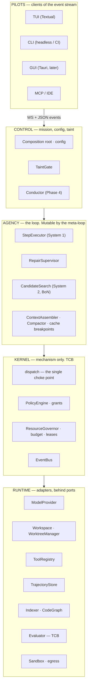
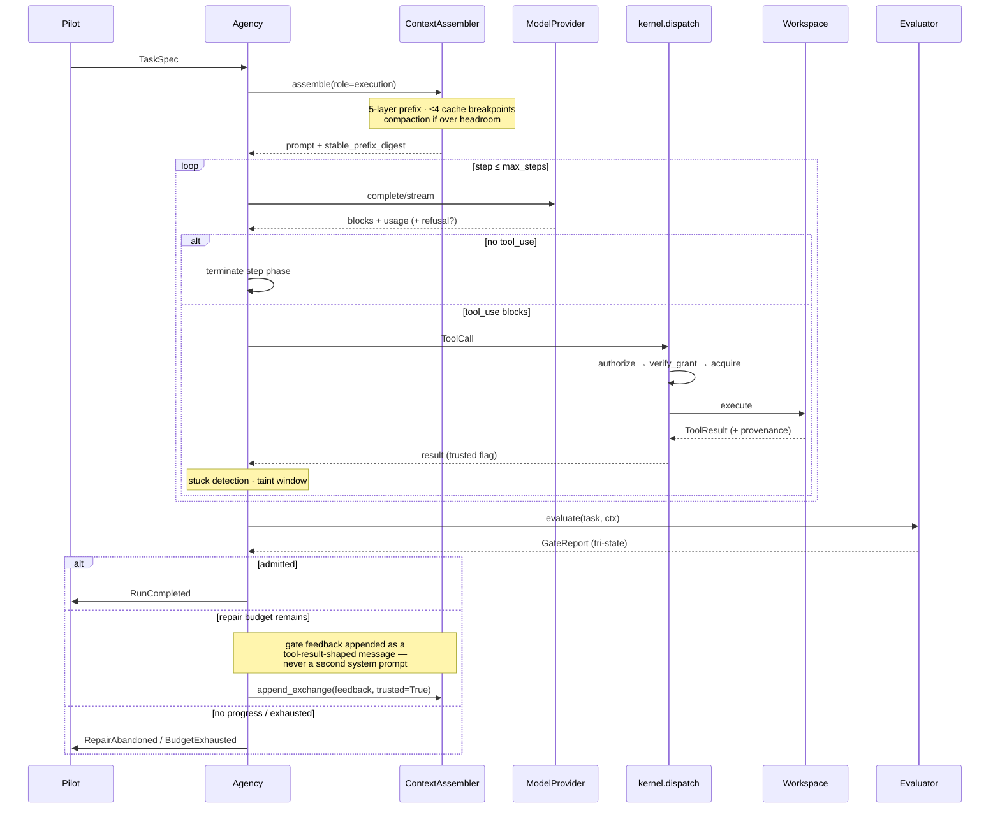

# AETHER v3.0.0 — Architecture Blueprint

> [!NOTE]
> **LLM / AI AGENT NOTICE**: This file is Phase-0 rationale for the AETHER rewrite. It is not
> binding and defines no contract. **Contracts live in `src/aether/ports/` and
> `src/aether/domain/`** — a `Protocol` or `BaseModel` defined in a `.md` file is a bug. This
> document navigates; it never defines.

Answers RFP [§5.4](../reviews/review_project_rewrite_v300.md).

---

## 1. The nine invariants

Each has a **mechanical enforcement**, because an invariant enforced only by discipline is a wish.

| # | Invariant | Enforcement |
| :--- | :--- | :--- |
| **I1** | **Pure domain.** Core logic imports no DB driver, no filesystem, no HTTP client | import-linter `domain-is-pure` |
| **I2** | **Typed ports.** All I/O crosses a `Protocol` boundary | pyright strict, zero errors |
| **I3** | **Wire-serializable ports.** Every method `async`; only serializable payloads; no file handles, callables, generators, or live objects | Reflection contract over all ports |
| **I4** | **Adapter substitutability.** Every adapter passes the *same* parametrized conformance suite | One suite, N adapters, in CI |
| **I5** | **Single dispatch choke point.** All effects through one call site; grants verified at the point of effect | Architecture test: no bypass path |
| **I6** | **Frozen extension resolution.** Entry points resolved once at composition, then frozen | Composition test; runtime registration raises |
| **I7** | **Generator ≠ Evaluator.** The agent that writes code cannot modify the tests grading it | `tests_unmodified` hard gate |
| **I8** | **Immutable TCB.** Policy, evaluator, gates, benchmarks, CI unmodifiable by agent or meta-loop | import-linter + CI `tcb-check` |
| **I9** | **Hard gates admit; proxies rank.** A learned scorer may order candidates, never admit one | Type-level `rank()` / `admit()` separation |

**I3 is the one that saves the project.** Wire-serializability lets any port move out of
process — to a Rust sidecar, a container, a remote peer — *without changing a single caller*. It is
nearly free on day one and impossible to retrofit, and it is what makes
[the monoglot decision](./rewrite_v300_decisoes_runtime.md) reversible per component instead of
all-or-nothing.

**Schemas are provisionally frozen in Phase 0 and ratified after the walking skeleton round-trips
them.** Schemas written before any code exercises them are wrong in ways only a running system
reveals. One ratification window, then the freeze is real and breaking changes require a version bump.
That is the difference between a contract and a guess with type annotations.

---

## 2. Layer model

Five strata. Dependencies point downward only; import-linter enforces the ordering.



**Why the kernel is a separate stratum.** Dispatch plus grant verification is the whole security
argument. Isolating it as mechanism-only means the meta-loop can rewrite the agency layer freely — the
prompts, the routing, the skills — without ever being able to weaken the thing that authorizes
effects. The TCB is defined by *exclusion from the mutable surface*, and this layer boundary is what
makes that definition mechanical.

---

## 3. Port catalog

Definitions live in `src/aether/ports/`. This table navigates.

### 3.1 Core — present at the walking skeleton

| Port | Responsibility | First adapter |
| :--- | :--- | :--- |
| `ModelProvider` | `complete()` and `stream()`; typed usage; typed refusal outcome | Anthropic native (cache breakpoints, thinking, effort); cassette replay |
| `Workspace` | Read, write, apply edit, run command, checkpoint, restore | Local; container sandbox |
| `WorktreeManager` | Allocate, materialize, release per-candidate worktrees | Git worktree |
| `ToolRegistry` | Register, dispatch, effect class, provenance stamping | Default; cassette |
| `PolicyEngine` | `authorize` → `grant_id`; `verify_grant`; `record_outcome` | Default — **TCB** |
| `ResourceGovernor` | Leases, budget, wall-clock | Default |
| `TrajectoryStore` | Append step / event; run records; resume | SQLite |
| `Evaluator` | `evaluate(task, ctx) → GateReport` (tri-state) | Gate evaluator — **TCB** |
| `Indexer` | `find_symbols`, `get_skeleton`, `search` | FTS5 + tree-sitter chunking |

Nine entries for eight boundaries — `Workspace` and `WorktreeManager` are separate protocols on one
concern.

### 3.2 Growth — added **with** their first adapter (A-010)

`CodeGraph` (impact analysis) · `Memory` (bi-temporal LTM) · `Toolchain` (test, typecheck, lint,
coverage) · `CandidateSearch` (BoN + judge) · `LSPAdapter` (diagnostics) · `Advisory` (learned
scoring, `research`).

**Not ports:** `Orchestrator` (the engine API *is* the boundary — SAGIHA's version was never called);
short-term memory (loop-local state); `MetaImprover` (an offline pipeline, not a runtime boundary);
`e0`/measurement (a tool, ADR-0024).

### 3.3 Port rules

Every method `async`. No `Path`, file handle, callable, generator, or live object crosses a boundary.
No untyped `dict[str, Any]`. All datetimes timezone-aware. **No `Grant` in any public signature** —
`PolicyEngine` returns a `grant_id` and nothing else. All of these are asserted **generically across
every port by reflection**, so the contract covers the port added next month, not just today's.

---

## 4. The execution loop



Four properties this diagram encodes, each of which the predecessor got wrong at some point:

1. **The gate is inside the loop.** `planning_final_sprint_rev2.md` §1 documents the pre-S7f state:
   the gate ran once after the loop exited and its verdict was shown to nobody. That single missing
   edge is the largest score lever in the tree.
2. **Feedback re-enters as a tool-result-shaped message.** A second system prompt forks the stable
   prefix and destroys the cache hit rate.
3. **Every effect passes through `kernel.dispatch`.** There is no second path.
4. **Termination is explicit** — progress signature, stuck detection, budget park — not a step cap
   alone.

### System 1 → System 2 escalation

S1 is the ReAct loop above. S2 is Best-of-N across isolated worktrees with verifier-guided selection
plus sequential repair. The escalation ladder is
`rehydrate → replan → escalate (S1→S2) → checkpoint + abort`, each rung consuming budget, each rung an
ablation target.

**BoN fan-out is cache-sequenced**: one request, await its first streamed token, then fire the
remaining N−1 — see [context & cache §1.4](./rewrite_v300_contexto_memoria.md). Naive parallel fan-out
turns N−1 cache reads into N−1 cache writes, a ~12× cost difference on the shared prefix.

---

## 5. Context assembly

```
┌─ tools               frozen for the run; deterministic serialization  ─ breakpoint 1
├─ system prompt       frozen; no dates, no run ids, no task text       ─ breakpoint 2
├─ memory / skills     resolved at composition; frozen for the run
├─ static repo context repo map + retrieval seed; construction-time only ─ breakpoint 3
└─ dynamic turns       append-only; exchanges, tool results, gate feedback ─ breakpoint 4, rolling
```

`stable_prefix_digest` is recorded on every `TrajectoryStep`, which makes a cache-stability regression
detectable after the fact rather than only in the invoice. Intermediate breakpoints go in at least
every ~15 blocks within long turns, because a breakpoint searches back at most 20 content blocks and a
tool-heavy step overruns that window silently. Full mechanics in
[context & cache](./rewrite_v300_contexto_memoria.md).

---

## 6. Workflow DAG

Agent logic as a serializable, parametric graph — ComfyUI's model applied to agent cognition.
ADR-0018, extended.

| Element | Definition |
| :--- | :--- |
| Node | `WorkflowStep[In, Out]` with typed sockets |
| Graph | Serialized to config; re-ordered, swapped, or parameterized with zero kernel changes |
| **Memoization** | Per-node output cached, **keyed by input digest** |
| Partial re-execution | Changing one node re-runs only that node and its descendants |

The memoization key is what makes ablation cheap: flipping one mechanism re-runs its subtree, not the
pipeline. Given that the project's core discipline is "no mechanism ships without an ablation", the
cost of an ablation is a first-order design concern — and this is the mechanism that pays it down.

**The graph is the execution structure; the event stream (§7) is the observation structure.** They are
deliberately separate. Nodes emit events as they run; events never drive node scheduling. Collapsing
the two produces a system where adding observability changes behaviour, which is the failure mode
every event-driven orchestrator eventually finds.

No reference in the study set implements this for agent cognition. It is original to AETHER, which
also means it carries more risk than the ported components — and is why
[A-024](./rewrite_v300_decisoes_adr.md) moves it *forward* rather than back: node types in M0, a
four-node linear graph running the walking skeleton in M1a, memoization in M2 when ablations become
routine, branching in M3. A linear pipeline is a DAG with no branches, so the abstraction is exercised
from the first working run at almost no cost, and nothing downstream accumulates a straight-line
assumption.

---

## 7. Event stream

One typed, append-only stream is the system's only observable surface — persisted to the trajectory
store, served to pilots over WS+JSON, and mined offline for failure taxonomy. Every pilot is a
consumer; none has a privileged path.

| Family | Events |
| :--- | :--- |
| Run | `RunStarted` · `RunCompleted` · `RunFailed` · `BudgetExhausted` |
| Step | `StepStarted` · `StepCompleted` · `CompactionApplied` |
| Model | `ModelCallStarted` · `ModelCallCompleted` · `ProviderFailover` · `ModelRefused` |
| Tool | `ToolCallRequested` · `ToolCallAuthorized` · `ToolCallDenied` · `ToolCallCompleted` |
| Gate | `GateEvaluated` · `RepairAttemptStarted` · `RepairAbandoned` |
| Cache | `CacheStatsRecorded` (hit rate, write/read tokens) |

The catalog is **generated from code and CI-checked for drift** (`gen_event_catalog.py --check`) —
the documentation of the event surface cannot silently diverge from the surface.

Two additions over SAGIHA: `ModelRefused` (a refusal is a typed outcome, not a crash) and
`CacheStatsRecorded` (cache economics is a first-class metric with a CI floor).

---

## 8. Package layout

```
src/aether/
├── domain/        pure models — zero I/O (I1)
├── ports/         Protocols — zero internal deps (I2, I3)
├── kernel/        dispatch · policy · governor · bus — TCB (I5, I8)
├── agency/        step_executor · repair_supervisor · escalation
├── context/       assembler · compactor · cache breakpoints · tokens
├── adapters/      model · workspace · tools · trajectory · retrieval · sandbox · search
├── measurement/   evaluator (TCB) · statistics · runner · harvester · export
├── workflow/       WorkflowStep DAG · memoization
├── engine.py      headless API — the surface every pilot consumes
└── composition.py explicit wiring; no DI container (ADR-0004)
```

Import-linter contracts: layer ordering `agency > kernel > adapters > ports > domain`; `domain-is-pure`;
`ports-are-pure`; `tcb-isolation` (kernel/policy and measurement/evaluator may not import agency or
adapters — the TCB cannot reach *up* into what it judges).

---

## 9. What is deliberately absent from v1

| Absent | Returns |
| :--- | :--- |
| `Orchestrator` port | Never. The engine API is the boundary |
| Graph **memoization** and **branching** | M2 and M3 respectively. The node types and a linear four-node graph are present from M0/M1a — see [A-024](./rewrite_v300_decisoes_adr.md) |
| Dense retrieval | ADR-0014 recall@10 trigger |
| Learned scorer / `Advisory` | Labeled corpus beats rank-by-tests-passed |
| MCP | `growth`, with its first real adapter |
| LSP diagnostics | `growth`, with a warm server pool |
| Conductor (System 3) | Phase 4, after L1–L3 are measured |
| Multi-language sidecars | RT-1 / RT-2 / RT-3 |

Each row is a capability with a **trigger**, not a capability that was forgotten. SAGIHA's failure
mode was declaring five ports with zero adapters and an empty `aoi/` package listed in planning
documents as a capability; the discipline here is that a thing not yet built says so.
