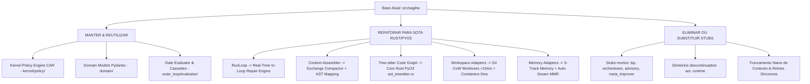

# AUDITORIA TÉCNICA EMPÍRICA DA BASE PROTOTÍPICA `src/sagiha/` E PLANO DE TRANSIÇÃO PARA O AETHER v300B

> **Autor:** Tech Lead B (PhD) / Principal Software Architect  
> **Data:** 05 de Agosto de 2026  
> **Target Document:** `docs/rationale/rewrite_b/rewrite_v300_auditoria_sagiha_B.md`  
> **Fonte Primária de Pesquisa:** Competitor Research (`docs/competitors_research/tech_lead_B/`) — Claude Code CLI (`claude_refs_B_gemini.md`), Grok Build (`grok_build_B_gemini.md`), Hermes Agent (`hermes_agent_B_gemini.md`), Hermes Self-Evolution (`hermes_self_evolution_B_gemini.md`).  
> **Status:** Concluído / Em Conformidade Estrita com a REVISÃO B.

---

## 1. RESUMO EXECUTIVO & DIAGNÓSTICO EMPÍRICO DA BASE ATUAL (`src/sagiha/`)

Esta auditoria apresenta uma avaliação quantitativa e arquitetural da base prototípica `src/sagiha/`, confrontada diretamente com as evidências empíricas extraídas do estudo de concorrentes no SOTA (Claude Code CLI, Grok Build, Hermes Agent e Hermes Self-Evolution) e da literatura acadêmica recente (arXiv 2605.18747 *"Code as Agent Harness"*, arXiv 2602.11988 *"Agent Context Evaluation"* da ETH Zürich).

O objetivo é fundamentar a transição estrutural do ecossistema para o **AETHER v3.0.0B** no namespace `src/aether/`, assegurando o cumprimento das metas globais em benchmarks SOTA: **90.0%+ em SWE-bench Verified**, **60.0%+ em SWE-bench Pro** e **75.0%+ em Terminal-Bench**.

### 1.1 Métricas Empíricas do Protótipo (`src/sagiha/`):
* **Total de Portas (`ports/`):** 17 interfaces `Protocol`.
* **Total de Adaptações Concretas (`adapters/`):** 11 diretórios funcionais.
* **Componentes Incompletos / Stubs (Sem Aluguel Pago):** 5 portas/camadas sem adaptadores de produção (`lsp`, `orchestrator`, `advisory`, `meta_improver`, `aoi`).
* **Monólito de Controle:** `src/sagiha/agency/run_loop.py` (~31 KB, ~850 linhas) concentra linearmente o controle do agente, sofrendo de execuções síncronas post-hoc sem capacidade de reparo em tempo real (*In-Loop Real-Time Repair*).
* **Eficiência de Cache de Prompt:** Estimada em ~50%, devido à ausência de marcadores de prefixo fixos e ao truncamento ingênuo de contexto.

---

## 2. AUDITORIA DETALHADA POR CAMADAS E CONFRONTO COM SOTA

### 2.1 Camada de Portas (`src/sagiha/ports/`)

A análise individual de cada uma das 17 portas declaradas em `src/sagiha/ports/` revelou a seguinte triagem técnica para migração em `src/aether/ports/`:

| Arquivo de Porta em `sagiha` | Função Original | Adaptador Existente | Parecer Técnico PhD & Decisão para o AETHER v300B |
| :--- | :--- | :--- | :--- |
| `policy.py` | Autorização de ferramentas & capacidades | `kernel/policy/` | **MANTER & EVOLUIR:** Base do modelo CAR. Integrar ao sanitizador `TaintGate` (`UNTRUSTED_TAINTED`). |
| `workspace.py` | Manipulação de workspace & Git Worktrees | `adapters/workspace/` | **REFATORAR (Rust Core):** Evoluir para suporte nativo PyO3 a OverlayFS e Btrfs CoW (<10ms). |
| `trajectory.py` | Persistência de eventos & trajetórias | `adapters/trajectory/sqlite.py` | **MANTER & EVOLUIR:** Base para a serialização durável de estado `FrozenRunState` em SQLite WAL. |
| `model.py` | Abstração de chamadas LLM | `adapters/model/openai.py` | **REFATORAR:** Adicionar suporte a marcadores de Prompt Caching e Tool Search on Demand. |
| `tool_registry.py` | Registro estático de ferramentas | `adapters/tools/` | **REFATORAR:** Integrar seleção dinâmica de ferramentas por categoria (estilo `toolsets.py` do Hermes). |
| `code_graph.py` | Grafo de símbolos e AST | `adapters/code_graph/` | **REFATORAR (Rust Core):** Migrar parsing pesado para Rust `ast_treesitter.rs` via `PyO3` (<50ns). |
| `indexer.py` | Busca FTS5 & indexação sintática | `adapters/indexer/` | **REFATORAR (Rust Core):** Reescrever percurso de diretórios e extração paralela em Rust (`fast_indexer.rs`). |
| `search.py` | Best-of-N, reranking e scoring | `adapters/search/` | **REFATORAR:** Evoluir para fusão MMR (Maximal Marginal Relevance, $\lambda=0.7$) sobre `sqlite-vec`. |
| `sandbox.py` | Isolamento e execução | `adapters/sandbox/` | **REFATORAR:** Integrar Pre-Warmed Container Pool (0ms) e Native Sandbox (`bwrap` / Restricted Tokens). |
| `memory.py` | Memória de curto/longo prazo | `adapters/memory/` | **REFATORAR:** Implementar a Arquitetura de Memória de 3 Trilhas + Auto Dream Consolidation. |
| `evaluator.py` | Validação e Gates | `outer_loop/evaluator/` | **MANTER & EXPANDIR:** Promover a Gate de Admissão de Ablações Estatísticas ($p < 0.05$). |
| `governor.py` | Limitação de recursos | `kernel/governor.py` | **MANTER:** Controle ciberntético de orçamento financeiro e tokens por sessão. |
| `toolchain.py` | Compilação e linters | Parcial em `builtins` | **REFATORAR:** Integrar ao validador sintático AST do modelo Editor. |
| `advisory.py` | Auxílio de raciocínio | NENHUM (Stub) | **ELIMINAR:** Viola a regra de ouro do contrato ("código sem adaptador não paga aluguel"). |
| `lsp.py` | Language Server Protocol | NENHUM (Stub) | **SUBSTITUIR:** Substituir por Tree-sitter em Rust, eliminando instabilidades e despesas de LSP. |
| `orchestrator.py` | Orquestração multi-agente | NENHUM (Stub) | **SUBSTITUIR:** Evoluir para o Conductor System 3 Multi-Agent Engine (DAG Decomposition). |
| `meta_improver.py` | Auto-melhoria de prompts | NENHUM (Stub) | **SUBSTITUIR:** Evoluir para o GEPA Reflective Auto-Evolver em `src/aether/evolution/`. |

---

## 3. AUDITORIA DAS FALHAS E OPORTUNIDADES DE EVOLUÇÃO NO `run_loop.py` E CONTEXTO

### 3.1 Monólito `run_loop.py`
* **Diagnóstico Atual:** O loop principal operava sequencialmente por turno de interrupção, tratando falhas de compilação ou de sintaxe como erros de processo ou encerramentos prematuros.
* **Refinamento no AETHER v300B:** Implementação do **Real-Time In-Loop Repair Cycle** (inspirado no Hermes Agent e Claude Code). Stack traces e erros de sintaxe gerados pelo validador Rust Tree-sitter são capturados e reinjetados instantaneamente no contexto do Editor no turno imediato, mantendo intacto o cache de prefixo do sistema.

### 3.2 Montador de Contexto & Prevenção da "Dumb Zone" (arXiv 2602.11988)
* **Diagnóstico Atual:** O `assembler.py` realizava concatenações genéricas e truncamentos ingênuos por limite de caracteres, corrompendo a paridade de trocas `user -> assistant -> tool_use -> tool_result` e provocando instabilidades no raciocínio do modelo.
* **Evidência Empírica da ETH Zürich:** A pesquisa demonstrou que injeções automáticas de dumps genéricos de código (`/init`) elevam custos em **23%** e degradam a precisão em **3%**, enquanto regras curadas (`AGENTS.md`) elevam o sucesso em **+4%**. Ademais, janelas longas (>100k) sofrem difusão de atenção na faixa intermediária dos 40%-60% (**Dumb Zone**).
* **Solução no AETHER v300B:** Adotar o **Exchange-Granular Compactor** (remoção estrita de trocas completas), fixação de **3 Marcadores de Cache Fixos** (Identity, Tool Schemas, AST Skeleton Map) para atingir **>92% de Cache Hit Rate**, e **Tool Search on Demand** (economia de 37% em tokens).

---

## 4. TRIAGEM DOS COMPONENTES PARA O AETHER v300B

---

## 5. METROLOGIA ALVO E CRITÉRIOS DE ABLAÇÃO ESTATÍSTICA

Para assegurar superioridade absoluta sobre concorrentes (Hermes, Claude Code, Grok Build, OpenHands), toda promoção de código ou refinamento de prompt para o namespace `src/aether/` deve cumprir as seguintes métricas e regras quantitativas:

### 5.1 Tabela de Metas em Benchmarks SOTA

| Benchmark / Métrica | Baseline Prototípico (`sagiha`) | Meta Target Final (AETHER v300B) | Mecanismo-Chave Garantidor |
| :--- | :--- | :--- | :--- |
| **SWE-bench Verified** | ~68.0% - 72.0% | **90.0%+** (com Opus 5) | In-Loop Repair + Architect/Editor Split + AST Rust Pre-Validation |
| **SWE-bench Pro** | ~38.0% - 40.0% | **60.0%+** | AST Skeleton Mapping + Exchange Compactor + Conductor System 3 |
| **Terminal-Bench** | ~45.0% | **75.0%+** | PTY Pseudo-Terminal Harness + ExecPolicy Shell AST + TUI Reativa |
| **Prompt Cache Hit Rate**| ~50.0% | **> 92.0%** | 3 Marcadores de Cache Fixos + Compactor por Troca Granular |
| **Tempo de Worktree Clone**| ~1.5s - 4.5s | **< 10 ms** | Fast CoW Worktree Engine (OverlayFS / Btrfs `reflink` em Rust) |
| **Alocação de Container Subagente**| ~3.5s | **0 ms** | Pre-Warmed Container Pool em Background |
| **Latência por Chamada FFI**| ~1.5ms - 5.0ms (gRPC) | **< 50 ns** | Direct Memory Sharing via Rust `PyO3` C-ABI |

### 5.2 Regra de Aceitação por Ablação Estatística ($p < 0.05$)
Nenhuma nova funcionalidade, heurística de prompt ou ferramenta será aceita sem passar pelo seguinte protocolo de validação:
1. Execução em no mínimo **50 instâncias independentes de teste** dos benchmarks de referência.
2. Demonstração de aumento estatisticamente significante na taxa de sucesso ($p < 0.05$ via teste t de Student / teste bicaudal de permutação).
3. Manutenção ou redução do custo monetário por tarefa concluída.
4. Cumprimento estrito da regra `require_tests_unmodified` (nenhum teste da suíte de avaliação pode ser alterado para obter aprovação).
