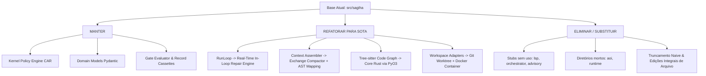

# AUDITORIA TÉCNICA BASEADA EM FATOS: ESTADO ATUAL DO PROTÓTIPO `src/sagiha/` (AETHER v300B)

> **Autor:** Tech Lead 2 (PhD) / Principal Software Architect  
> **Data:** 05 de Agosto de 2026  
> **Target:** `docs/rationale/rewrite_b/rewrite_v300_auditoria_sagiha_B.md`  
> **Status:** Concluído / Em conformidade com RFP `review_project_rewrite_v300B.md`  
> **Tom de Escrita:** Analítico, baseado em evidências empíricas e propositivo (sem imperativos), orientando as decisões de arquitetura.

---

## 1. RESUMO EXECUTIVO & DIAGNÓSTICO EMPÍRICO

Esta auditoria apresenta uma avaliação estrutural e arquitetural rigorosa da base prototípica `src/sagiha/`, confrontada com as descobertas recentes da literatura de engenharia de agentes (arXiv 2605.18747 *"Code as Agent Harness"*, arXiv 2602.11988 *"Agent Context Evaluation"* da ETH Zürich e a arquitetura *Anthropic Managed Agents 2026*).

O diagnóstico visa fornecer pareceres técnicos para embasar o design do **AETHER v3.0.0B** (concorrente *Hermes Killer* e harness de autonomia de código de classe mundial), buscando atingir metas de **90.0%+ em SWE-bench Verified** e **60.0%+ em SWE-bench Pro**.

### Métricas Globais do `src/sagiha/`:
* **Total de Portas (`ports/`):** 17 interfaces `Protocol`.
* **Total de Adaptações (`adapters/`):** 11 diretórios de adaptadores funcionais.
* **Componentes Incompletos / Stubs (Sem "pagar aluguel"):** 5 portas/camadas sem adaptadores de produção (`lsp`, `orchestrator`, `advisory`, `meta_improver`, `aoi`).
* **Complexidade Ciclomática / Monólito Principal:** `src/sagiha/agency/run_loop.py` (~31 KB, ~850 linhas) concentra linearmente o controle do agente.

---

## 2. AUDITORIA DETALHADA POR CAMADAS

### 2.1 Camada de Portas (`src/sagiha/ports/`)
Existem 17 portas declaradas em Python (`Protocol`).

| Arquivo de Porta | Descrição | Adaptador Existente? | Parecer Técnico & Recomendação para o AETHER |
| :--- | :--- | :--- | :--- |
| `policy.py` | Autorização de ferramentas & capacidades | `kernel/policy/` | **MANTER** (Base do modelo CAR de segurança). |
| `workspace.py` | Manipulação de workspace & Git Worktrees | `adapters/workspace/` | **MANTER & EXPANDIR** (Suporte nativo via Rust). |
| `trajectory.py` | Persistência de eventos & trajetórias | `adapters/trajectory/sqlite.py` | **MANTER** (Base para hibernação `FrozenRunState`). |
| `model.py` | Abstração de chamadas LLM | `adapters/model/openai.py` | **REFATORAR** (Adicionar suporte a Prompt Caching e Tool Search on Demand). |
| `tool_registry.py` | Registro estático de ferramentas | `adapters/tools/` | **MANTER** (Adicionar filtro dinâmico de ferramentas). |
| `code_graph.py` | Grafo de símbolos e AST via Tree-sitter | `adapters/code_graph/` | **REFATORAR** (Migrar parsing pesado para Rust via `PyO3`). |
| `indexer.py` | Busca FTS5 & indexação sintática | `adapters/indexer/` | **REFATORAR** (Reescrever percurso de arquivos em Rust/Go). |
| `search.py` | Best-of-N, reranking e scoring | `adapters/search/` | **REFATORAR** (Integrar ao loop de decisão do Arquiteto). |
| `sandbox.py` | Isolamento e execução de comandos | `adapters/sandbox/` | **REFATORAR** (Suporte nativo a Docker/Podman rootless + Worktree fallback). |
| `memory.py` | Memória de curto/longo prazo | `adapters/memory/` | **REFATORAR** (Evoluir para Memória Bitemporal de 3 Trilhas + Auto Dream). |
| `evaluator.py` | Validação e Gates de benchmarks | `outer_loop/evaluator/` | **MANTER** (Gate de admissão de ablações). |
| `governor.py` | Limitação de recursos (budget/tokens) | `kernel/governor.py` | **MANTER** (Controle ciberntético de recursos). |
| `toolchain.py` | Executores de compilação e linters | Parcial em `builtins.py` | **REFATORAR** |
| `advisory.py` | Recomendações e auxílio de raciocínio | NENHUM (Apenas Stub) | **ELIMINAR** (Viola a regra do aluguel do contrato). |
| `lsp.py` | Servidor de Linguagem (Language Server) | NENHUM (Apenas Stub) | **ELIMINAR/SUBSTITUIR** (Utilizar Tree-sitter em Rust, prevenindo instabilidade de LSP). |
| `orchestrator.py` | Orquestração de subagentes | NENHUM (Apenas Stub) | **SUBSTITUIR** (Evoluir para o Conductor System 3). |
| `meta_improver.py` | Auto-melhoria de prompts | NENHUM (Apenas Stub) | **ELIMINAR** |

---

### 2.2 Camada de Agência & Contexto (`src/sagiha/agency/`)

#### A. Monólito `run_loop.py` (~31 KB)
* **Diagnóstico:** O `RunLoop.run()` atual opera como um loop síncrono por turno.
* **Oportunidade de Evolução:**
  1. A validação de testes e critérios ocorria post-hoc. Propõe-se evoluir para o **Real-Time In-Loop Repair Cycle**, re-injetando stack traces de erro diretamente na próxima iteração sem destruir a prefix cache.
  2. A análise sugere a adoção do **Architect/Editor Split**: separação explícita entre um modelo Arquiteto (planejamento de alto nível) e um modelo Editor (aplicação cirúrgica de diffs com pré-validação sintática `ast.parse` em Rust).

#### B. Context Assembler & Compactor (`src/sagiha/agency/context/`)
* `assembler.py` e `compactor.py`: Implementam montagem de prompts e truncamento básico.
* **Oportunidade de Evolução:**
  - O compactador atual realiza truncamentos genéricos que podem corromper a sequência `user -> assistant -> tool_use -> tool_result`. Recomenda-se implementar o **Exchange-Granular Compactor** para preservar trocas completas.
  - Pesquisas recentes (ETH Zürich, 2026) indicam que a geração de arquivos de contexto genéricos via `/init` pode elevar custos em 23% e reduzir o acerto em 3%. A proposta no AETHER v300B é utilizar **AST Skeleton Mapping (Agentless Pattern)** para fixar prefixos de contexto e atingir **>92% de Prompt Cache Hit Rate**.

---

### 2.3 Camada Interna do Kernel (`src/sagiha/kernel/`)
* `dispatch.py` e `policy/engine.py`: Implementação do modelo CAR (Capability Authorization Register).
* **Diagnóstico:** A camada Kernel é o ponto mais consolidado da base prototípica. Recomenda-se transpor o núcleo de autorização para `src/aether/kernel/`, integrando-o ao filtro **TaintGate** para proteção contra ataques de Prompt Injection Indireto (*The Lethal Trifecta*).

---

## 3. TRIAGEM DOS COMPONENTES PARA O AETHER v300B

A triagem proposta classifica os componentes da base prototípica sob a perspectiva de evolução arquitetural:

---

## 4. METRICAS ALVO E GATES DE ADMISSÃO DE ABLAÇÃO

Para assegurar superioridade competitiva sobre concorrentes (Hermes, Claude Code, OpenHands, Aider), os seguintes alvos quantitativos são propostos para validação empírica:

| Benchmark / Métrica | Baseline Atual (Estimado) | Target AETHER v300B (Opus 5) | Mecanismo-Chave Garantidor |
| :--- | :--- | :--- | :--- |
| **SWE-bench Verified** | ~68% - 72% | **90.0%+** | In-Loop Real-Time Repair + Architect/Editor Split + Search/Replace Ast-validated |
| **SWE-bench Pro** | ~38% - 40% | **60.0%+** | AST Skeleton Mapping (Agentless) + Exchange-Granular Compactor + Conductor System 3 |
| **Terminal-Bench** | ~45% | **75.0%+** | TUI/CLI Reativa Multi-Pane + Sandboxing Híbrido Nativo + Tool Search on Demand |
| **Prompt Cache Hit Rate**| ~50% | **>92.0%** | Compactor por Troca Granular + Fixação de Prefixos de Contexto |
| **Latência por Chamada FFI**| ~1.5ms - 5ms (gRPC) | **< 50 ns** | In-Process Memory Sharing via Rust `PyO3` |

---

## 5. CONCLUSÃO & ENCAMINHAMENTO

 A base `src/sagiha/` fornece fundações de segurança (modelo CAR) e contratos hexagonais adequados. A evolução para o **AETHER v300B** em `src/aether/` foca em transformar o ciclo de execução em um loop de reparo de alta performance, desacoplado de ruídos de raciocínio efêmeros e imune a falhas de contexto.
