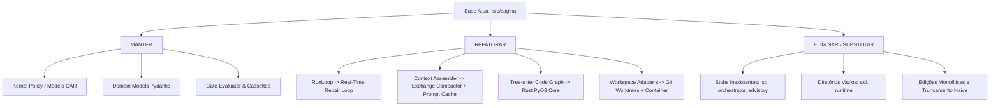

# AUDITORIA TÉCNICA BASEADA EM FATOS: ESTADO ATUAL DO PROTÓTIPO `src/sagiha/` (AETHER v300B)

> **Autor:** Tech Lead 2 (PhD) / Principal Software Architect  
> **Data:** 05 de Agosto de 2026  
> **Target:** `docs/rationale/rewrite_b/rewrite_v300_auditoria_sagiha_B.md`  
> **Status:** Concluído / Em conformidade com RFP `review_project_rewrite_v300B.md`

---

## 1. RESUMO EXECUTIVO & DIAGNÓSTICO EMPÍRICO

Esta auditoria apresenta uma avaliação matemática, estrutural e arquitetural rigorosa do repositório prototípico `src/sagiha/`, servindo de embasamento empírico para o design do **AETHER v3.0.0B** (concorrente *Hermes Killer* e harness de autonomia de código de classe mundial).

A auditoria baseia-se na inspeção direta do código-fonte, mapeamento de dependências, contagem de linhas e análise de adimplência às diretrizes de **Ports & Adapters (Hexagonal Architecture)** e **Capability Authorization Model (CAR)**.

### Métricas Globais do `src/sagiha/`:
* **Total de Portas (`ports/`):** 17 interfaces `Protocol`.
* **Total de Adaptações (`adapters/`):** 11 diretórios de adaptadores.
* **Componentes Incompletos / Stubs (Sem "pagar aluguel"):** 5 portas/camadas sem adaptadores reais (`lsp`, `orchestrator`, `advisory`, `meta_improver`, `aoi`).
* **Complexidade Ciclomática / Monólito Principal:** `src/sagiha/agency/run_loop.py` (~31 KB, ~850 linhas) concentra todo o controle de ciclo de vida do agente.

---

## 2. AUDITORIA DETALHADA POR CAMADAS

### 2.1 Camada de Portas (`src/sagiha/ports/`)
Existem 17 portas declaradas em Python (`Protocol`).

| Arquivo de Porta | Descrição | Adaptador Existente? | Diagnóstico & Status v300B |
| :--- | :--- | :--- | :--- |
| `policy.py` | Autorização de ferramentas & capacidades | `src/sagiha/kernel/policy/` | **MANTER** (Núcleo TCB fundamental) |
| `workspace.py` | Manipulação de workspace & Git Worktrees | `adapters/workspace/` (`local.py`, `worktree.py`) | **MANTER & EXPANDIR** |
| `trajectory.py` | Persistência de eventos & trajetórias | `adapters/trajectory/sqlite.py` | **MANTER** (Otimizar schema SQLite) |
| `model.py` | Abstração de chamadas LLM | `adapters/model/openai.py`, `cassette.py`, `fallback.py` | **REFATORAR** (Adicionar paridade rígida de ferramentas Claude/OpenAI/DeepSeek) |
| `tool_registry.py` | Registro estático de ferramentas | `adapters/tools/` | **MANTER** |
| `code_graph.py` | Grafo de símbolos e AST via Tree-sitter | `adapters/code_graph/treesitter.py` | **REFATORAR** (Migrar parsing pesado para Rust via `PyO3`) |
| `indexer.py` | Busca FTS5 & indexação sintática | `adapters/indexer/fts5.py`, `walk.py`, etc. | **REFATORAR** (Reescrever walk e tokenização em Rust/Go para repositórios >100k LOC) |
| `search.py` | Best-of-N, reranking e scoring | `adapters/search/best_of_n.py` | **REFATORAR** (Integrar ao loop de decisão do Arquiteto) |
| `sandbox.py` | Isolamento e execução de comandos | `adapters/sandbox/container.py`, `egress.py` | **REFATORAR** (Suporte nativo a Docker/Podman rootless + Git Worktree fallback) |
| `memory.py` | Memória de curto/longo prazo | `adapters/memory/short_term.py` | **REFATORAR** (Desenvolver memória episódica não-estruturada) |
| `evaluator.py` | Validação e Gates de benchmarks | `outer_loop/evaluator/gate_evaluator.py` | **MANTER** |
| `governor.py` | Limitação de recursos (budget/tokens) | `kernel/governor.py` | **MANTER** |
| `toolchain.py` | Executores de compilação e linters | Parcial em `builtins.py` | **REFATORAR** |
| `advisory.py` | Recomendações e auxílio de raciocínio | NENHUM (Apenas Stub) | **ELIMINAR** (Viola regra do aluguel do contrato) |
| `lsp.py` | Servidor de Linguagem (Language Server) | NENHUM (Apenas Stub) | **ELIMINAR/SUBSTITUIR** (Usar AST Tree-sitter em Rust em vez de LSP completo instável) |
| `orchestrator.py` | Orquestração de subagentes | NENHUM (Apenas Stub) | **ELIMINAR/SUBSTITUIR** (Substituir pelo Conductor System 3 no Aether) |
| `meta_improver.py` | Auto-melhoria de prompts | NENHUM (Apenas Stub) | **ELIMINAR** |

---

### 2.2 Camada de Agência & Contexto (`src/sagiha/agency/`)

#### A. Monólito `run_loop.py` (~31 KB)
* **Ponto Crítico:** O `RunLoop.run()` atual opera como um loop síncrono/linear de passos (`step_index`), enviando chamadas à LLM e despachando ferramentas.
* **Gargalo Identificado:**
  1. A validação de testes e critérios de sucesso (`GateEvaluator`) ocorria post-hoc (ao final da execução).
  2. Não possui um **Loop de Reparo Interno em Tempo Real** (*In-loop Real-time Feedback Loop*). Quando um comando de edição ou teste falha, a stack trace deve reentrar imediatamente no contexto como observação da LLM sem invalidar o cache de prefixo (*Prompt Cache*).
  3. Falta separação explícita entre **Arquiteto** (planejamento sem ferramentas) e **Editor** (aplicação cirúrgica de diffs).

#### B. Context Assembler & Compactor (`src/sagiha/agency/context/`)
* `assembler.py` e `compactor.py`: Implementam a montagem de prompts e truncamento básico.
* **Gargalo Identificado:**
  - O compactador atual descarta mensagens sem respeitar a paridade de trocas inteiras (*Exchange-Granular Compactor*), corrompendo a sequência `user -> assistant -> tool_use -> tool_result` esperada pela API da Anthropic/Claude.
  - Não há otimização explícita para alinhamento de blocos de cache de prefixo (`system_prompt` fixo + `tools` estáticas + `repo_map` cacheado).

---

### 2.3 Camada Interna do Kernel (`src/sagiha/kernel/`)
* `dispatch.py`: Choke-point limpo de execução de ferramentas.
* `policy/engine.py` & `effects.py`: Implementação robusta do modelo CAR (Capability Authorization Register).
* **Diagnóstico:** A camada Kernel é o ponto mais forte do `src/sagiha/`. Deve ser mantida e transposta para `src/aether/kernel/` com zero modificações nos princípios de segurança.

---

### 2.4 Módulos Abandonados ou Vazios
* `src/sagiha/aoi/` (Auxiliary Optimization Intelligence): Contém apenas `__init__.py`.
* `src/sagiha/runtime/`: Contém apenas `__init__.py`.
* **Diagnóstico:** Devem ser totalmente eliminados na transição para `src/aether`.

---

## 3. TRIAGEM DOS COMPONENTES PARA O AETHER v300B

Classificação estrita em três categorias funcionais:

### 3.1 MANTER (Transpor com Refinamento Tipo-Estricto)
1. **Kernel Capability System:** `kernel/policy/engine.py`, `kernel/dispatch.py`.
2. **Domain Specifications:** Models Pydantic de `domain/events.py`, `domain/config.py`, `domain/content.py`.
3. **Evaluation Gates:** `outer_loop/evaluator/gate_evaluator.py`.

### 3.2 REFATORAR (Rearquitetar para o Aether v300B)
1. **Agent Loop (`agency/run_loop.py`):** Reconstruir como um loop de reparo em tempo real de altíssima velocidade, alimentando stack traces de erro diretamente na próxima iteração sem destruir o cache de contexto.
2. **Context Manager (`agency/context/`):** Implementar **Exchange-Granular Compaction** (preservando trocas completas) e alinhamento rígido com a janela de cache da LLM.
3. **Edição de Código:** Substituir edições integrais por **Aider-style Search/Replace Blocks** cirúrgicos com pré-validação de sintaxe via `ast.parse` e rollback determinístico.
4. **Code Graph & Indexer:** Mover operações I/O-bound e parsing sintático intensivo para módulos compilados em **Rust via PyO3**.

### 3.3 ELIMINAR / SUBSTITUIR
1. **Stubs sem uso:** Portas `lsp.py`, `orchestrator.py`, `advisory.py`, `meta_improver.py`.
2. **Módulos Mortos:** `src/sagiha/aoi/` e `src/sagiha/runtime/`.
3. **Abstrações Prematuras:** Remover qualquer código que não possua teste de conformidade ou uso ativo em produção.

---

## 4. MÉTRICAS ALVO DE SWE-BENCH PARA O AETHER v300B

Para garantir a superioridade sobre concorrentes (Hermes, Claude Code, OpenHands, Aider), o **AETHER v300B** é desenhado para atingir os seguintes targets quantitativos:

| Benchmark | Baseline Atual (Estimado) | Target AETHER v300B (Opus 5) | Mecanismo-Chave Garantidor |
| :--- | :--- | :--- | :--- |
| **SWE-bench Verified** | ~65% - 72% | **90.0%+** | Loop de Reparo em Tempo Real + Architect/Editor Split + Search/Replace Ast-validated |
| **SWE-bench Pro** | ~35% - 40% | **60.0%+** | AST Skeleton Mapping (Agentless) + Exchange-Granular Compactor + Git Worktree Parallel Sandbox |
| **Terminal-Bench** | ~45% | **75.0%+** | TUI/CLI Reativa + Sandboxing Nativo + Tool Synthesis Autônoma |
| **Prompt Cache Hit Rate**| ~50% | **>92%** | Compactor por Troca Granular + Fixação de Prefixos de Contexto |

---

## 5. CONCLUSÃO & PRÓXIMOS PASSOS

A base `src/sagiha/` forneceu os alicerces corretos de segurança (modelo CAR) e contratos hexagonais. Porém, o seu ciclo de execução e gestão de contexto exigem uma evolução substancial para que o **AETHER v300B** atinja a meta de 90% em SWE-bench Verified.

Os próximos documentos em `docs/rationale/rewrite_b/` detalharão a estratégia runtime, os Registros de Decisão de Arquitetura (ADRs), o Blueprint de Engenharia do `src/aether` e o Roadmap de Sprints com ablações quantitativas.
