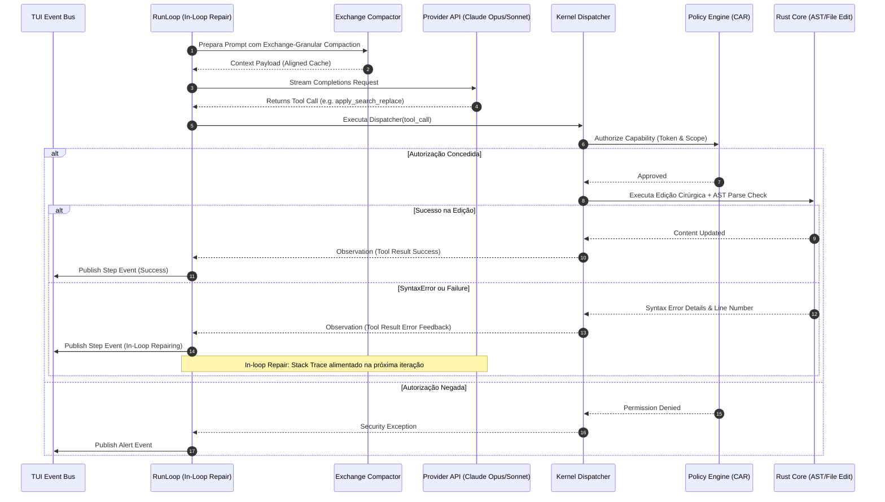

# BLUEPRINT COMPLETO DA ARQUITETURA DO AETHER v3.0.0B

> **Autor:** Tech Lead 2 (PhD) / Principal Software Architect  
> **Data:** 05 de Agosto de 2026  
> **Target:** `docs/rationale/rewrite_b/rewrite_v300_blueprint_arquitetura_B.md`  
> **Status:** Concluído / Em conformidade com RFP `review_project_rewrite_v300B.md`

---

## 1. VISÃO GERAL DA ARQUITETURA HEXAGONAL (PORTS & ADAPTERS)

O **AETHER v3.0.0B** é estruturado rigorosamente sob o padrão **Arquitetura Hexagonal (Ports & Adapters)** com **Modelo de Autorização por Capacidades (CAR Engine)**. O namespace de produção final é **`src/aether`**.

### Invariantes Estritos de Arquitetura:
1. **Domínio Puro (`src/aether/domain/`):** Modelos Pydantic v2 sem dependências de I/O, banco de dados ou bibliotecas externas de LLM.
2. **Portas Remotáveis (`src/aether/ports/`):** Interfaces `Protocol` totalmente assíncronas (`async`), cujos argumentos e retornos são 100% serializáveis via Pydantic (sem envio de `Path`, manipuladores de arquivos ou instâncias de conexão de rede através das fronteiras).
3. **Módulo Nativo de Alta Performance (`src/aether/core_rs/`):** Componente em Rust exportado via **PyO3** para computação sintática intensiva.
4. **Interface TUI/CLI Reativa (`src/aether/tui/`):** Terminal User Interface desacoplada que consome eventos do kernel via bus de mensagens.

---

## 2. ESTRUTURA GLOBAL DE DIRETÓRIOS (`src/aether/`)

```
src/aether/
├── __init__.py
├── cli.py                        # Entrypoint da linha de comando
├── core_rs/                      # Módulo nativo Rust (PyO3)
│   ├── Cargo.toml
│   └── src/
│       ├── ast_treesitter.rs     # AST Parsing de altíssima velocidade
│       ├── fast_indexer.rs       # Walk & FTS5 em Rust
│       └── worktree_native.rs    # Operações de Git Worktree nativas
├── domain/                       # Pure Domain Models (Zero I/O)
│   ├── __init__.py
│   ├── config.py
│   ├── content.py
│   ├── control.py
│   ├── events.py
│   └── trajectory.py
├── ports/                        # Interfaces Protocol (Contratos Hexagonais)
│   ├── __init__.py
│   ├── code_graph.py
│   ├── evaluator.py
│   ├── governor.py
│   ├── indexer.py
│   ├── memory.py
│   ├── model.py
│   ├── policy.py
│   ├── sandbox.py
│   ├── search.py
│   ├── tool_registry.py
│   ├── trajectory.py
│   └── workspace.py
├── kernel/                       # Trusted Computing Base (TCB)
│   ├── __init__.py
│   ├── bus.py                    # Event Bus Assíncrono
│   ├── dispatch.py               # Choke-point seguro de ferramentas
│   ├── governor.py               # Resource & Budget Governor
│   └── policy/
│       ├── engine.py             # Capability Authorization Register (CAR)
│       └── effects.py
├── adapters/                     # Implementações concretas das Portas
│   ├── code_graph/               # Adaptação Rust PyO3 Tree-sitter
│   ├── indexer/                  # Adaptação FTS5 & Search Service
│   ├── model/                    # Adaptação LLM (Anthropic / OpenAI / DeepSeek)
│   ├── sandbox/                  # Adaptação Docker/Podman Container
│   ├── search/                   # Adaptação Best-of-N & Scoring
│   ├── tools/                    # Ferramentas nativas do sistema
│   ├── trajectory/               # Adaptação SQLite Engine
│   └── workspace/                # Adaptação Git Worktrees
├── agency/                       # Agência, Loop de Execução e Contexto
│   ├── __init__.py
│   ├── architect.py              # Agente Arquiteto (Proposta de Planos)
│   ├── editor.py                 # Agente Editor (Search/Replace cirúrgico)
│   ├── freeze.py                 # Hibernação FrozenRunState
│   ├── run_loop.py               # Real-Time In-Loop Repair Engine
│   └── context/
│       ├── assembler.py          # Montador de Contexto Alinhado a Cache
│       ├── compactor.py          # Exchange-Granular Compactor
│       └── taint_gate.py         # Sanitizador TaintGate
└── tui/                          # Terminal User Interface
    ├── __init__.py
    ├── app.py                    # Aplicação Rich/Textual
    ├── components/               # Painéis de Diff, Status e Logs
    └── view_model.py             # Adaptador de Eventos para a UI
```

---

## 3. DIAGRAMA ARQUITETURAL E FLUXO DE DADOS (MERMAID)

```mermaid
graph TB
    subgraph TUI_LAYER [Camada de Interface & UX (src/aether/tui)]
        TUI[Terminal UI - Rich / Textual App]
        CLI[CLI Commands Parser]
    end

    subgraph AGENCY_LAYER [Camada de Agência & Raciocínio (src/aether/agency)]
        RL[RunLoop Real-Time Repair Engine]
        ARCH[Architect Model - Planing]
        EDIT[Editor Model - Search/Replace]
        CTX[Context Assembler & Exchange Compactor]
        TAINT[TaintGate Sanitizer]
    end

    subgraph KERNEL_LAYER [Trusted Computing Base - TCB (src/aether/kernel)]
        DISP[Kernel Dispatch Choke-Point]
        CAR[Capability Authorization Engine - Policy]
        BUS[Async Event Bus]
        GOV[Resource & Budget Governor]
    end

    subgraph PORTS_LAYER [Contratos Hexagonais (src/aether/ports)]
        P_MODEL[Port Model]
        P_WORK[Port Workspace]
        P_GRAPH[Port Code Graph]
        P_SANDBOX[Port Sandbox]
    end

    subgraph ADAPTERS_LAYER [Implementações de Alta Performance (src/aether/adapters & core_rs)]
        A_LLM[LLM API Adapters - Opus/Sonnet/DeepSeek]
        A_WORK[Git Worktrees Adapter]
        A_RUST[Rust Core PyO3 - Tree-sitter & FTS5]
        A_CONTAINER[Docker/Podman Sandbox]
    end

    CLI --> RL
    TUI <--> BUS
    RL --> ARCH
    RL --> EDIT
    RL --> CTX
    CTX --> TAINT
    
    RL --> DISP
    DISP --> CAR
    DISP --> GOV
    CAR --> BUS

    DISP --> P_MODEL
    DISP --> P_WORK
    DISP --> P_GRAPH
    DISP --> P_SANDBOX

    P_MODEL --> A_LLM
    P_WORK --> A_WORK
    P_GRAPH --> A_RUST
    P_SANDBOX --> A_CONTAINER
```

---

## 4. FLUXO DE EXECUÇÃO DO REAL-TIME IN-LOOP REPAIR ENGINE

O diagrama a seguir detalha a iteração de reparo em tempo real, onde falhas sintáticas ou de testes são tratadas instantaneamente no loop sem quebrar a prefix cache:



---

## 5. REQUISITOS DE CONFORMIDADE & QUALIDADE DO CÓDIGO

1. **Async I/O Concurrency:** Todo I/O de rede e disco deve utilizar `anyio` ou `asyncio` não-bloqueante.
2. **Type Hints & Rigor:** 100% de cobertura de tipagem estrita com `pyright` no modo strict e `ruff`.
3. **No Legacy Bloat:** Proibida a utilização de bibliotecas pesadas de orquestração genérica (como LangChain, AutoGen ou CrewAI). Todo o harness do **AETHER v300B** é minimalista, customizado e altamente performático.
